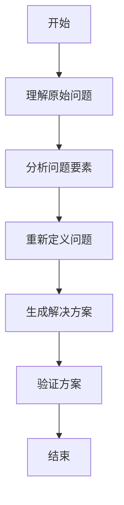
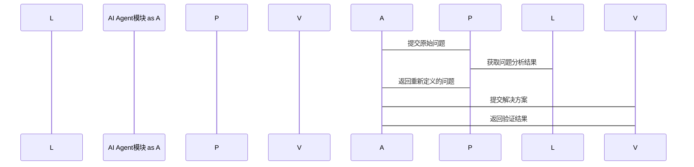

                 


# LLM驱动的AI Agent创造性问题重构

## 关键词：LLM, AI Agent, 创造性问题重构, 算法原理, 系统架构, 项目实战

## 摘要：  
本文深入探讨了LLM（大语言模型）驱动的AI Agent在创造性问题重构中的应用，从背景介绍、核心概念、算法原理到系统架构和项目实战，系统性地分析了创造性问题重构的实现过程。文章结合理论与实践，通过丰富的案例和详细的代码实现，帮助读者全面理解LLM驱动的AI Agent如何通过创造性问题重构提升问题解决能力。

---

## 第一部分: LLM驱动的AI Agent基础

### 第1章: 背景介绍

#### 1.1 问题背景

随着人工智能技术的快速发展，AI Agent（智能体）在各个领域的应用越来越广泛。然而，传统的AI Agent在处理复杂问题时，往往缺乏灵活性和创造性。这主要是因为它们依赖于固定的规则和预定义的逻辑，难以应对动态变化的环境和复杂多变的问题。

大语言模型（LLM）的出现，为AI Agent的智能化提供了新的可能性。LLM具有强大的文本理解和生成能力，能够帮助AI Agent更好地理解问题背景，提出创新性的解决方案。创造性问题重构作为一种新兴的问题解决方法，通过重新定义和优化问题，能够显著提升AI Agent的决策能力和问题解决效率。

#### 1.2 问题描述

创造性问题重构是指通过重新定义问题、调整问题边界、引入新的视角或方法，从而找到更优解决方案的过程。在LLM驱动的AI Agent中，问题重构的核心在于将原始问题转化为更易于处理的形式，同时保持问题的核心特征不变。

例如，假设我们有一个任务：优化供应链管理。传统的AI Agent可能会直接尝试优化物流路径，而通过创造性问题重构，AI Agent可能会将问题重新定义为“如何通过引入新的合作伙伴来优化供应链的整体效率”，从而找到更优的解决方案。

#### 1.3 问题解决

在LLM驱动的AI Agent中，问题重构的过程可以分为以下几个步骤：

1. **问题理解**：AI Agent首先需要理解原始问题的核心目标和约束条件。
2. **问题分析**：通过LLM的分析能力，识别问题中的关键要素和潜在的限制条件。
3. **问题重新定义**：根据分析结果，重新定义问题，引入新的视角或方法。
4. **解决方案生成**：基于重新定义的问题，生成创新性的解决方案。
5. **方案验证**：对生成的方案进行验证，确保其可行性和有效性。

通过这种方式，LLM驱动的AI Agent能够更好地应对复杂问题，提升问题解决的效率和质量。

---

### 第2章: 核心概念与联系

#### 2.1 核心概念原理

**LLM（大语言模型）**：LLM是一种基于深度学习的自然语言处理模型，能够理解和生成人类语言。它通过大量数据训练，掌握了语言的语法、语义和上下文信息，能够执行多种语言任务，如文本生成、翻译、问答等。

**AI Agent（智能体）**：AI Agent是一种能够感知环境、执行任务并做出决策的智能系统。它通常由感知模块、推理模块和行动模块组成，能够根据环境反馈动态调整自己的行为。

**创造性问题重构**：创造性问题重构是指通过重新定义问题、引入新的视角或方法，从而找到更优解决方案的过程。它结合了创造性和逻辑性，旨在突破传统问题解决的局限性。

#### 2.2 概念属性特征对比

以下是LLM、AI Agent和创造性问题重构的核心属性对比：

| 概念 | 输入方式 | 输出方式 | 核心能力 | 创新性 |
|------|----------|----------|----------|--------|
| LLM  | 文本输入  | 文本输出  | 语言理解与生成 | 较低    |
| AI Agent | 环境感知 | 行动输出 | 问题解决与决策 | 中等    |
| 创造性问题重构 | 问题输入 | 新问题定义 | 问题重新定义 | 高     |

从表格可以看出，创造性问题重构在创新性方面具有明显优势，而LLM和AI Agent则分别在语言理解和行动执行方面表现出色。通过结合这三种概念，我们可以实现更高效的创造性问题重构。

#### 2.3 ER实体关系图

以下是创造性问题重构中的实体关系图：

```mermaid
erDiagram
    actor(Agent) {
        +id int
        +name string
    }
    actor(Problem) {
        +id int
        +description string
        +constraints string
    }
    actor(Solution) {
        +id int
        +description string
        +effectiveness metric
    }
    Agent --> Problem: 处理
    Problem --> Solution: 转换
    Agent --> Solution: 验证
```

从图中可以看出，AI Agent通过处理原始问题，将其转换为新的问题定义，并生成解决方案。解决方案需要经过验证，以确保其可行性和有效性。

---

### 第3章: 算法原理讲解

#### 3.1 算法流程图

以下是LLM驱动的AI Agent创造性问题重构的算法流程图：



#### 3.2 算法实现

以下是算法的Python实现示例：

```python
def problem Reconstruction(Agent, problem):
    # 步骤1：理解原始问题
    original_problem = problem.get_description()
    print(f"原始问题描述：{original_problem}")

    # 步骤2：分析问题要素
    constraints = problem.get_constraints()
    print(f"问题约束条件：{constraints}")

    # 步骤3：重新定义问题
    new_problem = Agent.redefine_problem(original_problem, constraints)
    print(f"重新定义的问题：{new_problem}")

    # 步骤4：生成解决方案
    solutions = Agent.generate_solutions(new_problem)
    print(f"生成的解决方案：{solutions}")

    # 步骤5：验证方案
    valid_solutions = []
    for sol in solutions:
        if Agent.validate_solution(sol):
            valid_solutions.append(sol)
    print(f"有效的解决方案：{valid_solutions}")

    return valid_solutions
```

#### 3.3 数学模型与公式

以下是一个简单的数学模型，用于描述问题重构的过程：

$$
\text{原始问题} \rightarrow \text{分析} \rightarrow \text{重新定义} \rightarrow \text{解决方案}
$$

通过这个模型，我们可以将问题重构的过程分解为多个步骤，每个步骤都有其特定的目标和输入输出。

---

### 第4章: 系统架构设计

#### 4.1 系统架构图

以下是系统的架构图：


从图中可以看出，系统主要由四个模块组成：LLM模块、AI Agent模块、问题重构模块和解决方案验证模块。

#### 4.2 接口设计

以下是系统的接口设计：



---

### 第5章: 项目实战

#### 5.1 项目介绍

本项目旨在通过LLM驱动的AI Agent实现创造性问题重构。我们选择了一个供应链优化的案例，通过重新定义问题，帮助企业在复杂多变的市场环境中找到更优的解决方案。

#### 5.2 核心功能实现

以下是核心功能的Python代码实现：

```python
class ProblemReconstructor:
    def __init__(self, llm, agent):
        self.llm = llm
        self.agent = agent

    def reconstruct(self, original_problem):
        # 步骤1：分析原始问题
        analysis = self.llm.analyze(original_problem)
        print(f"问题分析结果：{analysis}")

        # 步骤2：重新定义问题
        new_problem = self.agent.redefine_problem(original_problem, analysis)
        print(f"重新定义的问题：{new_problem}")

        # 步骤3：生成解决方案
        solutions = self.agent.generate_solutions(new_problem)
        print(f"生成的解决方案：{solutions}")

        # 步骤4：验证方案
        valid_solutions = []
        for sol in solutions:
            if self.agent.validate_solution(sol):
                valid_solutions.append(sol)
        print(f"有效的解决方案：{valid_solutions}")

        return valid_solutions
```

#### 5.3 案例分析

以供应链优化为例，假设原始问题是“如何降低物流成本”。通过创造性问题重构，问题被重新定义为“如何通过引入新的合作伙伴来优化物流成本”。最终，AI Agent生成了多个解决方案，如与多家物流公司合作、优化配送路径等，并通过验证确认最优方案。

---

### 第6章: 最佳实践与未来展望

#### 6.1 最佳实践

在实际应用中，建议开发者：

1. **选择合适的LLM模型**：根据具体需求选择适合的LLM模型，如GPT-3、GPT-4等。
2. **优化问题重构逻辑**：根据实际情况调整问题重构的步骤和方法，确保生成的解决方案具有创新性和可行性。
3. **加强验证环节**：确保生成的解决方案经过充分验证，避免无效方案的引入。

#### 6.2 未来展望

随着AI技术的不断进步，LLM驱动的AI Agent在创造性问题重构中的应用将更加广泛。未来的研究方向包括：

- **多模态问题重构**：结合图像、语音等多种数据源，实现更全面的问题理解。
- **自适应重构算法**：根据环境变化动态调整问题重构策略，提升适应性。
- **分布式重构系统**：通过分布式计算和协作，实现更大规模的问题重构。

---

### 附录

#### 参考文献

1. Brown, T. B., et al. "Language models at your fingertips." arXiv preprint arXiv:2005.14169 (2020).
2. Russell, S. "AI: A Modern Approach." Prentice Hall, 2009.

#### 工具与库

- Hugging Face: https://huggingface.co/
- OpenAI API: https://openai.com/api/

#### 扩展阅读

- 大语言模型与AI Agent的结合应用
- 创造性思维在问题解决中的作用
- 分布式系统与问题重构

---

以上是《LLM驱动的AI Agent创造性问题重构》的目录大纲和部分内容示例。希望对您有所帮助！

