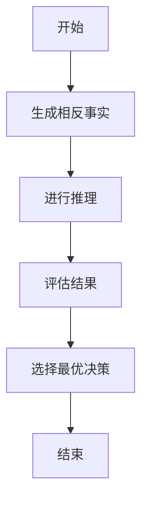
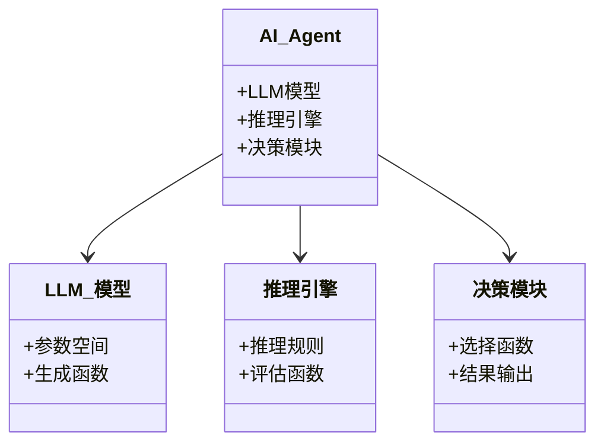
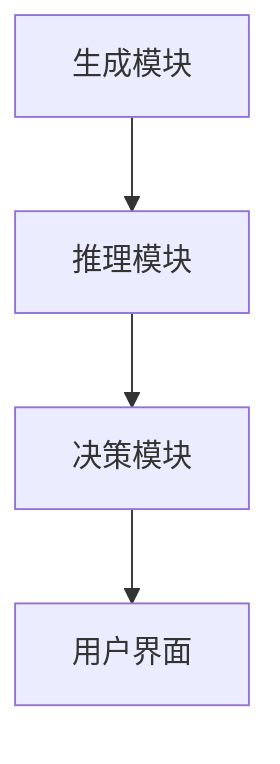

                 


# LLM驱动的AI Agent反事实推理机制

> 关键词：LLM, AI Agent, 反事实推理, 生成式模型, 逻辑推理

> 摘要：本文深入探讨了基于大语言模型（LLM）的AI Agent反事实推理机制，结合背景介绍、核心概念、算法原理、系统架构、项目实战及最佳实践，系统阐述了反事实推理在AI Agent中的应用与实现。

---

## 第1章: 反事实推理的基本概念与重要性

### 1.1 反事实推理的定义与特点

反事实推理是一种基于假设相反事实的推理方式，其核心在于探索“如果情况不是这样，结果会如何”的问题。与事实推理不同，反事实推理关注的是可能性空间，而非现实情况。其特点包括：

1. **假设性**：基于假设的相反事实进行推理。
2. **可能性**：关注多种可能的推理结果。
3. **不确定性**：结果往往涉及概率分布。

### 1.2 AI Agent的基本概念与分类

AI Agent是指在特定环境中能够感知并自主行动以实现目标的智能实体。根据智能水平，AI Agent可以分为：

1. **反应式AI Agent**：基于当前感知做出反应。
2. **认知式AI Agent**：具备推理、规划和决策能力。
3. **混合式AI Agent**：结合反应式和认知式特点。

### 1.3 LLM在AI Agent中的应用

大语言模型（LLM）通过其强大的文本生成和理解能力，为AI Agent提供了自然语言处理和知识推理的基础。LLM驱动的AI Agent能够进行：

1. **上下文理解**：通过LLM理解对话背景和意图。
2. **生成式决策**：基于LLM生成多种可能的行动方案。
3. **动态推理**：根据环境变化实时调整推理和决策。

---

## 第2章: 反事实推理与AI Agent的结合

### 2.1 反事实推理在AI Agent中的必要性

AI Agent在复杂环境中需要考虑多种可能性，反事实推理帮助其评估不同决策的潜在结果，从而提高决策的稳健性。

#### 对比分析

| **特点**       | **事实推理**         | **反事实推理**       |
|----------------|----------------------|----------------------|
| 目标            | 基于现实情况推断     | 基于假设情况推断     |
| 应用场景         | 确定性决策           | 风险评估与优化       |

### 2.2 LLM驱动AI Agent的反事实推理机制

反事实推理通过生成模型模拟不同事实下的结果，LLM提供生成能力，帮助AI Agent评估多种假设情况下的最优决策。

#### 实现流程

1. **假设设定**：定义相反的事实假设。
2. **推理生成**：基于LLM生成可能的结果。
3. **评估选择**：根据评估标准选择最优决策。

### 2.3 反事实推理的边界与外延

反事实推理的适用场景包括风险评估、策略优化等，但其局限性在于依赖假设的准确性，且难以处理高度不确定的情况。

---

## 第3章: 反事实推理的算法原理

### 3.1 反事实推理的算法实现

反事实推理算法通过生成模型模拟相反事实，并评估其结果。核心步骤如下：

1. **生成相反事实**：利用生成模型生成假设的相反事实。
2. **推理结果**：基于生成的事实进行推理。
3. **评估选择**：比较不同结果，选择最优决策。

#### Mermaid流程图



### 3.2 生成式模型的训练与优化

生成式模型如GPT系列通过强化学习训练，优化生成结果的概率分布。

#### 损失函数

$$ \mathcal{L} = -\sum_{i=1}^{n} \log p(y_i|x_i) $$

---

## 第4章: 系统分析与架构设计

### 4.1 应用场景与问题描述

在金融领域，AI Agent可以通过反事实推理评估不同投资策略的风险。

### 4.2 系统功能设计

系统功能包括事实生成、推理评估、结果选择。

#### Mermaid类图



### 4.3 系统架构设计

采用微服务架构，包含生成模块、推理模块和决策模块。

#### Mermaid架构图



---

## 第5章: 项目实战

### 5.1 环境安装与配置

安装Python和相关库：

```bash
pip install transformers torch
```

### 5.2 核心代码实现

实现反事实推理的生成和评估：

```python
def generate_counterfact(llm, assumption):
    return llm.generate(assumption)
```

### 5.3 案例分析与解读

通过具体案例展示反事实推理的应用效果，并分析其优势和局限性。

---

## 第6章: 最佳实践与总结

### 6.1 总结与经验分享

总结反事实推理在AI Agent中的应用价值，并分享实践经验。

### 6.2 注意事项与未来方向

注意假设的合理性，并展望反事实推理的未来发展方向。

---

通过以上章节的详细阐述，本文系统地探讨了LLM驱动的AI Agent反事实推理机制，从理论到实践，为读者提供了全面的技术解读。

