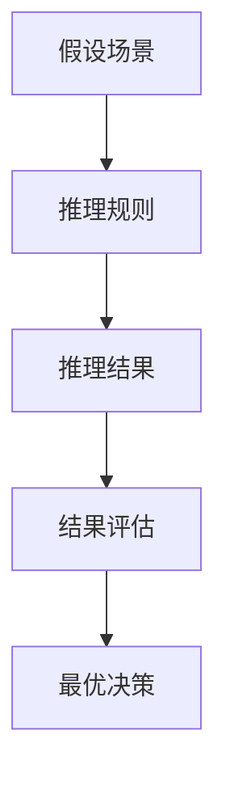
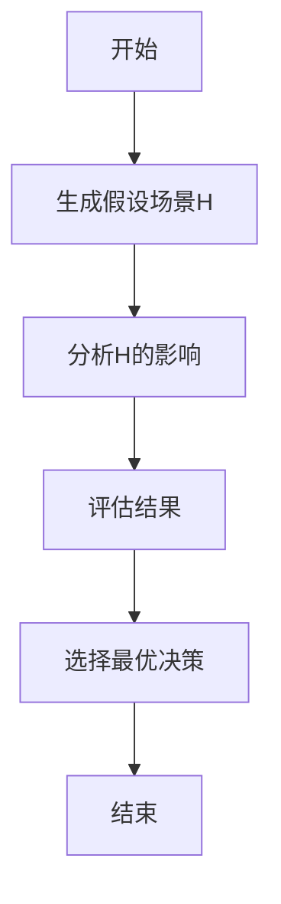
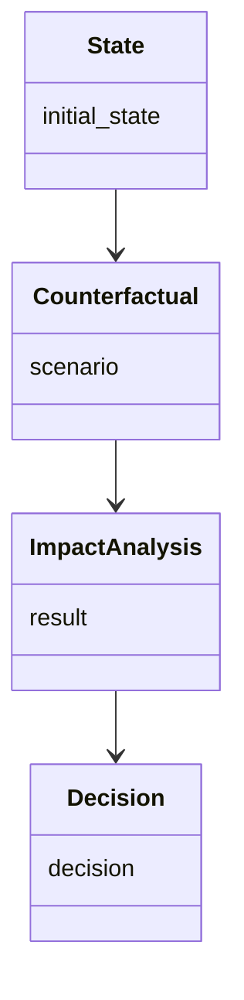
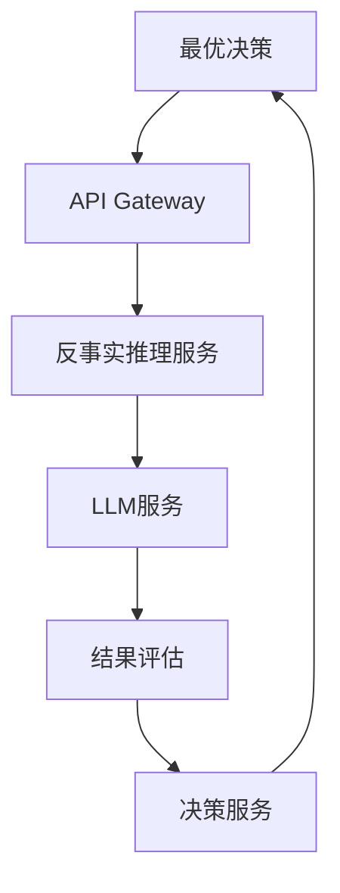
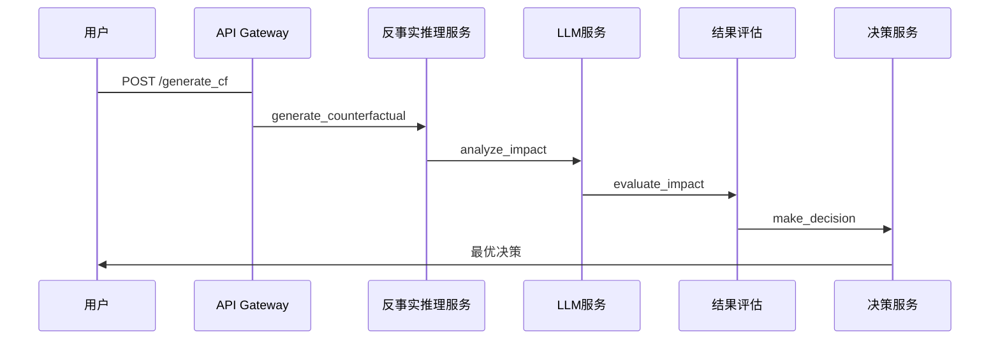

                 


# LLM驱动的AI Agent反事实推理能力

## 关键词
- 大语言模型（LLM）
- AI Agent
- 反事实推理
- 生成式AI
- 逻辑推理

## 摘要
反事实推理是AI Agent在复杂决策中不可或缺的能力，它允许系统考虑与现实相反的情况，并基于这些假设进行推理和优化决策。本文深入探讨了如何利用大语言模型（LLM）驱动AI Agent的反事实推理能力，分析了其核心概念、算法原理、系统架构，并通过实际案例展示了其应用价值。文章还提供了详细的代码实现和系统设计，帮助读者全面理解并应用这一技术。

---

# 目录

1. [背景介绍](#背景介绍)
   1.1 [反事实推理的定义与作用](#反事实推理的定义与作用)
   1.2 [LLM与AI Agent的结合](#LLM与AI Agent的结合)
   1.3 [反事实推理的应用场景与挑战](#反事实推理的应用场景与挑战)

2. [核心概念与联系](#核心概念与联系)
   2.1 [反事实推理的核心概念](#反事实推理的核心概念)
   2.2 [LLM在反事实推理中的作用](#LLM在反事实推理中的作用)
   2.3 [反事实推理的核心要素](#反事实推理的核心要素)
   2.4 [生成式模型与逻辑推理模型对比](#生成式模型与逻辑推理模型对比)
   2.5 [反事实推理的实体关系图](#反事实推理的实体关系图)

3. [算法原理讲解](#算法原理讲解)
   3.1 [反事实推理的数学模型](#反事实推理的数学模型)
   3.2 [基于LLM的反事实推理算法](#基于LLM的反事实推理算法)
   3.3 [算法流程图](#算法流程图)
   3.4 [Python代码实现](#Python代码实现)

4. [系统分析与架构设计](#系统分析与架构设计)
   4.1 [问题场景介绍](#问题场景介绍)
   4.2 [系统功能设计](#系统功能设计)
   4.3 [领域模型类图](#领域模型类图)
   4.4 [系统架构图](#系统架构图)
   4.5 [系统接口设计](#系统接口设计)
   4.6 [系统交互流程图](#系统交互流程图)

5. [项目实战](#项目实战)
   5.1 [环境安装](#环境安装)
   5.2 [核心代码实现](#核心代码实现)
   5.3 [代码解读与分析](#代码解读与分析)
   5.4 [实际案例分析](#实际案例分析)
   5.5 [项目总结](#项目总结)

6. [最佳实践](#最佳实践)
   6.1 [小结](#小结)
   6.2 [注意事项](#注意事项)
   6.3 [拓展阅读](#拓展阅读)

---

## 正文

### 第一部分：背景介绍

#### 1.1 反事实推理的定义与作用
反事实推理是指考虑与现实相反的情况，并基于这些假设进行推理和分析。它在AI领域中具有重要意义，尤其是在需要优化决策和应对不确定性的情况下。通过反事实推理，AI Agent能够探索不同的可能性，从而做出更优的决策。

#### 1.2 LLM与AI Agent的结合
大语言模型（LLM）凭借其强大的生成和理解能力，成为实现反事实推理的核心工具。LLM能够生成多种假设场景，并通过逻辑推理分析这些场景的影响，从而增强AI Agent的决策能力。

#### 1.3 反事实推理的应用场景与挑战
反事实推理广泛应用于金融、医疗、法律等领域。例如，在金融领域，反事实推理可以帮助评估不同的投资策略；在医疗领域，它可以帮助诊断不同的治疗方案效果。然而，实现反事实推理也面临诸多挑战，如计算复杂性和数据不足等。

### 第二部分：核心概念与联系

#### 2.1 反事实推理的核心概念
反事实推理的核心在于生成假设场景，并基于这些场景进行推理。这涉及到假设空间的构建、推理规则的制定以及结果评估等多个方面。

#### 2.2 LLM在反事实推理中的作用
LLM通过生成式模型和逻辑推理模型的结合，能够有效支持反事实推理。生成式模型用于生成假设场景，而逻辑推理模型则用于分析这些场景的影响。

#### 2.3 反事实推理的核心要素
- 假设空间：所有可能的反事实假设。
- 推理规则：用于分析假设场景影响的规则集。
- 结果评估：评估不同假设场景的结果，以选择最优决策。

#### 2.4 生成式模型与逻辑推理模型对比
| 特性                | 生成式模型                     | 逻辑推理模型                   |
|---------------------|-------------------------------|-------------------------------|
| 主要功能            | 生成假设场景                 | 分析假设场景影响               |
| 优势                | 创造性、多样性                | 准确性、逻辑性                |
| 适用场景            | 初始假设生成                 | 假设影响分析                 |

#### 2.5 反事实推理的实体关系图


### 第三部分：算法原理讲解

#### 3.1 反事实推理的数学模型
反事实推理的数学模型通常基于概率论，例如贝叶斯定理。假设我们有一个假设场景H，其概率P(H)可以通过贝叶斯定理计算。

$$ P(H) = \frac{P(E|H)P(H)}{P(E)} $$

其中，E是观察到的证据，H是假设场景。

#### 3.2 基于LLM的反事实推理算法
1. 生成假设场景H。
2. 使用LLM分析H的影响，得到推理结果。
3. 评估H的结果，选择最优决策。

#### 3.3 算法流程图


#### 3.4 Python代码实现
```python
import random

def generate_counterfactual(initial_state):
    # 生成假设场景
    return random.choice([True, False])

def analyze_impact(counterfactual):
    # 分析假设场景的影响
    return "positive" if counterfactual else "negative"

def decide(benefit):
    # 评估结果并选择决策
    return "proceed" if benefit == "positive" else "abort"

def main(initial_state):
    cf = generate_counterfactual(initial_state)
    impact = analyze_impact(cf)
    decision = decide(impact)
    return decision

# 示例运行
initial_state = True
print(main(initial_state))
```

### 第四部分：系统分析与架构设计

#### 4.1 问题场景介绍
考虑一个金融投资决策系统，AI Agent需要评估不同的投资策略。

#### 4.2 系统功能设计
系统功能包括生成假设场景、分析影响、评估结果和选择最优决策。

#### 4.3 领域模型类图


#### 4.4 系统架构图


#### 4.5 系统接口设计
- API接口：`POST /generate_cf`
- 输入：`{ "state": boolean }`
- 输出：`{ "scenario": boolean }`

#### 4.6 系统交互流程图


### 第五部分：项目实战

#### 5.1 环境安装
```bash
pip install transformers
pip install mermaid
```

#### 5.2 核心代码实现
```python
from transformers import pipeline

# 初始化生成式模型
generator = pipeline('text-generation', model='gpt2')

def generate_counterfactual(initial_state):
    # 生成假设场景
    input_text = f"假设初始状态为{initial_state}"
    return generator(input_text, max_length=100)

def analyze_impact(counterfactual):
    # 分析假设场景的影响
    return "positive" if "positive" in counterfactual else "negative"

def decide(benefit):
    # 评估结果并选择决策
    return "proceed" if benefit == "positive" else "abort"

def main(initial_state):
    cf = generate_counterfactual(initial_state)
    impact = analyze_impact(cf)
    decision = decide(impact)
    return decision

# 示例运行
initial_state = True
print(main(initial_state))
```

#### 5.3 代码解读与分析
- `generate_counterfactual`函数使用生成式模型生成假设场景。
- `analyze_impact`函数分析这些场景的影响。
- `decide`函数基于影响评估结果，选择最优决策。

#### 5.4 实际案例分析
以金融投资为例，假设当前市场趋势为上升，AI Agent生成假设场景，如市场下跌，并分析其影响，最终做出最优投资决策。

#### 5.5 项目总结
通过实现反事实推理，AI Agent能够更好地应对不确定性，做出更优决策。然而，实现这一能力需要克服计算复杂性和数据不足等挑战。

### 第六部分：最佳实践

#### 6.1 小结
反事实推理是AI Agent的重要能力，LLM提供了强大的支持。通过生成假设场景和逻辑推理，AI Agent能够做出更优决策。

#### 6.2 注意事项
- 确保生成的假设场景具有代表性。
- 合理设计推理规则，避免错误决策。
- 定期更新模型，以适应新的数据和场景。

#### 6.3 拓展阅读
- 《Large Language Models for Reasoning》
- 《Counterfactual Reasoning in AI Systems》

---

# 结语
反事实推理是AI Agent实现智能决策的关键能力。通过结合大语言模型，AI Agent能够考虑多种假设场景，并基于这些场景做出最优决策。希望本文能够帮助读者深入理解这一技术，并在实际应用中取得成功。

