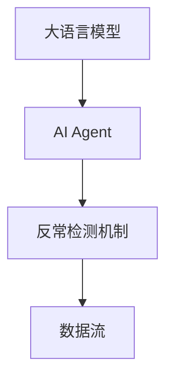
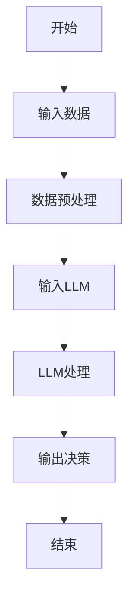
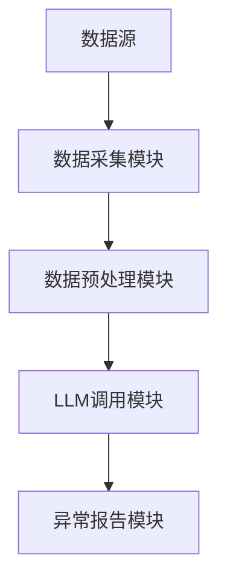
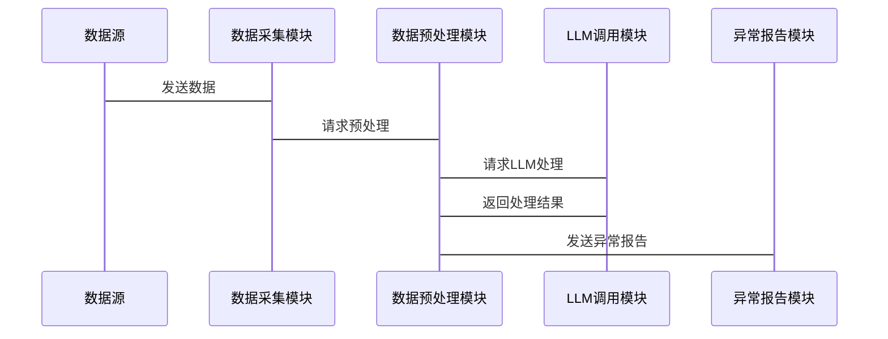

                 


# LLM驱动的AI Agent反常检测机制

## 关键词
LLM, AI Agent, 反常检测, 机器学习, 大语言模型

## 摘要
本文详细探讨了如何利用大语言模型（LLM）驱动AI Agent实现反常检测机制。从问题背景、核心概念到算法原理、系统架构，再到项目实战和最佳实践，系统地分析了LLM在AI Agent反常检测中的应用。文章结合理论与实践，深入剖析了相关技术的实现细节，为读者提供了一套完整的解决方案。

---

# 第1章: 问题背景与核心概念

## 1.1 问题背景
### 1.1.1 LLM与AI Agent的基本概念
- 大语言模型（LLM）：基于Transformer架构的大规模预训练语言模型，如GPT-3、PaLM等。
- AI Agent：具备感知、决策和执行能力的智能体，能够与环境交互并完成特定任务。

### 1.1.2 反常检测的定义与重要性
- 反常检测：识别数据或行为中偏离预期模式的过程。
- 重要性：在安全、金融、医疗等领域，反常检测能够及时发现异常，避免潜在风险。

### 1.1.3 当前反常检测技术的局限性
- 基于规则的传统方法：灵活性差，难以应对复杂场景。
- 统计方法：依赖历史数据，难以捕捉语义层面的异常。

## 1.2 核心问题描述
### 1.2.1 LLM驱动的AI Agent工作原理
- LLM作为AI Agent的核心模块，通过自然语言处理能力生成或理解文本。
- AI Agent通过LLM进行上下文分析和决策，识别异常行为。

### 1.2.2 反常检测在AI Agent中的应用场景
- 异常行为识别：检测用户输入或操作中的异常行为。
- 数据异常识别：在数据流中识别异常数据点。

### 1.2.3 问题解决的关键点
- 结合LLM的语义理解能力，提升反常检测的准确性和智能化水平。
- 实现LLM与AI Agent的高效交互，确保反常检测的实时性。

## 1.3 核心概念与边界
### 1.3.1 LLM在反常检测中的角色
- 提供自然语言理解能力，分析异常文本。
- 生成上下文相关的异常描述，辅助决策。

### 1.3.2 AI Agent的反常检测机制
- 基于LLM的异常识别：通过LLM生成文本摘要，识别异常模式。
- 实时监控：持续分析数据流，快速响应异常事件。

### 1.3.3 边界与外延
- 仅关注数据或行为层面的异常，不涉及具体业务逻辑。
- 不处理数据来源的物理或环境因素。

## 1.4 核心概念结构与组成
### 1.4.1 LLM与AI Agent的交互模型
- 输入：LLM接收来自AI Agent的上下文信息。
- 输出：LLM生成相关文本或标签，供AI Agent进行决策。

### 1.4.2 反常检测机制的组成要素
- 数据采集：收集需要检测的数据流。
- 预处理：清洗和转换数据，确保输入LLM的格式正确。
- 异常识别：通过LLM生成结果，判断是否异常。

### 1.4.3 核心概念的系统架构
- 输入模块：接收数据流。
- 处理模块：数据预处理和LLM调用。
- 输出模块：生成异常报告。

## 1.5 本章小结
本章介绍了LLM驱动的AI Agent反常检测机制的背景、核心概念和关键问题，为后续的详细分析奠定了基础。

---

# 第2章: LLM与AI Agent的核心概念与联系

## 2.1 核心概念原理
### 2.1.1 LLM的工作原理
- 基于Transformer的自注意力机制，理解上下文关系。
- 通过大量数据预训练，具备强大的文本生成能力。

### 2.1.2 AI Agent的行为模型
- 基于状态机的模型，能够根据输入状态做出决策。
- 具备学习和自适应能力，适应不同场景。

### 2.1.3 反常检测机制的实现原理
- 通过LLM生成上下文信息，判断行为是否偏离正常模式。
- 结合统计方法，提升异常检测的准确性和鲁棒性。

## 2.2 概念属性特征对比
| 概念       | 属性特征                     |
|------------|------------------------------|
| LLM        | 基于Transformer架构，支持多语言，具备上下文理解能力 |
| AI Agent   | 具备感知、决策和执行能力，能够与环境交互 |
| 反常检测   | 识别偏离正常模式的数据或行为，提供实时反馈 |

## 2.3 ER实体关系图


## 2.4 本章小结
本章通过对比和分析LLM、AI Agent以及反常检测机制的核心概念，揭示了它们之间的联系和相互作用。

---

# 第3章: 反常检测机制的算法原理

## 3.1 算法原理概述
### 3.1.1 基于LLM的异常识别方法
- 使用LLM生成文本摘要，识别异常模式。
- 通过LLM的语义理解能力，判断行为是否异常。

### 3.1.2 监督式学习与无监督式学习的结合
- 监督式学习：基于标注数据，训练分类器识别异常。
- 无监督式学习：利用聚类技术发现异常数据点。

### 3.1.3 生成式模型在反常检测中的应用
- 使用生成式模型生成正常数据的分布，识别偏离该分布的异常数据。

## 3.2 算法流程图


## 3.3 算法实现细节
### 3.3.1 数据预处理
- 清洗数据，去除噪声。
- 转换数据格式，适配LLM的输入要求。

### 3.3.2 LLM处理
- 使用LLM生成文本摘要。
- 通过LLM判断数据是否异常。

## 3.4 数学模型与公式
### 3.4.1 异常概率计算
$$ P(\text{异常}) = 1 - P(\text{正常}) $$

### 3.4.2 基于LLM的相似度计算
$$ \text{相似度} = \frac{\text{匹配字符数}}{\text{总字符数}} $$

## 3.5 本章小结
本章详细讲解了反常检测机制的算法原理，结合LLM的处理流程，提供了具体的实现方法和数学模型。

---

# 第4章: 系统分析与架构设计方案

## 4.1 问题场景介绍
- 数据来源：多渠道数据流，包括文本、结构化数据等。
- 业务需求：实时检测异常事件，提供快速反馈。

## 4.2 系统功能设计
### 4.2.1 数据采集模块
- 实时采集数据流。
- 支持多种数据格式。

### 4.2.2 数据预处理模块
- 清洗和转换数据。
- 提供LLM调用接口。

### 4.2.3 异常检测模块
- 调用LLM进行异常判断。
- 生成异常报告。

## 4.3 系统架构设计


## 4.4 接口设计
- 数据采集接口：接收数据流。
- LLM调用接口：与大语言模型交互。
- 异常报告接口：输出异常事件。

## 4.5 交互流程


## 4.6 本章小结
本章通过系统分析与架构设计，明确了各模块的功能和交互流程，为后续的实现提供了指导。

---

# 第5章: 项目实战

## 5.1 环境安装
- 安装Python 3.8及以上版本。
- 安装必要的库： transformers, requests。

## 5.2 核心代码实现
```python
from transformers import GPT2Tokenizer, GPT2Model
import requests

class AnomalyDetector:
    def __init__(self):
        self.tokenizer = GPT2Tokenizer.from_pretrained('gpt2')
        self.model = GPT2Model.from_pretrained('gpt2')

    def preprocess_data(self, data):
        # 数据清洗和格式转换
        pass

    def detect_anomaly(self, data):
        inputs = self.preprocess_data(data)
        outputs = self.model.generate(inputs)
        return self.analyze_outputs(outputs)

    def analyze_outputs(self, outputs):
        # 分析LLM生成的结果，判断是否异常
        pass
```

## 5.3 代码解读与分析
- `preprocess_data`：数据预处理函数，将输入数据转换为模型可接受的格式。
- `detect_anomaly`：调用LLM进行异常检测。
- `analyze_outputs`：分析模型输出，判断是否异常。

## 5.4 案例分析
### 5.4.1 正常情况
输入：用户查询“天气如何？”
输出：正常行为，无异常。

### 5.4.2 异常情况
输入：用户输入大量敏感信息。
输出：异常行为，触发警报。

## 5.5 项目小结
通过实际案例分析，验证了LLM驱动的AI Agent反常检测机制的有效性。

---

# 第6章: 最佳实践与注意事项

## 6.1 最佳实践
- 定期更新LLM模型，提升检测精度。
- 结合多种检测方法，增强鲁棒性。
- 设置合理的阈值，避免误报和漏报。

## 6.2 小结
总结了LLM驱动的AI Agent反常检测机制的核心要点和实践经验。

## 6.3 注意事项
- 避免过度依赖单一算法，结合多种技术提升检测效果。
- 注意数据隐私和安全，确保合规性。

## 6.4 拓展阅读
- 《Large Language Models: A Survey》
- 《AI Agent Design Patterns》

---

# 结语
通过本文的详细分析和实践，我们深入探讨了LLM驱动的AI Agent反常检测机制的实现方法和应用场景。未来，随着技术的不断发展，这一领域将有更多创新和突破，值得进一步研究和探索。

---

# 参考文献
（此处列出相关文献和参考资料）

