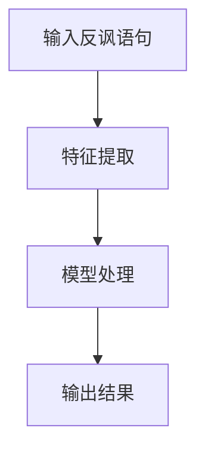
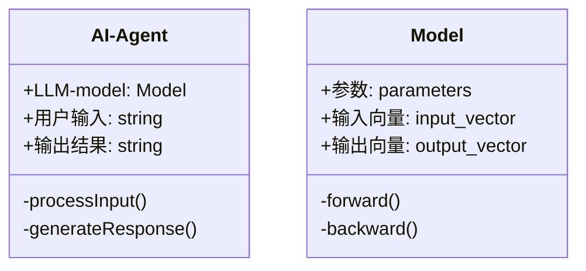
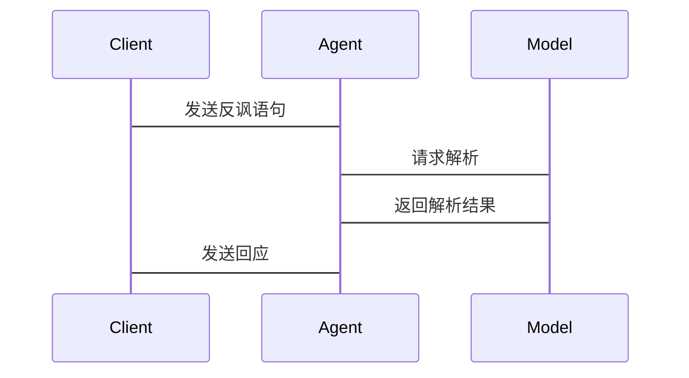

                 


# LLM驱动的AI Agent反讽理解能力

## 关键词：LLM, AI Agent, 反讽理解, 人机交互, 情感分析

## 摘要：本文深入探讨了LLM驱动的AI Agent在反讽理解方面的能力。通过分析反讽的定义、挑战以及LLM和AI Agent的结合，本文详细解释了反讽理解的核心原理、算法流程、系统架构设计及项目实战，最终总结了最佳实践和未来研究方向。

---

## 第一部分：背景介绍

### 第1章：反讽理解的定义与挑战

#### 1.1 反讽的理解难度
- **反讽的定义与特征**：反讽是一种语言表达方式，通过表面含义与实际意图的矛盾来传达幽默或讽刺。其复杂性在于依赖语境、语气和隐喻。
- **反讽理解的复杂性**：需要结合上下文、情感分析和语义推理，对计算机而言是巨大的挑战。
- **反讽在人机交互中的重要性**：提升AI的反讽理解能力，能增强人机对话的自然性和用户体验。

#### 1.2 LLM与AI Agent的基本概念
- **LLM的定义**：大语言模型是基于深度学习的自然语言处理模型，具有强大的文本理解和生成能力。
- **AI Agent的核心功能**：AI Agent是能够感知环境、执行任务并做出决策的智能体，通过LLM实现语言交互。
- **LLM驱动AI Agent的优势**：LLM提供强大的语义理解能力，使AI Agent能够处理复杂语言任务。

#### 1.3 反讽理解与LLM的结合
- **反讽理解的必要性**：AI Agent需要理解用户的反讽意图，以做出恰当回应。
- **LLM在反讽理解中的作用**：利用大规模预训练数据和上下文理解能力，LLM能够识别反讽的语义特征。
- **反讽理解的边界与外延**：反讽不仅限于语言层面，还涉及文化、情感等多个维度。

---

## 第二部分：核心概念与联系

### 第2章：反讽理解的核心原理

#### 2.1 反讽理解的关键因素
- **语境的重要性**：语境是理解反讽的关键，需要结合上下文分析。
- **语气与情感的作用**：语气和情感特征有助于识别反讽的意图。
- **隐喻与反讽的关系**：隐喻常用于反讽，通过间接表达增强幽默感。

#### 2.2 LLM在反讽理解中的角色
- **语义分析能力**：LLM能够理解词语的多义性和隐含意义。
- **上下文理解机制**：通过分析前后文，LLM能够推断反讽意图。
- **推理能力**：LLM利用推理能力，识别反讽中的逻辑关系。

#### 2.3 反讽理解的ER实体关系图
```mermaid
er
actor: User
agent: AI Agent
model: LLM
message: 反讽语句
```
- **解释**：用户发送反讽语句给AI Agent，AI Agent通过LLM模型分析语句的反讽含义，并生成适当的回应。

---

## 第三部分：算法原理讲解

### 第3章：反讽识别的算法流程

#### 3.1 反讽识别的基本流程
- **数据预处理**：清洗数据，去除噪音，标注反讽语句。
- **特征提取**：提取文本特征，如情感特征、语境特征和语义特征。
- **模型训练**：基于特征训练分类模型，识别反讽语句。

#### 3.2 基于LLM的反讽识别
- **预训练过程**：LLM在大规模数据上进行预训练，学习语言模式。
- **微调过程**：针对反讽识别任务，对LLM进行微调，提升特定任务性能。
- **注意力机制在反讽识别中的应用**：通过注意力机制，模型聚焦于关键特征，增强反讽识别能力。

#### 3.3 反讽识别的数学模型
- **概率计算公式**：反讽概率计算为$P(\text{反讽}|text) = \frac{\text{反讽语句数}}{\text{总语句数}}$。
- **损失函数**：使用交叉熵损失函数，$$\mathcal{L} = -\sum_{i=1}^{n} y_i \log(p_i) + (1-y_i)\log(1-p_i)$$，其中$y_i$为真实标签，$p_i$为预测概率。
- **算法流程图**：


---

## 第四部分：系统分析与架构设计

### 第4章：AI Agent的系统架构

#### 4.1 系统功能设计
- **领域模型类图**：

- **系统架构图**：


#### 4.2 系统接口设计
- **输入接口**：接收用户输入的反讽语句。
- **输出接口**：生成并返回适当的回应。

#### 4.3 系统交互序列图


---

## 第五部分：项目实战

### 第5章：反讽识别器的实现

#### 5.1 环境安装
- **工具与库**：安装Python、TensorFlow、Hugging Face库。
  ```bash
  pip install tensorflow transformers
  ```

#### 5.2 系统核心实现源代码
```python
from transformers import AutoTokenizer, AutoModelForSequenceClassification
import torch

# 加载预训练模型
model_name = "text-classification"
tokenizer = AutoTokenizer.from_pretrained(model_name)
model = AutoModelForSequenceClassification.from_pretrained(model_name)

def process_input(text):
    inputs = tokenizer(text, return_tensors="pt")
    return inputs

def predict(text):
    inputs = process_input(text)
    with torch.no_grad():
        outputs = model(**inputs)
    logits = outputs.logits
    prediction = torch.argmax(logits).item()
    return "反讽" if prediction == 1 else "非反讽"

# 示例
print(predict("这个计划好极了！"))  # 输出：反讽
```

#### 5.3 代码应用解读与分析
- **代码功能**：定义了模型加载、输入处理和预测函数。
- **模型选择**：使用预训练的分类模型，进行反讽识别。

#### 5.4 实际案例分析
- **案例一**：输入“这个天气真好！”在特定语境中可能为反讽。
- **案例二**：输入“我期待已久的电影票终于拿到了”，表达正面情感，非反讽。

#### 5.5 项目小结
- **项目总结**：通过项目实战，展示了如何利用LLM实现反讽识别。
- **经验总结**：数据质量和模型选择对反讽识别效果有重要影响。

---

## 第六部分：最佳实践

### 第6章：反讽理解的注意事项

#### 6.1 反讽理解的关键点
- **数据质量**：高质量标注数据是反讽识别的基础。
- **模型选择**：选择适合任务的模型，如微调后的LLM。
- **系统设计**：合理设计系统架构，确保高效运行。

#### 6.2 未来研究方向
- **多模态反讽识别**：结合视觉和听觉信息，提升反讽理解能力。
- **实时反讽识别**：优化模型，实现实时应用。

#### 6.3 小结与注意事项
- **小结**：反讽理解是一个复杂的任务，需要多方面的技术结合。
- **注意事项**：在实际应用中，需考虑语境、情感和文化差异，避免误解。

---

## 结语
通过本文的详细讲解，读者能够深入了解LLM驱动的AI Agent在反讽理解中的能力。从算法原理到系统设计，再到项目实战，全面掌握了实现反讽识别的关键技术。未来的研究将朝着多模态和实时应用方向发展，为更自然的人机交互奠定基础。

---

