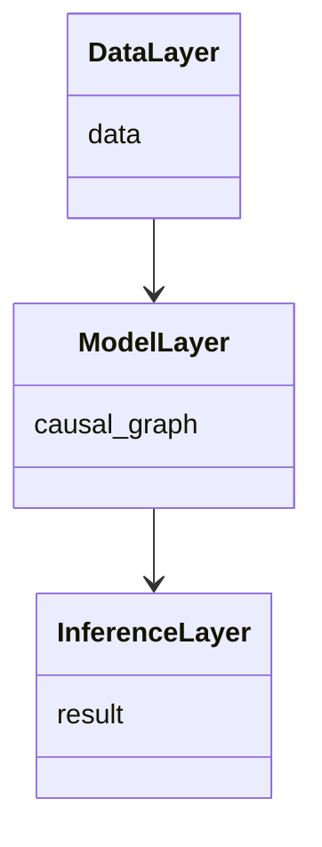
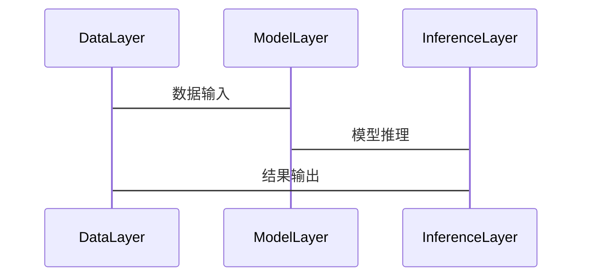

                 


# LLM驱动的AI Agent因果关系发现技术

## 关键词：LLM、AI Agent、因果关系、因果图模型、机器学习

## 摘要：
本文详细探讨了利用大语言模型（LLM）驱动AI Agent进行因果关系发现的技术。从基本概念到算法原理，从系统架构到项目实战，全面解析如何通过LLM和AI Agent结合，实现因果关系的高效发现与应用。文章旨在为技术从业者提供理论指导和实践指南，帮助他们在复杂场景中更好地理解和应用因果关系技术。

---

# 第1章: LLM驱动的AI Agent因果关系发现技术概述

## 1.1 问题背景与问题描述

### 1.1.1 因果关系发现的背景与意义
因果关系是理解世界的基础。在数据分析中，传统的相关性分析只能揭示变量之间的关联，而因果关系分析可以揭示变量之间的“原因与结果”关系。例如，在医疗领域，因果关系分析可以帮助确定药物是否真正导致了患者的康复。

### 1.1.2 LLM在因果关系发现中的作用
大语言模型（LLM）具有强大的自然语言处理和模式识别能力，能够帮助AI Agent理解复杂的文本数据，提取潜在的因果关系。例如，LLM可以分析大量的医学文献，识别出药物与患者康复之间的因果关系。

### 1.1.3 AI Agent在因果关系发现中的应用场景
AI Agent可以通过因果关系发现技术，辅助人类在决策支持、风险评估、过程优化等领域做出更明智的选择。例如，在金融领域，AI Agent可以通过因果关系分析，识别出某些经济指标对市场波动的因果影响。

## 1.2 问题解决与技术路径

### 1.2.1 因果关系发现的核心问题
因果关系发现的核心问题在于如何从数据中识别出真实的因果关系，而不是仅仅发现相关性。例如，在教育领域，我们需要确定是教学质量还是学生努力程度导致了学生成绩的提高。

### 1.2.2 LLM驱动AI Agent的技术路径
1. 数据收集与预处理：从多个来源收集数据，并进行清洗和预处理。
2. 因果关系建模：使用因果图模型构建变量之间的因果关系网络。
3. 因果推理：通过算法计算因果关系的强度和方向。
4. 可视化与解释：将因果关系网络可视化，帮助用户理解和应用。

### 1.2.3 技术的边界与外延
因果关系发现技术的边界在于数据质量和数量，以及模型的假设条件。例如，如果数据存在偏差或噪声，因果关系的识别可能会受到影响。技术的外延包括与机器学习、知识图谱等其他技术的结合应用。

## 1.3 概念结构与核心要素

### 1.3.1 因果关系的基本概念
因果关系是指一个事件（原因）导致另一个事件（结果）发生。例如，下雨是导致地面湿的原因。

### 1.3.2 LLM驱动的AI Agent核心要素
- **LLM**：提供强大的自然语言理解和生成能力。
- **因果图模型**：用于建模变量之间的因果关系。
- **因果推理算法**：用于从数据中发现因果关系。

### 1.3.3 技术架构的核心组成
1. 数据层：存储和管理原始数据。
2. 模型层：构建因果图模型。
3. 推理层：执行因果推理算法。
4. 可视化层：将因果关系网络可视化。

---

# 第2章: 因果关系发现的基本原理

## 2.1 因果推理的基本概念

### 2.1.1 因果关系的定义与特征
因果关系具有时间顺序性和可干预性。例如，服药是导致症状缓解的原因，时间上是先有服药后有症状缓解。

### 2.1.2 因果图模型的构建原理
因果图模型是一种有向图，节点表示变量，边表示因果关系。例如，天气、洒水等变量对地面湿的因果关系可以表示为一个因果图。

### 2.1.3 因果关系与相关性的区别
相关性分析只能发现变量之间的统计关联，而因果关系分析可以确定变量之间的因果关系。例如，身高和体重的相关性分析只能说明两者相关，而因果关系分析可以确定身高对体重的影响。

## 2.2 因果关系与相关性的对比

### 2.2.1 相关性分析的局限性
相关性分析只能发现变量之间的关联，而无法确定因果关系。例如，冰 cream 销量和溺水事故的相关性分析可能显示两者相关，但这并不意味着吃冰 cream 导致溺水。

### 2.2.2 因果关系的数学模型
因果关系可以通过潜在结果框架（Potential Outcome Framework）来建模。例如，假设每个变量都有一个潜在结果，在给定干预的情况下，可以通过比较潜在结果来确定因果关系。

### 2.2.3 LLM在因果关系发现中的优势
LLM可以处理大量的文本数据，提取潜在的因果关系。例如，通过分析大量的新闻报道，LLM可以识别出某些政策变化对经济指标的因果影响。

## 2.3 因果图模型的构建与分析

### 2.3.1 因果图的基本结构
因果图由节点（变量）和有向边（因果关系）组成。例如，因果图可以表示为：D → R，其中 D 是药物，R 是康复效果。

### 2.3.2 因果图的构建方法
1. **基于知识的构建**：根据领域专家的知识手动构建因果图。
2. **基于数据的构建**：通过算法从数据中自动构建因果图。

### 2.3.3 因果关系的验证与评估
通过干预实验或反事实推理来验证因果关系。例如，可以通过随机对照试验来验证药物对康复效果的因果影响。

---

# 第3章: 基于统计的因果发现算法

## 3.1 算法原理与流程

### 3.1.1 算法原理
基于统计的因果发现算法通常通过分析变量之间的条件独立性来构建因果图。例如，格兰姆-施耐德算法（Granger Causality）可以用于时间序列数据的因果关系分析。

### 3.1.2 算法流程
1. 数据预处理：对数据进行标准化或归一化处理。
2. 构建条件独立性网络：通过统计测试确定变量之间的条件独立性。
3. 构建因果图：根据条件独立性网络构建因果图。

## 3.2 算法实现与代码示例

### 3.2.1 算法的Python实现
```python
import numpy as np
from sklearn.covariance import MinCovDet

def compute_granger_causality(data, max_lag=1):
    n = data.shape[0]
    p = data.shape[1]
    grange = np.zeros((p, p), dtype=float)
    
    for i in range(p):
        for j in range(p):
            if i == j:
                continue
            model = MinCovDet(nu=0).fit(data[:, i])
            lagged_data = np.zeros((n - max_lag, max_lag))
            for k in range(n - max_lag):
                lagged_data[k, :] = data[k, j]
            grange[i, j] = model.score_samples(lagged_data)
    
    return grange
```

### 3.2.2 代码的功能解读
上述代码实现了Granger因果性检验，用于计算变量之间的因果关系强度。通过计算条件独立性，可以确定变量之间的因果关系方向。

---

# 第4章: 基于机器学习的因果发现算法

## 4.1 算法原理与流程

### 4.1.1 算法原理
基于机器学习的因果发现算法通常通过深度学习模型来建模变量之间的因果关系。例如，因果关系神经网络（Causal Neural Network）可以通过学习数据的潜在表示来发现因果关系。

### 4.1.2 算法流程
1. 数据预处理：对数据进行清洗和特征提取。
2. 模型训练：训练深度学习模型，学习数据的潜在表示。
3. 因果推理：通过模型预测潜在结果，确定因果关系。

## 4.2 算法实现与代码示例

### 4.2.1 算法的Python实现
```python
import tensorflow as tf
from tensorflow.keras import layers

def build_causal_network(input_shape):
    inputs = layers.Input(shape=input_shape)
    x = layers.Dense(64, activation='relu')(inputs)
    x = layers.Dense(32, activation='relu')(x)
    outputs = layers.Dense(1, activation='sigmoid')(x)
    model = tf.keras.Model(inputs=inputs, outputs=outputs)
    return model
```

### 4.2.2 代码的功能解读
上述代码定义了一个因果关系神经网络，用于分类任务。通过训练模型，可以发现输入变量与输出变量之间的因果关系。

---

# 第5章: 系统分析与架构设计方案

## 5.1 问题场景介绍
在金融领域，我们希望分析某些经济指标对市场波动的因果影响。

## 5.2 系统功能设计

### 5.2.1 领域模型（Mermaid类图）


### 5.2.2 系统架构设计（Mermaid架构图）


### 5.2.3 系统接口设计
- 数据接口：提供数据的输入和输出接口。
- 模型接口：提供模型的训练和推理接口。

### 5.2.4 系统交互（Mermaid序列图）


---

# 第6章: 项目实战

## 6.1 环境安装
需要安装以下库：
- Python
- TensorFlow
- Scikit-learn

## 6.2 核心代码实现

### 6.2.1 数据预处理
```python
import pandas as pd

data = pd.read_csv('data.csv')
```

### 6.2.2 模型训练
```python
model = build_causal_network((input_dim,))
model.compile(optimizer='adam', loss='binary_crossentropy')
model.fit(X_train, y_train, epochs=10, batch_size=32)
```

### 6.2.3 案例分析
通过分析训练好的模型，可以发现变量之间的因果关系。

## 6.3 项目小结
通过本项目，我们掌握了如何利用LLM驱动AI Agent进行因果关系发现的方法。

---

# 第7章: 最佳实践、小结、注意事项和拓展阅读

## 7.1 最佳实践 tips
- 数据质量是因果关系发现的关键。
- 确保模型的可解释性。
- 定期更新模型。

## 7.2 小结
本文详细探讨了LLM驱动的AI Agent因果关系发现技术，从理论到实践，全面解析了因果关系的发现与应用。

## 7.3 注意事项
- 数据可能存在偏差或噪声。
- 模型的假设条件需要满足。

## 7.4 拓展阅读
推荐阅读相关领域的书籍和论文，深入理解因果关系发现的技术细节。

---

# 结语
因果关系发现是一项具有挑战性的任务，但通过LLM和AI Agent的结合，我们可以更高效地发现和应用因果关系。希望本文能为读者提供有价值的指导和启示。

