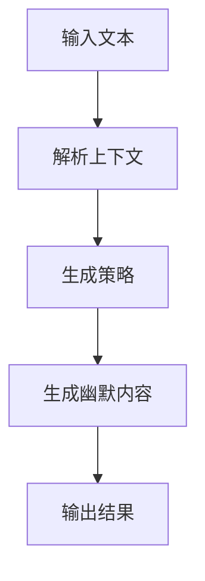
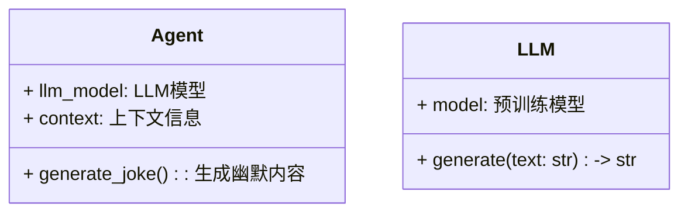
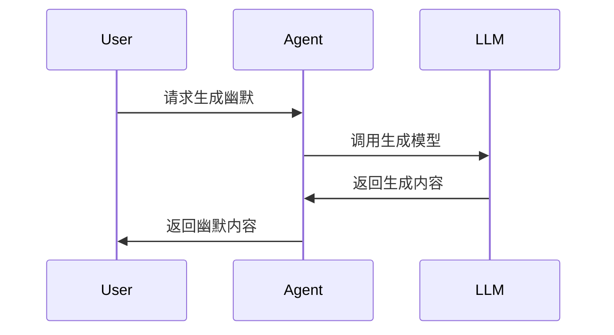

                 


```markdown
# LLM驱动的AI Agent幽默感生成

> 关键词：LLM，AI Agent，幽默感生成，自然语言处理，大语言模型，人工智能，幽默算法，机器学习，生成模型

> 摘要：本文系统地探讨了利用大语言模型（LLM）驱动AI Agent生成幽默感的核心原理、算法设计和实现方案。通过分析幽默感的多维度特征，结合LLM的生成能力，提出了一套完整的幽默生成框架，并通过实际案例展示了如何实现这一过程。文章内容涵盖理论与实践，旨在为研究人员和开发者提供深入的技术指导。

---

# 第一部分: 背景介绍与核心概念

# 第1章: LLM驱动的AI Agent幽默感生成概述

## 1.1 问题背景与问题描述
### 1.1.1 幽默感生成的背景
幽默是人类语言交流中的一种高级能力，能够拉近人与人之间的距离，提升沟通的愉悦感。然而，如何让AI具备幽默感，使其能够与人类进行更自然的互动，是当前人工智能领域的重要挑战之一。

### 1.1.2 问题描述与目标
- **问题描述**：幽默感的生成需要结合语言理解、情感感知和创造力，传统的基于规则的幽默生成方法难以应对复杂多样的语境。
- **目标**：利用大语言模型的强大生成能力，设计一种能够根据输入上下文自动生成幽默内容的AI Agent。

### 1.1.3 解决方法与边界
- **解决方法**：通过LLM的文本生成能力，结合领域知识和语境信息，动态生成符合场景的幽默内容。
- **边界与外延**：幽默感生成的边界包括文本内容的合规性、文化适配性以及生成效率。外延则涉及情感计算、多模态幽默生成等方向。

## 1.2 核心概念与概念结构
### 1.2.1 LLM驱动的AI Agent定义
LLM驱动的AI Agent是一种能够理解上下文、生成幽默内容并进行交互的智能体，通过与用户互动，动态调整生成策略。

### 1.2.2 幽默感生成的多维度特征
幽默感的生成需要考虑以下维度：
- **语言维度**：语义理解、语境感知。
- **情感维度**：情感共鸣、情绪调节。
- **文化维度**：文化适配性、地域特色。

### 1.2.3 核心概念的ER实体关系图
```mermaid
er
    actor: 用户
    agent: AI Agent
    llm: 大语言模型
    joke: 幽默内容
    action: 动作
    attribute: 属性
    relation: 关系
    actor --> agent: 请求生成幽默
    agent --> llm: 调用模型生成
    llm --> joke: 生成幽默内容
    joke --> action: 包含动作
    joke --> attribute: 包含属性
    action --> relation: 形成关系
```

---

# 第2章: 幽默感生成的机制与模型

## 2.1 幽默感的本质与特征
### 2.1.1 幽默的多维度特征
- 幽默是一种高级的语言能力，涉及对语言、情感和文化的深刻理解。
- 幽默的生成需要结合逻辑推理、语境理解和创造力。

### 2.1.2 幽默生成的模式
- **基于规则的生成**：通过预定义的幽默规则和模板生成幽默内容。
- **基于统计的生成**：利用大数据分析，提取常见幽默模式。
- **基于LLM的生成**：通过大语言模型的深度学习能力，生成高质量的幽默内容。

### 2.1.3 LLM在幽默生成中的独特优势
- **强大的生成能力**：LLM能够生成多样化、高质量的幽默内容。
- **动态适应能力**：能够根据上下文调整生成策略，适应不同场景需求。

## 2.2 幽默生成模型的原理
### 2.2.1 基于LLM的生成模型
- **输入处理**：接收用户输入，解析上下文信息。
- **生成策略**：基于LLM的内部机制，生成符合场景的幽默内容。
- **输出优化**：通过优化算法，提升生成内容的质量。

### 2.2.2 基于规则的生成模型
- **规则定义**：预定义幽默规则和模板。
- **内容生成**：根据规则生成幽默内容。
- **内容评估**：评估生成内容的质量，进行优化。

### 2.2.3 混合模型的优势
- **结合规则与生成**：利用规则模型的可控性和生成模型的创造性，生成高质量的幽默内容。
- **动态调整**：根据反馈动态调整生成策略，提升生成效果。

## 2.3 LLM在幽默生成中的应用
### 2.3.1 基于GPT系列的幽默生成
- **GPT-3**：通过微调GPT-3模型，使其具备幽默生成能力。
- **GPT-4**：进一步提升生成能力，支持多轮对话。

### 2.3.2 基于BERT系列的幽默生成
- **BERT**：通过预训练模型，生成与上下文相关的幽默内容。
- **RoBERTa**：优化的BERT模型，提升生成效果。

### 2.3.3 其他模型的对比分析
- **对比分析**：从生成质量、效率、可控性等方面对比不同模型的优缺点。

---

# 第3章: 幽默生成的核心算法原理

## 3.1 幽默生成算法的流程
### 3.1.1 输入处理
- **文本预处理**：去除无关信息，提取关键内容。
- **上下文解析**：理解输入的语境和情感。

### 3.1.2 生成策略
- **基于概率的生成**：根据上下文概率生成最优内容。
- **基于规则的生成**：结合预定义规则生成幽默内容。
- **混合生成**：结合概率和规则，生成高质量内容。

### 3.1.3 优化方法
- **损失函数优化**：通过损失函数优化生成模型。
- **强化学习优化**：利用强化学习提升生成质量。

## 3.2 幽默生成算法的数学模型
### 3.2.1 概率模型
- **条件概率模型**：P(joke|context)。
- **最大似然估计**：最大化P(joke|context)。

### 3.2.2 损失函数
- **交叉熵损失函数**：衡量生成内容与真实内容的差距。
  $$ \text{Loss} = -\sum_{i=1}^{n} \log P(y_i|x_i) $$

### 3.2.3 生成策略
- **贪心生成**：逐词生成，选择概率最高的词。
- **随机采样**：随机选择生成内容，增加多样性。

## 3.3 幽默生成算法的实现
### 3.3.1 基于Python的实现
```python
def generate_joke(context):
    # 输入处理
    input_ids = tokenizer(context, return_tensors='np')
    # 生成幽默内容
    outputs = model.generate(
        input_ids=input_ids.input_ids,
        max_length=100,
        do_sample=True,
        temperature=1.2
    )
    # 解析生成内容
    joke = tokenizer.decode(outputs[0], skip_special_tokens=True)
    return joke
```

### 3.3.2 生成过程的流程图


---

# 第4章: 幽默生成的系统分析与架构设计

## 4.1 问题场景介绍
- **用户需求**：用户希望与AI Agent进行幽默对话。
- **系统目标**：设计一个能够生成幽默内容的AI Agent。

## 4.2 系统功能设计
### 4.2.1 领域模型


### 4.2.2 系统架构


### 4.2.3 接口设计
- **输入接口**：接收用户输入的文本。
- **输出接口**：返回生成的幽默内容。

### 4.2.4 交互序列图


---

# 第5章: 幽默生成的项目实战

## 5.1 环境安装
- **Python环境**：安装Python 3.8及以上版本。
- **依赖安装**：安装必要的库，如`transformers`、`torch`等。

## 5.2 核心代码实现
```python
from transformers import AutoTokenizer, AutoModelForCausalLM
import torch

# 加载预训练模型
tokenizer = AutoTokenizer.from_pretrained("gpt2")
model = AutoModelForCausalLM.from_pretrained("gpt2")

def generate_joke(context):
    input_ids = tokenizer(context, return_tensors='pt')
    outputs = model.generate(
        input_ids=input_ids['input_ids'],
        max_length=100,
        do_sample=True,
        temperature=1.2
    )
    joke = tokenizer.decode(outputs[0], skip_special_tokens=True)
    return joke

# 测试
print(generate_joke("为什么程序员总是混淆..."))
```

## 5.3 代码解读与分析
- **输入处理**：将输入文本转换为模型可处理的格式。
- **生成过程**：通过模型生成幽默内容，设置适当的温度参数以增加生成的多样性。
- **输出处理**：将生成的文本解码为人类可读的形式。

## 5.4 案例分析
- **输入**：用户输入“为什么程序员总是混淆...”。
- **输出**：生成“因为他们总是看到括号不配对！”。

## 5.5 项目小结
- **总结**：通过简单的代码实现了一个基本的幽默生成系统。
- **优化方向**：可以进一步优化生成算法，增加对上下文的深度理解，提升生成内容的质量。

---

# 第6章: 总结与展望

## 6.1 最佳实践 tips
- **输入处理**：确保输入文本的完整性和准确性。
- **生成策略**：根据具体需求调整生成参数，如温度、长度等。
- **模型优化**：通过微调和优化算法提升生成效果。

## 6.2 小结
本文系统地介绍了利用LLM驱动AI Agent生成幽默感的核心原理、算法设计和实现方案。通过理论分析和实践案例，展示了如何利用大语言模型实现高质量的幽默生成。

## 6.3 注意事项
- **内容合规性**：确保生成内容符合法律法规和社会主义核心价值观。
- **文化适配性**：考虑不同文化背景下的幽默差异，避免文化冲突。
- **用户体验**：注重生成内容的可读性和幽默效果，提升用户体验。

## 6.4 拓展阅读
- **相关书籍**：《生成式人工智能：原理与应用》。
- **相关论文**：《Large Language Models for Humorous Generation》。
- **技术博客**：深入探讨LLM在幽默生成中的应用。

---

# 结语

通过本文的系统介绍，读者可以全面了解LLM驱动的AI Agent幽默感生成的核心技术，并通过实际案例掌握具体的实现方法。未来，随着大语言模型的不断进步，幽默生成将更加智能化、个性化，为人类与AI的交互带来更多的乐趣与便利。
```

