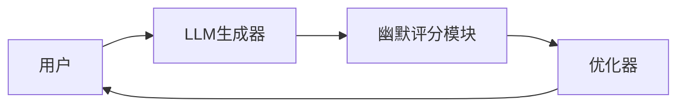
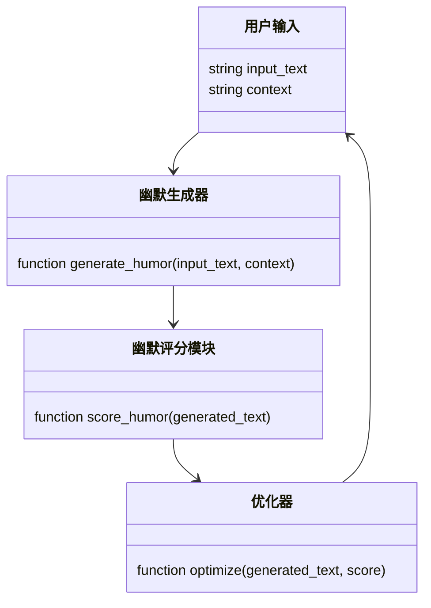
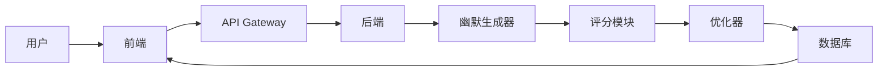
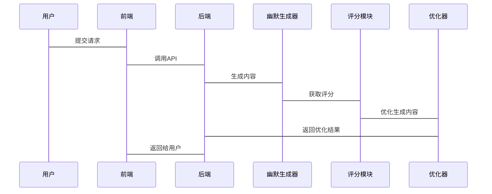

                 


# LLM驱动的AI Agent幽默感生成器

> 关键词：LLM，AI Agent，幽默感，生成式模型，优化器，幽默评分，系统架构

> 摘要：本文探讨了如何利用大语言模型（LLM）驱动的AI Agent来生成幽默感内容。通过分析幽默生成的关键问题、LLM与AI Agent的协同工作原理，以及系统架构设计，提出了一个基于LLM的幽默感生成器解决方案。文章从背景介绍、核心概念、算法原理、系统架构到项目实战，详细阐述了如何构建一个高效的幽默感生成系统，并给出了实际案例和优化建议。

---

## 第一章: 背景介绍与核心概念

### 1.1 问题背景与目标

在人机交互领域，幽默感被认为是提升用户体验的重要因素之一。然而，幽默感的生成是一个复杂的过程，涉及对语言的理解、情感的把握以及对上下文的适应。传统的幽默生成方法依赖于预定义的规则或模板，这种方法在面对多样化的语言和文化背景时显得力不从心。近年来，随着大语言模型（LLM）的崛起，AI Agent的能力得到了显著提升，为幽默感生成提供了新的可能性。

本章的目标是介绍幽默感生成的基本概念、问题背景以及LLM与AI Agent结合的核心目标。

### 1.2 核心概念与定义

#### 1.2.1 大语言模型（LLM）

- **定义**：大语言模型是一种基于深度学习的生成模型，能够理解和生成人类语言。
- **特点**：
  - 基于Transformer架构
  - 参数量大（如GPT-3有175亿参数）
  - 具备上下文理解能力
- **应用场景**：文本生成、对话系统、内容创作等。

#### 1.2.2 AI Agent

- **定义**：AI Agent是一种智能体，能够感知环境、执行任务并做出决策。
- **特点**：
  - 主动性：能够自主决策
  - 反应性：能实时响应用户输入
  - 学习能力：通过反馈优化行为
- **应用场景**：智能助手、推荐系统、自动化任务处理等。

#### 1.2.3 幽默感生成器

- **定义**：幽默感生成器是一种结合了LLM和AI Agent的系统，能够根据输入生成幽默的内容。
- **目标**：
  - 理解用户需求
  - 生成符合上下文的幽默内容
  - 提供多样化的表达方式

### 1.3 问题解决与边界

- **问题解决**：
  - 利用LLM的生成能力，解决传统幽默生成方法的单一性和缺乏灵活性问题。
  - 通过AI Agent的决策能力，提升幽默生成的适应性和智能化水平。
- **边界**：
  - 仅限于文本生成，不涉及图像或视频等多模态内容。
  - 生成内容需符合伦理规范，避免冒犯或不适当的内容。

---

## 第二章: LLM与AI Agent的核心联系

### 2.1 核心概念原理

#### 2.1.1 LLM的生成机制

- **生成过程**：
  1. 输入处理：将用户输入转化为模型可理解的向量。
  2. 解码过程：通过Transformer的解码器生成输出序列。
  3. 输出优化：基于评分模块对生成内容进行优化。

#### 2.1.2 AI Agent的决策逻辑

- **决策过程**：
  1. 状态感知：通过上下文理解当前场景。
  2. 目标设定：根据用户需求确定生成目标。
  3. 行动选择：基于评分结果选择最优生成方案。

#### 2.1.3 幽默感的多模态融合

- **多模态输入**：结合文本、语音、图像等多种输入方式。
- **多模态输出**：生成文本的同时，配合语气、表情等增强幽默效果。

### 2.2 核心概念属性对比

| 对比维度       | LLM                     | AI Agent                  | 幽默感生成器          |
|----------------|--------------------------|-----------------------------|-----------------------|
| 核心功能       | 生成高质量文本           | 执行任务并做出决策         | 生成幽默内容          |
| 技术基础       | Transformer架构         | 组合多种AI技术             | 结合LLM与AI Agent     |
| 应用场景       | 文本生成、对话系统       | 智能助手、推荐系统         | 幽默生成、内容创作    |
| 优化目标       | 提高生成准确性           | 提升决策效率               | 增强幽默效果          |

### 2.3 实体关系图



---

## 第三章: LLM驱动的生成式模型原理

### 3.1 生成式模型的数学基础

#### 3.1.1 概率分布与生成模型

- **概率分布**：生成模型的目标是学习数据的分布 $P(X)$。
- **生成过程**：通过采样的方式生成新的数据点 $x$。

#### 3.1.2 变量关系与损失函数

- **条件生成模型**：给定条件 $c$，生成 $x$ 的概率 $P(x|c)$。
- **损失函数**：交叉熵损失函数用于衡量生成结果与真实数据的差异。

$$
\text{交叉熵损失函数} = -\sum_{i=1}^{n} y_i \log p(y_i)
$$

### 3.2 大语言模型的训练机制

#### 3.2.1 自监督学习与预训练

- **自监督学习**：模型通过预测下一个词来学习语言的结构。
- **预训练**：在大规模语料库上进行无监督学习，提取通用语言特征。

#### 3.2.2 转换器架构与注意力机制

- **转换器架构**：由编码器和解码器组成，能够处理长序列。
- **注意力机制**：通过计算词与词之间的相关性，确定生成词的权重。

$$
\text{注意力机制公式} = \text{softmax}(\frac{QK^T}{\sqrt{d_k}})
$$

### 3.3 幽默评分算法

#### 3.3.1 基于LLM的评分函数

- **评分函数**：通过LLM对生成内容进行评分，判断其幽默程度。
- **评分标准**：结合内容相关性、语境适应性、情感强度等多维度指标。

$$
\text{幽默评分} = f(\text{内容相关性}, \text{语境适应性}, \text{情感强度})
$$

#### 3.3.2 多元回归模型与评分优化

- **多元回归模型**：通过多个特征变量预测幽默评分。
- **优化方法**：使用梯度下降等优化算法，提升评分的准确性。

---

## 第四章: AI Agent的决策逻辑与算法

### 4.1 基于LLM的决策逻辑

#### 4.1.1 决策过程

- **状态感知**：AI Agent通过输入获取当前状态信息。
- **目标设定**：根据状态信息确定生成目标。
- **行动选择**：基于评分结果选择最优生成方案。

#### 4.1.2 基于评分的优化

- **评分反馈**：AI Agent根据评分模块的反馈调整生成策略。
- **策略优化**：通过强化学习等方法，提升生成效果。

### 4.2 优化器与调参技巧

#### 4.2.1 动量优化与Adam算法

- **动量优化**：通过引入动量项，加速优化过程。
- **Adam算法**：结合动量和自适应学习率，提升优化效率。

$$
\text{Adam优化器公式} = \beta_1 \text{梯度} + \beta_2 \text{二阶矩估计}
$$

#### 4.2.2 超参数调优与实验验证

- **超参数调优**：通过实验确定最佳的超参数组合。
- **实验验证**：在不同场景下验证生成效果。

---

## 第五章: 系统架构设计

### 5.1 系统功能设计

#### 5.1.1 领域模型



#### 5.1.2 系统架构



### 5.2 系统接口设计

- **输入接口**：接收用户输入的文本或指令。
- **输出接口**：返回生成的幽默内容或评分结果。
- **内部接口**：各模块之间的通信接口。

### 5.3 系统交互流程



---

## 第六章: 项目实战

### 6.1 环境配置

```bash
pip install transformers
pip install torch
pip install requests
```

### 6.2 核心实现代码

```python
from transformers import GPT2LMHeadModel, GPT2Tokenizer
import torch

class HumorGenerator:
    def __init__(self, model_name):
        self.tokenizer = GPT2Tokenizer.from_pretrained(model_name)
        self.model = GPT2LMHeadModel.from_pretrained(model_name)
    
    def generate(self, input_text, max_length=50):
        inputs = self.tokenizer.encode(input_text, return_tensors="pt")
        outputs = self.model.generate(inputs, max_length=max_length, do_sample=True)
        return self.tokenizer.decode(outputs[0], skip_special_tokens=True)

# 示例用法
generator = HumorGenerator("gpt2")
response = generator.generate("为什么鸡会过马路？")
print(response)
```

### 6.3 实际案例分析

- **案例描述**：生成“为什么鸡会过马路？”的幽默回答。
- **代码实现**：使用上述代码生成幽默内容。
- **结果分析**：对比不同输入生成的幽默效果，优化生成策略。

### 6.4 项目小结

- **实现总结**：通过代码实现了一个简单的幽默生成器。
- **经验分享**：参数调优和模型选择对生成效果有显著影响。
- **问题反思**：生成内容的幽默性依赖于模型训练数据的质量。

---

## 第七章: 最佳实践与总结

### 7.1 小结

- 通过结合LLM和AI Agent，我们成功构建了一个幽默感生成器。
- 该系统能够根据输入生成多样化的幽默内容，并通过评分模块优化生成效果。

### 7.2 注意事项

- **数据质量**：训练数据的质量直接影响生成效果。
- **伦理问题**：需避免生成不当内容。
- **用户体验**：生成内容需符合用户的预期和文化背景。

### 7.3 未来研究方向

- **多模态幽默生成**：结合图像、语音等多模态信息，提升幽默效果。
- **个性化生成**：根据用户偏好生成定制化幽默内容。
- **实时优化**：基于实时反馈优化生成策略。

---

## 总结

通过本文的详细阐述，我们了解了如何利用LLM驱动的AI Agent来生成幽默感内容。从背景介绍到系统架构设计，再到项目实战，我们逐步构建了一个完整的幽默生成系统。希望本文能为相关领域的研究者和开发者提供有价值的参考和启发。

