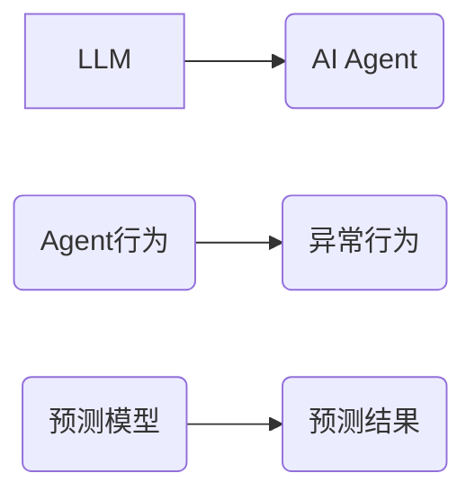

                 


# LLM驱动的AI Agent异常行为预测机制

> 关键词：LLM, AI Agent, 异常行为预测, 智能体行为分析, 人工智能安全

> 摘要：本文深入探讨了基于大语言模型（LLM）的AI Agent异常行为预测机制，从背景介绍、核心概念、算法原理、系统架构到项目实战，详细分析了如何利用LLM技术预测和防范AI Agent的异常行为。通过理论分析与实践结合，本文为AI Agent的安全运行提供了新的思路和解决方案。

---

## 第一部分: LLM驱动的AI Agent异常行为预测机制背景介绍

### 第1章: 异常行为预测机制的背景与问题描述

#### 1.1 问题背景
- **1.1.1 LLM驱动的AI Agent概念与特点**
  - LLM（Large Language Model）通过自然语言处理技术，赋予AI Agent理解和生成人类语言的能力。
  - AI Agent具备自主决策、问题解决和人机交互的特点。
  - LLM驱动的AI Agent广泛应用于智能客服、自动驾驶、智能助手等领域。

- **1.1.2 异常行为预测的必要性**
  - AI Agent在复杂环境中可能因算法漏洞或外部干扰产生异常行为。
  - 异常行为可能导致系统故障、数据泄露或用户体验下降。
  - 预测和预防异常行为是保障AI系统安全性和可靠性的关键。

- **1.1.3 问题边界与外延**
  - 异常行为预测的边界：仅关注AI Agent的行为层面，不涉及系统内部算法细节。
  - 外延：结合LLM的输出结果，分析行为的合理性与合规性。

#### 1.2 问题描述
- **1.2.1 异常行为的定义与分类**
  - 异常行为：AI Agent的行为偏离预期目标或违背伦理规范。
  - 分类：基于行为后果的严重性，分为低风险、中风险和高风险异常行为。

- **1.2.2 异常行为预测的核心目标**
  - 通过LLM分析AI Agent的行为模式，识别潜在的异常倾向。
  - 提供实时预警机制，降低异常行为带来的风险。

- **1.2.3 问题解决的关键路径**
  - 数据收集：记录AI Agent的历史行为数据。
  - 模型训练：基于LLM构建行为预测模型。
  - 实时监控：持续分析AI Agent的行为，触发预警机制。

#### 1.3 核心概念与联系
- **1.3.1 LLM与AI Agent的关系**
  - LLM作为AI Agent的“大脑”，负责生成行为决策。
  - AI Agent作为LLM的“执行者”，将决策转化为实际操作。

- **1.3.2 异常行为预测机制的构成要素**
  - 数据源：AI Agent的历史行为记录。
  - 预测模型：基于LLM的行为分析模型。
  - 预警系统：实时监控与反馈机制。

- **1.3.3 核心概念属性对比表**
  | 概念     | 描述                                             |
  |----------|--------------------------------------------------|
  | LLM      | 基于大规模数据训练的语言模型，具备生成和理解能力。 |
  | AI Agent | 具备自主决策能力的智能体，执行特定任务。         |
  | 异常行为 | AI Agent的行为偏离预期目标或伦理规范。           |

#### 1.4 本章小结
本章从背景、问题描述和核心概念三个方面，全面介绍了LLM驱动的AI Agent异常行为预测机制的研究背景和关键问题。

---

## 第2章: LLM驱动的AI Agent核心概念与联系

#### 2.1 LLM与AI Agent的实体关系图


- **实体关系说明**：
  - LLM为AI Agent提供决策支持。
  - AI Agent的行为可能产生异常行为。
  - 预测模型分析行为数据，输出预测结果。

#### 2.2 LLM驱动AI Agent的原理
- **2.2.1 LLM的输入输出机制**
  - 输入：AI Agent的行为描述或上下文信息。
  - 输出：预测的异常行为概率或具体异常类型。

- **2.2.2 AI Agent的决策过程**
  - 输入：用户请求或环境信息。
  - 处理：基于LLM生成决策。
  - 输出：执行操作或反馈结果。

- **2.2.3 异常行为的触发条件**
  - 内部因素：算法错误或训练数据偏差。
  - 外部因素：用户干扰或环境异常。

#### 2.3 异常行为预测的数学模型
- **2.3.1 概率模型**
  $$P(abnormal|input) = \frac{N_{abnormal}}{N_{total}}$$
  - 解释：计算给定输入下出现异常行为的概率。

- **2.3.2 序列模型**
  $$P(abnormal|context) = f_{RNN}(context)$$
  - 解释：基于上下文的序列模型预测异常行为。

#### 2.4 本章小结
本章通过实体关系图和数学模型，详细阐述了LLM与AI Agent之间的关系，以及异常行为预测的原理和方法。

---

## 第3章: 异常行为预测机制的算法原理

#### 3.1 基于LLM的异常检测算法
- **3.1.1 算法流程图**
  ```mermaid
  graph TD
  A[输入行为数据] --> B(LLM处理) --> C[预测结果]
  ```

- **3.1.2 算法步骤**
  1. 数据预处理：清洗和标注行为数据。
  2. 模型训练：基于LLM构建预测模型。
  3. 预测推理：输入行为数据，输出预测结果。

#### 3.2 算法实现
- **3.2.1 Python代码实现**
  ```python
  def predict_abnormal行为(input_data):
      model = load_model()  # 加载训练好的模型
      result = model.predict(input_data)  # 预测异常行为
      return result
  ```

- **3.2.2 代码解读**
  - `load_model()`：加载预训练好的LLM模型。
  - `model.predict(input_data)`：输入行为数据，输出预测结果。

#### 3.3 数学模型与公式
- **3.3.1 概率计算**
  $$P(abnormal|input) = \sum_{i=1}^{n} P(abnormal|x_i)$$
  - 解释：计算每个输入特征的异常概率，并求和。

- **3.3.2 序列建模**
  $$f_{LSTM}(x_t) = \text{LSTM}(x_t, f_{LSTM}(x_{t-1}))$$
  - 解释：使用LSTM模型处理序列数据，预测异常行为。

#### 3.4 本章小结
本章详细讲解了异常行为预测的算法原理，包括流程图、代码实现和数学模型。

---

## 第4章: 系统分析与架构设计

#### 4.1 问题场景介绍
- **4.1.1 项目目标**
  - 构建基于LLM的AI Agent异常行为预测系统。
  - 实现实时监控和预警功能。

- **4.1.2 项目范围**
  - 数据采集：收集AI Agent的行为数据。
  - 模型训练：构建预测模型。
  - 系统集成：实现实时监控功能。

#### 4.2 系统功能设计
- **4.2.1 领域模型类图**
  ```mermaid
  classDiagram
  class AI-Agent {
      - behavior_id: int
      - behavior_desc: string
      - predicted_abnormal: bool
  }
  class LLM-Model {
      - model_weights: array
      - predict_abnormal(behavior_data: array): bool
  }
  class Prediction-System {
      - agent: AI-Agent
      - model: LLM-Model
      - predict_and Warn(): void
  }
  ```

- **4.2.2 系统架构图**
  ```mermaid
  graph TD
  A[AI Agent] --> B(LLM Model)
  B --> C[Prediction System]
  C --> D[预警模块]
  ```

- **4.2.3 系统接口设计**
  - 输入接口：接收AI Agent的行为数据。
  - 输出接口：输出预测结果和预警信息。

- **4.2.4 系统交互序列图**
  ```mermaid
  sequenceDiagram
  AI-Agent -> LLM-Model: 提供行为数据
  LLM-Model -> AI-Agent: 返回预测结果
  AI-Agent -> Prediction-System: 触发预警模块
  ```

#### 4.3 本章小结
本章通过系统分析与架构设计，详细介绍了AI Agent异常行为预测系统的实现方案。

---

## 第5章: 项目实战

#### 5.1 环境安装
- **5.1.1 安装Python环境**
  - 安装Python 3.8及以上版本。
  - 安装必要的库：`transformers`, `torch`, `numpy`。

- **5.1.2 安装LLM模型**
  - 使用Hugging Face提供的预训练模型。
  - 安装命令：`pip install transformers`.

#### 5.2 核心代码实现
- **5.2.1 数据预处理代码**
  ```python
  import pandas as pd
  data = pd.read_csv('behavior_data.csv')
  # 数据清洗
  data.dropna(inplace=True)
  # 数据标注
  data['is_abnormal'] = data['behavior'].apply(lambda x: 1 if x in ['异常行为1', '异常行为2'] else 0)
  ```

- **5.2.2 模型训练代码**
  ```python
  from transformers import AutoModelForSequenceClassification, AutoTokenizer
  model_name = 'bert-base-uncased'
  tokenizer = AutoTokenizer.from_pretrained(model_name)
  model = AutoModelForSequenceClassification.from_pretrained(model_name, num_labels=2)
  ```

- **5.2.3 预测推理代码**
  ```python
  def predict_and_warn(input_behavior):
      inputs = tokenizer(input_behavior, return_tensors='np')
      outputs = model(**inputs)
      prediction = outputs.logits.argmax(-1).item()
      if prediction == 1:
          print("检测到异常行为，已触发预警！")
  ```

#### 5.3 代码解读与分析
- 数据预处理：清洗和标注行为数据，为模型训练做好准备。
- 模型训练：基于预训练的LLM构建分类模型，区分正常和异常行为。
- 预测推理：输入行为数据，输出预测结果并触发预警。

#### 5.4 实际案例分析
- **案例1**：AI Agent在智能客服中的异常行为预测。
  - 输入：用户投诉内容。
  - 输出：预测是否存在不当回复。

- **案例2**：AI Agent在自动驾驶中的异常行为预测。
  - 输入：传感器数据。
  - 输出：预测是否存在危险操作。

#### 5.5 本章小结
本章通过实际案例分析，详细讲解了如何利用LLM驱动的AI Agent异常行为预测机制进行实时监控和预警。

---

## 第6章: 最佳实践与小结

#### 6.1 最佳实践
- **数据质量**：确保行为数据的完整性和准确性。
- **模型优化**：定期更新模型，提升预测精度。
- **实时监控**：实现高效的实时预警机制。

#### 6.2 小结
本文从理论到实践，详细探讨了LLM驱动的AI Agent异常行为预测机制的实现方法。通过系统分析和项目实战，为AI系统的安全性提供了有力保障。

#### 6.3 注意事项
- 避免过度依赖单一模型，建议采用多模型融合的方法。
- 定期进行模型评估和优化，确保预测的准确性。

#### 6.4 拓展阅读
- 《Large Language Models: A Survey》
- 《AI Safety and Ethics: A Comprehensive Guide》

---

# 结语

本文通过系统的理论分析与实践案例，深入探讨了LLM驱动的AI Agent异常行为预测机制的实现方法。希望本文能够为AI系统的设计与优化提供新的思路和参考。

