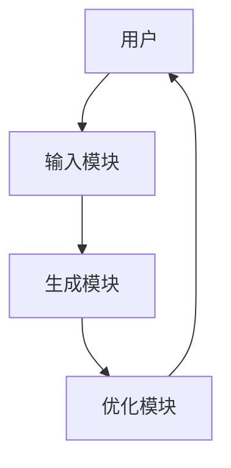
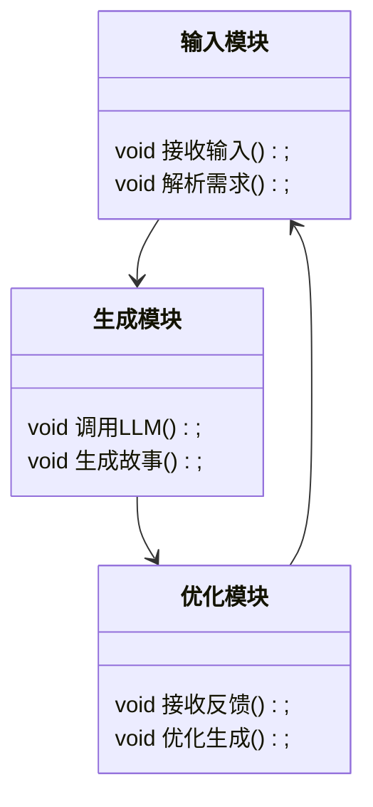

                 


# LLM驱动的AI Agent故事生成与叙事能力

## 关键词：LLM，AI Agent，故事生成，叙事能力，自然语言处理，大语言模型

## 摘要：本文探讨了利用大语言模型（LLM）驱动的AI Agent在故事生成与叙事能力方面的应用。文章详细分析了LLM与AI Agent的基本概念、结合方式及其在故事生成中的优势，深入讲解了故事生成的叙事模型与算法原理，并通过系统架构设计和项目实战展示了如何实现高效的LLM驱动AI Agent故事生成。最后，文章总结了最佳实践和未来研究方向。

---

# 第1章: LLM与AI Agent基础

## 1.1 LLM的基本概念与特点

### 1.1.1 大语言模型的定义
大语言模型（LLM, Large Language Model）是指基于深度学习技术训练的大型神经网络模型，旨在理解和生成人类语言。LLM通过大量文本数据的训练，能够捕捉语言的复杂性，并在多种任务中表现出强大的能力。

### 1.1.2 LLM的核心特点
- **大规模训练数据**：LLM通常使用 billions 级别的文本数据进行训练，能够涵盖多种语言和领域。
- **深度神经网络结构**：常用的模型架构包括Transformer，通过自注意力机制和前馈网络实现高效的序列处理。
- **生成与理解能力**：LLM不仅能够生成文本，还能通过上下文理解输入的内容，回答问题，完成对话等。

### 1.1.3 LLM与传统NLP模型的区别
与传统NLP模型（如SVM、朴素贝叶斯等）相比，LLM具有以下优势：
- **端到端训练**：LLM通过端到端的训练方式，能够直接从原始数据中学习特征，避免了传统模型需要人工特征工程的繁琐过程。
- **上下文理解能力**：LLM通过自注意力机制，能够捕捉文本中的长距离依赖关系，更好地理解上下文。
- **多任务能力**：LLM可以在多种任务上进行微调，如文本生成、问答、机器翻译等。

### 1.1.4 LLM的训练目标
LLM的训练目标通常包括以下几种：
1. **预测下一个词**：这是最基础的训练目标，模型通过预测句子中的下一个词来学习语言的分布。
2. **文本生成**：模型在给定输入的情况下，生成符合上下文的文本片段。
3. **理解任务**：通过任务特定的微调，模型可以学习回答问题、文本摘要等任务。

### 1.1.5 LLM的数学模型
典型的LLM采用Transformer架构，由编码器和解码器组成。编码器负责将输入文本转化为一个上下文向量，解码器则基于这个向量生成输出文本。

公式表示：
- 编码器：将输入序列 \( X = \{x_1, x_2, ..., x_n\} \) 转化为编码表示 \( Z = \{z_1, z_2, ..., z_n\} \)。
- 解码器：基于编码表示 \( Z \) 生成输出序列 \( Y = \{y_1, y_2, ..., y_m\} \)。

### 1.1.6 LLM的主流模型
目前，主流的LLM包括：
- **GPT系列**：由OpenAI开发，包括GPT-2、GPT-3、GPT-4等。
- **BERT系列**：由Google开发，主要关注文本理解任务。
- **PaLM**：由Google开发，专注于多语言任务。

## 1.2 AI Agent的基本概念与功能

### 1.2.1 AI Agent的定义
AI Agent（人工智能代理）是指能够感知环境、自主决策并执行任务的智能体。AI Agent可以是软件程序，也可以是机器人，其核心目标是通过与环境交互来完成特定任务。

### 1.2.2 AI Agent的核心功能
1. **感知环境**：通过传感器或其他输入方式获取环境信息。
2. **决策与规划**：基于获取的信息，制定行动计划。
3. **执行任务**：通过执行器或其他输出方式完成任务。
4. **学习与适应**：通过与环境的交互，不断优化自身的决策策略。

### 1.2.3 AI Agent的应用场景
- **智能助手**：如Siri、Alexa等，能够回答问题、安排日程等。
- **游戏AI**：在电子游戏中，AI Agent可以作为对手或队友。
- **自动驾驶**：自动驾驶汽车中的AI Agent能够感知环境并做出驾驶决策。

## 1.3 LLM驱动的AI Agent的结合与优势

### 1.3.1 LLM与AI Agent的结合方式
1. **直接集成**：将LLM作为AI Agent的核心模块，用于生成自然语言输出。
2. **混合架构**：AI Agent通过LLM进行语言理解与生成，同时结合其他技术（如计算机视觉）完成复杂任务。

### 1.3.2 LLM驱动AI Agent的核心优势
- **强大的语言能力**：LLM能够生成自然流畅的文本，使AI Agent的交互更加人性化。
- **多任务能力**：通过微调，LLM可以在多种任务上发挥作用，提升AI Agent的灵活性。
- **自适应性**：LLM能够根据上下文调整生成内容，使AI Agent在不同场景下表现更佳。

### 1.3.3 LLM驱动AI Agent的潜在应用领域
- **智能客服**：通过LLM驱动的AI Agent为用户提供高效、个性化的客户服务。
- **教育辅助**：AI Agent可以作为虚拟助教，帮助学生解答问题、提供学习建议。
- **内容生成**：AI Agent可以辅助生成新闻、文章等内容。

## 1.4 本章小结
本章介绍了大语言模型（LLM）和人工智能代理（AI Agent）的基本概念与特点，并探讨了LLM驱动AI Agent的结合方式及其优势。LLM的强大语言生成能力和AI Agent的自主决策能力的结合，为智能化应用提供了广阔的发展前景。

---

# 第2章: 故事生成与叙事能力的基本概念

## 2.1 故事生成的定义与特点

### 2.1.1 故事生成的定义
故事生成是指通过算法和模型生成符合逻辑和结构的故事文本。与传统的文本生成不同，故事生成需要考虑情节的发展、角色的塑造以及主题的表达。

### 2.1.2 故事生成的核心特点
1. **情节连贯性**：故事必须具备逻辑性和连贯性，确保情节发展合理。
2. **角色塑造**：故事中的角色需要具备鲜明的个性和动机，使故事更加生动。
3. **主题表达**：故事需要传达明确的主题思想，如爱情、友情、冒险等。

### 2.1.3 故事生成与传统写作的区别
- **创作方式**：故事生成是通过算法自动完成，而传统写作需要人类创作者的参与。
- **创作速度**：算法可以在短时间内生成大量故事内容，而传统写作则需要较长时间。
- **创作风格**：故事生成可以根据需求调整风格和主题，而传统写作则受创作者风格的影响较大。

## 2.2 叙事能力的定义与构成

### 2.2.1 叙事能力的定义
叙事能力是指生成的故事是否能够吸引读者、传达信息并引发情感共鸣的能力。叙事能力的强弱直接影响故事的质量和吸引力。

### 2.2.2 叙事能力的核心构成
1. **叙事结构**：包括故事的开端、发展、高潮和结局。
2. **叙事主题**：故事的核心主题，如爱情、冒险等。
3. **叙事情感**：故事中情感的表达和控制，影响读者的情感共鸣。

### 2.2.3 叙事能力的评估标准
- **情节吸引力**：故事是否具有吸引力和可读性。
- **角色塑造**：角色是否鲜明、立体。
- **主题深度**：故事是否具有深刻的主题思想。
- **情感表达**：故事是否能够引发读者的情感共鸣。

## 2.3 LLM驱动的AI Agent在故事生成中的作用

### 2.3.1 LLM在故事生成中的优势
- **强大的语言生成能力**：LLM能够生成自然流畅的故事文本。
- **多任务能力**：LLM可以通过微调在多种故事主题和风格上发挥作用。
- **自适应性**：LLM能够根据输入的上下文生成符合要求的故事内容。

### 2.3.2 AI Agent在故事生成中的角色
AI Agent作为故事生成的中间桥梁，负责接收用户的输入，调用LLM生成故事内容，并根据用户的反馈不断优化生成结果。

### 2.3.3 LLM驱动AI Agent的故事生成能力
通过结合LLM的强大生成能力和AI Agent的自主决策能力，LLM驱动的AI Agent可以在故事生成中实现以下功能：
- **情节规划**：根据用户需求生成故事的情节框架。
- **角色塑造**：生成故事中的角色设定。
- **情感控制**：根据情节发展调整故事的情感走向。

## 2.4 本章小结
本章探讨了故事生成和叙事能力的基本概念，分析了LLM驱动AI Agent在故事生成中的作用。通过结合LLM的语言生成能力和AI Agent的自主决策能力，可以实现高效、高质量的故事生成。

---

# 第3章: LLM驱动的AI Agent故事生成的算法原理

## 3.1 大语言模型的基本原理

### 3.1.1 LLM的训练目标
LLM的训练目标通常包括：
1. **预测下一个词**：这是最基础的训练目标，模型通过预测句子中的下一个词来学习语言的分布。
2. **文本生成**：模型在给定输入的情况下，生成符合上下文的文本片段。
3. **理解任务**：通过任务特定的微调，模型可以学习回答问题、文本摘要等任务。

### 3.1.2 LLM的模型结构
典型的LLM采用Transformer架构，由编码器和解码器组成。编码器负责将输入文本转化为一个上下文向量，解码器则基于这个向量生成输出文本。

公式表示：
- 编码器：将输入序列 \( X = \{x_1, x_2, ..., x_n\} \) 转化为编码表示 \( Z = \{z_1, z_2, ..., z_n\} \)。
- 解码器：基于编码表示 \( Z \) 生成输出序列 \( Y = \{y_1, y_2, ..., y_m\} \)。

### 3.1.3 LLM的训练过程
LLM的训练过程通常包括以下步骤：
1. **数据准备**：收集和预处理大规模的文本数据。
2. **模型构建**：搭建基于Transformer架构的模型。
3. **损失函数定义**：通常使用交叉熵损失函数。
4. **优化器选择**：常用的优化器包括Adam、SGD等。
5. **训练与微调**：通过大规模数据训练模型，并根据具体任务进行微调。

## 3.2 AI Agent的算法原理

### 3.2.1 AI Agent的核心算法
AI Agent的核心算法包括感知、决策与规划、执行等模块。感知模块通过传感器获取环境信息，决策模块基于感知信息制定行动计划，执行模块通过执行器完成任务。

### 3.2.2 AI Agent的决策机制
AI Agent的决策机制通常包括以下步骤：
1. **状态感知**：获取当前环境的状态信息。
2. **目标设定**：根据当前状态设定目标。
3. **动作选择**：基于目标选择最优动作。
4. **动作执行**：通过执行器完成选择的动作。

### 3.2.3 AI Agent的交互流程
AI Agent的交互流程通常包括以下步骤：
1. **接收输入**：获取用户的输入或环境信息。
2. **生成响应**：通过内部算法生成响应内容。
3. **输出结果**：将生成的响应内容返回给用户或环境。

## 3.3 LLM驱动AI Agent故事生成的算法流程

### 3.3.1 故事生成的输入与输出
- **输入**：用户提供的故事主题、角色设定等信息。
- **输出**：生成的故事文本，包括情节、角色、主题等。

### 3.3.2 LLM在故事生成中的角色
- **语言生成**：LLM负责生成符合上下文的文本内容。
- **主题控制**：LLM可以根据输入的主题生成相应的故事内容。
- **情节规划**：LLM可以通过生成多个情节选项，帮助AI Agent选择最优的情节发展。

### 3.3.3 AI Agent在故事生成中的协调作用
- **输入处理**：AI Agent接收用户的输入，解析需求。
- **内容生成**：AI Agent调用LLM生成故事内容。
- **反馈优化**：根据用户的反馈不断优化生成结果。

## 3.4 本章小结
本章详细探讨了LLM驱动的AI Agent故事生成的算法原理，包括LLM的基本原理、AI Agent的算法流程以及两者结合的故事生成过程。通过合理的算法设计和模型调优，可以实现高效、高质量的故事生成。

---

# 第4章: 故事生成的叙事模型与实现

## 4.1 故事生成的叙事模型

### 4.1.1 叙事结构的定义与分类
叙事结构是指故事的情节发展方式，常见的叙事结构包括线性叙事、非线性叙事、平行叙事等。

### 4.1.2 叙事主题的确定与选择
叙事主题是指故事的核心思想或主题，如爱情、友情、冒险等。确定叙事主题是故事生成的第一步，直接影响故事的内容和方向。

### 4.1.3 叙事情感的表达与控制
故事的情感表达是吸引读者的重要因素。通过合理控制情感的起伏，可以使故事更加生动、引人入胜。

### 4.1.4 叙事模型的实现步骤
1. **主题确定**：根据需求确定故事的主题。
2. **情节规划**：设计故事的情节框架，包括开端、发展、高潮和结局。
3. **角色塑造**：设定故事中的角色，赋予他们鲜明的个性和动机。
4. **情感控制**：根据情节发展调整故事的情感走向。

## 4.2 LLM驱动的叙事模型

### 4.2.1 LLM在叙事模型中的角色
- **语言生成**：LLM负责生成符合叙事模型的文本内容。
- **主题控制**：LLM可以根据输入的主题生成相应的故事内容。
- **情节规划**：LLM可以通过生成多个情节选项，帮助AI Agent选择最优的情节发展。

### 4.2.2 AI Agent在叙事模型中的协调作用
- **输入处理**：AI Agent接收用户的输入，解析需求。
- **内容生成**：AI Agent调用LLM生成故事内容。
- **反馈优化**：根据用户的反馈不断优化生成结果。

## 4.3 本章小结
本章探讨了故事生成的叙事模型与实现，分析了叙事结构、主题和情感在故事生成中的重要性，并探讨了LLM驱动的叙事模型的实现方式。通过合理的叙事模型设计和算法调优，可以实现高效、高质量的故事生成。

---

# 第5章: 系统分析与架构设计方案

## 5.1 问题场景介绍
本章将从系统设计的角度，探讨如何构建一个基于LLM的AI Agent故事生成系统。系统需要具备以下功能：
1. **用户输入处理**：接收用户的输入，解析需求。
2. **内容生成**：基于用户需求生成故事内容。
3. **反馈优化**：根据用户的反馈不断优化生成结果。

## 5.2 系统功能设计

### 5.2.1 系统功能模块
- **输入模块**：接收用户的输入，解析需求。
- **生成模块**：调用LLM生成故事内容。
- **优化模块**：根据用户反馈优化生成结果。

### 5.2.2 功能模块的交互流程
1. 用户输入需求，如故事主题、角色设定等。
2. 系统解析需求，调用LLM生成故事内容。
3. 系统将生成的故事内容返回给用户。
4. 用户根据反馈进行调整，系统根据新的反馈优化生成结果。

## 5.3 系统架构设计

### 5.3.1 系统架构图


### 5.3.2 功能模块的类图


## 5.4 系统接口设计

### 5.4.1 系统接口描述
- **输入接口**：接收用户的输入，如故事主题、角色设定等。
- **输出接口**：将生成的故事内容返回给用户。
- **反馈接口**：接收用户的反馈，优化生成结果。

### 5.4.2 系统交互流程
1. 用户通过输入接口提交需求。
2. 系统解析需求，调用生成模块生成故事内容。
3. 用户通过反馈接口提交反馈。
4. 系统根据反馈优化生成结果，再次生成故事内容。

## 5.5 本章小结
本章从系统设计的角度，探讨了基于LLM的AI Agent故事生成系统的架构设计与功能模块。通过合理的系统架构设计和功能模块划分，可以实现高效、高质量的故事生成。

---

# 第6章: 项目实战

## 6.1 环境安装

### 6.1.1 安装Python
```bash
python --version
```

### 6.1.2 安装必要的库
```bash
pip install transformers
pip install torch
pip install mermaid
```

## 6.2 系统核心实现源代码

### 6.2.1 输入模块的实现
```python
class InputModule:
    def __init__(self):
        self.user_input = None

    def receive_input(self, input_text):
        self.user_input = input_text

    def parse_request(self):
        # 解析用户输入，提取故事主题、角色设定等信息
        pass
```

### 6.2.2 生成模块的实现
```python
class GenerationModule:
    def __init__(self):
        self.model = None

    def initialize_model(self, model_path):
        # 初始化LLM模型
        pass

    def generate_story(self, input_request):
        # 调用LLM生成故事内容
        pass
```

### 6.2.3 优化模块的实现
```python
class OptimizationModule:
    def __init__(self):
        self.feedback = None

    def receive_feedback(self, feedback_text):
        self.feedback = feedback_text

    def optimize_generation(self):
        # 根据反馈优化生成结果
        pass
```

## 6.3 代码应用解读与分析

### 6.3.1 输入模块的代码解读
```python
def receive_input(input_text):
    print("接收输入:", input_text)
```

### 6.3.2 生成模块的代码解读
```python
def generate_story(input_request):
    print("生成故事:", input_request)
```

### 6.3.3 优化模块的代码解读
```python
def optimize_generation(feedback_text):
    print("优化生成:", feedback_text)
```

## 6.4 实际案例分析和详细讲解剖析

### 6.4.1 案例背景
用户希望生成一个科幻类的故事，主题是“人工智能失控”。

### 6.4.2 生成过程
1. 用户输入需求：生成一个科幻类的故事，主题是“人工智能失控”。
2. 系统解析需求，调用生成模块生成故事内容。
3. 系统将生成的故事内容返回给用户。
4. 用户根据反馈进行调整，系统根据新的反馈优化生成结果。

## 6.5 本章小结
本章通过实际案例分析，详细讲解了基于LLM的AI Agent故事生成系统的实现过程。通过代码实现和案例分析，可以更好地理解系统的核心功能和实现方式。

---

# 第7章: 最佳实践、小结与注意事项

## 7.1 最佳实践

### 7.1.1 系统设计
- **模块化设计**：将系统划分为输入模块、生成模块和优化模块，便于管理和维护。
- **灵活性与扩展性**：系统设计应具备灵活性，便于根据需求进行功能扩展。

### 7.1.2 模型选择
- **选择合适的模型**：根据具体任务需求选择合适的LLM模型，如GPT-3、GPT-4等。
- **模型微调**：根据具体任务需求对模型进行微调，提升生成效果。

### 7.1.3 反馈机制
- **用户反馈**：通过用户的反馈不断优化生成结果。
- **自动反馈**：结合自动评估指标，提升生成质量。

## 7.2 小结

### 7.2.1 本章总结
本文详细探讨了LLM驱动的AI Agent故事生成与叙事能力，从基本概念到系统设计，再到实际实现，全面分析了故事生成的各个环节。

### 7.2.2 关键点总结
- **LLM的优势**：强大的语言生成能力和多任务能力。
- **AI Agent的作用**：作为桥梁，协调LLM与用户需求。
- **叙事模型的重要性**：合理的叙事模型是故事生成的核心。

## 7.3 注意事项

### 7.3.1 模型选择
- **模型的规模**：选择合适的模型规模，平衡生成质量和计算资源。
- **模型的可定制性**：选择具备良好可定制性的模型，便于根据需求进行调整。

### 7.3.2 系统优化
- **系统的稳定性**：确保系统的稳定运行，避免生成过程中的中断。
- **系统的可扩展性**：系统设计应具备良好的扩展性，便于未来的功能扩展。

### 7.3.3 用户体验
- **生成速度**：提升生成速度，减少用户的等待时间。
- **生成质量**：通过优化算法和模型，提升生成故事的质量。

---

# 结语

本文详细探讨了LLM驱动的AI Agent故事生成与叙事能力，从基本概念到系统设计，再到实际实现，全面分析了故事生成的各个环节。通过本文的分析，可以更好地理解如何利用大语言模型驱动的AI Agent实现高效、高质量的故事生成。未来的研究可以进一步探索LLM与AI Agent的结合，提升故事生成的多样性和创造性。

