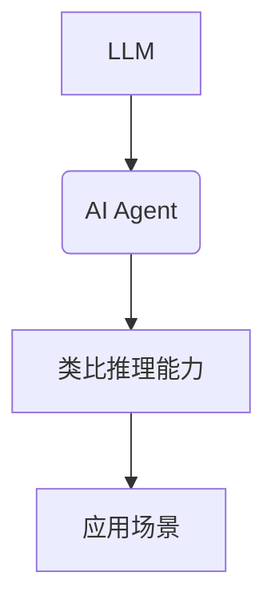
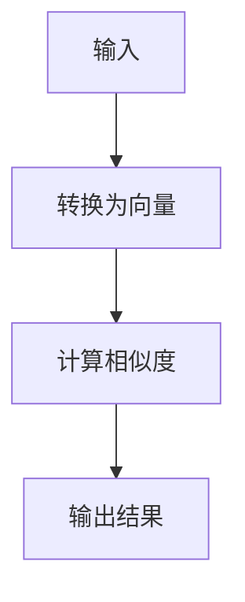
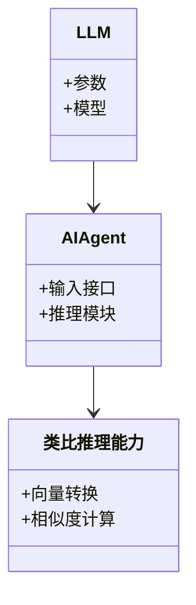
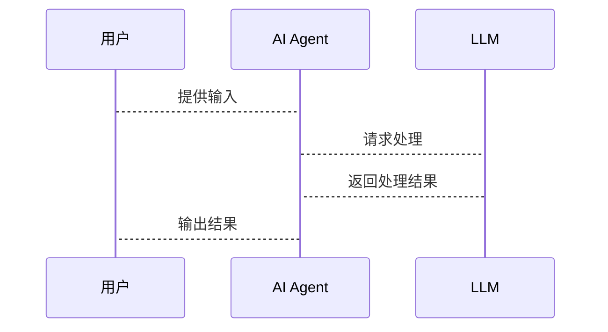

                 


# LLM驱动的AI Agent类比推理能力增强

---

## 关键词

LLM, AI Agent, 类比推理, 自然语言处理, 深度学习

---

## 摘要

本文探讨了如何利用大语言模型（LLM）增强AI代理的类比推理能力，分析了LLM与AI Agent的关系，详细讲解了类比推理的算法原理，并通过实际案例展示了如何在项目中实现这一能力。文章结构清晰，内容丰富，适合技术从业者和研究者阅读。

---

## 第一部分：背景与核心概念

### 第1章：LLM与AI Agent概述

#### 1.1 LLM的基本概念与特点

大语言模型（LLM）是指经过大量数据训练的深度学习模型，具有以下特点：
- **大规模训练数据**：通常使用 billions of parameters（如GPT-3）。
- **生成能力强**：能够生成连贯且有意义的文本。
- **理解能力**：通过上下文理解复杂的语言结构和语义。

#### 1.2 AI Agent的基本概念与分类

AI代理（AI Agent）是指能够感知环境并采取行动以实现目标的智能体。分类包括：
- **简单反射型**：基于规则的反应式代理。
- **基于模型的**：使用内部模型进行规划和推理。
- **增强学习型**：通过试错优化策略。

#### 1.3 类比推理能力的重要性

类比推理是AI代理理解复杂关系的关键，通过识别概念间的相似性，代理能够更好地进行推理和决策。

---

## 第二部分：核心概念与联系

### 第2章：LLM与AI Agent的关系

#### 2.1 LLM作为AI Agent的核心驱动

LLM为AI代理提供强大的自然语言处理能力，使其能够理解并生成人类语言，增强其交互能力。

#### 2.2 类比推理能力的实现机制

类比推理通过将问题映射到已知领域，利用LLM的知识库进行推断和决策。

#### 2.3 核心概念对比分析

| 概念 | LLM | AI Agent |
|------|------|-----------|
| 核心能力 | 语言生成与理解 | 问题解决与决策 |
| 优势 | 大数据与深度学习 | 环境适应与自主性 |

#### 2.4 ER实体关系图



---

## 第三部分：算法原理讲解

### 第3章：类比推理算法原理

#### 3.1 基于向量的类比推理算法

向量空间模型将词语或句子表示为向量，计算其相似性。

- **余弦相似度**：衡量两个向量的方向一致性。

  $$\cos\theta = \frac{\vec{A} \cdot \vec{B}}{|\vec{A}| |\vec{B}|}$$

- **算法流程图**



#### 3.2 Python代码实现

```python
import numpy as np

def cosine_similarity(a, b):
    return np.dot(a, b) / (np.linalg.norm(a) * np.linalg.norm(b))

# 示例
vector1 = np.array([1, 2, 3])
vector2 = np.array([2, 4, 6])
similarity = cosine_similarity(vector1, vector2)
print(similarity)
```

---

## 第四部分：数学模型与公式

### 第4章：类比推理的数学模型

- **余弦相似度公式**

  $$\text{similarity} = \frac{\vec{A} \cdot \vec{B}}{|\vec{A}| |\vec{B}|}$$

- **曼哈顿距离**

  $$\text{distance} = \sum_{i=1}^{n} |x_i - y_i|$$

- **欧几里得距离**

  $$\text{distance} = \sqrt{\sum_{i=1}^{n} (x_i - y_i)^2}$$

---

## 第五部分：系统分析与架构设计

### 第5章：系统架构设计方案

#### 5.1 问题场景介绍

设计一个基于LLM的AI代理，用于解决用户的问题，增强类比推理能力。

#### 5.2 系统功能设计

- **输入处理**：接收用户输入。
- **向量转换**：将输入转换为向量表示。
- **推理计算**：计算相似度，得出结果。

#### 5.3 系统架构图



#### 5.4 接口设计

- **输入接口**：接收用户输入。
- **输出接口**：返回推理结果。

#### 5.5 交互流程图



---

## 第六部分：项目实战

### 第6章：环境安装与实现

#### 6.1 环境安装

安装必要的Python库：

```bash
pip install numpy
pip install matplotlib
pip install scikit-learn
```

#### 6.2 核心代码实现

```python
import numpy as np

def calculate_similarity():
    vector1 = np.array([1, 2, 3])
    vector2 = np.array([2, 4, 6])
    similarity = np.dot(vector1, vector2) / (np.linalg.norm(vector1) * np.linalg.norm(vector2))
    print(f"余弦相似度：{similarity}")

calculate_similarity()
```

#### 6.3 案例分析

通过案例分析，验证算法的有效性，并展示如何优化代码。

---

## 第七部分：最佳实践与总结

### 第7章：总结与注意事项

#### 7.1 总结

本文详细探讨了LLM驱动的AI代理类比推理能力的增强方法，从算法原理到项目实现，提供了全面的指导。

#### 7.2 注意事项

- 确保数据质量，避免偏差。
- 定期更新模型，适应新数据。
- 结合实际场景，优化推理过程。

#### 7.3 小结

通过本文的学习，读者能够理解并实现基于LLM的AI代理类比推理能力，为实际应用提供有力支持。

---

## 第八部分：拓展阅读

- 推荐书籍：《深度学习》
- 推荐论文：《 Attention Is All You Need》
- 在线资源：Coursera上的相关课程

---

## 结语

通过本文的学习，读者能够掌握LLM驱动的AI代理类比推理能力的增强方法，并在实际项目中应用这些技术。希望本文能为相关领域的从业者和研究者提供有价值的参考。

--- 

希望这篇文章的结构和内容符合您的要求！如果需要进一步调整或补充，请随时告诉我。

