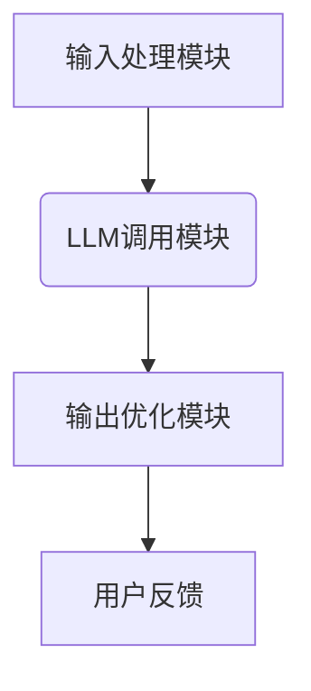
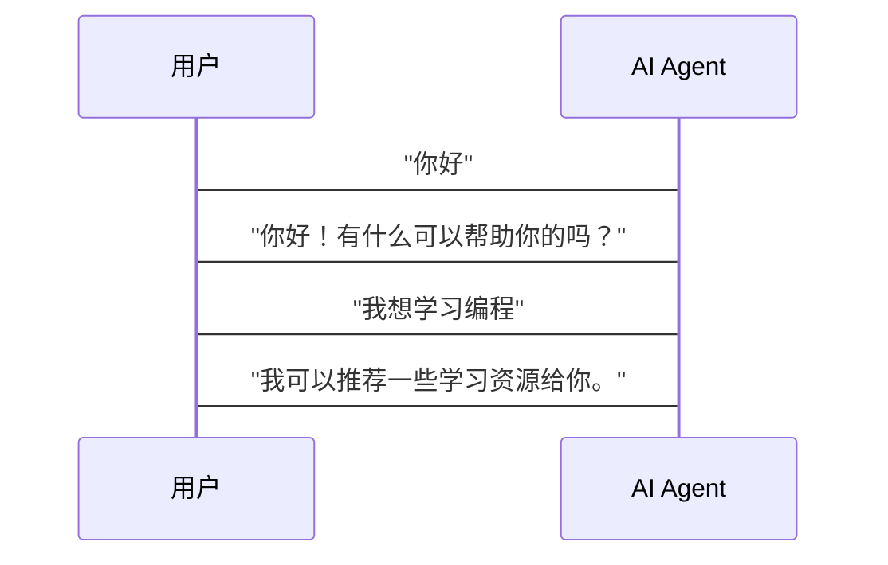

                 


# LLM驱动的AI Agent角色扮演能力增强

> 关键词：LLM, AI Agent, 角色扮演, 语言模型, 人工智能

> 摘要：本文探讨了利用大语言模型（LLM）增强AI Agent角色扮演能力的各个方面，从理论到实践，详细分析了LLM在角色理解、情感共鸣、知识整合及任务执行中的应用。通过系统架构设计、算法原理解析和项目实战案例，本文展示了如何提升AI Agent的角色扮演能力，使其在人机交互中更自然、更智能地完成任务。

---

## 第1章：背景介绍

### 1.1 LLM与AI Agent的基本概念

#### 1.1.1 LLM的定义与特点
大语言模型（LLM）是基于深度学习的自然语言处理模型，具有以下特点：
- **大规模训练数据**：通常使用海量文本数据进行训练，涵盖多种语言和领域。
- **强大的上下文理解**：通过自注意力机制（Self-attention）捕捉文本中的长距离依赖关系。
- **生成能力强**：能够生成连贯且自然的文本，适用于对话、翻译、文本摘要等多种任务。

#### 1.1.2 AI Agent的定义与分类
AI Agent是具有自主决策能力和交互能力的智能体，主要分为以下几类：
- **简单反射型**：基于规则的简单响应，适用于特定场景。
- **基于模型的反应型**：利用内部模型理解和预测环境，进行动态决策。
- **基于目标的**：具有明确的目标，通过规划和推理实现目标。

#### 1.1.3 LLM与AI Agent的结合
LLM为AI Agent提供了强大的语言理解和生成能力，使其能够：
- 自然地与人类进行多轮对话。
- 理解上下文并根据情境调整响应。
- 学习和适应不同角色的行为模式。

### 1.2 LLM驱动AI Agent的背景与意义

#### 1.2.1 背景
随着LLM技术的快速发展，AI Agent的应用场景逐渐扩展到更多领域，如客服、教育、娱乐等。传统的基于规则的AI Agent在复杂场景下表现受限，而结合LLM的AI Agent能够更好地理解和适应动态变化的环境。

#### 1.2.2 意义
- **提升用户体验**：通过更自然的交互方式，增强用户对AI Agent的信任感和满意度。
- **降低开发成本**：LLM的通用性减少了针对特定任务的规则编写工作。
- **支持多领域应用**：LLM强大的知识整合能力使AI Agent能够适应更多场景。

---

## 第2章：LLM驱动AI Agent的核心概念

### 2.1 LLM驱动AI Agent的能力构成

#### 2.1.1 语言理解与生成能力
- **语言理解**：LLM通过编码器（Encoder）将输入文本转换为向量表示，捕捉语义信息。
- **语言生成**：解码器（Decoder）基于向量生成自然语言文本，实现对话或多轮交互。

#### 2.1.2 知识表示与推理能力
- **知识表示**：将外部知识（如常识、领域知识）整合到LLM中，增强其推理能力。
- **推理能力**：通过上下文理解和逻辑推理，生成符合情境的响应。

#### 2.1.3 个性化表达与情感共鸣
- **个性化表达**：根据用户需求和角色设定，生成个性化文本。
- **情感共鸣**：通过情感分析和生成，增强人机交互的情感体验。

### 2.2 LLM与AI Agent的交互机制

#### 2.2.1 单轮与多轮对话机制
- **单轮交互**：简单的问答形式，适用于信息查询。
- **多轮交互**：通过上下文记忆，进行连续对话，适用于复杂任务。

#### 2.2.2 上下文记忆与状态管理
- **上下文记忆**：记录对话历史，确保后续响应的相关性。
- **状态管理**：维护当前对话的状态信息，如用户情感、任务目标等。

#### 2.2.3 动态目标调整与反馈优化
- **动态目标调整**：根据对话进展，实时调整任务目标。
- **反馈优化**：通过用户反馈调整生成策略，提升交互体验。

### 2.3 角色扮演能力的关键要素

#### 2.3.1 角色知识库的构建与管理
- **知识库构建**：收集和整理目标角色的相关知识，如背景、性格特点、行为规范。
- **知识库管理**：动态更新知识库，确保信息的准确性和适用性。

#### 2.3.2 角色行为的规范与约束
- **行为规范**：定义角色在不同情境下的行为准则。
- **行为约束**：设定角色行为的边界，避免生成不当内容。

---

## 第3章：LLM驱动AI Agent的算法原理

### 3.1 LLM的核心算法

#### 3.1.1 Transformer模型的结构
- **编码器**：将输入文本转换为向量表示。
- **解码器**：基于编码结果生成输出文本。
- **自注意力机制**：捕捉文本中的长距离依赖关系。

#### 3.1.2 编码器-解码器结构
$$
\text{编码器} \rightarrow \text{解码器}
$$

#### 3.1.3 注意力机制的数学公式
$$
\text{注意力权重} = \text{softmax}(\frac{QK^T}{\sqrt{d}})
$$

### 3.2 LLM驱动AI Agent的算法实现

#### 3.2.1 对话生成算法
- **输入处理**：将用户输入转换为向量表示。
- **生成策略**：基于LLM生成响应文本。
- **输出优化**：通过后处理优化生成文本的质量。

#### 3.2.2 上下文记忆算法
- **记忆维护**：记录对话历史，维护当前状态。
- **记忆更新**：根据新输入更新记忆内容。

---

## 第4章：系统分析与架构设计

### 4.1 系统功能设计

#### 4.1.1 功能模块划分
- **输入处理模块**：接收用户输入并解析。
- **LLM调用模块**：调用预训练的LLM生成响应。
- **记忆管理模块**：维护对话历史和状态信息。
- **输出优化模块**：对生成的文本进行优化。

#### 4.1.2 功能流程
- 用户输入 -> 输入处理 -> LLM调用 -> 输出优化 -> 用户反馈

### 4.2 系统架构设计

#### 4.2.1 系统架构图


#### 4.2.2 系统接口设计
- **输入接口**：接收用户输入文本。
- **输出接口**：返回生成的响应文本。

### 4.3 系统交互流程

#### 4.3.1 交互流程图


---

## 第5章：项目实战

### 5.1 环境安装

```bash
pip install transformers
pip install torch
pip install matplotlib
```

### 5.2 核心代码实现

#### 5.2.1 预训练模型加载
```python
from transformers import AutoTokenizer, AutoModelForCausalLM

tokenizer = AutoTokenizer.from_pretrained('gpt2')
model = AutoModelForCausalLM.from_pretrained('gpt2')
```

#### 5.2.2 提示词设计
```python
def generate_response(prompt):
    inputs = tokenizer.encode(prompt, return_tensors='pt')
    outputs = model.generate(inputs, max_length=50)
    response = tokenizer.decode(outputs[0], skip_special_tokens=True)
    return response
```

#### 5.2.3 模型推理
```python
prompt = "作为一个医生，你应该如何回应病人的焦虑？"
response = generate_response(prompt)
print(response)
```

### 5.3 实际案例分析

#### 5.3.1 案例背景
- **任务**：模拟医生与病人对话。
- **目标**：缓解病人焦虑，提供专业建议。

#### 5.3.2 案例分析
- **输入**：病人表达焦虑情绪。
- **输出**：医生生成共情的回应，提供心理支持。

---

## 第6章：总结与展望

### 6.1 最佳实践

#### 6.1.1 知识库优化
- 定期更新角色知识库，确保内容的准确性和相关性。

#### 6.1.2 模型优化
- 使用更先进的LLM模型，如GPT-4，提升生成质量。

### 6.2 小结

通过本文的探讨，我们了解了如何利用LLM增强AI Agent的角色扮演能力。从算法原理到系统设计，再到项目实战，我们逐步构建了一个高效的角色扮演AI Agent。

### 6.3 注意事项

- **数据隐私**：确保用户数据的安全性和隐私性。
- **内容审核**：对生成的内容进行审核，避免不当信息。

### 6.4 拓展阅读

- 推荐阅读《Large Language Models in AI》深入理解LLM的原理与应用。

---

# 结语

通过本文的系统讲解，我们不仅掌握了LLM驱动AI Agent角色扮演能力的核心技术，还通过实际案例加深了对理论的理解。希望本文能为相关领域的研究者和开发者提供有价值的参考和启发。

