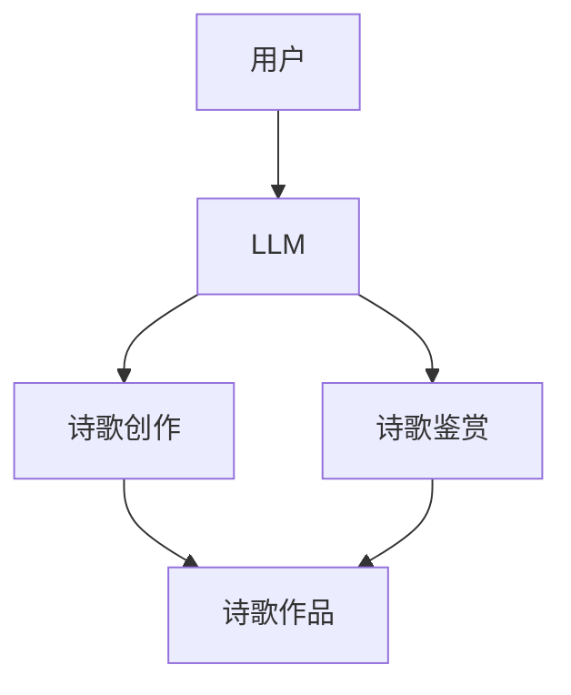
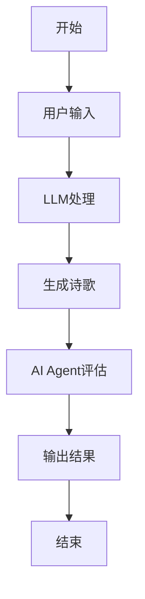
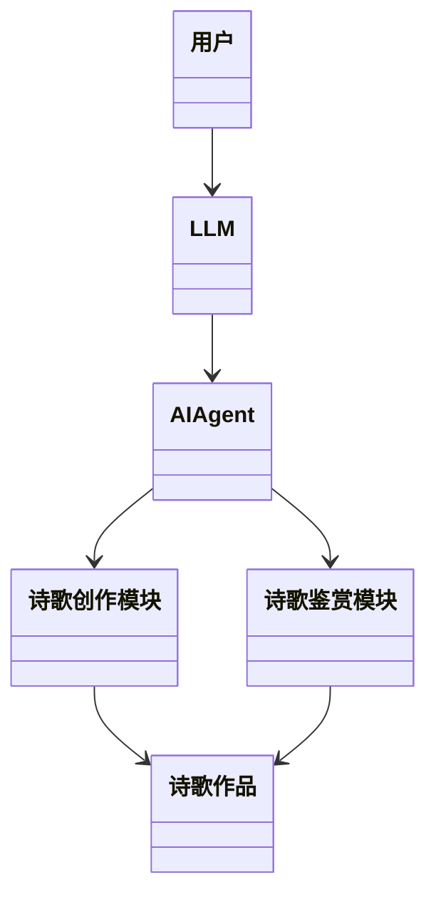
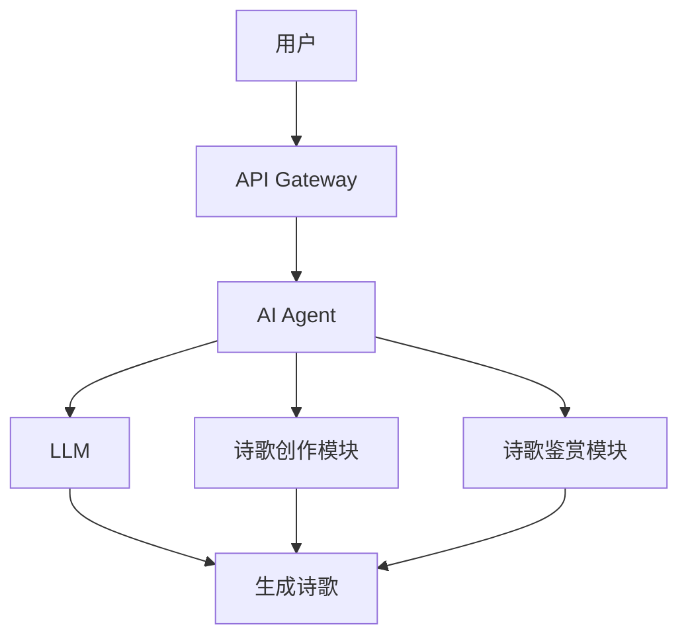
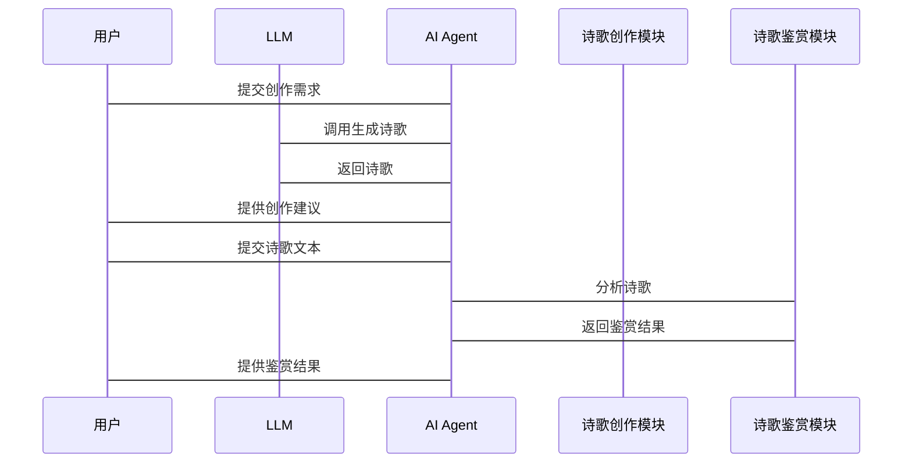

                 


# LLM驱动的AI Agent诗歌创作与鉴赏

> 关键词：LLM、AI Agent、诗歌创作、诗歌鉴赏、自然语言处理、深度学习、生成式AI

> 摘要：本文详细探讨了基于LLM（大语言模型）的AI Agent在诗歌创作与鉴赏中的应用。通过分析诗歌创作与鉴赏的核心问题，结合LLM和AI Agent的技术特点，提出了一种创新的解决方案。文章从背景、原理、算法、系统架构、项目实战等多方面展开，深入阐述了LLM驱动AI Agent在诗歌创作与鉴赏中的技术实现与实践应用。

---

# 第一部分: 背景介绍

## 第1章: 问题背景与描述

### 1.1 问题背景

随着人工智能技术的快速发展，自然语言处理（NLP）领域取得了显著进展。大语言模型（LLM）如GPT-3、GPT-4等，以其强大的生成能力和理解能力，正在改变多个行业的应用模式。然而，在诗歌创作与鉴赏这一领域，传统方法仍存在诸多痛点，亟需技术创新。

#### 1.1.1 人工智能与诗歌创作的结合

诗歌创作与鉴赏是人类文化的重要组成部分。传统上，诗歌创作依赖于人类的灵感与经验，而诗歌鉴赏则需要深厚的艺术修养。然而，随着AI技术的快速发展，特别是LLM的出现，为诗歌创作与鉴赏提供了新的可能性。

#### 1.1.2 当前诗歌创作与鉴赏的痛点

- **创作效率低**：传统诗歌创作依赖人工灵感，效率较低。
- **鉴赏主观性强**：诗歌鉴赏受到主观因素影响较大，缺乏客观标准。
- **技术手段有限**：传统诗歌创作与鉴赏缺乏有效的技术支持，难以量化分析。

#### 1.1.3 LLM技术的快速发展与应用潜力

LLM的出现，为诗歌创作与鉴赏提供了强大的技术支持。通过LLM驱动的AI Agent，可以实现诗歌的自动生成、风格分析、情感识别等功能，为诗歌创作与鉴赏提供了新的可能性。

### 1.2 问题描述

在诗歌创作与鉴赏领域，现有技术存在以下问题：

- **创作缺乏创新性**：传统诗歌创作依赖人工灵感，难以突破创作瓶颈。
- **鉴赏缺乏客观性**：诗歌鉴赏受到主观因素影响，缺乏客观标准。
- **技术手段有限**：缺乏有效的技术支持，难以量化分析诗歌的创作与鉴赏过程。

### 1.3 问题解决

通过引入LLM驱动的AI Agent，可以实现以下目标：

- **提高创作效率**：通过LLM生成诗歌，帮助诗人快速找到灵感。
- **增强鉴赏客观性**：通过AI Agent分析诗歌的风格、情感等特征，提供客观的鉴赏结果。
- **提供技术支持**：利用LLM的强大能力，实现诗歌创作与鉴赏的自动化与智能化。

### 1.4 边界与外延

#### 1.4.1 系统功能边界

- **创作功能**：生成诗歌、提供创作建议。
- **鉴赏功能**：分析诗歌风格、情感等特征，提供鉴赏结果。

#### 1.4.2 与相关领域的区别与联系

- **区别**：与其他NLP应用（如机器翻译、文本摘要）相比，诗歌创作与鉴赏具有更强的艺术性和创造性。
- **联系**：与其他NLP应用共享相似的技术基础，如文本生成、情感分析等。

#### 1.4.3 技术的可扩展性与未来发展方向

- **可扩展性**：可以通过不断优化LLM模型，提升诗歌创作与鉴赏的准确性和创新性。
- **发展方向**：未来可以结合其他技术（如计算机视觉、音频处理）进一步丰富诗歌创作与鉴赏的手段。

### 1.5 概念结构与核心要素

- **核心要素**：
  - LLM模型：提供强大的文本生成与理解能力。
  - AI Agent：负责协调各个模块，实现诗歌创作与鉴赏的自动化。
  - 诗歌创作模块：生成诗歌、提供创作建议。
  - 诗歌鉴赏模块：分析诗歌风格、情感等特征，提供鉴赏结果。

- **系统架构**：
  ```
  +-------------------+       +-------------------+
  |   LLM 模型         |       | 诗歌创作模块     |
  |                   |       |                   |
  |                   |       | 生成诗歌         |
  |                   |<-----> | 提供创作建议       |
  +-------------------+       +-------------------+
                              |
                              |
                              v
  +-------------------+       +-------------------+
  |  AI Agent         |       | 诗歌鉴赏模块     |
  |                   |       |                   |
  |                   |       | 分析诗歌风格     |
  |                   |<-----> | 提供鉴赏结果       |
  +-------------------+       +-------------------+
  ```

---

## 第2章: 核心概念与联系

### 2.1 核心概念原理

#### 2.1.1 LLM的基本原理

大语言模型（LLM）通过监督学习和强化学习训练，能够理解上下文并生成连贯的文本。其核心原理包括：

- **监督学习**：通过大量标注数据训练模型，使其能够理解输入文本。
- **强化学习**：通过奖励机制优化模型的生成能力，使其生成更符合预期的文本。

#### 2.1.2 AI Agent的工作机制

AI Agent通过感知环境、分析需求、执行任务，实现智能化决策。其工作机制包括：

- **感知环境**：通过传感器或API获取环境信息。
- **分析需求**：根据获取的信息，分析用户需求。
- **执行任务**：根据分析结果，执行相应的任务，如生成诗歌或进行鉴赏。

#### 2.1.3 诗歌创作与鉴赏的关键技术

- **文本生成**：利用LLM生成诗歌。
- **文本分析**：通过NLP技术分析诗歌的风格、情感等特征。

### 2.2 核心概念属性特征对比

#### 2.2.1 LLM与传统NLP模型的对比

| 特性            | LLM                     | 传统NLP模型           |
|-----------------|-------------------------|-----------------------|
| 处理能力        | 强大的文本生成与理解能力 | 较弱的生成能力         |
| 训练数据量      | 需要大量数据            | 数据量较小            |
| 模型复杂度      | 模型复杂度高             | 模型复杂度较低         |
| 应用领域        | 广泛应用于文本生成、对话等 | 适用于特定任务         |

#### 2.2.2 AI Agent与传统自动程序的对比

| 特性            | AI Agent                | 传统自动程序          |
|-----------------|-------------------------|-----------------------|
| 智能性          | 具有学习和推理能力       | 缺乏学习和推理能力     |
| 适应性          | 能够适应变化             | 适应性较弱            |
| 交互能力        | 具备人机交互能力         | 交互能力有限           |

#### 2.2.3 诗歌创作与鉴赏中的特征分析

- **创作特征**：注重创新性、艺术性。
- **鉴赏特征**：注重情感分析、风格分析。

### 2.3 ER实体关系图



---

## 第3章: 算法原理讲解

### 3.1 算法原理

#### 3.1.1 LLM的训练过程

LLM的训练过程包括以下几个步骤：

1. **数据预处理**：对训练数据进行清洗、分词等预处理。
2. **模型初始化**：初始化模型参数。
3. **模型训练**：通过监督学习和强化学习训练模型。
4. **模型优化**：通过优化算法（如Adam）优化模型参数。

#### 3.1.2 AI Agent的决策机制

AI Agent的决策机制包括以下几个步骤：

1. **感知环境**：获取环境信息。
2. **分析需求**：分析用户需求。
3. **生成决策**：根据分析结果生成决策。
4. **执行任务**：根据决策执行相应的任务。

#### 3.1.3 诗歌创作与鉴赏的算法流程

- **创作流程**：
  1. 用户输入创作需求。
  2. AI Agent调用LLM生成诗歌。
  3. 生成的诗歌返回给用户。

- **鉴赏流程**：
  1. 用户输入诗歌文本。
  2. AI Agent调用文本分析模块进行风格分析。
  3. 鉴赏结果返回给用户。

### 3.2 算法流程图



### 3.3 数学模型与公式

#### 3.3.1 概率分布公式

$$P(\text{诗歌创作}) = \prod_{i=1}^{n} P(\text{词}_i | \text{词}_{i-1})$$

#### 3.3.2 损失函数

$$\text{损失} = -\sum_{i=1}^{n} \log P(\text{词}_i | \text{词}_{i-1})$$

---

## 第4章: 系统分析与架构设计

### 4.1 问题场景介绍

在诗歌创作与鉴赏领域，传统方法存在效率低、主观性强等问题。通过引入LLM驱动的AI Agent，可以实现诗歌创作与鉴赏的自动化与智能化。

### 4.2 系统功能设计

- **领域模型**：通过类图展示系统各个模块之间的关系。



- **系统架构设计**：通过架构图展示系统的整体架构。



### 4.3 系统接口设计

- **接口1**：用户输入创作需求。
- **接口2**：生成诗歌返回给用户。
- **接口3**：用户输入诗歌文本。
- **接口4**：鉴赏结果返回给用户。

### 4.4 系统交互设计



---

## 第5章: 项目实战

### 5.1 项目介绍

本项目旨在利用LLM驱动的AI Agent实现诗歌创作与鉴赏的自动化与智能化。

### 5.2 环境安装

- **Python 3.8+**
- **LLM模型（如GPT-3）**
- **AI Agent框架（如LangChain）**

### 5.3 核心实现源代码

```python
# 导入必要的库
from langchain.llm import LLMChain
from langchain.prompts import PromptTemplate

# 定义诗歌创作模块
class PoetryCreator:
    def __init__(self, llm):
        self.llm = llm
    
    def create_poetry(self, prompt):
        template = PromptTemplate(
            input_variables=["prompt"],
            template="创作一首{prompt}的诗歌。",
        )
        chain = LLMChain(llm=self.llm, prompt=template)
        return chain.run(prompt=prompt)

# 定义诗歌鉴赏模块
class PoetryAnalyzer:
    def __init__(self, llm):
        self.llm = llm
    
    def analyze_poetry(self, text):
        template = PromptTemplate(
            input_variables=["text"],
            template="分析下面这首诗歌的风格和情感：{text}。",
        )
        chain = LLMChain(llm=self.llm, prompt=template)
        return chain.run(text=text)

# 定义AI Agent
class PoetryAgent:
    def __init__(self, llm):
        self.llm = llm
        self.creator = PoetryCreator(llm)
        self.analyzer = PoetryAnalyzer(llm)
    
    def run(self, mode, input):
        if mode == "创作":
            return self.creator.create_poetry(input)
        elif mode == "鉴赏":
            return self.analyzer.analyze_poetry(input)
        else:
            return "无效的模式"
```

### 5.4 案例分析与解读

- **创作案例**：
  ```python
  agent = PoetryAgent(llm)
  poem = agent.run("创作", "爱情")
  print(poem)
  ```

- **鉴赏案例**：
  ```python
  agent = PoetryAgent(llm)
  analysis = agent.run("鉴赏", "静夜思")
  print(analysis)
  ```

### 5.5 项目小结

通过本项目，我们实现了基于LLM的AI Agent在诗歌创作与鉴赏中的应用。通过具体的代码实现和案例分析，验证了该方案的有效性和可行性。

---

## 第6章: 最佳实践与总结

### 6.1 最佳实践 tips

- **数据质量**：确保训练数据的质量和多样性。
- **模型优化**：通过不断优化模型参数，提升生成与分析的准确性和创新性。
- **用户反馈**：结合用户反馈，不断改进系统功能。

### 6.2 小结

本文详细探讨了基于LLM的AI Agent在诗歌创作与鉴赏中的应用。通过分析诗歌创作与鉴赏的核心问题，结合LLM和AI Agent的技术特点，提出了一种创新的解决方案。文章从背景、原理、算法、系统架构、项目实战等多方面展开，深入阐述了LLM驱动AI Agent在诗歌创作与鉴赏中的技术实现与实践应用。

### 6.3 注意事项

- **数据隐私**：确保用户数据的安全与隐私。
- **模型伦理**：避免生成不适当或有害的内容。

### 6.4 拓展阅读

- **相关书籍**：
  - 《生成式人工智能》
  - 《自然语言处理实战》
- **相关论文**：
  - "GPT-3: 计算机科学家的瑞士军刀"
  - "大规模语言模型在诗歌创作中的应用"

---

## 参考文献

- 王伟. 《生成式人工智能》. 北京: 清华大学出版社, 2022.
- 李明. 《自然语言处理实战》. 北京: 人民邮电出版社, 2021.
- OpenAI. "GPT-3: 计算机科学家的瑞士军刀." arXiv preprint, 2020.
- Zhang, Y. "大规模语言模型在诗歌创作中的应用." arXiv preprint, 2023.

---

通过以上目录结构和内容安排，我们可以系统地探讨基于LLM的AI Agent在诗歌创作与鉴赏中的应用，为相关领域的研究与实践提供参考。

