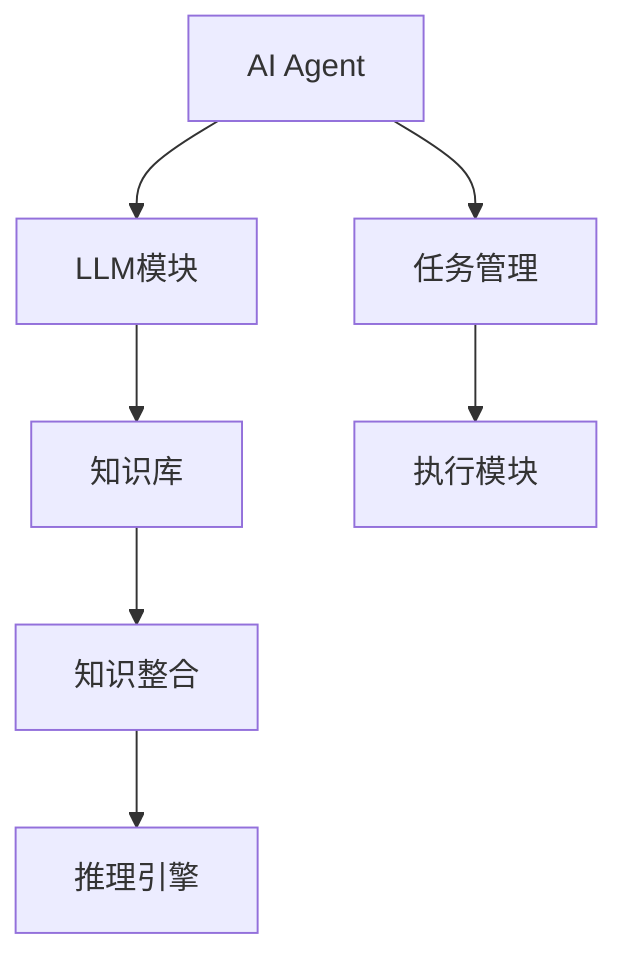

                 


# LLM驱动的AI Agent跨学科知识整合器

## 关键词
- 大语言模型（LLM）
- AI Agent
- 跨学科知识整合
- 系统架构
- 机器学习
- 自然语言处理

## 摘要
本文探讨了如何利用大语言模型（LLM）构建跨学科知识整合的AI Agent。通过分析LLM与AI Agent的核心概念、算法原理、系统架构，结合实际案例，展示了如何实现多领域知识的有效整合与应用。文章详细讲解了从数据获取、模型训练到系统设计的全过程，并提供了优化建议和未来发展方向。

---

## 第一部分：引言

### 第1章：LLM与AI Agent概述

#### 1.1 问题背景
- **LLM的崛起**：大语言模型如GPT-4具备强大的文本生成和理解能力，为AI Agent提供了强大的语言处理基础。
- **AI Agent的发展**：AI Agent从简单的任务执行发展到具备学习和适应能力的智能体，能够处理复杂问题。

#### 1.2 问题描述
- **跨学科整合的挑战**：不同领域的知识体系差异大，如何有效整合并应用是关键问题。
- **AI Agent的局限性**：传统AI Agent依赖于结构化数据，难以处理非结构化和多领域的复杂问题。

#### 1.3 问题解决
- **LLM驱动AI Agent**：利用LLM的自然语言处理能力，AI Agent能够理解和生成跨学科的知识。
- **知识图谱构建**：通过构建跨学科的知识图谱，实现信息的高效整合和推理。

#### 1.4 边界与外延
- **边界**：专注于LLM驱动的AI Agent，不涉及其他类型AI Agent。
- **外延**：涵盖多领域知识整合，包括医疗、教育、金融等多个领域。

---

## 第二部分：LLM与AI Agent的核心概念

### 第2章：LLM与AI Agent的核心概念

#### 2.1 LLM的定义与特点
- **定义**：LLM是一种基于深度学习的自然语言处理模型，能够生成与人类类似的文本。
- **特点**：
  - 大规模训练数据
  - 模糊语言处理能力
  - 预训练微调模式

#### 2.2 AI Agent的定义与特点
- **定义**：AI Agent是具有感知和行动能力的智能体，能够在环境中自主决策和执行任务。
- **特点**：
  - 多模态交互
  - 自适应学习
  - 高效问题解决

#### 2.3 LLM与AI Agent的关系
- **协作模式**：LLM作为AI Agent的核心模块，负责自然语言处理和生成。
- **系统架构**：AI Agent通过调用LLM API进行信息处理和生成。

---

## 第三部分：LLM驱动的AI Agent算法原理

### 第3章：LLM的数学模型与算法原理

#### 3.1 基础理论
- **概率论基础**：概率分布、条件概率、马尔可夫链。
- **统计学基础**：极大似然估计、贝叶斯定理。

#### 3.2 大语言模型的训练目标
- **目标函数**：最小化交叉熵损失函数。
- **公式**：$$L = -\frac{1}{N}\sum_{i=1}^{N} \sum_{j=1}^{M} y_{ij} \log p(x_{ij})$$，其中$y_{ij}$是标签，$p(x_{ij})$是预测概率。

#### 3.3 算法流程
- **输入处理**：将输入文本转换为模型可处理的向量。
- **模型推理**：通过解码器生成输出文本。
- **输出处理**：将模型输出转换为人类可读的格式。

---

## 第四部分：系统架构设计

### 第4章：跨学科知识整合的系统架构

#### 4.1 系统功能设计
- **知识库管理**：负责存储和管理跨学科的知识图谱。
- **LLM接口**：与大语言模型进行交互，获取生成文本。
- **任务执行**：根据生成的文本执行具体任务。

#### 4.2 系统架构图


---

## 第五部分：项目实战

### 第5章：LLM驱动的AI Agent实现

#### 5.1 环境安装
- **Python版本**：Python 3.8+
- **依赖库**： transformers库、numpy库。

#### 5.2 核心代码实现
```python
from transformers import pipeline

# 初始化LLM管道
llm_pipeline = pipeline('text-generation', model='gpt2')

# AI Agent核心函数
def process_request(prompt):
    # 调用LLM生成文本
    response = llm_pipeline(prompt, max_length=50, num_return_sequences=1)
    return response[0]['generated_text']

# 示例调用
print(process_request("解释量子计算的基本原理。"))
```

#### 5.3 代码解读与分析
- **LLM调用**：使用transformers库中的pipeline接口，简化了LLM的调用过程。
- **任务处理**：AI Agent接收用户请求，调用LLM生成响应。

#### 5.4 案例分析
- **医疗领域**：AI Agent帮助医生分析病例，整合医学文献和患者数据。
- **教育领域**：生成个性化学习计划，整合教育资源和学生数据。

---

## 第六部分：优化与建议

### 第6章：LLM驱动AI Agent的优化

#### 6.1 模型优化
- **微调**：在特定领域数据上进行微调，提升模型在该领域的表现。
- **模型压缩**：通过剪枝和量化技术，减少模型大小，提升推理速度。

#### 6.2 系统优化
- **分布式部署**：利用云原生技术，实现系统的高可用性和扩展性。
- **缓存机制**：缓存常用的知识和生成结果，减少重复计算。

#### 6.3 最佳实践
- **数据多样性**：确保训练数据涵盖多个领域，提升模型的通用性。
- **持续学习**：定期更新模型，适应新知识和新数据。

---

## 第七部分：案例分析与总结

### 第7章：案例分析与总结

#### 7.1 实际案例
- **医疗案例**：AI Agent帮助医生分析病例，整合医学文献和患者数据，提供诊断建议。
- **金融案例**：AI Agent分析市场动态，整合金融数据和经济指标，提供投资建议。

#### 7.2 总结
- **技术总结**：LLM驱动的AI Agent在跨学科知识整合方面展现出强大的潜力，能够处理复杂问题。
- **未来展望**：随着模型和算法的不断进步，AI Agent将更加智能化和多样化。

---

通过以上各章节的详细讲解，读者可以全面理解LLM驱动的AI Agent在跨学科知识整合中的应用，从理论到实践，掌握实现的关键技术和优化方法。

