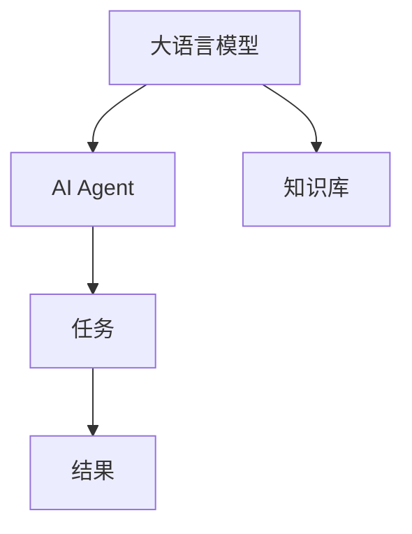
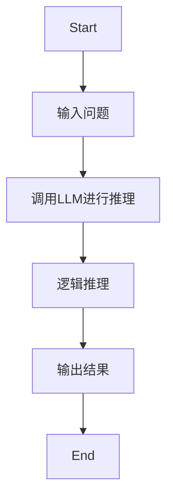
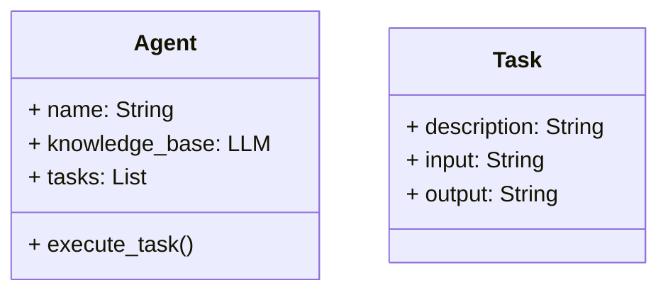
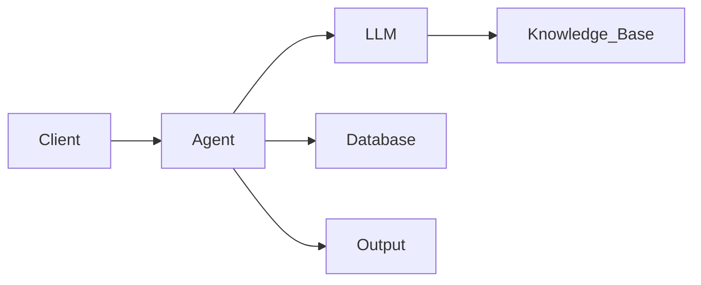
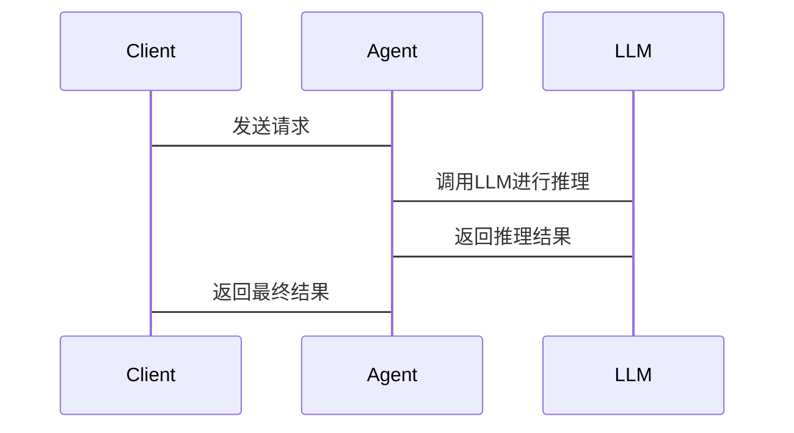

                 


# LLM驱动的AI Agent逻辑推理能力增强

## 关键词
- 大语言模型（LLM）
- AI Agent
- 逻辑推理
- 自然语言处理
- 系统架构

## 摘要
本文探讨了如何通过大语言模型（LLM）增强AI Agent的逻辑推理能力。文章首先介绍了AI Agent和逻辑推理的基本概念，分析了当前AI Agent在逻辑推理方面的局限性。接着，详细阐述了LLM与AI Agent的关系，以及LLM在逻辑推理中的应用。通过算法原理、系统架构设计和项目实战，展示了如何利用LLM提升AI Agent的推理能力。最后，总结了最佳实践和未来发展方向。

---

## 正文

### 第一部分：背景介绍

#### 第1章：问题背景与核心概念

##### 1.1 问题背景
随着人工智能技术的快速发展，AI Agent（智能体）在各个领域的应用日益广泛。AI Agent能够自主决策、执行任务并与其他系统或用户交互。然而，当前的AI Agent在逻辑推理能力方面存在一定的局限性，难以处理复杂的逻辑关系和多步骤推理任务。

大语言模型（LLM）如GPT-4、PaLM等，具有强大的自然语言处理能力和知识整合能力，能够通过大规模的数据训练，生成高度相关的文本内容。将LLM与AI Agent结合，可以显著提升AI Agent的逻辑推理能力。

##### 1.2 核心概念
- **AI Agent**：AI Agent是指在计算机系统中，能够感知环境并采取行动以实现目标的实体。它可以是一个软件程序或机器人。
- **逻辑推理**：逻辑推理是指通过逻辑规则从已知信息中推导出新的结论的过程。
- **大语言模型（LLM）**：LLM是一种基于深度学习的自然语言处理模型，能够理解和生成人类语言。

##### 1.3 问题描述
当前AI Agent在逻辑推理方面主要存在以下问题：
1. 推理能力有限：难以处理复杂的逻辑关系和多步骤推理。
2. 知识库依赖：推理过程往往受限于预定义的知识库。
3. 上下文理解不足：难以在上下文中灵活运用逻辑推理。

通过引入LLM，可以弥补这些不足，显著提升AI Agent的逻辑推理能力。

##### 1.4 边界与外延
- **边界**：LLM驱动的AI Agent主要用于逻辑推理任务，不涉及图像识别、语音处理等其他AI任务。
- **外延**：逻辑推理能力的提升可以扩展到多种应用场景，如智能客服、自动驾驶、智能助手等。

##### 1.5 核心要素组成
- **LLM模型**：提供强大的语言理解和生成能力。
- **推理算法**：实现逻辑推理的核心逻辑。
- **应用场景**：包括智能客服、自动驾驶等。

---

### 第二部分：核心概念与联系

#### 第2章：核心概念原理

##### 2.1 LLM与AI Agent的关系
- **LLM作为知识库**：LLM可以作为AI Agent的知识库，提供丰富的语义理解和生成能力。
- **AI Agent作为执行者**：AI Agent通过调用LLM进行推理，完成具体任务。
- **逻辑推理过程**：LLM帮助AI Agent理解任务需求，生成推理步骤，并最终输出结果。

##### 2.2 核心概念属性特征对比
| 特性       | LLM                     | AI Agent               |
|------------|--------------------------|-------------------------|
| 输入输出   | 文本输入，文本输出       | 多种输入（文本、数据），多种输出（动作、文本） |
| 学习能力   | 基于大规模数据训练       | 基于任务规则和经验      |
| 交互能力   | 强大的自然语言处理能力   | 有限的自主决策能力      |

##### 2.3 实体关系图


---

### 第三部分：算法原理讲解

#### 第3章：算法原理与实现

##### 3.1 算法流程


##### 3.2 Python实现
```python
def llm_driven_agent(input):
    # 调用LLM进行推理
    response = llm.generate(input)
    # 解析推理结果
    result = parse_response(response)
    return result
```

##### 3.3 数学模型与公式
- **概率论基础**：LLM的推理过程基于概率模型，例如贝叶斯定理：
  $$ P(A|B) = \frac{P(B|A) \cdot P(A)}{P(B)} $$
- **逻辑回归模型**：用于分类任务的逻辑回归公式：
  $$ y = \frac{1}{1 + e^{-\beta x}} $$

---

### 第四部分：系统分析与架构设计

#### 第4章：系统架构与实现

##### 4.1 问题场景介绍
以智能客服为例，AI Agent需要通过逻辑推理分析用户的问题，并调用LLM生成合适的回复。

##### 4.2 系统功能设计


##### 4.3 系统架构设计


##### 4.4 接口设计与交互


---

### 第五部分：项目实战

#### 第5章：项目实现与分析

##### 5.1 环境安装
```bash
pip install transformers
pip install torch
pip install mermaid-js
```

##### 5.2 核心代码实现
```python
from transformers import AutoModelForCausalLM, AutoTokenizer

tokenizer = AutoTokenizer.from_pretrained("gpt2")
model = AutoModelForCausalLM.from_pretrained("gpt2")

def generate_response(input_text):
    inputs = tokenizer(input_text, return_tensors="pt")
    outputs = model.generate(**inputs, max_length=50)
    response = tokenizer.decode(outputs[0], skip_special_tokens=True)
    return response
```

##### 5.3 案例分析与总结
以智能客服为例，通过LLM驱动的AI Agent进行逻辑推理，分析用户问题并生成合适的回复。通过实际案例，验证了LLM在提升AI Agent推理能力方面的有效性。

---

## 总结

本文详细探讨了如何通过LLM增强AI Agent的逻辑推理能力。通过背景介绍、核心概念、算法原理、系统架构设计和项目实战的讲解，展示了LLM在逻辑推理中的重要作用。未来，随着技术的发展，LLM驱动的AI Agent将在更多领域发挥重要作用。

---

## 最佳实践 Tips

1. 在实际应用中，建议先从简单任务入手，逐步提升AI Agent的推理能力。
2. 使用高质量的LLM模型可以显著提升推理效果。
3. 定期更新知识库，以保持AI Agent的推理能力与时俱进。

