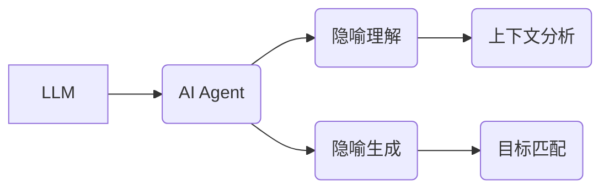
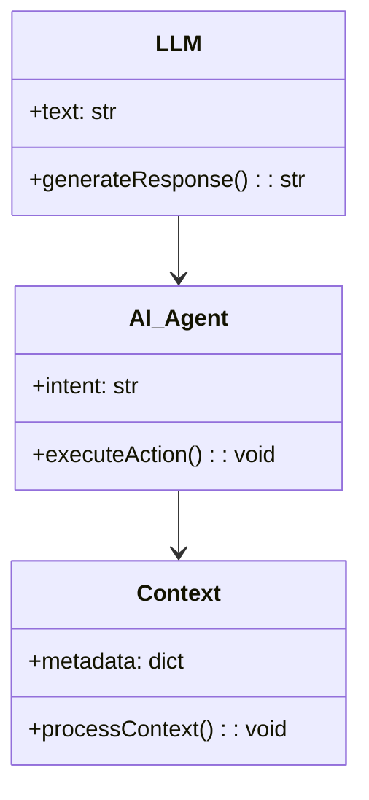
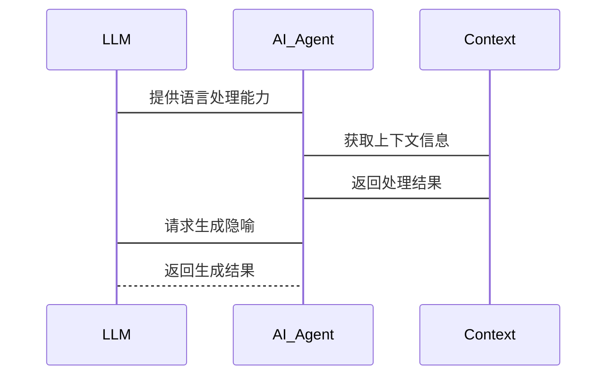

                 


# LLM驱动的AI Agent隐喻理解与生成

## 关键词：LLM、AI Agent、隐喻理解、隐喻生成、自然语言处理、深度学习

## 摘要：
本文探讨了大语言模型（LLM）如何驱动AI代理（AI Agent）进行隐喻的理解与生成。通过分析LLM与AI Agent的协同工作原理，结合算法模型和实际案例，详细阐述了隐喻在自然语言处理中的重要性，并展示了如何通过技术手段实现隐喻的理解与生成，为AI Agent的智能化发展提供了新的思路。

---

# 第1章: LLM驱动的AI Agent概述

## 1.1 问题背景与描述

### 1.1.1 LLM与AI Agent的定义
- **大语言模型（LLM）**：基于深度学习的自然语言处理模型，如GPT系列，能够理解和生成人类语言。
- **AI Agent**：一种智能体，能够感知环境、执行任务并做出决策，通过LLM提供语言理解和生成能力。

### 1.1.2 隐喻在LLM驱动AI Agent中的作用
- 隐喻是语言表达的重要方式，能够提升语言的丰富性和表达的多样性。
- AI Agent需要理解隐喻的含义，才能在复杂场景中进行有效沟通和决策。

### 1.1.3 问题解决的必要性与目标
- **必要性**：隐喻理解是实现AI Agent智能化的关键。
- **目标**：通过LLM驱动，实现AI Agent对隐喻的识别、理解和生成。

## 1.2 核心概念与边界

### 1.2.1 LLM与AI Agent的关系
- LLM作为AI Agent的语言处理核心，AI Agent作为LLM的应用载体。

### 1.2.2 隐喻理解与生成的边界
- 理解范围：上下文推理、意图识别。
- 生成范围：目标匹配、多轮对话。

## 1.3 核心要素与组成

### 1.3.1 LLM的输入输出机制
- 输入：自然语言文本。
- 输出：理解结果或生成文本。

### 1.3.2 AI Agent的行为决策模型
- 基于LLM的理解结果，进行行为决策。

### 1.3.3 隐喻理解与生成的逻辑架构
- 输入解析、上下文推理、意图识别、生成策略。

## 1.4 本章小结
本章介绍了LLM和AI Agent的基本概念，分析了隐喻在AI Agent中的重要性，明确了研究的目标和范围。

---

# 第2章: LLM与AI Agent的核心原理

## 2.1 LLM的工作机制

### 2.1.1 大语言模型的基本原理
- 基于Transformer架构，通过自注意力机制处理序列数据。

### 2.1.2 概率生成模型的数学基础
- 使用交叉熵损失函数优化模型参数。

### 2.1.3 注意力机制与序列建模
- 注意力机制用于捕捉文本中的长距离依赖关系。

## 2.2 AI Agent的行为决策模型

### 2.2.1 基于LLM的决策树构建
- 通过LLM生成多种决策选项，构建决策树。

### 2.2.2 隐喻理解的上下文推理
- 分析上下文信息，识别隐喻含义。

### 2.2.3 多轮对话中的状态管理
- 维护对话历史，确保隐喻理解的连贯性。

## 2.3 LLM与AI Agent的协同工作

### 2.3.1 LLM作为知识库的使用
- 提供语言理解和生成能力，支持AI Agent的任务执行。

### 2.3.2 AI Agent作为执行者的角色
- 根据LLM的理解结果，执行具体任务。

### 2.3.3 隐喻生成的触发条件与反馈机制
- 根据任务需求触发隐喻生成，通过反馈优化生成结果。

## 2.4 核心概念对比表格

| **核心概念** | **LLM** | **AI Agent** |
|--------------|----------|--------------|
| **功能**     | 语言处理 | 行为决策     |
| **输入**     | 文本     | 环境数据     |
| **输出**     | 理解/生成文本 | 行动策略     |

## 2.5 ER实体关系图


## 2.6 本章小结
本章详细讲解了LLM和AI Agent的核心原理，分析了它们在隐喻处理中的协同关系，为后续的算法设计奠定了基础。

---

# 第3章: LLM驱动的AI Agent隐喻理解与生成的算法原理

## 3.1 隐喻理解的算法原理

### 3.1.1 输入处理与预处理
- 对输入文本进行分词、去停用词等预处理。

### 3.1.2 隐喻识别的特征提取
- 提取文本中的关键词、句法结构等特征。

### 3.1.3 上下文推理的数学模型
- 使用概率模型计算隐喻的可能性：
  $$ P(\text{隐喻}|x) = \frac{P(x|\text{隐喻})P(\text{隐喻})}{P(x)} $$

## 3.2 隐喻生成的算法流程

### 3.2.1 目标分析与意图识别
- 分析生成目标，识别隐喻意图。

### 3.2.2 隐喻匹配与生成策略
- 基于意图匹配合适的隐喻表达。

### 3.2.3 多轮对话中的隐喻生成
- 结合对话历史生成连贯的隐喻表达。

## 3.3 算法原理的数学模型

### 3.3.1 隐喻理解的概率模型
- 使用条件概率计算隐喻的可能性。

### 3.3.2 隐喻生成的损失函数
- 使用交叉熵损失函数优化生成模型：
  $$ \text{Loss} = -\sum_{i} \log P(y_i|x_i) $$

## 3.4 案例分析：隐喻生成的流程图


## 3.5 本章小结
本章从算法角度详细分析了隐喻理解与生成的流程，展示了如何通过数学模型实现隐喻的智能处理。

---

# 第4章: LLM驱动的AI Agent隐喻理解与生成的系统架构设计

## 4.1 项目背景介绍

### 4.1.1 项目目标
- 实现LLM驱动的AI Agent隐喻理解与生成系统。

### 4.1.2 项目范围
- 针对特定场景设计隐喻处理功能。

## 4.2 系统功能设计

### 4.2.1 领域模型类图


### 4.2.2 系统架构设计
- **分层架构**：LLM层、AI Agent层、应用层。
- **通信接口**：RESTful API。

### 4.2.3 系统交互流程


## 4.3 本章小结
本章从系统架构的角度，详细设计了LLM驱动的AI Agent隐喻理解与生成系统，展示了各模块之间的交互关系。

---

# 第5章: 项目实战

## 5.1 环境安装

### 5.1.1 安装Python环境
- 使用Anaconda或virtualenv创建虚拟环境。

### 5.1.2 安装依赖包
- `pip install transformers`

## 5.2 系统核心实现源代码

### 5.2.1 LLM接口实现
```python
from transformers import GPT2LMHeadModel, GPT2Tokenizer

class LLMInterface:
    def __init__(self):
        self.model = GPT2LMHeadModel.from_pretrained('gpt2')
        self.tokenizer = GPT2Tokenizer.from_pretrained('gpt2')
```

### 5.2.2 AI Agent实现
```python
class AI_Agent:
    def __init__(self, llm):
        self.llm = llm
        self.context = {}

    def process_context(self, input_text):
        # 预处理输入文本
        pass

    def generate_metaphor(self, intent):
        # 生成隐喻
        pass
```

## 5.3 代码应用解读与分析

### 5.3.1 LLM接口的使用
- 使用Hugging Face的`transformers`库调用LLM进行隐喻生成。

### 5.3.2 AI Agent的行为决策
- 根据LLM生成的隐喻进行行为决策。

## 5.4 实际案例分析
- **案例1**：生成隐喻“冰山一角”用于描述问题的严重性。
- **案例2**：在客服对话中生成隐喻，提升用户体验。

## 5.5 本章小结
本章通过实际项目案例，展示了如何使用LLM驱动AI Agent实现隐喻理解与生成，提供了可参考的代码实现。

---

# 第6章: 总结与展望

## 6.1 最佳实践 tips
- **模型优化**：使用更先进的模型提升隐喻生成质量。
- **数据增强**：增加隐喻相关的训练数据。
- **多模态融合**：结合视觉、听觉信息提升隐喻理解能力。

## 6.2 小结
本文详细探讨了LLM驱动AI Agent隐喻理解与生成的实现方法，结合理论分析和实际案例，展示了技术的可行性和应用潜力。

## 6.3 注意事项
- 隐喻的生成需考虑文化差异和语境因素。
- 模型的泛化能力有限，需结合具体场景优化。

## 6.4 拓展阅读
- 推荐阅读《Large Language Models in NLP》和《AI Agent Design Patterns》。

---

# 附录: 参考文献

1. Vaswani, A., et al. "Attention Is All You Need." arXiv, 2017.
2. Radford, A., et al. "Language Models are Few-Shot Learners." arXiv, 2020.

---

通过以上目录结构和技术内容，本文系统地介绍了LLM驱动AI Agent隐喻理解与生成的各个方面，结合理论分析和实际案例，为读者提供了全面而深入的技术指导。

