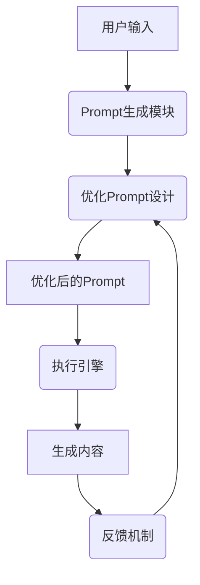

                 


# 第一部分: Prompt工程与AI Agent概述

## 第1章: Prompt工程的基本概念

### 1.1 什么是Prompt工程
#### 1.1.1 Prompt工程的定义
Prompt工程是指通过设计和优化提示（prompt）来指导AI模型生成所需输出的过程。它结合了自然语言处理（NLP）、机器学习和认知科学等领域知识，旨在最大化AI系统的性能和用户体验。

#### 1.1.2 Prompt工程的核心要素
- **目标设定**：明确提示的目标，例如生成回答、翻译文本或进行推理。
- **输入处理**：处理输入数据，确保AI模型能够正确解析和理解。
- **输出生成**：设计输出结构，指导模型生成符合期望的结果。
- **约束条件**：设置约束，如格式、长度或内容限制，以控制生成结果的质量。

#### 1.1.3 Prompt工程与AI Agent的关系
AI Agent是具备自主决策能力的智能体，Prompt工程为其提供了与用户交互和执行任务的接口。通过优化Prompt，AI Agent能够更高效地理解用户需求并执行复杂任务。

### 1.2 AI Agent的基本概念
#### 1.2.1 AI Agent的定义
AI Agent是一种能够感知环境、自主决策并执行任务的智能系统。它能够理解用户指令、处理信息并生成响应，类似于智能助手或聊天机器人。

#### 1.2.2 AI Agent的主要类型
- **简单反应式AI Agent**：基于当前输入做出反应，适用于简单的任务。
- **基于模型的AI Agent**：利用内部模型理解和推理，适用于复杂任务。
- **人机协作AI Agent**：与人类协同工作，结合人类决策和AI建议。

#### 1.2.3 AI Agent的应用场景
- **智能客服**：通过自然语言处理为用户提供支持。
- **智能助手**：如Siri、Alexa等，帮助用户完成日常任务。
- **自动驾驶**：通过AI Agent处理传感器数据，做出驾驶决策。

## 第2章: Prompt工程的背景与现状

### 2.1 AI Agent的发展历程
#### 2.1.1 从规则驱动到数据驱动的演变
早期AI Agent依赖预定义规则，而现在更多采用数据驱动的方法，利用深度学习模型进行自然语言处理。

#### 2.1.2 大模型在AI Agent中的应用
大语言模型如GPT-3、GPT-4的出现，为AI Agent提供了强大的生成能力，使得Prompt工程成为提升性能的关键。

#### 2.1.3 当前AI Agent面临的挑战
- **理解复杂性**：处理多轮对话和复杂任务时，AI Agent需要更精准的Prompt设计。
- **可解释性**：用户希望了解AI Agent的决策过程，这需要设计可解释的Prompt。
- **实时性**：在实时交互中，AI Agent需要快速响应，这对Prompt的优化提出了更高要求。

### 2.2 Prompt工程的兴起
#### 2.2.1 Prompt工程的起源
Prompt工程起源于自然语言处理领域，随着大模型的普及，逐渐成为优化AI Agent性能的重要方法。

#### 2.2.2 Prompt工程在AI Agent中的作用
- **提升生成质量**：通过优化Prompt，AI Agent能够生成更符合用户需求的内容。
- **增强交互性**：设计合理的Prompt，使AI Agent能够更好地理解用户意图，提升交互体验。
- **提高效率**：优化Prompt可以减少计算资源的浪费，提升AI Agent的运行效率。

#### 2.2.3 Prompt工程的现状与趋势
目前，Prompt工程已经在多个领域得到广泛应用，未来随着AI技术的进步，Prompt工程将更加智能化和个性化。

---

# 第二部分: Prompt的结构与设计原则

## 第3章: Prompt的结构分析

### 3.1 Prompt的基本组成
#### 3.1.1 目标设定
目标是Prompt的核心，它决定了生成内容的方向和范围。例如，生成一段产品描述的目标可能是“提供吸引人的产品特点”。

#### 3.1.2 输入处理
输入是Prompt的起点，需要确保AI模型能够正确解析输入内容。例如，用户输入“预订酒店”，系统需要理解用户的需求并生成合适的响应。

#### 3.1.3 输出生成
输出是Prompt的最终目标，设计输出结构时需要考虑生成内容的格式、长度和质量。例如，生成一段对话需要考虑句子的连贯性和自然性。

#### 3.1.4 约束条件
约束条件是Prompt的重要组成部分，用于限制生成内容的范围。例如，生成技术文档时，需要确保内容符合特定的格式和术语。

---

### 3.2 Prompt的设计原则
#### 3.2.1 简洁明了
Prompt应简洁明了，避免冗长复杂的描述，确保AI模型能够快速理解并生成正确的输出。

#### 3.2.2 目标明确
每个Prompt都应有一个明确的目标，确保生成内容与用户需求一致。例如，在生成回答时，明确回答的长度和深度。

#### 3.2.3 可扩展性
设计可扩展的Prompt，能够适应不同场景和任务。例如，设计一个通用的对话Prompt，能够适用于多种对话主题。

#### 3.2.4 可控性
通过设置约束条件和参数，确保生成内容在可控范围内，避免生成不符合预期的结果。

---

### 3.3 Prompt的可解释性
#### 3.3.1 什么是可解释性
可解释性是指Prompt生成的内容能够被人类理解和解释。这对于用户信任和AI系统的调试非常重要。

#### 3.3.2 提高Prompt的可解释性
- **使用明确的语言**：避免模糊不清的描述，确保生成内容易于理解。
- **减少歧义**：设计Prompt时尽量减少歧义，确保生成内容唯一或可预期。

#### 3.3.3 可解释性的重要性
可解释性是用户信任AI Agent的重要因素，同时也是调试和优化AI系统的关键。

---

## 第4章: Prompt的优化与高级技巧

### 4.1 Prompt优化的基本方法
#### 4.1.1 参数调优
通过调整Prompt中的参数（如温度、重复抑制等），优化生成内容的质量和多样性。

#### 4.1.2 动态Prompt生成
根据实时反馈动态调整Prompt，使生成内容更加灵活和适应性更强。

#### 4.1.3 多模态Prompt设计
结合视觉、听觉等多模态信息，设计更丰富的Prompt，提升AI Agent的综合能力。

---

### 4.2 高级技巧与实战

#### 4.2.1 领域知识的结合
将领域知识融入Prompt设计中，例如在医疗领域，Prompt需要包含专业术语和相关知识，确保生成内容的准确性。

#### 4.2.2 Prompt的迭代优化
通过不断测试和收集反馈，逐步优化Prompt，提升生成内容的质量和用户体验。

#### 4.2.3 基于反馈的Prompt自适应
根据用户反馈动态调整Prompt，使生成内容更符合用户期望。

---

## 第5章: 基于Prompt的系统架构与设计

### 5.1 系统架构概述

#### 5.1.1 系统组成
- **Prompt生成模块**：负责设计和优化Prompt。
- **执行模块**：根据生成的Prompt执行具体任务。
- **反馈模块**：收集用户反馈，用于优化Prompt。

#### 5.1.2 系统功能设计
- **Prompt设计工具**：提供可视化界面，帮助设计和优化Prompt。
- **执行引擎**：根据Prompt生成内容并执行任务。
- **反馈机制**：收集用户反馈，优化Prompt设计。

---

### 5.2 系统架构图



---

### 5.3 系统接口设计

#### 5.3.1 输入接口
- **用户输入**：接收用户的指令或输入数据。
- **系统参数**：包括Prompt设计参数和系统配置参数。

#### 5.3.2 输出接口
- **生成内容**：输出AI Agent生成的文本、图像或其他形式的内容。
- **反馈输出**：输出用户反馈信息，用于系统优化。

---

## 第6章: 项目实战与案例分析

### 6.1 项目背景

#### 6.1.1 项目目标
设计一个智能对话系统，提升对话质量，优化用户体验。

#### 6.1.2 项目需求
- 实现多轮对话功能。
- 提供个性化服务。
- 支持多种语言和领域。

---

### 6.2 系统实现

#### 6.2.1 环境安装
```bash
pip install transformers
pip install torch
pip install mermaid
```

#### 6.2.2 核心代码实现

```python
from transformers import AutoModelForCausalLM, AutoTokenizer

model_name = "gpt2"
tokenizer = AutoTokenizer.from_pretrained(model_name)
model = AutoModelForCausalLM.from_pretrained(model_name)

def generate_response(prompt, max_length=50):
    inputs = tokenizer.encode(prompt, return_tensors="pt")
    outputs = model.generate(inputs, max_length=max_length, do_sample=True)
    response = tokenizer.decode(outputs[0], skip_special_tokens=True)
    return response

# 示例：优化后的Prompt设计
optimized_prompt = "As an expert in AI, explain the concept of neural networks in simple terms."
response = generate_response(optimized_prompt)
print(response)
```

---

### 6.3 案例分析

#### 6.3.1 案例背景
设计一个智能客服系统，用于回答用户的技术支持问题。

#### 6.3.2 Prompt设计
```plaintext
As a technical support expert, provide a clear and concise explanation for:
- The problem the user is facing
- The solution steps
- Additional resources for further assistance
```

#### 6.3.3 实际应用
用户提问：“我的电脑无法连接到互联网。”
系统根据优化的Prompt生成响应：
"Please check your internet connection settings. If the issue persists, restart your router or contact your internet service provider."

---

## 第7章: 总结与展望

### 7.1 总结

- **Prompt工程**是提升AI Agent性能的关键技术。
- 通过优化Prompt设计，可以显著提升生成内容的质量和用户体验。
- 结合领域知识和用户反馈，能够进一步增强AI Agent的能力。

### 7.2 未来展望

- **智能化Prompt设计**：利用AI技术自动化优化Prompt，减少人工干预。
- **多模态Prompt**：结合视觉、听觉等多模态信息，设计更丰富的Prompt。
- **可解释性增强**：提高生成内容的可解释性，增强用户信任。

### 7.3 最佳实践 Tips

- **保持简洁**：避免复杂的Prompt设计，确保生成内容易于理解。
- **持续优化**：根据用户反馈不断优化Prompt，提升系统性能。
- **结合领域知识**：在特定领域中，Prompt设计需要融入专业知识，确保生成内容的准确性。

---

# 关键词：Prompt工程, AI Agent, 自然语言处理, 优化技巧, 系统架构

> 摘要：本文深入探讨了Prompt工程在提升AI Agent性能中的作用，从基本概念到高级技巧，结合实际案例分析，详细讲解了如何设计和优化Prompt，以实现更高效的AI Agent系统。文章还讨论了基于Prompt的系统架构与设计，并提出了未来的研究方向和最佳实践建议。

