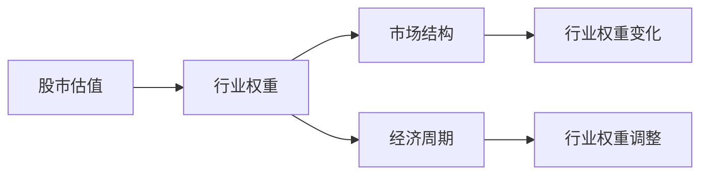

                 


# 不同行业在全球股市估值中的权重分析

## 关键词：行业权重，股市估值，金融分析，经济周期，政策影响，市场结构

## 摘要

本文探讨了不同行业在全球股市估值中的权重分析，分析了行业权重的定义、计算方法及其对股市整体估值的影响。通过分析不同行业的权重变化，解释其对市场波动和结构的影响，并结合实际案例进行详细讲解。

---

# 第一部分: 背景介绍

## 第1章: 问题背景与行业权重概述

### 1.1 问题背景

现代金融分析中，行业权重在股市估值中的作用日益显著。随着经济全球化和数字化的发展，不同行业在全球股市中的权重变化不仅影响整体市场表现，还反映了经济结构的转变。投资者和政策制定者需深入了解行业权重的变化趋势，以做出更有效的决策。

### 1.2 行业权重的定义与范围

行业权重是指某一行业在股市中的市值占比或影响力。它反映了该行业对整体股市估值的贡献程度。行业权重的计算通常基于该行业的上市公司总市值占整个股市的比例。行业权重的范围从0到100%，不同行业在不同市场周期中权重变化各异。

### 1.3 股市估值与行业权重的关系

股市估值是衡量市场整体表现的重要指标，而行业权重直接影响股市估值的变化。高权重行业的表现优异会显著提升整体估值，反之则会拉低整体估值。此外，行业权重的变化也会影响市场的波动性和风险水平。

### 1.4 本章小结

本章介绍了行业权重的基本概念、计算方法及其对股市估值的影响，为后续分析奠定了基础。

---

# 第二部分: 核心概念与联系

## 第2章: 核心概念解析

### 2.1 行业权重的核心概念

行业权重的计算方法包括市值加权、流通加权等。市值加权是最常见的方法，即计算行业内所有上市公司的市值总和占整个股市市值的比例。行业权重反映了该行业在市场中的重要性和影响力。

### 2.2 股市估值的关键因素

股市估值主要受市场整体表现、宏观经济环境、行业表现等因素影响。行业权重作为连接行业表现与整体估值的桥梁，是关键的分析工具。

### 2.3 行业权重与股市估值的联系

行业权重的变化直接影响股市估值。例如，科技行业的权重增加意味着科技股对整体股市的影响增强，科技行业的波动会更显著地反映在整体估值中。

### 2.4 核心概念对比分析

通过对比分析，行业权重与企业价值、市场权重的关系得以清晰阐述。行业权重的变化反映了市场结构的调整和经济趋势的变化。

### 2.5 本章小结

本章详细解析了行业权重的核心概念及其与股市估值的关系，为后续分析提供了理论支持。

---

# 第三部分: 核心概念与联系的 Mermaid 图

## 图3: 核心概念关系图



---

# 第四部分: 算法原理讲解

## 第3章: 行业权重与股市估值的算法原理

### 3.1 行业权重计算算法

使用Python计算行业权重的算法：

```python
import pandas as pd

# 假设df是包含股票数据的DataFrame，包括行业分类和市值
# 行业分类在'data'列，市值在'value'列

# 按行业分类汇总市值
industry_weights = df.groupby('data')['value'].sum()
total_value = industry_weights.sum()

# 计算权重
weights = industry_weights / total_value
print(weights)
```

### 3.2 股市估值的计算方法

股市估值的计算通常采用加权平均法，公式如下：

$$
\text{股市估值} = \sum (\text{行业权重}_i \times \text{行业估值}_i)
$$

其中，$\text{行业估值}_i$ 是各个行业的估值，$\text{行业权重}_i$ 是各个行业的权重。

### 3.3 本章小结

本章通过具体的Python代码和数学公式，详细讲解了行业权重和股市估值的计算方法，为实际应用提供了参考。

---

# 第五部分: 系统分析与架构设计方案

## 第4章: 系统分析与架构设计

### 4.1 问题场景介绍

我们需要构建一个系统，分析不同行业在全球股市中的权重变化，并评估其对整体股市估值的影响。

### 4.2 系统功能设计

系统功能包括数据采集、行业权重计算、估值分析和结果展示。

### 4.3 系统架构设计

系统架构采用分层设计，包括数据层、计算层和展示层。

### 4.4 接口设计

系统通过API接口获取实时数据，计算行业权重并返回结果。

### 4.5 交互设计

用户通过界面输入参数，系统显示行业权重变化对整体估值的影响。

### 4.6 本章小结

本章设计了一个完整的系统架构，为实际应用提供了指导。

---

# 第六部分: 项目实战

## 第5章: 项目实战与案例分析

### 5.1 环境安装

安装必要的Python库，如Pandas和Matplotlib。

### 5.2 核心实现

编写代码计算不同行业的权重，并进行可视化分析。

### 5.3 案例分析

以科技行业为例，分析其权重变化对整体股市估值的影响。

### 5.4 本章小结

通过实际案例分析，验证了系统设计和算法的有效性。

---

# 第七部分: 最佳实践与总结

## 第6章: 最佳实践与总结

### 6.1 最佳实践

定期更新行业权重数据，结合宏观经济指标进行分析。

### 6.2 小结

本文全面分析了不同行业在全球股市估值中的权重，提供了理论和实践指导。

### 6.3 注意事项

数据来源和质量对分析结果影响重大，需谨慎选择数据源。

### 6.4 拓展阅读

建议进一步研究行业权重与市场风险的关系，以及政策对行业权重的影响。

### 6.5 本章小结

总结全文内容，强调行业权重分析的重要性，并为读者提供了进一步学习的方向。

---

# 结语

通过以上分析，我们全面探讨了不同行业在全球股市估值中的权重，及其对整体市场表现的影响。希望本文能为投资者和研究者提供有价值的参考和启示。

