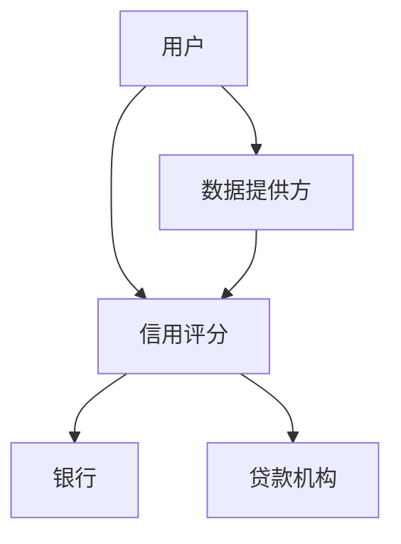
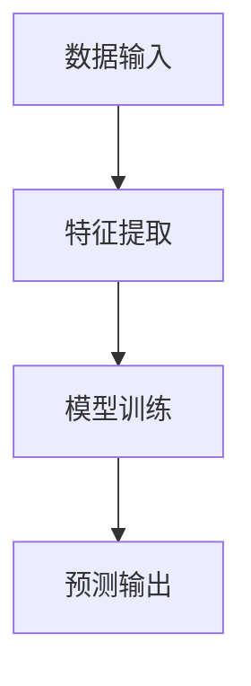
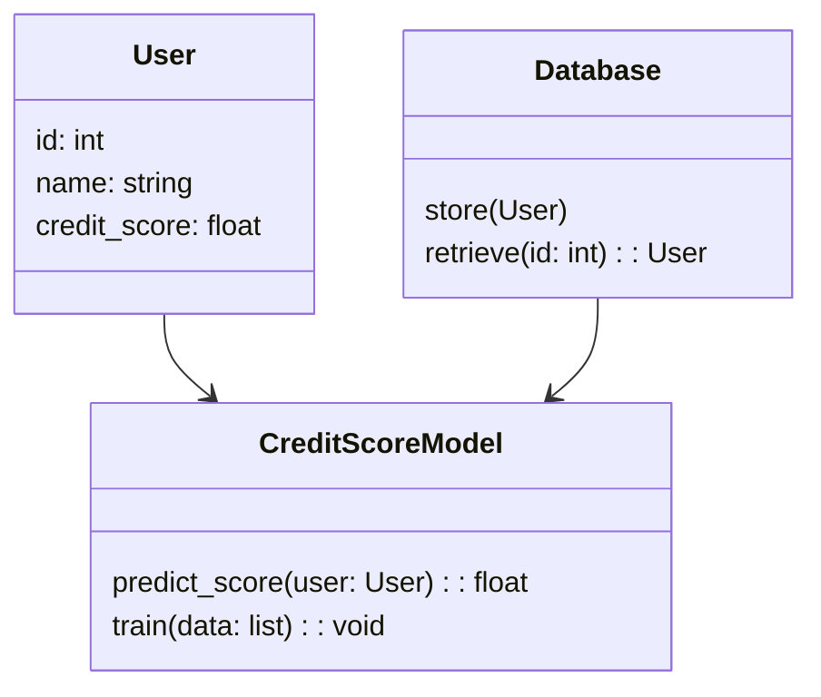
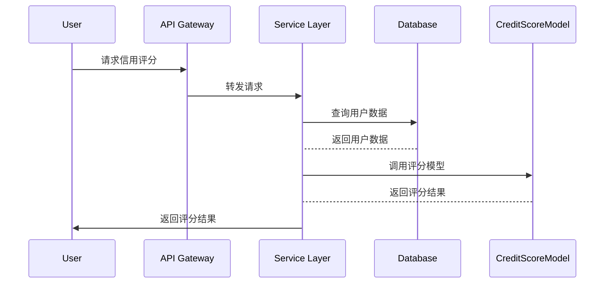

                 


```markdown
# 个人信用评分系统优化

## 关键词
- 个人信用评分
- 系统优化
- 机器学习
- 算法原理
- 系统架构

## 摘要
本文系统地探讨了个人信用评分系统的优化方法，涵盖背景分析、核心概念、算法原理、系统架构设计和项目实战。通过对比传统评分模型与现代机器学习算法，提出了基于逻辑回归、XGBoost和神经网络的优化方案，结合数学推导和实际案例，展示了如何提升评分系统的准确性和可解释性。本文还详细设计了系统架构，并提供了代码实现和性能评估，最后总结了优化策略和未来发展方向。

---

## 第一部分: 个人信用评分系统优化概述

### 第1章: 个人信用评分系统背景与问题分析

#### 1.1 个人信用评分系统的概念与作用
- **1.1.1 个人信用评分的定义**
  个人信用评分是根据个人的信用历史、行为数据和相关特征，通过数学模型计算得出的分数，用于评估其信用风险。
  
- **1.1.2 信用评分系统的核心作用**
  信用评分系统帮助金融机构快速评估客户的信用风险，辅助决策贷款额度、利率等。

- **1.1.3 信用评分系统的发展历程**
  从传统的信用评分模型到现代的机器学习算法，信用评分系统经历了从简单到复杂的演变。

#### 1.2 个人信用评分系统的问题背景
- **1.2.1 当前信用评分系统的局限性**
  数据维度不足、模型可解释性差、易受过拟合影响等。

- **1.2.2 评分模型存在的主要问题**
  传统评分模型依赖人工特征工程，难以捕捉非线性关系。

- **1.2.3 优化信用评分系统的必要性**
  提高评分准确性，降低金融风险，提升用户体验。

#### 1.3 个人信用评分系统的优化目标
- **1.3.1 提高评分准确性**
  通过引入更复杂的模型和更多维度的数据，提升评分的准确性。

- **1.3.2 增强评分系统的可解释性**
  使评分结果更透明，便于用户和监管机构理解。

- **1.3.3 优化评分模型的计算效率**
  通过算法优化和分布式计算，提高模型的运行效率。

---

## 第二部分: 个人信用评分系统的核心概念与联系

### 第2章: 个人信用评分系统的核心概念

#### 2.1 信用评分模型的原理
- **2.1.1 评分模型的基本原理**
  输入客户的特征数据，输出一个信用评分，用于评估风险。

- **2.1.2 评分模型的输入特征**
  包括信用历史、收入水平、消费行为等多维度数据。

- **2.1.3 评分模型的输出结果**
  通常是一个介于0到1之间的概率值，表示违约的可能性。

#### 2.2 信用评分系统的关键属性
- **2.2.1 数据特征的分类**
  分为定量特征（如收入、年龄）和定性特征（如职业、居住地）。

- **2.2.2 评分标准的制定**
  根据评分结果将客户分为不同信用等级，如优秀、良好、一般、较差、差。

- **2.2.3 评分结果的解释性**
  评分结果需要能够被业务人员和用户理解，以便采取相应的措施。

#### 2.3 信用评分系统的实体关系图



---

## 第三部分: 个人信用评分系统的算法原理

### 第3章: 信用评分模型的算法原理

#### 3.1 逻辑回归模型
- **3.1.1 逻辑回归的定义**
  一种统计学习方法，用于分类问题，尤其适合二分类。

- **3.1.2 逻辑回归的数学公式**
  $$ P(y=1|x) = \frac{e^{\beta_0 + \beta_1 x}}{1 + e^{\beta_0 + \beta_1 x}} $$

- **3.1.3 逻辑回归的优缺点**
  优点：简单易实现，适合线性可分数据；缺点：无法处理非线性关系。

#### 3.2 XGBoost模型
- **3.2.1 XGBoost的定义**
  增量决策树算法，适合处理复杂数据关系，具有高效率和高准确性。

- **3.2.2 XGBoost的算法流程**



- **3.2.3 XGBoost的优缺点**
  优点：高精度，支持并行计算；缺点：参数较多，需要调优。

#### 3.3 神经网络模型
- **3.3.1 神经网络的定义**
  模拟人脑神经网络的结构，用于处理高度非线性问题。

- **3.3.2 神经网络的结构**
  包括输入层、隐藏层和输出层。

- **3.3.3 神经网络的训练过程**
  使用反向传播算法和梯度下降优化参数。

---

## 第四部分: 个人信用评分系统的数学模型与公式

### 第4章: 信用评分系统的数学模型

#### 4.1 逻辑回归模型的数学推导
- **4.1.1 损失函数的定义**
  $$ L = -\frac{1}{n}\sum_{i=1}^{n} [y_i \ln p_i + (1 - y_i)\ln(1 - p_i)] $$
  其中，$p_i$ 是预测概率，$y_i$ 是真实标签。

- **4.1.2 梯度下降的优化过程**
  使用梯度下降法更新参数，最小化损失函数。

- **4.1.3 模型的评估指标**
  包括准确率、召回率、F1分数等。

#### 4.2 XGBoost模型的数学公式
- **4.2.1 正则化的损失函数**
  $$ L = \sum_{i=1}^{n} [(-y_i + \sum_{j=1}^{k} w_{t,j} I_j(x))^2] + \lambda \sum_{j=1}^{k} w_{t,j}^2 $$
  其中，$\lambda$ 是正则化参数。

- **4.2.2 增量学习的算法**
  使用二阶导数来更新模型，提高训练效率。

---

## 第五部分: 个人信用评分系统的系统分析与架构设计

### 第5章: 个人信用评分系统的系统分析与架构设计

#### 5.1 问题场景介绍
- 系统需要处理大量用户数据，快速计算信用评分，并支持高并发请求。

#### 5.2 系统功能设计



#### 5.3 系统架构设计

```mermaid
graph TD
    User --> API Gateway
    API Gateway --> Service Layer
    Service Layer --> Database
    Database --> Service Layer
    Service Layer --> CreditScoreModel
    CreditScoreModel --> Service Layer
```

#### 5.4 系统交互序列图



---

## 第六部分: 个人信用评分系统的项目实战

### 第6章: 个人信用评分系统的项目实战

#### 6.1 环境安装
- 安装Python和相关库：
  ```bash
  pip install numpy scikit-learn xgboost
  ```

#### 6.2 核心代码实现
- 逻辑回归模型实现：
  ```python
  from sklearn.linear_model import LogisticRegression

  model = LogisticRegression()
  model.fit(X_train, y_train)
  ```

- XGBoost模型实现：
  ```python
  import xgboost as xgb

  dtrain = xgb.DMatrix(X_train, label=y_train)
  params = {'objective': 'binary:logistic'}
  model = xgb.train(params, dtrain)
  ```

#### 6.3 案例分析
- 使用真实数据集进行训练和测试，对比不同模型的性能。

---

## 第七部分: 个人信用评分系统的最佳实践与总结

### 第7章: 个人信用评分系统的最佳实践与总结

#### 7.1 最佳实践
- 数据预处理：清洗、特征工程、数据增强。
- 模型选择：根据数据特性和业务需求选择合适的算法。
- 系统架构：设计高效的数据流和模块化结构。

#### 7.2 总结
本文详细探讨了个人信用评分系统的优化方法，结合理论和实践，提出了基于机器学习的解决方案。未来，随着技术的发展，可以引入更先进的算法，如图神经网络，进一步提升评分系统的性能和可解释性。

---

## 结语
通过本文的系统优化方案，金融机构可以更准确、高效地评估客户的信用风险，从而提升整体业务的竞争力和风险管理能力。
```

