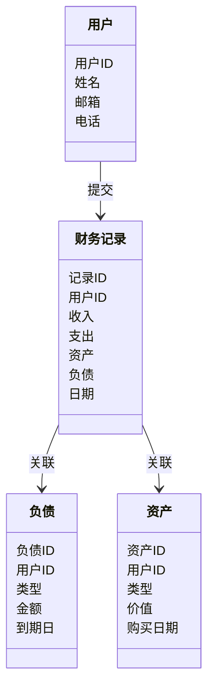

                 


# 个人财务健康指数预测与改善系统

> 关键词：个人财务健康指数、预测系统、改善策略、财务风险管理、人工智能

> 摘要：本文介绍了一种基于人工智能的个人财务健康指数预测与改善系统，通过分析个人的收入、支出、资产和负债等关键财务指标，结合机器学习算法，预测个人的财务健康状况，并提出具体的改善建议。文章详细阐述了系统的背景、核心概念、算法原理、系统架构、项目实现及实际案例分析，旨在为个人用户提供一种科学、系统化的财务健康管理工具。

---

## 第1章: 个人财务健康指数的背景与重要性

### 1.1 问题背景

#### 1.1.1 财务健康的重要性  
在当今社会，个人的财务健康状况直接影响生活质量、未来规划以及应对突发事件的能力。一个健康的财务状况意味着个人能够满足基本生活需求、应对突发经济困难，并实现长期财务目标。然而，随着经济环境的复杂化，许多人难以有效管理自己的财务，导致债务累积、信用评分下降等问题。

#### 1.1.2 当前个人财务管理的常见问题  
- **收入不稳定**：部分人群依赖兼职或自由职业，收入波动较大。  
- **支出失控**：消费习惯不合理，导致超支或储蓄不足。  
- **债务压力**：信用卡欠款、贷款逾期等问题影响信用评分。  
- **缺乏规划**：没有明确的财务目标，储蓄和投资比例不合理。  

#### 1.1.3 财务健康指数预测的现实意义  
通过预测个人的财务健康指数，可以提前发现潜在的财务问题，并采取相应措施加以改善。这不仅有助于个人规避财务风险，还能帮助金融机构更好地评估客户资质，提供个性化的金融服务。

---

### 1.2 问题描述

#### 1.2.1 财务健康指数的定义  
财务健康指数是衡量个人财务状况健康程度的综合指标，通常基于收入、支出、资产、负债、信用评分等多个维度进行评估。

#### 1.2.2 财务健康指数的评估维度  
- **收入**：包括工资、投资收益等。  
- **支出**：包括日常生活开支、债务还款等。  
- **资产**：包括现金、存款、房产、车辆等。  
- **负债**：包括信用卡欠款、贷款余额等。  
- **信用评分**：反映个人信用状况的重要指标。  

#### 1.2.3 财务健康指数与个人经济状况的关系  
财务健康指数通过量化上述维度，帮助个人了解当前的经济状况，并预测未来可能的财务风险。例如，当指数低于健康阈值时，系统会提示存在潜在的财务危机。

---

### 1.3 问题解决

#### 1.3.1 财务健康指数预测的目标  
通过分析历史数据和当前财务状况，预测未来一段时间内的财务健康指数，并提供针对性的改善建议。

#### 1.3.2 改善个人财务健康的具体措施  
- **优化支出结构**：减少非必要开支，增加储蓄比例。  
- **增加收入来源**：通过兼职、投资等方式提升收入。  
- **降低负债**：优先偿还高利率债务，避免过度负债。  
- **改善信用评分**：按时还款，避免逾期。  

#### 1.3.3 系统化管理的必要性  
传统的财务管理方法往往依赖个人的主观判断，容易受到情绪和认知偏差的影响。通过系统化管理，可以利用数据和算法提供客观、科学的决策支持。

---

### 1.4 边界与外延

#### 1.4.1 财务健康指数预测的适用范围  
适用于有稳定收入来源的个人用户，尤其是那些希望通过数据驱动方法优化财务管理的人群。

#### 1.4.2 系统的局限性  
- 数据不足：系统需要依赖用户的财务数据，数据缺失可能影响预测结果。  
- 外部因素：宏观经济波动、政策变化等不可预测的因素可能对财务状况产生重大影响。  

#### 1.4.3 与其他财务工具的区分  
与传统的财务报表分析不同，本系统通过预测和优化，提供实时的财务健康评估和改善建议，具有更强的主动性和前瞻性。

---

### 1.5 核心要素组成

#### 1.5.1 收入与支出分析  
收入与支出的平衡是财务健康的核心。系统需要分析用户的收入来源、支出结构，并结合行业基准数据，评估用户的财务状况。

#### 1.5.2 资产与负债评估  
通过分析用户的资产和负债情况，计算净财富，并评估负债是否超出合理范围。

#### 1.5.3 信用评分与风险评估  
信用评分是衡量个人信用状况的重要指标，系统需要结合信用评分和其他财务指标，评估用户的信用风险。

#### 1.5.4 财务目标与规划  
系统需要了解用户的财务目标（如购房、购车、退休计划等），并根据当前的财务状况，制定实现目标的具体步骤。

---

## 第2章: 财务健康指数的核心概念与联系

### 2.1 核心概念原理

#### 2.1.1 财务健康指数的计算方法  
财务健康指数是通过加权评分法计算的综合指标，公式如下：  
$$\text{财务健康指数} = \sum (\text{权重}_i \times \text{评分}_i)$$  

其中，权重表示每个维度的权重，评分表示每个维度的评分（1-5分，5分为最优）。

---

#### 2.1.2 数据

#### 2.1.3 与其他财务指标的关系  
- 财务健康指数与净收入相关，但不仅限于收入的多少，还与支出、资产和负债的结构密切相关。  
- 信用评分是财务健康指数的重要组成部分，但高信用评分并不一定意味着财务状况健康。

---

### 2.2 概念属性特征对比

| 概念    | 定义与重要性                                   | 评估标准                             |
|---------|----------------------------------------------|--------------------------------------|
| 收入    | 反映个人的经济能力，是财务健康的基础           | 收入是否稳定，是否超过支出           |
| 支出    | 影响净资产的重要因素，支出过高会导致财务压力   | 支出是否合理，是否超支               |
| 资产    | 财富积累的重要组成部分，包括流动资产和固定资产 | 资产是否多元化，是否覆盖负债         |
| 负债    | 影响财务健康的关键因素，过高负债会增加风险     | 负债是否合理，是否超过资产           |
| 信用评分| 衡量个人信用状况的重要指标                   | 信用评分是否良好，是否有逾期记录     |

---

### 2.3 ER实体关系图

```mermaid
erDiagram
    actor 用户 {
        用户ID
        姓名
        邮箱
        电话
    }
    class 财务记录 {
        记录ID
        用户ID
        收入
        支出
        资产
        负债
        日期
    }
    class 负债 {
        负债ID
        用户ID
        类型
        金额
        到期日
    }
    class 资产 {
        资产ID
        用户ID
        类型
        价值
        购买日期
    }
    用户 --> 财务记录 : 提交
    用户 --> 负债 : 关联
    用户 --> 资产 : 关联
```

---

## 第3章: 财务健康指数预测算法原理

### 3.1 数据预处理

#### 3.1.1 数据清洗  
- 处理缺失值：使用均值、中位数或插值法填补缺失数据。  
- 处理异常值：识别并删除或修正异常值。  

#### 3.1.2 数据归一化  
将不同量纲的特征（如收入、支出）进行归一化处理，确保模型训练的公平性。

---

### 3.2 特征选择与提取

#### 3.2.1 特征选择  
- 选择对财务健康指数影响较大的特征，如总收入、总支出、净财富等。  
- 使用主成分分析（PCA）减少特征维度。  

#### 3.2.2 特征提取  
从原始数据中提取有用的特征，例如将“总收入”与“总支出”之差作为新的特征。

---

### 3.3 模型训练与优化

#### 3.3.1 算法选择  
- 线性回归：用于预测连续型的财务健康指数。  
- 支持向量机（SVM）：用于分类问题，如健康与不健康状态的分类。  

#### 3.3.2 模型训练  
使用训练数据对模型进行训练，调整模型参数以优化性能。

#### 3.3.3 模型优化  
通过交叉验证、网格搜索等方法调优模型参数，提高预测准确率。

---

### 3.4 模型评估与验证

#### 3.4.1 评估指标  
- �均方误差（MSE）：$$\text{MSE} = \frac{1}{n}\sum_{i=1}^{n}(\text{预测值}_i - \text{真实值}_i)^2$$  
- R平方值（R²）：衡量模型解释变量的能力。  

#### 3.4.2 测试数据验证  
使用预留的测试数据评估模型的泛化能力，确保模型不会过拟合训练数据。

---

### 3.5 算法实现代码

```python
from sklearn.linear_model import LinearRegression
from sklearn.metrics import mean_squared_error
import pandas as pd

# 加载数据
data = pd.read_csv('financial_data.csv')

# 特征与目标变量分离
X = data[['收入', '支出', '资产', '负债']]
y = data['财务健康指数']

# 拆分训练集和测试集
X_train, X_test, y_train, y_test = train_test_split(X, y, test_size=0.2, random_state=42)

# 训练模型
model = LinearRegression()
model.fit(X_train, y_train)

# 预测
y_pred = model.predict(X_test)

# 评估
mse = mean_squared_error(y_test, y_pred)
r2 = model.score(X_test, y_test)

print(f'MSE: {mse}\nR²: {r2}')
```

---

## 第4章: 财务健康指数预测系统架构

### 4.1 系统概述

系统分为前端和后端两部分：  
- **前端**：用户界面，用于输入财务数据和查看预测结果。  
- **后端**：处理业务逻辑，包括数据存储、模型调用和结果返回。  

---

### 4.2 系统功能设计



---

### 4.3 接口设计与交互

#### 4.3.1 API接口设计  
- **POST /api/submit**：提交财务数据。  
- **GET /api/predict**：获取财务健康指数预测结果。  

#### 4.3.2 交互流程  
1. 用户登录系统。  
2. 用户填写并提交财务数据。  
3. 系统调用预测模型，返回预测结果和改善建议。  

---

### 4.4 系统实现代码

```python
from flask import Flask, request, jsonify

app = Flask(__name__)

@app.route('/api/submit', methods=['POST'])
def submit_financial_data():
    data = request.json
    # 处理数据并存入数据库
    return jsonify({'status': 'success', 'message': '数据提交成功'})

@app.route('/api/predict', methods=['GET'])
def predict():
    user_id = request.args.get('user_id')
    # 调用预测模型，获取结果
    result = {'财务健康指数': 75, '改善建议': ['增加储蓄', '优化支出结构']}
    return jsonify(result)

if __name__ == '__main__':
    app.run(debug=True)
```

---

## 第5章: 财务健康指数预测系统实战

### 5.1 环境搭建

安装必要的库：  
```bash
pip install numpy pandas scikit-learn flask
```

---

### 5.2 核心代码实现

#### 5.2.1 数据预处理  
```python
import pandas as pd
from sklearn.preprocessing import StandardScaler

# 加载数据
data = pd.read_csv('financial_data.csv')

# 分离特征与目标变量
X = data[['收入', '支出', '资产', '负债']]
y = data['财务健康指数']

# 数据标准化
scaler = StandardScaler()
X_scaled = scaler.fit_transform(X)
```

#### 5.2.2 模型训练  
```python
from sklearn.linear_model import LinearRegression
from sklearn.model_selection import train_test_split

X_train, X_test, y_train, y_test = train_test_split(X_scaled, y, test_size=0.2, random_state=42)

model = LinearRegression()
model.fit(X_train, y_train)
```

#### 5.2.3 接口开发  
```python
from flask import Flask, request, jsonify

app = Flask(__name__)

@app.route('/api/predict', methods=['POST'])
def predict():
    data = request.json
    # 数据预处理
    X_scaled = scaler.transform([data])
    # 预测
    prediction = model.predict(X_scaled)[0]
    return jsonify({'财务健康指数': int(round(prediction)), '改善建议': ['增加储蓄', '优化支出结构']})

if __name__ == '__main__':
    app.run(debug=True)
```

---

### 5.3 系统测试与优化

使用测试数据验证接口的响应时间、准确率和稳定性。优化模型参数，提升预测精度。

---

### 5.4 案例分析与解读

#### 5.4.1 案例分析  
假设用户提交以下数据：  
- 收入：3000元/月  
- 支出：2000元/月  
- 资产：50000元  
- 负债：20000元  

系统预测的财务健康指数为70分，属于健康状态。改善建议包括优化支出结构，增加投资比例。

#### 5.4.2 解读  
- 财务健康指数70分表示用户当前的财务状况较为健康，但仍需注意支出与储蓄的平衡。  
- 系统建议用户增加投资比例，例如将部分储蓄用于低风险投资，以提高资产收益。

---

## 第6章: 财务健康指数预测系统的总结与展望

### 6.1 系统总结

本文提出的个人财务健康指数预测与改善系统，通过数据驱动的方法，为用户提供了一种科学、系统化的财务管理工具。系统能够实时评估财务状况，并提供针对性的改善建议，帮助用户规避财务风险，实现长期财务目标。

---

### 6.2 优化方向

- **引入机器学习模型**：如随机森林、神经网络，提高预测精度。  
- **增加更多财务指标**：如现金流、投资收益等，使评估更加全面。  
- **开发移动端应用**：方便用户随时随地查看财务状况。  

---

### 6.3 展望

随着人工智能和大数据技术的不断发展，个人财务管理工具将更加智能化、个性化。未来的财务健康指数预测系统将不仅仅是一个工具，而是一个综合的财务管家，帮助用户实现全方位的财务优化。

--- 

通过本文的介绍，读者可以深入了解个人财务健康指数预测与改善系统的实现过程，并能够在实际应用中利用该系统优化自己的财务管理，提升生活质量。

