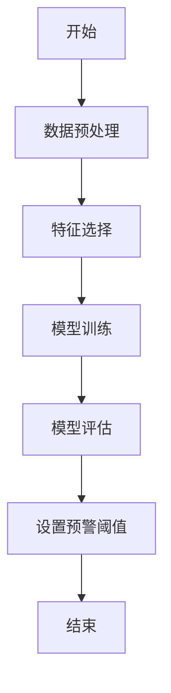
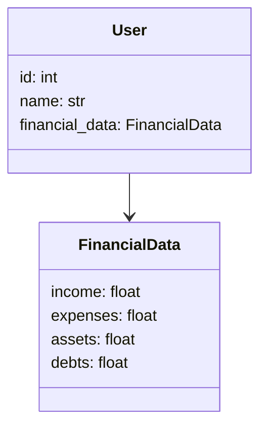

                 


# 个人财务健康预警与干预系统

> 关键词：个人财务健康，预警系统，干预措施，机器学习，系统设计

> 摘要：本文系统性地探讨了个人财务健康预警与干预系统的构建，从问题背景、核心概念到算法原理、系统架构，再到项目实战，全面解析了如何通过技术手段实现对个人财务健康的智能监控与管理。文章深入浅出，结合实际案例和代码实现，为读者提供了一套完整的解决方案，旨在帮助个人有效管理财务健康，预防财务风险。

---

## 第一部分：个人财务健康预警与干预系统概述

### 第1章：个人财务健康预警与干预系统背景介绍

#### 1.1 问题背景

随着经济的发展和生活水平的提高，个人财务管理变得越来越复杂。许多人由于缺乏对财务状况的实时监控和有效管理，容易陷入财务困境，如过度负债、资产配置不当等问题。这些问题不仅影响个人生活质量，还可能导致更大的经济危机。

**问题成因分析：**

- **消费习惯不佳**：冲动消费、缺乏预算规划。
- **收入与支出失衡**：收入不足以覆盖必要支出，导致债务累积。
- **风险管理不足**：缺乏对突发事件的财务准备，如失业、疾病等。

**问题影响：**

- 影响个人信用记录，限制未来融资。
- 影响家庭经济稳定，降低生活质量。
- 可能引发更大的经济危机，如破产。

#### 1.2 问题描述

个人财务健康预警与干预系统的核心目标是通过实时监控和分析个人的财务数据，识别潜在的财务风险，并提供相应的干预措施，帮助用户维持或改善财务状况。

**财务健康的核心指标：**

- 收支平衡：月收入是否覆盖月支出。
- 资产负债比：资产总额与负债总额的比率。
- 储蓄率：每月储蓄占收入的比例。
- 偿债能力：能否按时偿还债务。

#### 1.3 问题解决

**系统设计目标：**

- 实时监控：及时发现财务问题。
- 智能预警：通过算法分析潜在风险。
- 自动干预：提供个性化建议，帮助用户调整财务行为。

**系统实现路径：**

1. 数据采集：获取用户的收入、支出、资产、负债等数据。
2. 数据分析：通过机器学习模型评估财务健康状况。
3. 预警触发：当检测到潜在风险时，触发预警机制。
4. 干预措施：根据预警结果，提供具体的财务调整建议。

#### 1.4 系统的边界与外延

**功能边界：**

- 仅关注个人财务健康，不涉及企业或机构财务。
- 专注于预警和干预，不处理实际的财务交易。

**适用范围：**

- 适用于有稳定收入来源的个人用户。
- 适用于希望通过技术手段管理财务的用户。

**与外部环境的交互：**

- 数据来源：银行账户、信用报告、交易记录等。
- 用户反馈：用户对系统建议的响应情况。

---

## 第二部分：核心概念与联系

### 第2章：系统核心概念与联系

#### 2.1 核心概念原理

**财务健康评估模型：**

- 通过多维度指标评估用户的财务状况，如收支平衡、资产配置、债务负担等。
- 使用加权评分法，将各指标赋予不同的权重，计算综合评分。

**预警机制：**

- 基于机器学习算法，分析用户的历史数据，预测未来可能出现的财务问题。
- 设置不同的预警级别，根据风险程度提醒用户。

**干预措施：**

- 根据预警结果，提供具体的财务调整建议，如增加收入、减少支出、优化资产配置等。

#### 2.2 核心概念属性特征对比

**表格：财务健康评估指标对比**

| 指标 | 类型 | 描述 | 权重 |
|------|------|------|------|
| 收支平衡 | 数值型 | 收入是否覆盖支出 | 30% |
| 资产负债比 | 比率型 | 资产与负债的比率 | 40% |
| 储蓄率 | 数值型 | 每月储蓄占收入比例 | 20% |
| 偿债能力 | 数值型 | 是否能按时偿还债务 | 10% |

---

## 第三部分：算法原理讲解

### 第3章：算法原理与实现

#### 3.1 算法原理

**数学模型：**

- 使用逻辑回归（Logistic Regression）进行分类，判断用户的财务健康状况。
- 模型公式：
  $$ P(y=1|x) = \frac{1}{1 + e^{-(\beta_0 + \beta_1x_1 + \beta_2x_2 + \dots + \beta_nx_n)}} $$
  其中，$y$ 是目标变量（财务健康状态），$x_i$ 是各特征变量。

**算法步骤：**

1. 数据预处理：清洗数据，处理缺失值和异常值。
2. 特征选择：选取影响财务健康的核心指标。
3. 模型训练：使用训练数据拟合逻辑回归模型。
4. 模型评估：通过准确率、召回率等指标评估模型性能。
5. 预警阈值设定：根据业务需求设定预警级别。

#### 3.2 算法流程图



#### 3.3 Python源代码实现

```python
import pandas as pd
from sklearn.linear_model import LogisticRegression
from sklearn.metrics import accuracy_score, recall_score

# 数据加载
data = pd.read_csv('financial_data.csv')

# 数据预处理
data = data.dropna()
data = pd.get_dummies(data)

# 特征选择
features = ['income', 'expenses', 'assets', 'debts']
target = 'financial_health'

X = data[features]
y = data[target]

# 模型训练
model = LogisticRegression()
model.fit(X, y)

# 模型评估
y_pred = model.predict(X)
print(f"准确率: {accuracy_score(y, y_pred)}")
print(f"召回率: {recall_score(y, y_pred)}")
```

---

## 第四部分：系统分析与架构设计

### 第4章：系统分析与架构设计

#### 4.1 项目背景与目标

**项目背景：**

随着个人财务管理需求的增加，开发一个智能的财务健康预警与干预系统成为必要。通过技术手段，帮助用户实时监控财务状况，预防财务风险。

**项目目标：**

- 实现对个人财务数据的实时监控。
- 提供智能预警和干预建议。
- 优化用户体验，使其易于使用。

#### 4.2 系统功能设计

**领域模型Mermaid类图：**



---

## 第五部分：项目实战

### 第5章：项目实战

#### 5.1 环境安装

**所需工具：**

- Python 3.8+
- Jupyter Notebook
- Pandas、Scikit-learn 等库

**安装命令：**

```bash
pip install pandas scikit-learn
```

#### 5.2 系统核心实现源代码

```python
import pandas as pd
from sklearn.linear_model import LogisticRegression
from sklearn.metrics import accuracy_score, recall_score

# 数据加载
data = pd.read_csv('financial_data.csv')

# 数据预处理
data = data.dropna()
data = pd.get_dummies(data)

# 特征选择
features = ['income', 'expenses', 'assets', 'debts']
target = 'financial_health'

X = data[features]
y = data[target]

# 模型训练
model = LogisticRegression()
model.fit(X, y)

# 模型评估
y_pred = model.predict(X)
print(f"准确率: {accuracy_score(y, y_pred)}")
print(f"召回率: {recall_score(y, y_pred)}")
```

---

## 第六部分：总结与展望

### 第6章：总结与展望

#### 6.1 最佳实践 Tips

- 数据来源的准确性是系统的关键，确保数据的真实性和完整性。
- 定期更新模型，适应用户的财务行为变化。
- 提供个性化的干预建议，满足不同用户的需求。

#### 6.2 小结

本文详细探讨了个人财务健康预警与干预系统的构建过程，从背景分析到算法实现，再到系统设计，为读者提供了一套完整的解决方案。通过技术手段，帮助个人有效管理财务健康，预防财务风险。

#### 6.3 注意事项

- 保护用户隐私，确保数据安全。
- 系统的易用性，降低用户的使用门槛。
- 定期维护和更新系统，确保其有效性和稳定性。

#### 6.4 拓展阅读

- 探讨更复杂的算法，如随机森林、梯度提升树，提高模型的准确性。
- 研究用户的使用反馈，优化系统功能和用户体验。

---

通过本文的系统性分析，读者可以深入了解个人财务健康预警与干预系统的构建过程，并能够在实际应用中灵活运用这些技术手段，帮助个人实现财务健康的目标。

