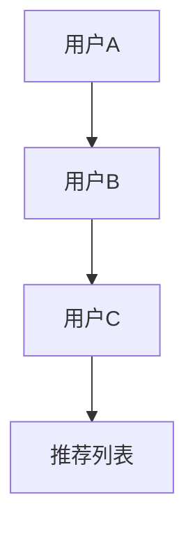
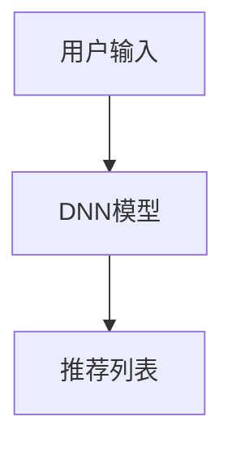
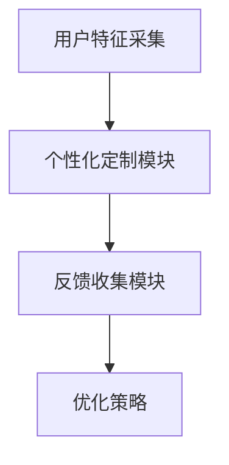

                 

# 个性化定制：根据用户特征调整AI Agent

## 关键词：个性化定制, AI Agent, 用户特征分析, 个性化推荐系统, 动态调整策略, 人工智能系统设计

## 摘要：个性化定制是根据用户的特征来调整AI Agent的行为和响应，以满足用户的个性化需求。本文将详细探讨个性化定制的核心概念、算法原理、系统架构设计以及项目实战，从背景、理论到实践，全面解析如何根据用户特征实现AI Agent的动态调整，为读者提供深入的技术指导和实践参考。

---

# 第一部分: 个性化定制与AI Agent的背景与基础

## 第1章: 个性化定制的核心概念

### 1.1 个性化定制的背景与问题背景

#### 1.1.1 从传统AI到个性化定制的演进
传统的AI Agent通常基于固定的规则和预设的逻辑进行操作，难以适应用户的个性化需求。随着大数据和机器学习技术的发展，AI Agent逐渐从“通用化”向“个性化”演进，能够根据用户的特征动态调整其行为和响应。

#### 1.1.2 用户特征分析的必要性
用户的特征（如兴趣、行为模式、偏好等）是个性化定制的基础。通过分析用户的特征，AI Agent可以更好地理解用户需求，提供更精准的服务。

#### 1.1.3 个性化定制的核心问题描述
个性化定制的核心问题是如何根据用户特征动态调整AI Agent的行为，使其能够更好地满足用户的个性化需求。这涉及用户特征的采集、分析、建模以及动态调整策略的设计。

---

### 1.2 用户特征分析与AI Agent的关系

#### 1.2.1 用户特征的定义与分类
用户特征可以分为显式特征（如用户输入、行为数据）和隐式特征（如兴趣、偏好）。AI Agent需要通过这些特征来推断用户的深层需求。

#### 1.2.2 用户特征在AI Agent中的应用
用户特征分析是个性化定制的核心，AI Agent通过分析这些特征来生成个性化推荐、动态调整交互策略等。

#### 1.2.3 个性化定制的边界与外延
个性化定制的边界在于如何在保护用户隐私的前提下，最大限度地利用用户特征。外延则包括从简单的基于规则的定制到复杂的基于机器学习的动态调整。

---

### 1.3 个性化定制的核心要素组成

#### 1.3.1 用户特征的构成
用户特征包括用户的基本信息（如年龄、性别）、行为数据（如点击、购买记录）以及上下文信息（如时间、地点）。

#### 1.3.2 AI Agent的核心功能
AI Agent的核心功能包括数据采集、特征分析、决策推理和动态调整。

#### 1.3.3 个性化定制的实现机制
个性化定制的实现机制包括基于规则的定制、基于推荐系统的定制以及基于强化学习的动态调整。

---

## 第2章: 个性化定制的必要性与价值

### 2.1 个性化定制的必要性

#### 2.1.1 用户需求的多样性
用户的需求具有多样性，传统的通用化AI无法满足所有用户的需求。

#### 2.1.2 传统AI Agent的局限性
传统AI Agent难以处理复杂的个性化需求，容易导致用户体验差。

#### 2.1.3 个性化定制的商业价值
个性化定制能够提高用户体验，增强用户粘性，为企业创造更大的商业价值。

---

### 2.2 个性化定制的核心优势

#### 2.2.1 提高用户体验
个性化定制能够根据用户的特征提供更精准的服务，提升用户体验。

#### 2.2.2 增强AI Agent的适应性
个性化定制使AI Agent能够更好地适应用户的个性化需求，增强其灵活性和适应性。

#### 2.2.3 个性化定制的效率提升
个性化定制能够通过分析用户特征，优化AI Agent的行为，提高服务效率。

---

### 2.3 个性化定制的实现路径

#### 2.3.1 数据驱动的个性化
通过收集和分析用户数据，构建用户特征模型，实现个性化定制。

#### 2.3.2 模型驱动的个性化
利用机器学习模型（如推荐系统、自然语言处理模型）进行个性化预测和调整。

#### 2.3.3 结合用户反馈的动态调整
通过实时收集用户的反馈，动态调整AI Agent的行为，实现更精准的个性化服务。

---

# 第二部分: 个性化定制的算法原理

## 第3章: 推荐系统与个性化定制

### 3.1 推荐系统的背景与核心概念

#### 3.1.1 推荐系统的定义
推荐系统是一种基于用户特征和物品特征，向用户推荐相关内容的技术。

#### 3.1.2 推荐系统的分类
推荐系统可以分为协同过滤、基于内容的推荐、基于知识的推荐等。

---

### 3.2 基于协同过滤的推荐算法

#### 3.2.1 协同过滤的原理
协同过滤通过分析用户的行为数据，找到与当前用户行为相似的用户，推荐相似的物品。

#### 3.2.2 协同过滤的流程图

#### 3.2.3 协同过滤的数学模型
协同过滤的核心是计算用户之间的相似度，常用余弦相似度公式：
$$ \text{similarity}(u_1, u_2) = \frac{\sum_{i=1}^n (r_{u1,i} - \bar{r_{u1}})(r_{u2,i} - \bar{r_{u2}})}{\sqrt{\sum_{i=1}^n (r_{u1,i} - \bar{r_{u1}})^2} \sqrt{\sum_{i=1}^n (r_{u2,i} - \bar{r_{u2}})^2}}} $$

---

### 3.3 基于深度学习的推荐算法

#### 3.3.1 基于深度学习的推荐原理
深度学习推荐系统通过构建神经网络模型，自动提取用户特征，进行个性化推荐。

#### 3.3.2 基于深度学习的推荐流程图

#### 3.3.3 基于深度学习的推荐模型
深度学习推荐模型通常包括嵌入层、前馈网络层和输出层，具体模型可以根据需求进行调整。

---

## 第4章: 自然语言处理与个性化定制

### 4.1 自然语言处理的背景与核心概念

#### 4.1.1 自然语言处理的定义
自然语言处理（NLP）是研究如何让计算机理解和生成人类语言的技术。

#### 4.1.2 自然语言处理的核心任务
自然语言处理的核心任务包括文本分类、实体识别、情感分析等。

---

### 4.2 个性化定制在自然语言处理中的应用

#### 4.2.1 基于用户特征的文本生成
通过分析用户的特征，生成个性化的文本回复。

#### 4.2.2 基于上下文的动态调整
根据用户的上下文信息，动态调整NLP模型的输出。

#### 4.2.3 基于用户反馈的模型优化
通过用户的反馈，优化NLP模型，提高个性化定制的效果。

---

## 第5章: 强化学习与个性化定制

### 5.1 强化学习的背景与核心概念

#### 5.1.1 强化学习的定义
强化学习是一种通过智能体与环境交互，学习最优策略的技术。

#### 5.1.2 强化学习的核心概念
强化学习的核心概念包括状态、动作、奖励和策略。

---

### 5.2 强化学习在个性化定制中的应用

#### 5.2.1 动态调整策略
通过强化学习，动态调整AI Agent的行为策略。

#### 5.2.2 用户特征驱动的策略优化
根据用户特征，优化AI Agent的策略。

#### 5.2.3 实时反馈驱动的个性化
通过实时反馈，优化AI Agent的行为，实现更精准的个性化服务。

---

# 第三部分: 系统架构与项目实战

## 第6章: 系统架构设计

### 6.1 系统功能设计

#### 6.1.1 用户特征采集模块
负责采集用户的特征数据，包括显式特征和隐式特征。

#### 6.1.2 个性化定制模块
根据用户特征，动态调整AI Agent的行为和响应。

#### 6.1.3 反馈收集模块
收集用户的反馈，优化个性化定制策略。

---

### 6.2 系统架构设计

#### 6.2.1 微服务架构
采用微服务架构，将系统划分为多个独立的服务，方便管理和扩展。

#### 6.2.2 系统架构图

---

## 第7章: 项目实战

### 7.1 个性化推荐系统实战

#### 7.1.1 环境安装
安装必要的依赖库，如Python、TensorFlow、Keras等。

#### 7.1.2 核心代码实现
实现基于协同过滤的推荐系统，包括数据预处理、模型训练和推荐生成。

#### 7.1.3 案例分析
通过具体案例分析，展示个性化推荐系统的实现过程和效果。

---

### 7.2 动态调整策略实战

#### 7.2.1 环境安装
安装必要的依赖库，如Python、强化学习框架等。

#### 7.2.2 核心代码实现
实现基于强化学习的动态调整策略，包括状态定义、动作选择和奖励机制。

#### 7.2.3 案例分析
通过具体案例分析，展示动态调整策略的实现过程和效果。

---

# 第四部分: 总结与展望

## 第8章: 总结与展望

### 8.1 核心观点总结
个性化定制是根据用户特征动态调整AI Agent行为的核心技术，能够显著提升用户体验。

### 8.2 未来展望
未来，个性化定制将更加依赖于深度学习和强化学习技术，实现更智能、更精准的个性化服务。

---

通过以上内容，我们可以看到，个性化定制在AI Agent中的应用具有重要的理论和实践意义。从背景到算法，从系统设计到项目实战，我们全面解析了如何根据用户特征调整AI Agent的行为和响应。未来，随着技术的不断进步，个性化定制将为AI Agent带来更多的可能性。

