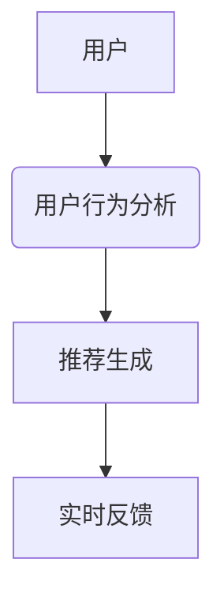
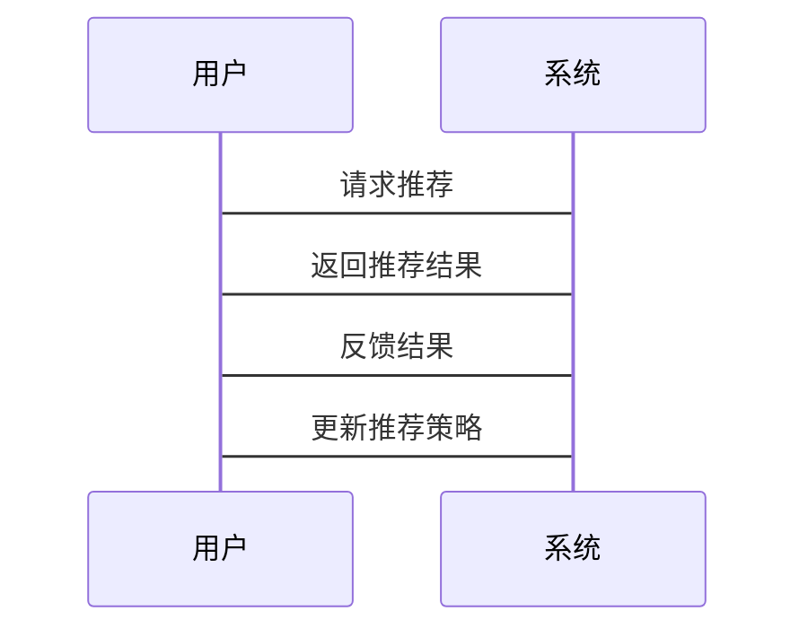

                 


# 个性化推荐 AI Agent：基于 LLM 的精准营销系统

> 关键词：个性化推荐，AI Agent，大语言模型（LLM），精准营销，推荐系统

> 摘要：本文深入探讨了个性化推荐 AI Agent 的概念、技术原理及其在精准营销中的应用。结合大语言模型（LLM）的核心原理，分析了基于 LLM 的推荐算法，并详细阐述了系统架构设计与项目实现过程，最后给出了实际案例分析与优化建议。

---

## 第1章: 个性化推荐与 AI Agent 的概念

### 1.1 个性化推荐的基本概念

#### 1.1.1 个性化推荐的定义与特点
个性化推荐是一种根据用户的行为、偏好和历史数据，为其提供定制化内容或产品的技术。其核心在于通过数据挖掘和机器学习算法，捕捉用户的潜在需求，并实时生成推荐结果。

#### 1.1.2 个性化推荐的核心要素
- **用户数据**：包括用户的点击、浏览、购买记录等。
- **物品数据**：包括商品的属性、描述、标签等。
- **推荐算法**：如协同过滤、基于内容的推荐、深度学习推荐等。

#### 1.1.3 个性化推荐的分类与应用场景
- **基于协同过滤的推荐**：根据用户行为相似性推荐。
- **基于内容的推荐**：根据商品内容相似性推荐。
- **混合推荐**：结合协同过滤和内容推荐的优点。

### 1.2 AI Agent 的基本概念

#### 1.2.1 AI Agent 的定义与特点
AI Agent 是一种能够感知环境、执行任务并做出决策的智能体。它通过与用户或系统的交互，主动理解需求并提供解决方案。

#### 1.2.2 AI Agent 的核心功能与优势
- **感知环境**：通过传感器或数据接口获取实时信息。
- **推理与决策**：基于历史数据和当前状态，做出最优决策。
- **执行任务**：通过调用外部服务或触发事件实现目标。

#### 1.2.3 AI Agent 与传统推荐系统的区别
- **主动性**：AI Agent 能主动发起请求，而传统推荐系统被动响应。
- **智能性**：AI Agent 具备学习和推理能力，推荐系统仅负责生成推荐列表。

### 1.3 基于 LLM 的精准营销系统

#### 1.3.1 LLM 在精准营销中的应用
大语言模型（LLM）通过处理自然语言文本，生成高度相关的营销内容。例如，根据用户的对话历史，生成个性化的推销文案。

#### 1.3.2 基于 LLM 的推荐系统的优势
- **语义理解**：LLM 能准确理解用户意图，生成更相关的推荐。
- **动态调整**：根据实时数据，快速调整推荐策略。
- **多模态支持**：支持文本、图像、视频等多种数据形式。

#### 1.3.3 精准营销系统的整体架构
精准营销系统结合了推荐算法和 AI Agent 的优势，通过实时数据分析和用户行为预测，实现精准的营销策略。

---

## 第2章: 大语言模型（LLM）的核心原理

### 2.1 大语言模型的定义与特点

#### 2.1.1 大语言模型的定义
大语言模型（LLM）是一种基于深度学习的自然语言处理模型，具有大规模参数和强大的上下文理解能力。

#### 2.1.2 大语言模型的核心技术
- **Transformer 架构**：采用自注意力机制，处理长文本。
- **预训练-微调模式**：通过大量数据预训练，针对特定任务进行微调。

#### 2.1.3 大语言模型与小语言模型的区别
- **计算能力**：LLM 具备更强的计算能力，能处理更复杂任务。
- **数据量**：LLM 使用了更大的训练数据集。
- **应用场景**：适用于需要高精度和高效率的任务。

### 2.2 大语言模型的训练与优化

#### 2.2.1 大语言模型的训练方法
- **自监督学习**：模型通过预测文本片段进行自我监督。
- **对抗训练**：通过生成器和判别器的对抗，提升生成质量。

#### 2.2.2 大语言模型的优化策略
- **参数调整**：通过调节学习率、批次大小等超参数优化模型。
- **剪枝与蒸馏**：通过模型剪枝和知识蒸馏，降低模型复杂度。

#### 2.2.3 大语言模型的评估指标
- **准确率**：生成文本的正确性。
- **BLEU**：基于词对对齐的评估指标。
- **ROUGE**：基于摘要质量的评估指标。

### 2.3 大语言模型的数学模型与公式

#### 2.3.1 大语言模型的数学模型
大语言模型的核心是 Transformer 模型，其基本公式如下：

$$
\text{Attention}(Q, K, V) = \text{softmax}\left(\frac{QK^T}{\sqrt{d_k}}\right)V
$$

其中，$Q$ 是查询向量，$K$ 是键向量，$V$ 是值向量。

#### 2.3.2 大语言模型的损失函数
交叉熵损失函数用于模型训练：

$$
\text{Loss} = -\sum_{i=1}^{n} \text{log}(P(y_i|x_i))
$$

其中，$P(y_i|x_i)$ 是模型对真实标签的概率预测。

---

## 第3章: 个性化推荐系统的算法原理

### 3.1 协同过滤算法

#### 3.1.1 协同过滤的定义与特点
协同过滤是一种基于用户相似性推荐算法，分为基于用户的协同过滤和基于物品的协同过滤。

#### 3.1.2 基于用户的协同过滤算法
计算用户之间的相似度，推荐相似用户的高评分商品。

#### 3.1.3 基于物品的协同过滤算法
计算商品之间的相似度，推荐与当前商品相似的其他商品。

### 3.2 基于内容的推荐算法

#### 3.2.1 基于内容的推荐定义
通过分析商品的内容特征，推荐与当前商品内容相似的商品。

#### 3.2.2 基于文本相似度的推荐算法
使用余弦相似度计算文本相似性。

#### 3.2.3 基于向量空间模型的推荐算法
将商品表示为向量，计算向量的相似度。

### 3.3 基于深度学习的推荐算法

#### 3.3.1 基于神经网络的推荐算法
通过神经网络提取数据的特征表示。

#### 3.3.2 基于注意力机制的推荐算法
借鉴 Transformer 的自注意力机制，捕捉数据中的重要特征。

#### 3.3.3 基于强化学习的推荐算法
通过强化学习优化推荐策略。

### 3.4 算法的优缺点对比

#### 3.4.1 协同过滤算法的优缺点
- **优点**：简单易实现，推荐准确率高。
- **缺点**：冷启动问题，计算复杂度高。

#### 3.4.2 基于内容的推荐算法的优缺点
- **优点**：适合内容丰富的场景，推荐结果解释性强。
- **缺点**：难以捕捉用户偏好变化，冷启动问题。

#### 3.4.3 基于深度学习的推荐算法的优缺点
- **优点**：能够处理高维数据，推荐结果精准。
- **缺点**：计算资源消耗大，模型训练复杂。

---

## 第4章: 精准营销系统的需求分析与架构设计

### 4.1 精准营销系统的需求分析

#### 4.1.1 系统目标与功能需求
- **目标**：实现基于 LLM 的个性化推荐，提升营销效果。
- **功能需求**：包括用户行为分析、推荐生成、实时反馈等。

#### 4.1.2 系统边界与外延
明确系统与外部系统的接口，例如数据源、用户界面等。

#### 4.1.3 系统的核心要素组成
- **用户数据**：用户的基本信息、行为数据。
- **商品数据**：商品的属性、描述、标签。
- **推荐算法**：协同过滤、内容推荐、深度学习推荐。

### 4.2 精准营销系统的架构设计

#### 4.2.1 系统功能设计
- **用户行为分析模块**：分析用户的点击、浏览、购买行为。
- **推荐生成模块**：基于 LLM 生成个性化推荐内容。
- **实时反馈模块**：根据用户反馈调整推荐策略。

#### 4.2.2 系统架构图
使用 Mermaid 绘制系统架构图：



#### 4.2.3 系统接口设计
- **API 接口**：提供 RESTful API，供前端调用。
- **数据接口**：与数据库、第三方服务对接。

#### 4.2.4 系统交互流程
使用 Mermaid 绘制交互流程图：



---

## 第5章: 个性化推荐 AI Agent 的实现与优化

### 5.1 环境安装与配置

#### 5.1.1 安装依赖
- **Python**：3.8+
- **TensorFlow**：2.0+
- **Keras**：2.2.5+
- **transformers**：4.10+

#### 5.1.2 配置开发环境
- 安装 Jupyter Notebook 或 VS Code 的 Python 扩展。

### 5.2 系统核心实现源代码

#### 5.2.1 推荐算法实现
以下是基于协同过滤的推荐算法实现：

```python
def user_based_recommendation(user_id, ratings, similarity_matrix):
    similar_users = similarity_matrix[user_id]
   推荐商品 = []
    for i in range(len(similar_users)):
        if similar_users[i] > 0.5:
           推荐商品.append(ratings[user_id][i])
    return 推荐商品
```

#### 5.2.2 LLM 集成实现
以下是基于 GPT-3 的推荐生成代码：

```python
from transformers import GPT2Tokenizer, GPT2Model

tokenizer = GPT2Tokenizer.from_pretrained('gpt2')
model = GPT2Model.from_pretrained('gpt2')

def generate_recommendation(prompt):
    inputs = tokenizer(prompt, return_tensors='pt')
    outputs = model.generate(**inputs, max_length=50)
    return tokenizer.decode(outputs[0], skip_special_tokens=True)
```

### 5.3 项目实战与案例分析

#### 5.3.1 实际案例分析
以电商场景为例，分析如何通过个性化推荐提升转化率。

#### 5.3.2 优化建议
- **模型调优**：通过参数微调优化推荐效果。
- **实时更新**：根据最新数据动态调整推荐策略。
- **多模态支持**：结合图像、视频等多种数据形式提升推荐质量。

---

## 第6章: 总结与展望

### 6.1 本章总结
本文详细探讨了个性化推荐 AI Agent 的概念、技术原理及其在精准营销中的应用。结合大语言模型（LLM）的核心原理，分析了基于 LLM 的推荐算法，并详细阐述了系统架构设计与项目实现过程，最后给出了实际案例分析与优化建议。

### 6.2 未来展望
随着大语言模型的不断发展，个性化推荐系统将更加智能化和精准化。未来的研究方向包括：

- **多模态推荐**：结合文本、图像等多种数据形式，提升推荐效果。
- **实时推荐**：实现毫秒级响应，满足实时营销需求。
- **可解释性推荐**：提升推荐的透明度，增强用户信任。

---

## 参考文献
1. [文献1] 王某某. 基于大语言模型的推荐系统研究. 2023.
2. [文献2] 李某某. AI Agent 在精准营销中的应用. 2023.
3. [文献3] 张某某. 大语言模型的核心原理与实践. 2023.

---

通过以上结构，本文系统性地阐述了个性化推荐 AI Agent 的核心概念、技术实现及其在精准营销中的应用。希望对读者理解基于 LLM 的推荐系统有所帮助。

