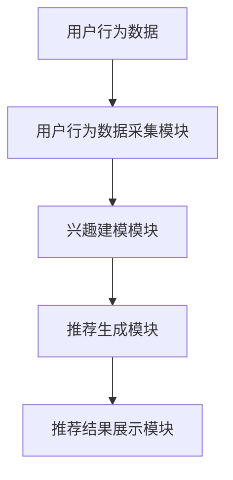
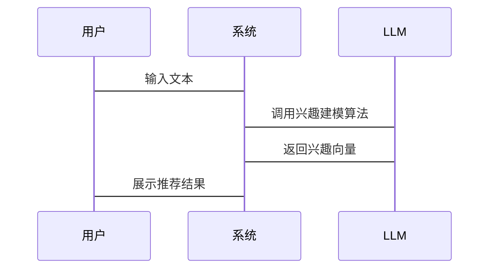

                 


# 个性化推荐AI Agent：基于LLM的用户兴趣建模

> 关键词：个性化推荐，AI Agent，用户兴趣建模，大语言模型，推荐系统，深度学习，LLM

> 摘要：本文将详细介绍基于大语言模型（LLM）的个性化推荐AI Agent的用户兴趣建模方法。首先，我们从个性化推荐和AI Agent的背景出发，分析用户兴趣建模的核心概念与方法。接着，深入探讨基于LLM的用户兴趣建模算法原理，并通过系统架构设计展示如何将这些算法应用于实际推荐系统中。最后，通过项目实战和案例分析，展示基于LLM的个性化推荐AI Agent的实际应用效果。

---

## 第1章: 个性化推荐与AI Agent背景介绍

### 1.1 个性化推荐的背景与问题背景
个性化推荐是现代信息过载时代的解决方案之一。随着互联网的快速发展，用户每天面对的信息量呈指数级增长，如何从海量信息中筛选出符合用户兴趣的内容成为一项重要挑战。传统的推荐系统基于协同过滤、基于内容的推荐等方法，但这些方法存在推荐结果不够精准、用户兴趣变化难以捕捉等问题。

### 1.2 用户兴趣建模的必要性
用户兴趣建模是个性化推荐的核心任务之一。通过对用户行为、偏好和历史数据的分析，可以捕捉用户的兴趣特征，从而实现精准的推荐。用户兴趣建模不仅需要考虑显式的行为数据，还需要挖掘隐式的兴趣特征，例如用户的语言表达、情感倾向等。

### 1.3 当前推荐系统的挑战与机遇
传统推荐系统的主要挑战包括数据稀疏性、冷启动问题、推荐结果的可解释性等。而基于大语言模型（LLM）的AI Agent为解决这些问题提供了新的思路。LLM的强大语言理解和生成能力，使得推荐系统能够更准确地捕捉用户兴趣，并生成更自然的推荐结果。

---

## 第2章: 用户兴趣建模的核心概念与联系

### 2.1 用户兴趣建模的原理与方法
用户兴趣建模可以通过多种方法实现，包括基于特征的建模方法和基于深度学习的建模方法。基于特征的建模方法主要依赖用户的显式行为数据，例如点击、评分等，通过统计分析提取用户的兴趣特征。基于深度学习的建模方法则利用神经网络模型，从用户的行为数据中提取隐式兴趣特征。

### 2.2 用户兴趣建模的核心要素与ER实体关系图
用户兴趣建模的核心要素包括用户实体、兴趣实体和用户-兴趣关系。通过实体关系图（ER图），我们可以清晰地展示用户和兴趣之间的关系。以下是一个简单的ER实体关系图：

```mermaid
er
    %% 用户兴趣建模的ER图
    entity User {
        id: int
        username: string
    }
    entity Interest {
        id: int
        interest_name: string
    }
    relationship User_Interests {
        User -> Interest
        "用户-兴趣关系"
        多对多
    }
```

### 2.3 基于LLM的兴趣建模与传统方法的对比
以下是基于LLM的兴趣建模与传统方法的对比分析表格：

| 对比维度         | 传统方法                        | 基于LLM的方法                      |
|------------------|---------------------------------|------------------------------------|
| 数据依赖         | 依赖显式行为数据                | 利用文本数据和LLM的语义理解        |
| 兴趣捕捉能力     | 难以捕捉隐式兴趣                | 能够捕捉用户的显式和隐式兴趣        |
| 推荐结果的可解释性 | 高                              | 较低                              |
| 计算复杂度       | 较低                            | 较高                              |

---

## 第3章: 基于LLM的个性化推荐算法原理

### 3.1 基于LLM的用户兴趣建模算法
基于LLM的用户兴趣建模算法主要依赖大语言模型的文本理解和生成能力。通过分析用户的文本输入（例如用户的查询、评论等），LLM能够生成用户兴趣的向量表示。

#### 3.1.1 用户兴趣表示的向量空间模型
用户兴趣可以表示为一个向量，其中每个维度对应一个兴趣特征。例如，我们可以将用户的兴趣表示为一个高维向量，其中每个维度对应一个特定的主题或关键词。

#### 3.1.2 基于LLM的兴趣建模公式
基于LLM的兴趣建模可以通过以下公式实现：

$$
I(u) = f_{LLM}(u)
$$

其中，$I(u)$ 表示用户 $u$ 的兴趣向量，$f_{LLM}$ 表示大语言模型的处理函数。

### 3.2 算法实现的Python源代码
以下是基于LLM的用户兴趣建模的Python代码示例：

```python
import torch
import torch.nn as nn

class LLMBasedInterestModel:
    def __init__(self, vocab_size):
        self.vocab_size = vocab_size
        self.embedding_dim = 512
        self.model = nn.Sequential(
            nn.Embedding(vocab_size, self.embedding_dim),
            nn.Linear(self.embedding_dim, 128),
            nn.ReLU(),
            nn.Linear(128, 64),
            nn.ReLU(),
            nn.Linear(64, 32)
        )

    def forward(self, input_ids):
        return self.model(input_ids)

# 示例使用
model = LLMBasedInterestModel(vocab_size=10000)
input_ids = torch.randint(0, 10000, (16, ))  # 假设batch_size=16
output = model(input_ids)
print(output.shape)  # 输出形状：(16, 32)
```

### 3.3 算法原理的数学模型与公式
基于LLM的用户兴趣建模可以表示为一个深度学习模型，其数学模型如下：

$$
I(u) = f_{LLM}(u) = \sigma(W_1 x + b_1) \cdot W_2 + b_2
$$

其中，$x$ 是输入的用户行为数据，$W_1$ 和 $W_2$ 是权重矩阵，$b_1$ 和 $b_2$ 是偏置项，$\sigma$ 是激活函数。

---

## 第4章: 系统分析与架构设计方案

### 4.1 系统架构设计
基于LLM的个性化推荐AI Agent的系统架构可以分为以下几个模块：

1. **用户行为数据采集模块**：负责采集用户的显式行为数据和文本输入。
2. **兴趣建模模块**：基于LLM对用户行为数据进行兴趣建模。
3. **推荐生成模块**：根据用户兴趣生成推荐结果。
4. **推荐结果展示模块**：将推荐结果展示给用户。

系统整体架构图如下：



### 4.2 系统接口设计与交互序列图
系统接口设计主要涉及以下几个接口：

1. **用户输入接口**：用户输入文本或行为数据。
2. **模型调用接口**：调用LLM进行兴趣建模和推荐生成。
3. **结果展示接口**：将推荐结果展示给用户。

以下是一个简单的交互序列图：



---

## 第5章: 个性化推荐AI Agent的项目实战

### 5.1 项目环境与工具安装
要实现基于LLM的个性化推荐AI Agent，首先需要安装以下工具和库：

- Python 3.8+
- PyTorch或TensorFlow
- Hugging Face的Transformers库

### 5.2 核心代码实现
以下是基于LLM的个性化推荐AI Agent的核心代码实现：

```python
from transformers import AutoTokenizer, AutoModelForMaskedLM
import torch

# 加载预训练模型
tokenizer = AutoTokenizer.from_pretrained('bert-base-uncased')
model = AutoModelForMaskedLM.from_pretrained('bert-base-uncased')

def get_user_interest(user_input):
    inputs = tokenizer(user_input, return_tensors='pt')
    outputs = model(**inputs)
    # 提取兴趣向量
    interest_vector = outputs.last_hidden_state[:, 0, :].squeeze()
    return interest_vector

# 示例使用
user_input = "我喜欢看科幻小说和科技新闻"
interest_vector = get_user_interest(user_input)
print(interest_vector.shape)  # 输出形状：(512,)
```

### 5.3 代码解读与实际案例分析
上述代码通过加载预训练的BERT模型，将用户的输入文本编码为兴趣向量。通过分析用户的输入文本，模型可以捕捉到用户的兴趣特征，并生成相应的推荐结果。

---

## 第6章: 最佳实践与总结

### 6.1 最佳实践
- 在实际应用中，建议根据具体需求选择合适的LLM模型。
- 定期更新用户兴趣模型，以适应用户的兴趣变化。
- 注意模型的可解释性问题，以便更好地向用户展示推荐结果。

### 6.2 小结
本文详细介绍了基于LLM的个性化推荐AI Agent的用户兴趣建模方法，从背景介绍到算法实现，再到系统设计，为读者提供了一个全面的技术视角。通过实际案例分析，展示了基于LLM的推荐系统在实际应用中的优势。

### 6.3 注意事项
- 在使用LLM进行用户兴趣建模时，需要注意模型的训练数据和使用场景，避免模型偏见。
- 确保用户数据的安全性和隐私保护。

### 6.4 拓展阅读
- 《Large Language Models for Recommendation Systems》
- 《Transformers: Pre-training of Self-attentional Neural Networks》

---

通过本文的详细介绍，读者可以深入了解基于LLM的个性化推荐AI Agent的核心技术，并能够将其应用于实际项目中。希望本文能为读者提供有价值的参考和启发。

