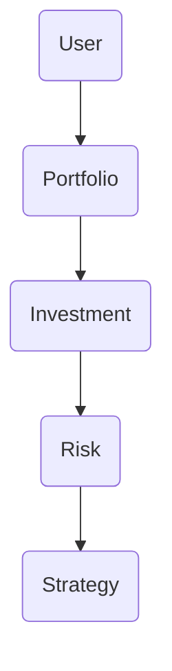
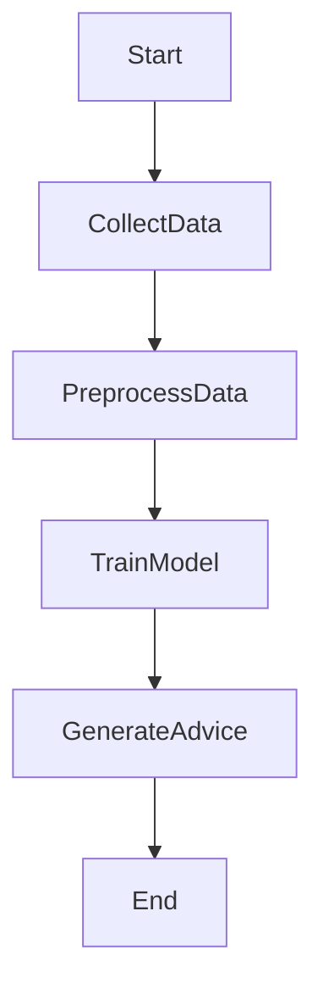
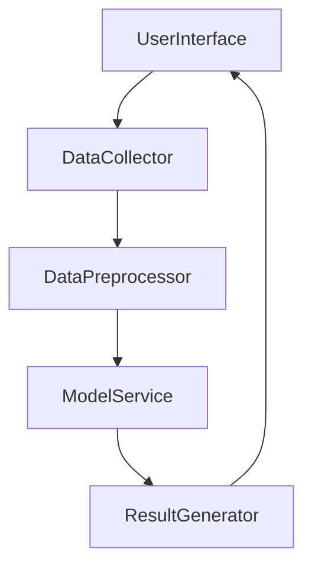

                 


# 个性化理财建议生成算法：原理与实现

## 关键词：个性化理财，生成算法，机器学习，数据挖掘，自然语言处理

## 摘要：本文深入探讨了个性化理财建议生成算法的核心原理与实现方法。通过分析用户需求和市场现状，提出了基于机器学习和数据挖掘的解决方案，并详细介绍了算法流程、系统架构和实现步骤，为读者提供了全面的技术指导。

---

## 第一部分：个性化理财建议生成算法的背景与问题

### 第1章：个性化理财建议生成算法的背景与问题

#### 1.1 问题背景

- **传统理财建议的局限性**：传统理财方式依赖人工咨询，无法满足个性化需求，且效率低下。
- **个性化理财需求的兴起**：随着金融市场的复杂化，用户对个性化理财的需求日益增长。
- **算法在理财建议中的作用**：算法能够快速分析大量数据，提供精准的理财建议。

#### 1.2 个性化理财建议的定义与特点

- **用户画像构建**：通过分析用户的财务状况、风险偏好等信息，构建个性化的用户画像。
- **理财目标分析**：根据用户的财务目标，如投资收益、风险承受能力等，进行分类和分析。
- **数据特征提取**：从大量数据中提取关键特征，为算法提供输入。

#### 1.3 个性化理财建议生成算法的必要性

- **提高理财效率**：通过算法快速匹配用户的理财需求。
- **精准匹配用户需求**：利用算法模型，提供个性化、定制化的理财建议。
- **算法的优势**：算法能够处理复杂的数据关系，提供科学的理财方案。

---

## 第二部分：个性化理财建议生成算法的核心原理

### 第2章：核心概念与联系

#### 2.1 核心概念原理

- **用户画像构建**：通过收集用户的基本信息、财务状况、投资偏好等数据，构建详细的用户画像。
- **理财目标分析**：根据用户的财务目标，如资产配置、风险承受能力等，进行分类和分析。
- **数据特征提取**：从用户数据中提取关键特征，如年龄、收入水平、投资经验等。

#### 2.2 核心概念属性特征对比

- **用户画像的属性特征**：年龄、收入水平、职业、资产规模等。
- **理财目标的属性特征**：风险承受能力、投资期限、预期收益等。
- **数据特征的属性特征**：数据来源、数据类型、数据质量等。

#### 2.3 ER实体关系图



### 第3章：算法原理讲解

#### 3.1 算法流程图



#### 3.2 数据预处理

- **数据清洗**：去除缺失值、异常值等。
- **数据归一化**：将不同量纲的数据进行标准化处理。
- **特征提取**：使用主成分分析（PCA）提取关键特征。

#### 3.3 模型训练

- **机器学习模型选择**：根据任务类型选择合适的模型，如随机森林、支持向量机（SVM）等。
- **模型训练**：使用训练数据对模型进行训练，调整模型参数以优化性能。
- **模型评估**：通过交叉验证、准确率、召回率等指标评估模型性能。

#### 3.4 理财建议生成

- **结果生成**：根据模型预测结果，生成个性化的理财建议。
- **结果展示**：将建议以用户友好的方式展示，如图表、文本形式等。

---

## 第三部分：系统架构与实现

### 第4章：系统架构设计

#### 4.1 系统功能设计

- **用户输入模块**：收集用户的财务状况、投资目标等信息。
- **数据处理模块**：对输入数据进行清洗、归一化处理。
- **模型服务模块**：调用训练好的模型，生成理财建议。
- **结果展示模块**：将建议以直观的方式呈现给用户。

#### 4.2 系统架构图



### 第5章：系统实现

#### 5.1 环境配置

- **安装Python**：使用Anaconda或虚拟环境管理Python版本。
- **安装依赖库**：如pandas、numpy、scikit-learn等。

#### 5.2 数据处理代码

```python
import pandas as pd
import numpy as np

# 数据清洗
data = pd.read_csv('input.csv')
data.dropna(inplace=True)

# 数据归一化
from sklearn.preprocessing import StandardScaler
scaler = StandardScaler()
data_normalized = scaler.fit_transform(data)
```

#### 5.3 模型训练代码

```python
from sklearn.ensemble import RandomForestClassifier

# 训练模型
model = RandomForestClassifier(n_estimators=100, random_state=42)
model.fit(X_train, y_train)

# 模型评估
from sklearn.metrics import accuracy_score
print("Accuracy:", accuracy_score(y_test, model.predict(X_test)))
```

#### 5.4 结果生成代码

```python
# 根据用户输入生成理财建议
user_input = ...  # 用户输入数据
processed_input = preprocess(user_input)
prediction = model.predict(processed_input)
print("理财建议:", prediction)
```

---

## 第四部分：项目实战

### 第6章：项目实战

#### 6.1 项目背景

- **项目目标**：构建一个个性化理财建议生成系统。
- **数据来源**：收集用户的财务数据和市场数据。

#### 6.2 数据收集与处理

```python
# 数据收集
import requests
import json

response = requests.get('https://api.marketdata.com/stocks')
data = json.loads(response.text)
```

#### 6.3 模型训练与部署

```python
# 模型训练
model.fit(X_train, y_train)

# 模型部署
import flask
app = flask.Flask(__name__)
@app.route('/api/predict', methods=['POST'])
def predict():
    data = flask.request.json
    processed_data = preprocess(data)
    result = model.predict(processed_data)
    return json.dumps({'result': result.tolist()})
```

---

## 第五部分：总结与展望

### 第7章：总结与展望

- **总结**：本文详细介绍了个性化理财建议生成算法的原理与实现，涵盖了数据处理、模型训练和系统部署的全过程。
- **展望**：未来可以进一步优化算法模型，引入更多数据源，提升理财建议的准确性和个性化程度。

---

## 关键词：个性化理财，生成算法，机器学习，数据挖掘，自然语言处理

## 摘要：本文深入探讨了个性化理财建议生成算法的核心原理与实现方法。通过分析用户需求和市场现状，提出了基于机器学习和数据挖掘的解决方案，并详细介绍了算法流程、系统架构和实现步骤，为读者提供了全面的技术指导。

