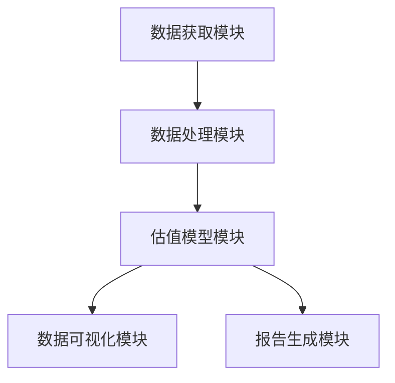

                 


# 中国股市估值: 增长潜力与风险并存

## 关键词：
- 股市估值、中国股市、风险管理、技术分析、投资策略、增长潜力

## 摘要：
本文深入探讨中国股市的估值方法与风险分析，结合技术分析与基本面研究，帮助投资者理解股市的增长潜力与潜在风险。通过系统化的分析框架和实战案例，本文为投资者提供科学的决策支持，助力在复杂市场环境中把握投资机会，规避潜在风险。

---

# 第一部分: 中国股市估值的背景与基础

## 第1章: 中国股市的概况与发展趋势

### 1.1 中国股市的发展历程
#### 1.1.1 中国股市的起源与发展
- 中国股市的起源：1990年上海证券交易所成立，1992年深圳证券交易所成立。
- 从试点交易到规范化：20世纪90年代至2000年，中国股市经历了制度化和规范化的关键阶段。
- 现阶段特征：多层次资本市场发展，包括主板、创业板、科创板和新三板。

#### 1.1.2 当前中国股市的市场规模与结构
- 上市公司数量：截至2023年，中国股市上市公司数量超过5000家，市值位居全球前列。
- 市场结构：主板、创业板、科创板的定位与功能差异。
- 投资者结构：以散户为主，机构投资者占比逐步提升。

#### 1.1.3 中国股市与全球股市的对比
- 市场规模：中国股市是全球第二大股票市场，仅次于美国。
- 市场特点：政策影响大，行业集中度高（金融、科技、消费等占比较大）。
- 风险因素：监管政策变化、宏观经济波动对市场的影响。

### 1.2 中国股市的主要参与者
#### 1.2.1 投资者类型分析
- 散户：占比高，投资行为受情绪影响较大。
- 机构投资者：包括公募基金、私募基金、券商自营、保险资金等。
- 外资：通过沪港通、深港通等渠道参与中国股市。

#### 1.2.2 上市公司特点
- 行业集中：金融、能源、科技、消费等行业占比较大。
- 估值差异：成长型企业估值较高，传统行业估值偏低。
- 政策敏感性：受政府政策影响较大，如行业监管、税收政策等。

#### 1.2.3 机构投资者的作用
- 市场稳定性：机构投资者通过理性投资为市场提供流动性。
- 信息优势：机构投资者通过深入研究影响市场定价。
- 资源配置：引导资金流向高增长行业和优质企业。

### 1.3 影响中国股市的主要因素
#### 1.3.1 宏观经济因素
- GDP增长：经济增速放缓对股市的影响。
- 通胀水平：通胀预期对股市估值的影响。
- 利率政策：央行利率调整对股市资金流动性的影响。

#### 1.3.2 政策法规的影响
- 股市政策：新股发行制度、退市制度等对市场的影响。
- 行业政策：如金融监管、房地产调控等对相关行业的影响。
- 市场监管：证监会监管力度对市场秩序的影响。

#### 1.3.3 市场情绪与投资者行为
- 投资者情绪对市场波动的影响。
- 杠杆效应：融资融券对市场波动的放大作用。
- 媒体传播：新闻报道对市场情绪的影响。

---

## 第2章: 股市估值的核心概念与方法

### 2.1 股票估值的基本原理
#### 2.1.1 股票价值的定义与分类
- 股票价值：未来现金流的现值，分为内在价值和市场价值。
- 内在价值：基于公司基本面的理论价值，市场价值：实际交易价格。

#### 2.1.2 估值的目的是什么
- 发现投资机会：识别被低估或高估的股票。
- 风险管理：通过估值控制投资风险。
- 投资决策：基于估值做出买卖决策。

#### 2.1.3 估值的基本方法与步骤
1. **基本面分析**：研究公司财务报表、行业地位、竞争优势。
2. **选择估值指标**：根据公司特点选择合适的估值方法。
3. **计算估值**：基于指标或模型计算股票的理论价值。
4. **比较与调整**：将理论价值与市场价比较，判断投资价值。

### 2.2 常用的估值指标
#### 2.2.1 市盈率（P/E）分析
- 定义：市盈率=股价/每股收益。
- 适用场景：适用于盈利稳定的公司，尤其是消费类、科技类公司。
- 优势：简单易用，反映市场对收益的预期。
- 局限性：不适用于亏损公司，不同行业间可比性有限。

#### 2.2.2 市净率（P/B）分析
- 定义：市净率=股价/每股净资产。
- 适用场景：适用于金融、房地产等资产-heavy行业。
- 优势：反映资产质量，适用于低增长行业。
- 局限性：不适用于高增长或轻资产行业。

#### 2.2.3 股息率与股息支付率
- 股息率：股息/股价。
- 股息支付率：股息支付/净利润。
- 适用场景：适用于成熟行业或红利股。
- 优势：反映收益的稳定性，适合追求稳定收益的投资者。
- 局限性：高股息率可能意味着低增长或高负债。

#### 2.2.4 EV/EBITDA倍数
- 定义：EV/EBITDA=企业价值/息税折旧及摊销前利润。
- 适用场景：适用于不同税率或财务杠杆的公司。
- 优势：跨行业可比性高，反映企业整体盈利能力。
- 局限性：不考虑资本结构，且依赖于准确的财务数据。

### 2.3 中国股市估值的独特性
#### 2.3.1 A股市场的特殊性
- 政策影响大：政府政策对股市影响显著。
- 市场流动性：资金流动性波动大，受监管政策影响。
- 市场情绪：散户占比高，市场情绪波动剧烈。

#### 2.3.2 行业估值差异分析
- 高增长行业：科技、消费、新能源行业的估值较高。
- 传统行业：金融、能源行业的估值相对较低。
- 政策敏感行业：如金融、房地产行业的估值受政策影响较大。

#### 2.3.3 政策对估值的影响
- 政策放松：如降息、降准等政策利好股市估值。
- 监管收紧：如行业监管加强，影响相关行业估值。
- 政策预期：市场对政策的预期影响短期估值波动。

---

## 第3章: 股市估值的核心概念与联系

### 3.1 股票估值的数学模型
#### 3.1.1 股票价值的计算公式
- 现金流折现模型（DCF）：
  $$ V = \sum_{t=1}^{n} \frac{CF_t}{(1+r)^t} + \frac{TV}{(1+r)^n} $$
  其中，\( V \) 为股票价值，\( CF_t \) 为第 \( t \) 年的现金流，\( r \) 为折现率，\( TV \) 为终值。

#### 3.1.2 市盈率与市净率模型
- 市盈率模型：
  $$ P = E \times \text{PE} $$
  其中，\( P \) 为股价，\( E \) 为每股收益，\( \text{PE} \) 为市盈率。
- 市净率模型：
  $$ P = B \times \text{PB} $$
  其中，\( B \) 为每股净资产，\( \text{PB} \) 为市净率。

#### 3.1.3 股权自由现金流模型
- 公式：
  $$ V = \sum_{t=1}^{n} \frac{FCF_t}{(1+wACC)^t} + \frac{FV}{(1+wACC)^n} $$
  其中，\( FCF \) 为股权自由现金流，\( wACC \) 为股权资本成本，\( FV \) 为终值。

### 3.2 股票估值的核心要素
#### 3.2.1 盈利能力分析
- 盈利能力指标：净利润率、ROE（净资产收益率）、ROA（资产净利率）。
- 优势：反映公司赚钱能力，是估值的重要依据。
- 局限性：短期盈利波动可能影响估值准确性。

#### 3.2.2 增长能力分析
- 增长能力指标：收入增长率、净利润增长率、ROE增长率。
- 优势：高增长公司通常具有较高的估值溢价。
- 局限性：高增长可能伴随高风险，需结合行业生命周期分析。

#### 3.2.3 财务健康性分析
- 财务健康指标：资产负债率、流动比率、速动比率。
- 优势：反映公司财务风险，帮助判断公司偿债能力。
- 局限性：财务杠杆过高可能导致公司估值受限。

#### 3.2.4 现金流分析
- 现金流指标：经营活动现金流净额、自由现金流。
- 优势：现金流是公司财务健康的核心指标，真实反映公司盈利质量。
- 局限性：现金流波动大，需结合其他指标分析。

---

## 第4章: 股市估值的核心算法与实现

### 4.1 股票估值的算法原理
#### 4.1.1 DCF模型的实现步骤
1. **确定现金流**：预测未来几年的现金流。
2. **选择折现率**：根据行业风险确定合适的折现率。
3. **计算终值**：假设稳定增长下计算终值。
4. **计算现值**：将未来现金流折现求和，加终值得到股票价值。

#### 4.1.2 市盈率与市净率模型的实现
1. **收集数据**：获取目标公司的财务数据和行业数据。
2. **计算估值指标**：计算市盈率、市净率等指标。
3. **比较分析**：将目标公司与行业平均水平或可比公司进行比较。

#### 4.1.3 综合估值模型的实现
1. **多指标分析**：结合市盈率、市净率、ROE等指标进行综合分析。
2. **权重分配**：根据行业特点和公司具体情况分配各指标权重。
3. **计算综合估值**：加权计算综合估值，判断股票是否被高估或低估。

### 4.2 股票估值的代码实现
#### 4.2.1 数据获取与处理
- 使用Python获取股票数据：
  ```python
  import pandas as pd
  import yfinance as yf

  # 下载数据
  data = yf.download(tickers='AAPL', period='5y')
  # 处理数据
  df = data['Adj Close'].pct_change().dropna()
  ```

#### 4.2.2 DCF模型实现
```python
def calculate_dcf(cash_flows, discount_rate, terminal_value):
    discounted_flows = []
    for t in range(len(cash_flows)):
        discounted_flow = cash_flows[t] / (1 + discount_rate) ** t
        discounted_flows.append(discounted_flow)
    total_value = sum(discounted_flows) + terminal_value / (1 + discount_rate) ** len(cash_flows)
    return total_value
```

#### 4.2.3 市盈率与市净率模型实现
```python
def calculate_pe_ratio(price, eps):
    return price / eps

def calculate_pb_ratio(price, book_value):
    return price / book_value
```

### 4.3 股票估值的系统架构设计
#### 4.3.1 系统功能设计
- 数据获取模块：获取股票历史数据和财务数据。
- 估值模型模块：实现多种估值方法，如DCF、PE、PB等。
- 数据可视化模块：展示估值结果与实际价格的对比。
- 报告生成模块：生成估值报告，提供投资建议。

#### 4.3.2 系统架构图


#### 4.3.3 系统接口设计
- 数据接口：与金融数据API对接，获取实时数据。
- 用户接口：提供输入参数，如股票代码、估值方法等。
- 输出接口：返回估值结果，生成可视化图表。

---

## 第5章: 股市估值的风险管理与投资策略

### 5.1 风险管理的核心概念
#### 5.1.1 投资风险的分类
- 系统性风险：市场风险、利率风险、通货膨胀风险。
- 非系统性风险：公司风险、行业风险、信用风险。

#### 5.1.2 风险与收益的平衡
- 风险厌恶：投资者对高风险投资的回避心理。
- 风险偏好：投资者对高收益高风险投资的偏好。
- 风险中性：投资者基于风险调整预期收益。

### 5.2 投资策略的制定
#### 5.2.1 基于估值的买入策略
- 买入被低估的股票：当市场价格低于内在价值时买入。
- 买入成长股：选择高增长潜力的公司。

#### 5.2.2 基于估值的卖出策略
- 卖出被高估的股票：当市场价格远高于内在价值时卖出。
- 卖出不再符合投资目标的股票：如行业政策变化影响公司前景。

### 5.3 投资组合的优化
#### 5.3.1 投资组合的风险分散
- 股票分散：投资不同行业、不同地区的股票。
- 资产配置：将资金分配到股票、债券、现金等不同资产类别。

#### 5.3.2 动态调整策略
- 定期评估：根据市场变化和公司基本面调整投资组合。
- 逐步建仓：分批买入或卖出，降低单次交易风险。

---

## 第6章: 中国股市估值的实战案例与分析

### 6.1 实战案例分析
#### 6.1.1 案例一：科技行业龙头股的估值
- 公司基本面分析：收入增长、利润率、研发投入等。
- 估值方法：使用DCF模型和市盈率模型进行估值。
- 结果对比：计算出的理论价值与市场价对比，判断是否低估或高估。

#### 6.1.2 案例二：消费行业龙头股的估值
- 公司基本面分析：市场份额、品牌优势、盈利稳定性。
- 估值方法：使用市盈率和股息率模型进行估值。
- 结果对比：分析行业平均估值水平，判断投资价值。

### 6.2 投资策略的制定与优化
#### 6.2.1 基于估值的投资决策
- 根据估值结果制定买卖策略。
- 结合市场趋势和行业前景优化投资组合。

#### 6.2.2 实战中的注意事项
- 数据准确性：确保财务数据和市场数据的准确性。
- 模型适用性：选择适合公司特点的估值模型。
- 风险控制：设定止损点，避免重大损失。

---

## 第7章: 中国股市估值的未来趋势与挑战

### 7.1 中国股市的未来发展趋势
#### 7.1.1 市场结构优化
- 退市制度完善，提高市场效率。
- 多层次资本市场发展，满足不同规模企业融资需求。

#### 7.1.2 行业发展趋势
- 新能源、科技、消费等高增长行业将继续引领市场。
- 传统行业通过转型和创新寻找新的增长点。

### 7.2 技术与数据对股市估值的影响
#### 7.2.1 人工智能在估值中的应用
- 机器学习算法：用于预测市场趋势和公司业绩。
- 大数据分析：通过海量数据提高估值准确性。

#### 7.2.2 量化投资的兴起
- 量化模型：基于算法和数学模型进行投资决策。
- 量化策略：高频交易、因子投资等策略的应用。

### 7.3 投资者面临的挑战
#### 7.3.1 市场波动加剧
- 宏观经济不确定性增加，市场波动加剧。
- 政策变化频繁，影响市场预期。

#### 7.3.2 信息过载
- 信息爆炸时代，投资者如何筛选有效信息。
- 数据分析工具的使用门槛较高，需要专业技能。

#### 7.3.3 风险管理的难度增加
- 复杂的市场环境要求投资者具备更强的风险管理能力。
- 需要动态调整投资策略，应对市场变化。

---

## 第8章: 总结与展望

### 8.1 总结
- 中国股市估值的核心在于基本面分析和合理的估值方法选择。
- 风险管理是投资成功的关键，需要动态调整投资策略。
- 技术分析与基本面研究的结合能够提高估值的准确性。

### 8.2 展望
- 随着技术的进步，人工智能和大数据分析将越来越广泛地应用于股市估值。
- 投资者需要不断提升自己的知识和技能，以应对复杂多变的市场环境。
- 未来的投资机会将更多地出现在高增长行业和创新型企业中。

---

# 结语
通过系统化的分析和实战案例，本文为投资者提供了科学的股市估值方法和风险管理策略。在未来的投资中，结合技术分析与基本面研究，投资者能够在复杂多变的市场中找到增长潜力巨大的投资机会，同时有效规避潜在风险，实现稳健的投资回报。

