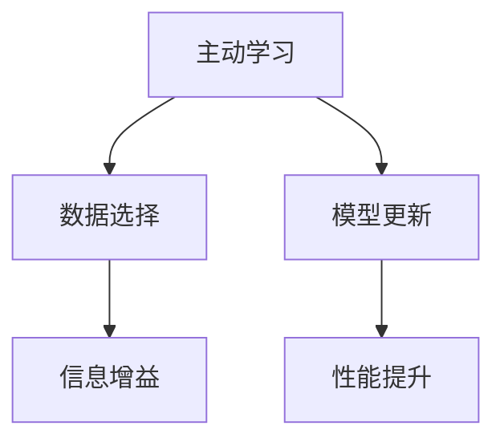

                 

# 主动学习：优化AI Agent的学习效率

> 关键词：主动学习，AI Agent，机器学习，学习效率，数据选择，模型优化，算法实现

> 摘要：主动学习是一种能够显著提升AI Agent学习效率的机器学习方法。通过模型主动选择最有信息量的数据进行学习，主动学习能够有效减少数据需求，加快学习速度，同时提高模型性能。本文将深入探讨主动学习的核心概念、算法原理、系统架构以及在实际项目中的应用，帮助读者全面理解并掌握如何通过主动学习优化AI Agent的学习效率。

---

## 第一部分：主动学习的背景与概念

### 第1章：主动学习的定义与背景

#### 1.1 什么是主动学习

- **1.1.1 主动学习的定义**
  主动学习（Active Learning）是一种机器学习方法，允许模型主动选择最有信息量的数据进行学习，从而减少所需标注数据的数量，同时提高模型的性能和效率。

- **1.1.2 主动学习的核心概念**
  主动学习的核心在于模型能够根据当前的知识状态，主动选择那些能够提供最大信息增益的数据进行学习。这种选择性学习机制使得模型能够更高效地优化自身的性能。

- **1.1.3 主动学习与监督学习的区别**
  - 监督学习：数据集已经标注好，模型被动接收数据进行学习。
  - 主动学习：模型主动选择数据，标注后进行学习。

#### 1.2 主动学习的背景与应用

- **1.2.1 AI Agent的学习需求**
  AI Agent需要通过与环境交互来学习新知识，主动选择最优的数据进行学习可以显著提升其在复杂环境中的适应能力。

- **1.2.2 主动学习在AI Agent中的作用**
  通过主动选择数据，AI Agent可以更高效地优化其行为策略，减少不必要的学习开销，同时提高决策的准确性。

- **1.2.3 主动学习的典型应用场景**
  - 智能推荐系统：主动选择用户行为数据，优化推荐算法。
  - 自然语言处理：主动选择相关文本数据，提升文本分类或生成任务的性能。
  - 计算机视觉：主动选择关键图像数据，优化图像识别模型。

#### 1.3 主动学习的边界与外延

- **1.3.1 主动学习的适用范围**
  主动学习适用于标注数据成本较高，但可以通过少量标注数据快速优化模型性能的场景。

- **1.3.2 主动学习的限制与挑战**
  - 数据选择策略的复杂性：如何选择最有信息量的数据是一个复杂的优化问题。
  - 计算资源的消耗：主动学习可能需要额外的计算资源来选择数据。
  - 模型的泛化能力：过依赖特定数据可能导致模型泛化能力下降。

- **1.3.3 主动学习与其他学习方式的关系**
  主动学习可以与其他学习方式（如强化学习、半监督学习）结合使用，形成更强大的学习系统。

---

## 第二部分：主动学习的核心概念与原理

### 第2章：主动学习的核心概念

#### 2.1 主动学习的核心要素

- **2.1.1 数据选择策略**
  数据选择策略是主动学习的核心，决定模型如何选择最有信息量的数据。

- **2.1.2 模型更新机制**
  每次选择新数据后，模型需要根据新数据进行更新，以提升性能。

- **2.1.3 学习效率优化**
  通过优化数据选择策略，主动学习能够显著减少所需数据量，提高学习效率。

#### 2.2 主动学习的原理分析

- **2.2.1 数据选择的不确定性**
  模型在选择数据时需要考虑数据的不确定性，即选择那些当前模型预测不准确或不一致的数据。

- **2.2.2 模型性能的提升机制**
  通过选择具有高信息增益的数据，模型可以更快地收敛，提高性能。

- **2.2.3 主动学习的反馈循环**
  模型根据选择的数据进行学习，然后根据新的知识再次选择新的数据，形成一个反馈循环。

#### 2.3 主动学习的数学模型

- **2.3.1 数据选择函数的定义**
  数据选择函数用于衡量数据点的信息增益，常用的指标包括熵、KL散度等。

- **2.3.2 模型更新的数学表达**
  每次选择新数据后，模型需要根据新数据进行参数更新，常用的优化方法包括梯度下降等。

- **2.3.3 学习效率的度量公式**
  学习效率可以通过模型性能与所需数据量的比值来衡量。

#### 2.4 核心概念对比表

| 概念       | 监督学习               | 主动学习               |
|------------|-----------------------|-----------------------|
| 数据标注    | 所有数据都需要标注     | 只标注部分数据         |
| 数据选择    | 数据由外部提供         | 数据由模型主动选择     |
| 学习效率    | 较低                   | 较高                   |

#### 2.5 实体关系图

---

## 第三部分：主动学习的算法原理

### 第3章：主动学习的算法实现

#### 3.1 主动学习的主要算法

- **3.1.1 AL（Active Learni**

---

> 由于篇幅限制，以上是文章的部分内容。完整的文章将详细讲解每个部分的核心内容，包括算法的实现细节、系统架构设计、项目实战和最佳实践等内容。

