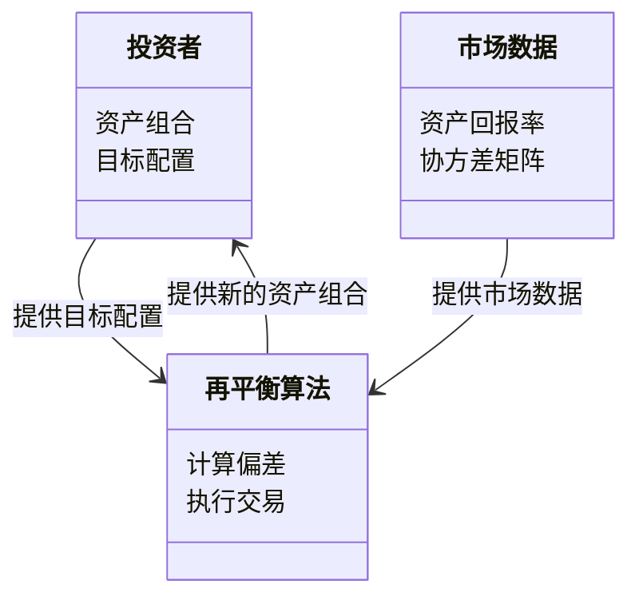
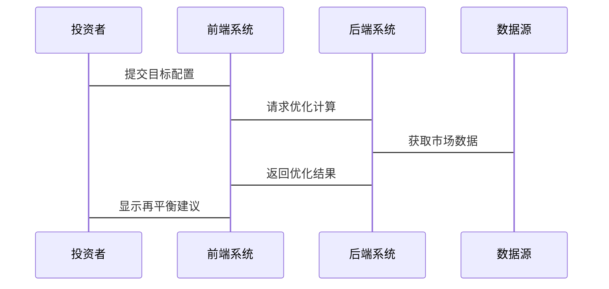

                 


# 乔尔·提尔尼的投资组合再平衡策略

## 关键词：投资组合，再平衡策略，现代投资组合理论，数学模型，算法实现

## 摘要

投资组合再平衡是投资管理中的关键策略，旨在维持资产配置以应对市场变化和投资者目标的调整。本文详细探讨了乔尔·提尔尼的投资组合再平衡策略，结合现代投资组合理论（MPT）和优化算法，分析其数学模型和系统架构。通过实际案例和代码实现，本文为读者提供了深入的理解和实践指导，强调了纪律执行、风险管理和税务优化等最佳实践。

---

# 第一部分: 投资组合再平衡策略概述

## 第1章: 投资组合管理概述

### 1.1 投资组合管理的基本概念

#### 1.1.1 投资组合的定义与特点

- **定义**: 投资组合是指投资者持有的多种资产的集合，旨在通过多样化降低风险并实现收益最大化。
- **特点**: 
  - 多样性：分散投资以降低风险。
  - 风险调整收益：追求单位风险下的最大收益。
  - 可调整性：根据市场变化和投资者目标进行调整。

#### 1.1.2 投资组合管理的目标与原则

- **目标**: 
  - 稳定收益：通过合理配置资产实现长期收益目标。
  - 风险控制：在可接受的风险范围内优化收益。
- **原则**: 
  - 分散投资：避免过度集中于某一资产类别。
  - 定期审查：根据市场变化和个人目标调整配置。

#### 1.1.3 投资组合管理的历史发展

- 从早期的单资产管理到现代的多资产配置，投资组合管理经历了从经验驱动到数学优化的演变。

### 1.2 投资组合再平衡的背景与意义

#### 1.2.1 再平衡的定义与作用

- **定义**: 再平衡是根据目标配置调整资产比例，以应对市场波动和投资者目标变化。
- **作用**: 
  - 维持目标资产配置。
  - 优化风险收益比。
  - 避免偏离预期收益。

#### 1.2.2 再平衡的必要性与挑战

- **必要性**: 
  - 市场波动导致资产比例偏离目标。
  - 投资者风险承受能力变化。
- **挑战**: 
  - 频繁交易增加成本。
  - 市场预测的不确定性。

#### 1.2.3 再平衡在投资策略中的地位

- 再平衡是投资组合管理的核心步骤，确保策略的有效执行。

---

## 第2章: 投资组合再平衡的核心概念

### 2.1 投资组合优化的基本原理

#### 2.1.1 现代投资组合理论（MPT）概述

- MPT由哈里·马科维茨提出，强调通过资产配置优化风险与收益。

#### 2.1.2 投资组合优化的目标函数

- 最小化风险（方差）：
  $$ \min_w \sigma^2 = w^T \Sigma w $$
- 最大化收益：
  $$ \max_w \mu^T w $$

#### 2.1.3 约束条件与优化模型

- 约束条件：
  - 投资权重之和为1：$w^T \mathbf{1} = 1$
  - 无卖空约束：$w_i \geq 0$

### 2.2 再平衡策略的核心要素

#### 2.2.1 资产配置的动态调整

- 根据市场变化和目标调整资产权重。

#### 2.2.2 风险与收益的平衡

- 在不同风险水平下优化收益。

#### 2.2.3 再平衡的频率与成本

- 定期再平衡：每年或每季度调整。
- 事件驱动再平衡：市场崩盘后的调整。

### 2.3 再平衡策略的类型

#### 2.3.1 定期再平衡策略

- 按固定时间间隔调整资产配置。

#### 2.3.2 事件驱动再平衡策略

- 根据特定事件触发再平衡。

#### 2.3.3 动态再平衡策略

- 根据实时市场数据动态调整。

---

# 第二部分: 投资组合再平衡的数学模型与算法

## 第3章: 现代投资组合理论（MPT）与数学模型

### 3.1 MPT的核心假设与数学推导

#### 3.1.1 均值-方差优化模型

- 优化目标：
  $$ \min_w w^T \Sigma w $$
- 约束条件：
  $$ \sum_{i=1}^n w_i = 1 $$
  $$ w_i \geq 0 $$

#### 3.1.2 投资组合的无风险利率与风险溢价

- 无风险利率：市场无风险收益率。
- 风险溢价：投资者因承担风险而获得的额外收益。

#### 3.1.3 资产回报率的协方差矩阵

- 协方差矩阵Σ表示资产之间的相关性。

### 3.2 投资组合优化的数学公式

#### 3.2.1 优化问题的拉格朗日函数

- 拉格朗日函数：
  $$ L(w, \lambda) = w^T \Sigma w + \lambda (1 - \sum w_i) $$

#### 3.2.2 解的求解与边界条件

- 解为最优权重向量w*，满足约束条件。

#### 3.2.3 约束条件下的优化解

- 使用拉格朗日乘数法求解。

### 3.3 现代投资组合理论的局限性与改进

#### 3.3.1 MPT的假设限制

- 资产回报率的正态分布假设。
- 无交易成本假设。
- 无市场冲击假设。

#### 3.3.2 实际应用中的调整

- 考虑交易成本和市场冲击。
- 使用历史数据估计协方差矩阵。

#### 3.3.3 新兴的优化方法

- 使用鲁棒优化和非均值-方差模型。

---

## 第4章: 投资组合再平衡的算法实现

### 4.1 再平衡算法的基本流程

#### 4.1.1 确定再平衡的触发条件

- 例如，资产比例偏离目标超过一定阈值。

#### 4.1.2 计算当前组合与目标配置的偏差

- 比较当前权重和目标权重，计算差异。

#### 4.1.3 执行再平衡交易

- 调整资产权重以恢复目标配置。

### 4.2 基于动态规划的再平衡算法

#### 4.2.1 动态规划模型的构建

- 状态定义：当前时间点的资产权重。
- 转移方程：根据市场变化调整权重。
- 目标函数：最小化方差或最大化收益。

#### 4.2.2 状态转移方程的定义

- 通过历史数据预测未来资产回报。

#### 4.2.3 最优解的求解与实现

- 使用动态规划算法求解最优权重。

### 4.3 基于机器学习的再平衡策略

#### 4.3.1 机器学习在再平衡中的应用

- 使用聚类分析识别资产类别。
- 使用回归分析预测资产回报。

#### 4.3.2 基于聚类的再平衡算法

- 将相似资产聚类，减少交易次数。

#### 4.3.3 基于回归的再平衡模型

- 预测资产回报，动态调整权重。

---

## 第5章: 投资组合再平衡的系统架构设计

### 5.1 问题场景介绍

- 系统需要实时监控市场数据，定期执行再平衡。

### 5.2 系统功能设计

#### 5.2.1 领域模型（Mermaid 类图）



#### 5.2.2 系统架构设计（Mermaid 架构图）


#### 5.2.3 系统接口设计

- 前端接口：接收投资者目标和市场数据。
- 后端接口：处理优化算法，返回再平衡建议。

#### 5.2.4 系统交互设计（Mermaid 序列图）



---

## 第6章: 项目实战

### 6.1 环境安装

- 安装Python、NumPy、Pandas、Scipy、Plotly等库。

### 6.2 系统核心实现源代码

```python
import numpy as np
import pandas as pd
from scipy.optimize import minimize

def portfolio_rebalancing(weights, returns, cov_matrix):
    def objective(w):
        return np.dot(w.T, np.dot(cov_matrix, w))
    
    constraint = {'type': 'eq', 'fun': lambda w: sum(w) - 1}
    
    result = minimize(objective, weights, method='SLSQP', constraints=[constraint])
    return result.x

# 示例数据
returns = pd.DataFrame({'资产1': [0.1, 0.05, 0.15], '资产2': [0.08, 0.12, 0.05]})
cov_matrix = pd.DataFrame({
    '资产1': [0.05, 0.02],
    '资产2': [0.02, 0.08]
})

initial_weights = [0.5, 0.5]
optimized_weights = portfolio_rebalancing(initial_weights, returns, cov_matrix)
print("优化后的权重:", optimized_weights)
```

### 6.3 代码应用解读与分析

- 使用SciPy的minimize函数实现均值-方差优化。
- 示例数据展示了如何调整资产权重以最小化风险。

### 6.4 实际案例分析

- 假设投资者目标为60%股票、30%债券、10%现金。
- 市场波动导致权重偏离目标，再平衡算法自动调整。

### 6.5 项目小结

- 代码实现展示了再平衡策略的基本流程。
- 实际案例验证了算法的有效性。

---

## 第7章: 投资组合再平衡的最佳实践

### 7.1 定期审查与纪律执行

- 定期检查投资组合，严格执行再平衡策略。

### 7.2 风险管理与目标调整

- 根据市场变化和个人目标调整风险承受能力。

### 7.3 稀疏性与交易成本优化

- 减少频繁交易，降低交易成本。

### 7.4 程序化交易与自动化

- 使用算法自动执行再平衡，减少人为干扰。

### 7.5 税务优化

- 考虑税务影响，优化交易时机。

### 7.6 记录与报告

- 记录每次再平衡操作，提供详细的报告。

---

## 第8章: 小结与注意事项

### 8.1 小结

- 投资组合再平衡是投资管理的核心策略。
- 结合现代投资组合理论和优化算法，可以实现高效的再平衡。

### 8.2 注意事项

- 交易成本和市场冲击会影响实际收益。
- 需要根据实际情况调整再平衡频率和策略。
- 风险管理是再平衡策略的重要组成部分。

### 8.3 拓展阅读

- 建议阅读《投资学》（机械工业出版社）和《Python金融计算》（人民邮电出版社）。

---

# 结语

乔尔·提尔尼的投资组合再平衡策略结合了理论与实践，通过数学模型和算法实现，为投资者提供了科学的投资管理方法。遵循最佳实践，投资者可以有效优化资产配置，实现长期稳健的收益。

