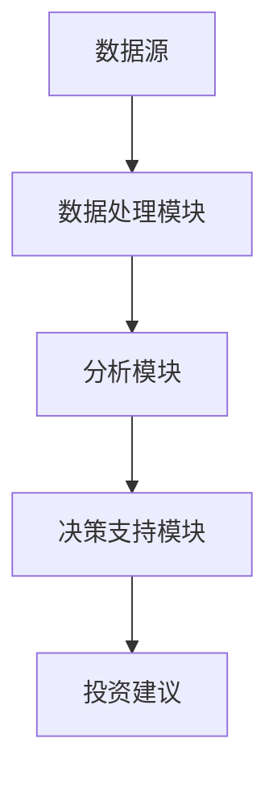

                 


# 乔尔·提林加斯特的全面价值投资：定量与定性分析的结合

> 关键词：全面价值投资，定量分析，定性分析，投资策略，数据分析，风险管理

> 摘要：本文深入探讨了乔尔·提林加斯特的全面价值投资方法，重点分析了如何将定量与定性分析相结合，以提升投资决策的准确性和效果。通过系统的理论分析、数学模型构建、算法原理阐述以及实际案例的详细解读，本文为投资者提供了全面而深入的指导。

---

# 正文

## 第一章: 全面价值投资的背景与核心概念

### 1.1 价值投资的历史与发展

#### 1.1.1 价值投资的起源
价值投资是一种长期投资策略，起源于20世纪初，由本杰明·格雷厄姆和大卫·多德提出。他们强调以低于内在价值的价格买入优质股票，以实现长期的超额收益。

#### 1.1.2 现代价值投资的发展
随着时间的推移，价值投资不断发展，融入了更多现代金融理论和工具。乔尔·提林加斯特在其投资实践中，将定量分析与定性分析相结合，形成了独特的全面价值投资方法。

#### 1.1.3 价值投资的核心理念
价值投资的核心理念是寻找市场低估的优质企业，通过深入分析企业的基本面，结合市场情绪和宏观经济因素，做出投资决策。

### 1.2 定量与定性分析的结合

#### 1.2.1 定量分析的定义与作用
定量分析通过数学模型和统计方法，对市场数据进行分析，帮助投资者识别潜在的投资机会和风险。

#### 1.2.2 定性分析的定义与作用
定性分析关注企业的基本面、行业地位、管理层能力和市场情绪等因素，帮助投资者更全面地评估投资标的的价值。

#### 1.2.3 定量与定性结合的意义
通过结合定量和定性分析，投资者可以克服单一方法的局限性，提高投资决策的准确性和全面性。

### 1.3 全面价值投资的定义与特点

#### 1.3.1 全面价值投资的定义
全面价值投资是一种综合运用定量和定性分析的方法，通过深入研究企业的基本面、市场趋势和宏观经济因素，寻找具有长期投资价值的企业。

#### 1.3.2 全面价值投资的核心特点
- 综合性：结合定量和定性分析，全面评估企业的价值。
- 长期性：注重长期投资，而非短期交易。
- 选择性：精选具有竞争优势和良好管理的企业。

#### 1.3.3 全面价值投资与传统投资的区别
传统投资方法往往侧重于单一的分析方法，而全面价值投资通过结合定量和定性分析，提供了更全面的投资视角。

---

## 第二章: 定性分析的核心要素

### 2.1 基本面分析

#### 2.1.1 公司财务状况分析
财务状况分析是定性分析的重要部分，包括对企业盈利能力、财务健康状况和现金流的评估。

#### 2.1.2 行业地位与竞争优势
分析企业在行业中的地位、竞争优势和市场占有率，帮助评估企业的长期发展潜力。

#### 2.1.3 管理层能力评估
管理层的能力和战略决策对企业的发展至关重要，因此在定性分析中需要对其进行全面评估。

### 2.2 市场情绪与投资者心理

#### 2.2.1 市场情绪的定义与影响
市场情绪是指投资者整体的乐观或悲观态度，影响市场的波动性和资产价格。

#### 2.2.2 投资者心理的作用
投资者心理在市场中起着重要作用，可能导致市场的非理性波动。

#### 2.2.3 定性分析中的情绪指标
通过分析市场情绪指标（如恐慌指数、投资者信心指数）来辅助投资决策。

### 2.3 行业趋势与宏观经济分析

#### 2.3.1 行业发展趋势
分析行业的发展趋势，包括市场规模、增长速度和技术进步等因素。

#### 2.3.2 宏观经济环境的影响
宏观经济因素如GDP增长率、利率和通货膨胀率对企业的经营和投资决策有重要影响。

#### 2.3.3 定性分析中的行业因素
行业结构、竞争格局和政策环境是定性分析中需要重点关注的因素。

---

## 第三章: 定量分析的数学模型

### 3.1 常用财务指标分析

#### 3.1.1 市盈率（P/E）
市盈率是衡量股票价值的重要指标，计算公式为：
$$ P/E = \frac{\text{股票价格}}{\text{每股收益}} $$

#### 3.1.2 市净率（P/B）
市净率是股票价格与每股净资产的比率，计算公式为：
$$ P/B = \frac{\text{股票价格}}{\text{每股净资产}} $$

#### 3.1.3 股息率（Dividend Yield）
股息率是衡量股票收益能力的指标，计算公式为：
$$ \text{股息率} = \frac{\text{每股股息}}{\text{股票价格}} \times 100\% $$

### 3.2 估值模型

#### 3.2.1 现金流折现模型（DCF）
DCF模型通过将未来现金流折现，计算企业的内在价值。公式为：
$$ V = \sum_{t=1}^{n} \frac{\text{CF}_t}{(1 + r)^t} + \frac{TV}{(1 + r)^n} $$

其中，$CF_t$是第t年的现金流，$r$是折现率，$TV$是终值。

#### 3.2.2 市盈率相对历史平均水平（ERP）
ERP是当前市盈率与历史平均水平的差值，用于评估市场的估值水平。

#### 3.2.3 股价合理区间计算
通过分析企业的内在价值和市场情绪，确定股票的合理价格区间。

### 3.3 风险调整后的收益模型

#### 3.3.1 夏普比率（Sharpe Ratio）
夏普比率衡量投资组合的风险调整后收益，计算公式为：
$$ \text{夏普比率} = \frac{\text{收益} - \text{无风险利率}}{\text{收益的标准差}} $$

#### 3.3.2 特雷诺比率（Treynor Ratio）
特雷诺比率是另一种风险调整收益指标，计算公式为：
$$ \text{特雷诺比率} = \frac{\text{收益} - \text{无风险利率}}{\text{投资组合的贝塔系数}} $$

#### 3.3.3 风险调整后的收益计算
通过夏普比率和特雷诺比率等指标，评估投资组合的风险调整后收益。

---

## 第四章: 定性与定量分析的结合方法

### 4.1 多因子模型构建

#### 4.1.1 因子选择与权重分配
根据投资目标选择相关因子，并合理分配权重。例如，选择市盈率、市净率、股息率等因子，并根据其重要性调整权重。

#### 4.1.2 因子之间的相互作用
分析不同因子之间的相互影响，确保模型的稳定性和有效性。

#### 4.1.3 多因子模型的优缺点
多因子模型能够综合考虑多个因素，但可能面临因子之间的多重共线性和模型过拟合的问题。

### 4.2 动态调整策略

#### 4.2.1 定量指标的动态监控
定期监控关键定量指标，如市盈率、市净率等，根据变化调整投资组合。

#### 4.2.2 定性因素的定期评估
定期评估企业的基本面和行业趋势，确保投资组合的持续优化。

#### 4.2.3 组合调整的时机与方法
根据市场变化和企业动态，及时调整投资组合，降低风险，捕捉机会。

### 4.3 综合评分与决策支持

#### 4.3.1 综合评分模型的设计
通过综合定量和定性分析，对企业进行评分，确定投资标的的价值。

#### 4.3.2 决策支持系统的构建
构建决策支持系统，整合定量和定性分析结果，辅助投资决策。

#### 4.3.3 综合评分的实际应用
通过综合评分模型，筛选出具有长期投资价值的企业，优化投资组合。

---

## 第五章: 系统架构与技术实现

### 5.1 系统架构设计

#### 5.1.1 数据流与模块交互
数据从外部输入，经过数据处理模块、分析模块和决策支持模块，最终输出投资建议。

#### 5.1.2 系统架构图


#### 5.1.3 系统功能设计
系统功能包括数据采集、数据分析、决策支持和结果输出。

### 5.2 技术实现

#### 5.2.1 数据采集与处理
使用Python的pandas库进行数据清洗和预处理。

#### 5.2.2 数据分析与建模
利用机器学习算法，如随机森林和XGBoost，构建预测模型。

#### 5.2.3 系统接口设计
设计RESTful API接口，方便与其他系统的集成。

### 5.3 项目实战

#### 5.3.1 环境安装
安装Python、pandas、scikit-learn等工具。

#### 5.3.2 核心代码实现
```python
import pandas as pd
from sklearn.ensemble import RandomForestRegressor

# 数据加载
data = pd.read_csv('data.csv')

# 特征选择
features = data.drop('target', axis=1)
target = data['target']

# 模型训练
model = RandomForestRegressor()
model.fit(features, target)

# 预测
predictions = model.predict(features)
```

#### 5.3.3 代码解读与分析
通过代码实现数据分析和建模过程，展示如何结合定量和定性因素进行预测。

---

## 第六章: 总结与展望

### 6.1 全面价值投资的优势与挑战

#### 6.1.1 优势
全面价值投资通过结合定量和定性分析，提高了投资决策的准确性和全面性。

#### 6.1.2 挑战
实施全面价值投资需要大量数据支持和专业分析能力，对投资者提出了更高的要求。

### 6.2 技术驱动的未来趋势

#### 6.2.1 大数据与人工智能的应用
大数据和人工智能技术将进一步推动投资分析的精准化和智能化。

#### 6.2.2 未来投资策略
随着技术的进步，投资策略将更加多样化和个性化。

### 6.3 投资风险管理

#### 6.3.1 风险管理的重要性
在全面价值投资中，风险管理是确保投资组合稳定收益的关键。

#### 6.3.2 风险管理策略
通过分散投资、动态调整和严格止损，降低投资风险。

### 6.4 最佳实践

#### 6.4.1 持续学习与优化
投资者需要不断学习新知识，优化投资策略。

#### 6.4.2 系统优化与维护
定期优化投资系统，确保其稳定性和高效性。

#### 6.4.3 保持长期视角
全面价值投资需要长期视角，耐心持有优质企业。

---

## 结语

乔尔·提林加斯特的全面价值投资方法，通过结合定量和定性分析，为投资者提供了更全面的投资视角。本文通过系统的理论分析、数学模型构建、算法原理阐述以及实际案例的详细解读，为投资者提供了全面而深入的指导。

---

## 参考文献

1. 乔尔·提林加斯特. 《价值投资实战策略》
2. 格雷厄姆. 《证券分析》
3. 夏普. 《投资学》
4. Python官方文档

---

## 致谢

感谢读者的耐心阅读，感谢在写作过程中提供帮助的同事和朋友。

---

通过以上结构，文章系统地介绍了全面价值投资的理论与实践，结合定量和定性分析的方法，为投资者提供了实用的指导和建议。

