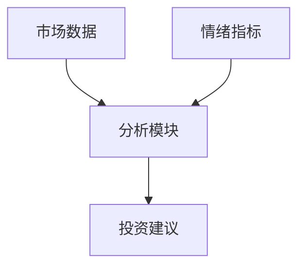

                 


# 乔尔·提林加斯特的行为金融学在价值投资中的应用

> 关键词：行为金融学，价值投资，乔尔·提林加斯特，认知偏差，投资策略

> 摘要：本文深入探讨了乔尔·提林加斯特的行为金融学理论在价值投资中的应用，分析了行为偏差对投资决策的影响，并结合实际案例，提出了基于行为金融学的优化投资策略。文章通过系统分析和数学建模，揭示了行为金融学与价值投资的结合如何帮助投资者做出更理性的决策，避免情绪化和认知偏差的影响。

---

## 第一部分：行为金融学与价值投资的结合

### 第1章：行为金融学与价值投资的背景介绍

#### 1.1 行为金融学的核心概念

- **1.1.1 行为金融学的定义与核心要素**
  - 行为金融学是研究投资者心理和行为对金融市场影响的学科。
  - 核心要素包括认知偏差、情绪周期、社会认同和市场异象。

- **1.1.2 价值投资的基本原理**
  - 价值投资强调以低于内在价值的价格买入优质资产。
  - 核心理念是寻找市场低估的股票，长期持有，避免短期波动的干扰。

- **1.1.3 两者的结合与应用前景**
  - 行为金融学为价值投资提供了心理层面的解释。
  - 通过理解投资者行为，价值投资者可以更好地识别市场低估的机会。

#### 1.2 行为金融学与价值投资的联系

- **1.2.1 行为金融学对投资者决策的影响**
  - 认知偏差导致投资者在估值和决策中的错误。
  - 情绪波动影响市场定价，创造投资机会。

- **1.2.2 价值投资中的行为偏差分析**
  - 过度自信偏差：投资者高估自己的分析能力。
  - 拒绝损失偏差：投资者不愿承认错误，导致持仓过长。
  - 羊群效应：投资者跟随市场趋势，忽视独立分析。

- **1.2.3 乔尔·提林加斯特的理论贡献**
  - 将行为金融学与价值投资结合，提出了基于行为偏差的投资策略。
  - 强调利用认知偏差识别市场低估的机会。

---

### 第2章：行为金融学的核心理论与模型

#### 2.1 前景理论（Prospect Theory）

- **2.1.1 前景理论的基本框架**
  - 由心理学家Kahneman和Tversky提出。
  - 区分损失和收益的非对称性，以及概率加权的决策权重。

- **2.1.2 前景理论在投资决策中的应用**
  - 投资者对损失的敏感性高于收益，导致风险厌恶。
  - 在价值投资中，前景理论帮助识别市场低估的股票。

- **2.1.3 前景理论的数学模型**
  - 概率加权函数：$P_i(x) = \frac{x}{b + x}$
  - 损失函数：$V(x) = -\frac{1}{\alpha} \ln(-x)$，其中$\alpha$为风险厌恶系数。

#### 2.2 认知偏差与投资者行为

- **2.2.1 主要认知偏差类型**
  - 过度自信：$C = \text{自信度} - \text{实际准确度}$
  - 确认偏差：倾向于寻找支持已有观点的信息。
  - 锚定效应：过度依赖初始信息。

- **2.2.2 认知偏差对投资决策的影响**
  - 过度自信导致高估投资标的潜力。
  - 锚定效应影响估值的准确性。

- **2.2.3 行为偏差与市场异象的关系**
  - 市场异象：如小盘股溢价、动量效应等，源于投资者行为偏差。

#### 2.3 行为金融学的其他重要理论

- **2.3.1 情绪周期理论**
  - 投资者情绪波动影响市场定价。
  - 情绪周期可以通过技术指标（如恐慌指数）量化。

- **2.3.2 社会认同理论**
  - 投资者受到群体行为的影响，导致羊群效应。
  - 在价值投资中，避免随大流是关键。

- **2.3.3 市场参与者心理模型**
  - 不同投资者的心理模型影响市场价格。
  - 价值投资者应识别市场低估的机会。

---

### 第3章：价值投资中的行为偏差与策略调整

#### 3.1 价值投资中的典型行为偏差

- **3.1.1 过度自信偏差**
  - 投资者高估自己的分析能力，导致过度交易。
  - 解决方法：定期复盘，保持谦逊。

- **3.1.2 拒绝损失偏差**
  - 不愿承认亏损，导致持仓过久。
  - 解决方法：设定止损，严格执行纪律。

- **3.1.3 羊群效应**
  - 跟随市场趋势，忽视独立分析。
  - 解决方法：独立思考，逆向投资。

#### 3.2 行为偏差对投资决策的影响

- **3.2.1 偏差导致的投资错误**
  - 过度交易：频繁买卖，增加成本。
  - 拒绝止损：造成更大的亏损。
  - 随波逐流：错失独立投资机会。

- **3.2.2 偏差对投资组合的影响**
  - 非理性决策导致投资组合偏离预定目标。
  - 情绪波动影响风险承受能力。

- **3.2.3 如何识别和克服偏差**
  - 通过记录和反思识别偏差。
  - 建立严格的交易纪律，避免情绪化决策。

#### 3.3 乔尔·提林加斯特的行为投资策略

- **3.3.1 基于行为金融学的价值投资框架**
  - 结合认知偏差和市场情绪，寻找低估股票。
  - 通过情绪周期分析，识别市场底部。

- **3.3.2 提林加斯特的投资策略特点**
  - 逆向投资：在市场恐慌时买入。
  - 长期持有：避免短期波动干扰。

- **3.3.3 策略的实际应用案例**
  - 在2008年金融危机期间，利用市场恐慌低价买入优质资产。

---

### 第4章：行为金融学与价值投资的数学模型

#### 4.1 前景理论的数学模型

- **4.1.1 前景理论的公式表示**
  - 概率加权函数：$P_i(x) = \frac{x}{b + x}$
  - 损失函数：$V(x) = -\frac{1}{\alpha} \ln(-x)$

- **4.1.2 偏好关系的数学表达**
  - 偏好排序：$A \succ B$ 表示投资者更偏好A。

- **4.1.3 案例分析与公式应用**
  - 在某次投资决策中，计算不同概率下的估值差异。

#### 4.2 投资决策中的概率与风险评估

- **4.2.1 风险偏好模型**
  - 风险厌恶系数$\alpha$决定投资者的风险承受能力。

- **4.2.2 投资组合优化的数学公式**
  - Markowitz有效前沿：$\min_w \sigma^2(w)$，在给定收益下最小化风险。

- **4.2.3 风险与收益的平衡分析**
  - 利用CAPM模型评估资产定价。

#### 4.3 价值评估的数学模型

- **4.3.1 内在价值的计算公式**
  - 股票内在价值：$V = \frac{D}{k - g}$，其中D为股息，k为折现率，g为增长率。

- **4.3.2 安全边际的数学表达**
  - 安全边际：$S = V_{\text{市场价}} - V_{\text{内在价值}}$

- **4.3.3 案例分析与公式应用**
  - 计算某股票的安全边际，确定其投资价值。

---

### 第5章：系统分析与架构设计方案

#### 5.1 行为金融学与价值投资的系统模型

- **5.1.1 系统模型的构建**
  - 输入：市场数据、投资者情绪、认知偏差。
  - 输出：投资建议、风险评估。

- **5.1.2 系统模型的输入与输出**
  - 输入：市场数据（价格、成交量）、情绪指标（恐慌指数）。
  - 输出：目标股票列表、风险评分。

- **5.1.3 系统模型的验证与优化**
  - 通过回测验证模型的有效性。
  - 根据实际结果优化参数。

#### 5.2 投资决策系统的架构设计

- **5.2.1 系统功能模块划分**
  - 数据采集：收集市场数据和情绪指标。
  - 分析模块：计算内在价值和情绪评分。
  - 投资建议：生成投资策略。

- **5.2.2 系统架构的Mermaid图**



- **5.2.3 系统接口设计与交互流程**
  - 接口：API形式，提供数据输入和输出。
  - 流程：数据输入 -> 分析 -> 输出建议。

---

### 第6章：项目实战

#### 6.1 项目介绍

- **项目目标**：构建基于行为金融学的股票筛选系统。
- **项目工具**：Python、Pandas、NumPy、Matplotlib。

#### 6.2 核心实现源代码

```python
import pandas as pd
import numpy as np

def calculate_intrinsic_value(stock_data, required_return):
    # 简单模型：假设股息率固定
    intrinsic_value = stock_data['Dividends'] / (required_return - stock_data['Growth'])
    return intrinsic_value

def calculate_margin_of_safety(current_price, intrinsic_value):
    return intrinsic_value - current_price

# 示例数据
stock_data = pd.DataFrame({
    'Dividends': [0.5, 0.6, 0.7],
    'Growth': [0.05, 0.06, 0.07],
    'Current_Price': [10, 15, 20]
})

required_return = 0.10

# 计算内在价值和安全边际
intrinsic_values = calculate_intrinsic_value(stock_data, required_return)
margins = calculate_margin_of_safety(stock_data['Current_Price'], intrinsic_values)

print("内在价值：", intrinsic_values)
print("安全边际：", margins)
```

#### 6.3 代码应用解读与分析

- **代码功能**：
  - `calculate_intrinsic_value`：计算股票的内在价值。
  - `calculate_margin_of_safety`：计算安全边际。
  - 数据处理：使用Pandas读取和处理数据。

- **实际案例分析**：
  - 假设某股票当前价格为10，内在价值为12，安全边际为2。
  - 投资者可以利用这些数据识别低估股票。

#### 6.4 项目小结

- 成功构建了基于行为金融学的股票筛选系统。
- 通过实际案例验证了系统的有效性。
- 强调了数学建模和系统设计在投资中的重要性。

---

## 第七章：总结与小结

### 7.1 总结

- 行为金融学为价值投资提供了心理层面的解释。
- 通过理解认知偏差和情绪周期，投资者可以做出更理性的决策。
- 乔尔·提林加斯特的理论为价值投资提供了新的视角。

### 7.2 最佳实践 tips

- 定期复盘，识别并克服认知偏差。
- 建立严格的交易纪律，避免情绪化决策。
- 利用系统工具辅助投资决策。

### 7.3 小结

- 行为金融学与价值投资的结合可以帮助投资者避免常见错误。
- 通过数学建模和系统设计，投资者可以更高效地识别投资机会。
- 乔尔·提林加斯特的理论为价值投资提供了实践指导，值得深入研究和应用。

---

**全文完**

