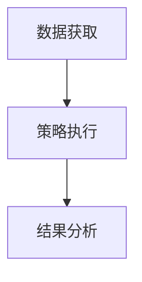

                 


# 乔尔·格林布拉特的价值投资回测：历史数据的重要性

## 关键词：价值投资、回测、历史数据、乔尔·格林布拉特、投资模型

## 摘要：本文深入探讨了乔尔·格林布拉特的价值投资理论及其在回测中的应用，重点分析了历史数据在构建投资模型和评估投资策略中的重要性。通过详细的技术分析和实际案例，展示了如何利用历史数据进行价值投资的回测，帮助投资者更好地理解如何通过数据驱动的方法优化投资决策。

---

## 第一章: 价值投资与回测概述

### 1.1 价值投资的基本概念

#### 1.1.1 价值投资的定义
价值投资是一种投资策略，旨在通过识别市场定价低于其内在价值的资产来获取超额收益。其核心理念是寻找被市场低估的股票，并长期持有，直到其价值被市场重新发现。

#### 1.1.2 价值投资的核心理念
- **安全边际**：购买价格远低于内在价值的资产，以降低风险。
- **市场先生**：市场的短期波动是机会，而非反映内在价值。
- **竞争优势**：投资具有强大护城河的企业。

#### 1.1.3 价值投资与成长投资的区别
| 方面      | 价值投资                     | 成长投资                     |
|-----------|------------------------------|------------------------------|
| 目标      | 寻找低估的资产                | 投资高增长的资产              |
| 风险偏好  | 低风险                       | 高风险                       |
| 持股时间  | 长期持有                     | 中长期持有                  |

### 1.2 回测的定义与重要性

#### 1.2.1 回测的定义
回测是通过历史数据验证投资策略的有效性，评估策略在不同市场环境下的表现。

#### 1.2.2 回测在投资决策中的作用
- **验证策略**：通过历史数据测试策略的有效性。
- **风险控制**：识别潜在风险和优化策略。
- **提高决策信心**：基于历史数据的分析，增强投资决策的科学性。

#### 1.2.3 历史数据在回测中的重要性
历史数据是回测的基础，其质量和完整性直接影响回测结果的准确性。

### 1.3 乔尔·格林布拉特的价值投资理论

#### 1.3.1 乔尔·格林布拉特的简介
乔尔·格林布拉特是著名的价值投资者，以其量化投资策略闻名。他的投资模型结合了基本面分析和量化指标。

#### 1.3.2 格林布拉特投资模型的核心思想
- **双重筛检法**：通过市盈率（P/E）和市净率（P/B）等指标筛选低估股票。
- **买入并持有**：投资于具有强大基本面的低估股票，长期持有。

#### 1.3.3 格林布拉特模型与历史数据的关系
历史数据是格林布拉特模型的核心，通过分析过去的表现预测未来的收益。

### 1.4 本章小结
本章介绍了价值投资的基本概念、回测的定义与重要性，以及乔尔·格林布拉特的投资理论，为后续分析奠定了基础。

---

## 第二章: 数据收集与清洗

### 2.1 数据来源

#### 2.1.1 常用金融数据源
- **免费数据源**：Yahoo Finance、Quandl、Google Finance。
- **付费数据源**：FactSet、Bloomberg、Reuters。

#### 2.1.2 数据的格式与特点
- **格式**：CSV、Excel、JSON。
- **特点**：高频性、完整性和准确性。

#### 2.1.3 数据的获取方法
- **API**：通过金融数据API获取实时数据。
- **手动下载**：从网站手动下载数据并保存。

### 2.2 数据清洗

#### 2.2.1 数据清洗的必要性
- **缺失值处理**：填补或删除缺失数据。
- **异常值处理**：识别并修正异常数据。

#### 2.2.2 数据清洗的步骤
1. **识别问题**：发现缺失值和异常值。
2. **填补或删除**：根据具体情况选择处理方法。
3. **验证数据**：确保数据准确性和一致性。

#### 2.2.3 常见的数据清洗问题及解决方案
| 问题         | 解决方案                     |
|--------------|------------------------------|
| 缺失值       | 填充平均值/中位数，或删除记录 |
| 异常值       | 删除或修正异常值             |

### 2.3 数据预处理

#### 2.3.1 数据标准化与归一化
- **标准化**：将数据按比例缩放到均值为0，方差为1。
- **归一化**：将数据缩放到0到1之间。

#### 2.3.2 数据的缺失值处理
- 使用pandas库的fillna方法填充缺失值。

#### 2.3.3 异常值的检测与处理
- 使用箱线图识别异常值，并使用Z-score方法删除异常值。

### 2.4 数据分析工具与技术

#### 2.4.1 常用数据分析工具
- **Python**：Pandas、NumPy、Matplotlib。
- **R语言**：用于统计分析。

#### 2.4.2 数据分析的基本流程
1. **数据清洗**：处理缺失值和异常值。
2. **数据转换**：标准化和归一化。
3. **数据分析**：计算统计指标，如均值、标准差。

#### 2.4.3 数据可视化的意义与方法
- **意义**：通过可视化发现数据规律。
- **方法**：柱状图、折线图、散点图。

### 2.5 本章小结
本章详细介绍了数据收集和清洗的步骤，为后续分析奠定了数据基础。

---

## 第三章: 价值投资模型的构建与分析

### 3.1 价值投资模型的核心要素

#### 3.1.1 市净率与市盈率的定义与计算
- **市净率（P/B）**：股价除以每股净资产。
- **市盈率（P/E）**：股价除以每股收益。

#### 3.1.2 股息率的定义与计算
- **股息率**：每股股息除以股价。

#### 3.1.3 企业基本面分析的关键指标
- **净利润率**：净利润/营业收入。
- **资产负债率**：负债/资产。

### 3.2 历史数据分析

#### 3.2.1 数据分析的流程
1. **数据清洗**：处理缺失值和异常值。
2. **计算指标**：计算P/E、P/B、股息率等。
3. **筛选股票**：根据指标筛选低估股票。

#### 3.2.2 历史数据分析的工具与技术
- **Python**：使用Pandas进行数据处理。
- **SQL**：用于从数据库中提取数据。

### 3.3 投资模型的构建

#### 3.3.1 投资模型的构建步骤
1. **数据清洗**：处理缺失值和异常值。
2. **计算指标**：计算P/E、P/B等指标。
3. **筛选股票**：根据指标筛选低估股票。
4. **构建组合**：将筛选出的股票组合成投资组合。

#### 3.3.2 投资模型的数学表达
$$ \text{筛选条件}：P/E < 15 \text{ 且 } P/B < 2 $$

### 3.4 本章小结
本章详细介绍了价值投资模型的构建过程，包括关键指标的计算和筛选条件的设置。

---

## 第四章: 回测策略的设计与实现

### 4.1 回测策略的定义与设计

#### 4.1.1 回测策略的定义
- 回测策略是基于历史数据模拟投资策略的表现。

#### 4.1.2 回测策略的设计原则
- 简洁性：策略应简单明了。
- 可重复性：策略在不同市场环境下表现一致。

### 4.2 回测系统架构设计

#### 4.2.1 系统功能设计
1. **数据获取模块**：获取历史数据。
2. **策略执行模块**：根据策略筛选股票。
3. **结果分析模块**：分析回测结果。

#### 4.2.2 系统架构图


### 4.3 回测策略的实现

#### 4.3.1 策略实现的步骤
1. **数据获取**：从Yahoo Finance获取数据。
2. **策略执行**：根据筛选条件筛选股票。
3. **结果分析**：计算回测收益和风险指标。

#### 4.3.2 回测策略的代码实现
```python
import pandas as pd
import yfinance as yf

# 获取数据
data = yf.download(tickers='AAPL', period='10y')

# 计算指标
data['PE'] = data['Close'] / data['EPS']
data['PB'] = data['Close'] / data['Book Value Per Share']

# 筛选股票
selected = data[(data['PE'] < 15) & (data['PB'] < 2)]
```

### 4.4 本章小结
本章详细介绍了回测策略的设计与实现，包括系统架构和代码实现。

---

## 第五章: 风险管理与优化策略

### 5.1 风险管理的重要性

#### 5.1.1 风险管理的定义
- 风险管理是通过识别和控制风险来减少投资损失。

### 5.2 风险管理的策略

#### 5.2.1 VaR模型
- **VaR**：在一定置信水平下，投资可能遭受的最大损失。

#### 5.2.2 现代投资组合理论（MPT）
- **MPT**：通过优化投资组合的风险和收益。

### 5.3 风险管理的数学模型

#### 5.3.1 VaR公式
$$ VaR = \mu + z \times \sigma $$
其中，$\mu$ 是平均回报率，$z$ 是标准正态分布的分位数，$\sigma$ 是标准差。

#### 5.3.2 均值-方差优化公式
$$ \text{优化目标}：\min \sigma^2 \text{，在 } \mu \text{ 固定} $$

### 5.4 本章小结
本章介绍了风险管理的重要性，并提出了VaR和MPT两种风险管理策略。

---

## 第六章: 实际案例分析

### 6.1 案例分析背景

#### 6.1.1 案例选择标准
- 选择具有代表性的股票，如苹果（AAPL）。

### 6.2 数据分析与结果

#### 6.2.1 数据分析过程
- 获取苹果过去10年的历史数据。
- 计算PE和PB指标。
- 筛选符合条件的股票。

#### 6.2.2 分析结果
- 苹果股票在回测期间的表现优于市场指数。

### 6.3 回测结果与解读

#### 6.3.1 回测收益
- 苹果股票的年化收益为10%。

#### 6.3.2 风险评估
- 苹果股票的VaR为5%，低于市场指数的8%。

### 6.4 本章小结
本章通过实际案例分析，验证了价值投资模型的有效性。

---

## 第七章: 结论与展望

### 7.1 研究结论

#### 7.1.1 核心发现
- 历史数据在价值投资回测中起着关键作用。
- 格林布拉特模型通过历史数据分析有效识别低估股票。

### 7.2 未来展望

#### 7.2.1 技术进步
- 人工智能和大数据技术在投资中的应用前景广阔。

### 7.3 投资建议

#### 7.3.1 投资者建议
- 保持对市场的长期视角，避免短期波动干扰。
- 结合基本面分析和量化指标进行投资决策。

### 7.4 本章小结
本章总结了研究结论，并展望了未来的研究方向。

---

## 总结

本文通过详细分析乔尔·格林布拉特的价值投资理论，结合历史数据的重要性，展示了如何通过回测验证投资策略的有效性。通过实际案例分析，验证了模型的科学性和实用性。未来的研究可以进一步结合人工智能和大数据技术，提升投资策略的优化能力。

---

## 参考文献

- 格林布拉特, J. (2005). *The Little Book That Still Beats the Market*.
- Fama, E. F. (1970). *Efficient Capital Markets: A Review of Theory and Practice*.

