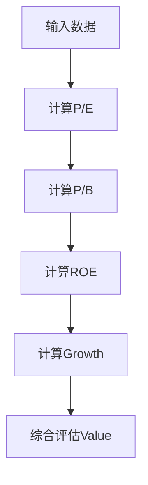
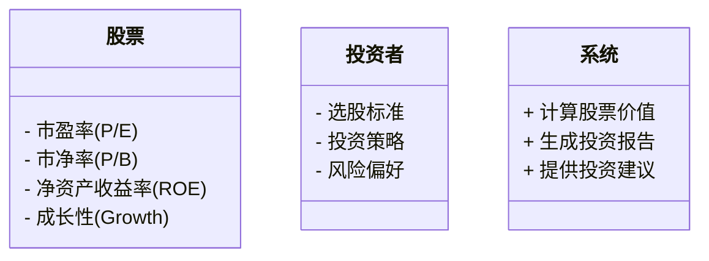
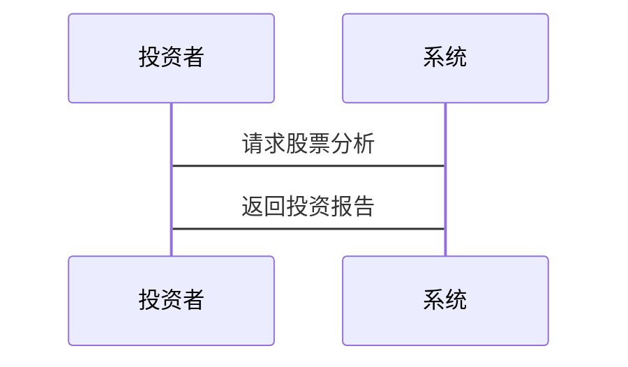

                 

# 乔尔·格林布拉特的价值投资学术研究

> 关键词：价值投资、基本面分析、数学模型、系统架构设计、投资策略

> 摘要：本文深入探讨了乔尔·格林布拉特的价值投资学术研究，分析了其核心理论、数学模型、系统架构设计以及实际投资策略。文章从价值投资的定义、基本面分析的核心要素、格林布拉特多因素模型的数学表达、系统架构设计的详细分析，到实际投资策略的案例分析，层层递进，为读者提供了全面而深入的见解。通过本文，读者将能够理解如何利用技术手段辅助价值投资决策，并掌握如何构建一个完整的价值投资分析系统。

---

# 第一部分: 价值投资的背景与核心概念

# 第1章: 价值投资的基本概念

## 1.1 价值投资的起源与发展

### 1.1.1 价值投资的起源
价值投资是一种以公司基本面分析为基础的投资策略，起源于20世纪初。本杰明·格雷厄姆和戴维·多德是这一理论的奠基人。他们认为市场情绪波动会导致股票价格偏离其内在价值，投资者可以通过分析公司财务报表和行业状况，找到那些被市场低估的股票进行投资。

### 1.1.2 价值投资的核心思想
价值投资的核心思想是寻找市场定价低于其内在价值的公司。这种低估通常由市场短期波动或投资者情绪导致。投资者通过长期持有这些股票，等待市场重新评估其价值，从而获得超额收益。

### 1.1.3 乔尔·格林布拉特的贡献
乔尔·格林布拉特是价值投资领域的著名学者，他进一步发展了格雷厄姆和多德的理论，提出了多因素模型，结合市盈率（P/E）、市净率（P/B）、ROE（净资产收益率）和成长性等多维度指标，构建了一个更为完善的股票筛选模型。

## 1.2 价值投资的核心要素

### 1.2.1 市场有效性的讨论
市场有效性是一个关键问题。如果市场是完全有效的，价值投资可能无法获得超额收益。然而，现实中市场并不总是有效，尤其是在短期波动中，股票价格可能偏离其内在价值。

### 1.2.2 价值与价格的定义与区别
- **价值**：一家公司的内在价值，通常通过基本面分析得出，包括盈利能力、资产质量、成长潜力等因素。
- **价格**：市场交易价格，受市场情绪和短期因素影响。

### 1.2.3 安全边际的概念与重要性
安全边际是价值投资中的一个重要概念，指股票价格与内在价值之间的差距。通过购买价格低于内在价值的股票，投资者可以降低投资风险，确保在市场波动中依然能够获得收益。

## 1.3 价值投资的适用场景与边界

### 1.3.1 价值投资的适用市场
价值投资在成熟市场和新兴市场都适用，但在成熟市场表现更为稳定，因为市场波动较小，内在价值更容易被识别。

### 1.3.2 价值投资的局限性
- 市场短期波动可能导致价值投资者长期持有股票，面临资金流动性风险。
- 需要大量时间和精力进行基本面分析，对个人投资者来说可能成本较高。

### 1.3.3 价值投资与其他投资策略的对比
- **成长投资**：注重公司未来增长潜力，可能忽视当前盈利能力。
- **指数投资**：通过分散投资降低风险，但无法获得超额收益。
- **短线交易**：注重技术分析和市场情绪，风险较高。

# 第2章: 价值投资的数学模型与公式

## 2.1 基本面分析的核心公式

### 2.1.1 市盈率（P/E）公式
$$ P/E = \frac{Price}{Earnings} $$
市盈率是衡量股票价格与盈利能力的指标，低市盈率通常意味着股票价格被低估。

### 2.1.2 市净率（P/B）公式
$$ P/B = \frac{Price}{Book\ Value} $$
市净率是衡量股票价格与账面价值的指标，低市净率通常意味着股票价格被低估。

### 2.1.3 股息率公式
$$ Dividend\ Yield = \frac{Dividend}{Price} \times 100\% $$
股息率是衡量股票分红能力的指标，高股息率通常意味着股票具有较高的分红潜力。

## 2.2 格林布拉特多因素模型

### 2.2.1 模型的数学表达
$$ Value = f(P/E, P/B, ROE, Growth) $$
该模型通过综合考虑市盈率、市净率、净资产收益率和成长性，筛选出具有长期竞争优势的公司。

### 2.2.2 模型的算法流程图

# 第3章: 价值投资的系统架构设计

## 3.1 系统功能设计

### 3.1.1 领域模型

## 3.2 系统架构设计

### 3.2.1 系统模块划分
- 数据采集模块：负责收集股票的基本面数据和市场数据。
- 模型计算模块：基于格林布拉特多因素模型，计算股票的内在价值。
- 报告生成模块：生成投资报告，提供投资建议。

### 3.2.2 系统架构图

## 3.3 系统接口设计

### 3.3.1 API接口
- 数据接口：提供股票数据的API。
- 计算接口：提供股票价值计算的API。
- 报告接口：提供投资报告的API。

## 3.4 系统交互设计

### 3.4.1 用户与系统交互流程图

# 第4章: 实际投资策略与案例分析

## 4.1 实际投资策略

### 4.1.1 选股标准
- 低市盈率
- 低市净率
- 高净资产收益率
- 高成长性

### 4.1.2 投资组合管理
- 分散投资
- 定期调整
- 风险控制

## 4.2 案例分析

### 4.2.1 案例一：苹果公司
- 市盈率：$$ P/E = \frac{Price}{Earnings} $$
- 市净率：$$ P/B = \frac{Price}{Book\ Value} $$
- 净资产收益率：ROE = 净利润 / 净资产

### 4.2.2 案例二：微软公司
- 市场地位稳定
- 高净资产收益率
- 高成长性

## 4.3 案例分析总结

### 4.3.1 案例分析结果
通过格林布拉特模型分析，苹果和微软都是具有长期竞争优势的公司，符合价值投资的标准。

### 4.3.2 案例分析小结
价值投资需要结合公司基本面和市场环境，选择具有长期竞争优势的公司进行投资。

# 第5章: 结论与展望

## 5.1 研究总结
通过本文的分析，我们可以得出结论：乔尔·格林布拉特的价值投资学术研究为投资者提供了一套科学的股票筛选方法，结合基本面分析和数学模型，可以帮助投资者找到被低估的股票。

## 5.2 未来研究方向
- 研究机器学习在价值投资中的应用
- 探讨高频交易策略
- 深入研究国际市场的价值投资策略

## 5.3 投资建议
- 投资者应结合市场环境和个人风险偏好，选择适合自己的投资策略。
- 长期持有优质股票是价值投资的核心，市场波动是投资者的朋友。

---

# 参考文献

1. 格林布拉特，乔尔. *《股市投资的策略和技巧》*
2. 格雷厄姆，本杰明. *《证券分析》*
3. 多德，戴维. *《投资理论与实践》*

---

通过本文的详细分析，读者可以全面了解乔尔·格林布拉特的价值投资学术研究，并能够将其应用于实际投资中。希望本文能够为价值投资者提供有益的指导和启示。

