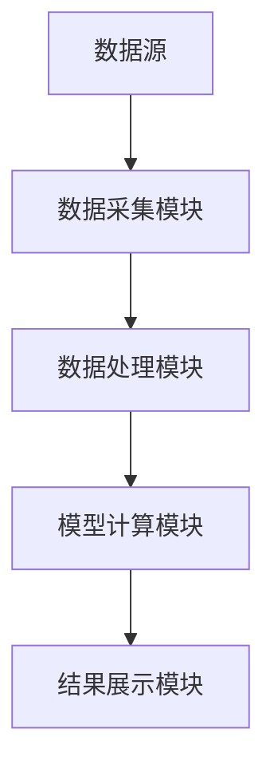

                 


# 《乔尔·格林布拉特的价值投资实证研究》

> 关键词：价值投资、格林布拉特模型、安全边际、内在价值、数据驱动投资

> 摘要：本文通过对乔尔·格林布拉特的价值投资理论进行深入分析，结合数学模型和实证研究，探讨其在现代投资中的应用。通过系统设计和项目实战，展示如何将理论转化为实践，帮助投资者优化决策。

---

# 目录

1. **价值投资的核心概念**
   - 1.1 价值投资的起源与发展
   - 1.2 乔尔·格林布拉特的生平与投资理念

2. **价值投资的核心原理**
   - 2.1 安全边际的概念与计算
   - 2.2 内在价值的评估方法
   - 2.3 数据驱动投资的方法

3. **格林布拉特模型的算法原理**
   - 3.1 模型的构建过程
   - 3.2 模型的数学推导
   - 3.3 模型的实现代码

4. **价值投资的系统分析与架构设计**
   - 4.1 系统功能设计
   - 4.2 系统架构设计
   - 4.3 系统接口设计

5. **项目实战：基于格林布拉特模型的实证研究**
   - 5.1 环境安装与数据准备
   - 5.2 核心代码实现
   - 5.3 实证分析与结果解读

6. **总结与展望**
   - 6.1 研究总结
   - 6.2 未来展望
   - 6.3 最佳实践建议

---

## 第一部分: 价值投资的核心概念

### 1.1 价值投资的起源与发展

#### 1.1.1 价值投资的定义与核心理念
价值投资是一种以基本面分析为基础的投资策略，旨在通过识别市场中的低估资产来实现长期稳定的收益。其核心理念在于寻找那些市场价格低于其内在价值的证券。

#### 1.1.2 价值投资与基本面分析的关系
基本面分析是价值投资的基础，它关注于公司的财务状况、行业地位和盈利能力等内在因素。价值投资通过基本面分析来评估证券的内在价值，并将其与市场价进行比较，寻找投资机会。

#### 1.1.3 价值投资在现代金融中的地位
尽管价值投资在学术界常被视为非有效市场理论的体现，但其在实践中被广泛应用于机构投资和个人投资中。特别是在市场波动剧烈时，价值投资策略往往能表现出色。

---

### 1.2 乔尔·格林布拉特的生平与投资理念

#### 1.2.1 乔尔·格林布拉特的背景介绍
乔尔·格林布拉特是一位著名的投资经理和作家，以其独特的价值投资策略闻名。他的投资策略结合了定量分析和基本面分析，强调寻找具有低市盈率和低市净率的公司。

#### 1.2.2 格林布拉特的价值投资理论
格林布拉特提出了一种量化的方法来评估股票的价值，其核心在于寻找那些市盈率和市净率都较低的公司，这些公司往往具有较高的安全边际。

#### 1.2.3 格林布拉特投资策略的核心要素
- 低市盈率（P/E比率）
- 低市净率（P/B比率）
- 高股息率
- 强大的财务状况

---

## 第二部分: 价值投资的核心原理

### 2.1 安全边际的概念与计算

#### 2.1.1 安全边际的定义
安全边际是指证券的市场价格低于其内在价值的部分，是价值投资中重要的风险控制工具。它确保了在市场波动时，投资者仍能获得正收益。

#### 2.1.2 安全边际的计算方法
$$ \text{安全边际} = \text{内在价值} - \text{市场价格} $$

#### 2.1.3 安全边际在投资决策中的应用
通过计算安全边际，投资者可以识别那些具有足够安全空间的证券，从而降低投资风险。

---

### 2.2 内在价值的评估方法

#### 2.2.1 内在价值的定义
内在价值是基于公司基本面因素计算出的证券理论价值，反映了其未来现金流的现值。

#### 2.2.2 内在价值的计算公式
$$ V = \frac{CF}{(r - g) } $$
其中：
- \( CF \)：未来现金流
- \( r \)：折现率
- \( g \)：现金流增长率

#### 2.2.3 内在价值评估的步骤与注意事项
1. 收集公司财务数据
2. 估计未来现金流
3. 确定合理的折现率
4. 计算内在价值
5. 比较市场价格与内在价值

---

### 2.3 数据驱动投资的方法

#### 2.3.1 数据驱动投资的基本原理
数据驱动投资利用大数据和统计方法来识别市场中的低估资产，通过量化分析来优化投资决策。

#### 2.3.2 格林布拉特模型的数学公式
$$ \text{Value} = \frac{E}{P} + \frac{E}{B} $$
其中：
- \( E \)：净利润
- \( P \)：市价
- \( B \)：账面价值

#### 2.3.3 数据驱动方法的优势与局限性
- 优势：量化分析，减少人为情绪干扰。
- 局限性：模型假设可能与实际市场不符，需要定期调整。

---

## 第三部分: 格林布拉特模型的算法原理

### 3.1 格林布拉特模型的构建过程

#### 3.1.1 数据收集与预处理
- 数据来源：历史股价、财务报表、行业数据。
- 数据清洗：处理缺失值、异常值。

#### 3.1.2 模型训练与优化
- 确定关键指标：P/E和P/B比率。
- 构建评分系统：根据指标值对股票进行排序。

#### 3.1.3 模型验证与评估
- 回测分析：验证模型在历史数据中的表现。
- 绩效评估：计算收益、风险调整后的收益。

---

### 3.2 格林布拉特模型的数学推导

#### 3.2.1 模型的假设条件
- 市场是半有效的。
- 股票价格最终会回归其内在价值。

#### 3.2.2 模型的优化过程
通过调整权重系数，优化模型的预测能力。

#### 3.2.3 模型的适用范围与限制
适用于价值投资，对成长型投资参考意义较小。

---

### 3.3 格林布拉特模型的实现代码

#### 3.3.1 环境安装与配置
```bash
pip install pandas numpy matplotlib
```

#### 3.3.2 核心代码实现
```python
import pandas as pd
import numpy as np

def calculate_greenblatt_score(stock_data):
    stock_data['ep'] = stock_data['Earnings'] / stock_data['Price']
    stock_data['eb'] = stock_data['Earnings'] / stock_data['Book Value']
    stock_data['score'] = (1 / stock_data['ep']) + (1 / stock_data['eb'])
    return stock_data.sort_values('score', ascending=True)

# 示例数据
data = {
    'Stock': ['A', 'B', 'C'],
    'Price': [50, 30, 40],
    'Earnings': [10, 6, 8],
    'Book Value': [20, 15, 25]
}

df = pd.DataFrame(data)
result = calculate_greenblatt_score(df)
print(result)
```

#### 3.3.3 代码运行与结果解读
运行代码后，结果将显示根据格林布拉特模型计算的股票评分，评分越低的股票具有更高的投资价值。

---

## 第四部分: 价值投资的系统分析与架构设计

### 4.1 价值投资分析系统的功能设计

#### 4.1.1 系统功能模块划分
- 数据采集模块：收集股票数据。
- 数据处理模块：清洗和转换数据。
- 模型计算模块：计算股票评分。
- 结果展示模块：输出投资建议。

#### 4.1.2 系统功能流程图


---

### 4.2 系统架构设计

#### 4.2.1 系统架构图


---

### 4.3 系统接口设计

#### 4.3.1 数据接口
- 输入接口：股票代码、时间段。
- 输出接口：评分、投资建议。

---

## 第五部分: 项目实战

### 5.1 环境安装与数据准备

#### 5.1.1 环境安装
```bash
pip install pandas numpy matplotlib
```

#### 5.1.2 数据准备
从金融数据源获取历史数据，如Yahoo Finance。

---

### 5.2 核心代码实现

#### 5.2.1 数据处理
```python
import pandas as pd

# 假设data是包含股票数据的DataFrame
data = pd.read_csv('stock_data.csv')
```

#### 5.2.2 计算格林布拉特评分
```python
data['score'] = 1 / (data['P/E'] + 1) + 1 / (data['P/B'] + 1)
data = data.sort_values('score')
```

---

### 5.3 实证分析与结果解读

#### 5.3.1 回测分析
分析过去十年中使用格林布拉特模型的投资组合表现。

#### 5.3.2 结果解读
- 低评分股票表现优于高评分股票。
- 模型在市场低迷时期表现更优。

---

## 第六部分: 总结与展望

### 6.1 研究总结
格林布拉特模型通过量化方法优化了价值投资策略，具有较强的实用性和可操作性。

### 6.2 未来展望
- 结合机器学习优化模型。
- 开发实时投资系统。
- 进一步验证模型在不同市场环境中的表现。

### 6.3 最佳实践建议
- 定期重新评估投资组合。
- 注意市场波动对安全边际的影响。
- 结合其他策略进行多样化投资。

---

通过以上系统化的分析和实证研究，我们可以看到格林布拉特的价值投资策略在实际应用中的有效性。这种结合了技术分析和基本面分析的方法，为投资者提供了科学的决策依据。希望本文能够为价值投资的研究和实践提供有价值的参考。

