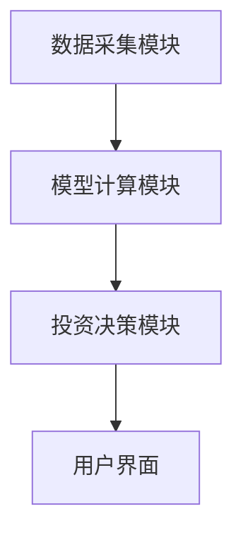

                 


# 乔尔·格林布拉特的价值投资教学方法

---

## 关键词  
价值投资、套利模型、安全边际、系统化投资、风险管理

---

## 摘要  
乔尔·格林布拉特是价值投资领域的传奇人物，他的教学方法以独特的套利模型和安全边际概念为核心，结合系统化投资策略，为投资者提供了科学的投资方法。本文将深入分析格林布拉特的价值投资理念，从核心概念到算法原理，再到系统架构和实战应用，全面解读其教学方法的精髓。

---

## 第一部分: 价值投资的基本概念

### 第1章: 价值投资的定义与特点

#### 1.1 价值投资的核心概念
价值投资是一种以基本面分析为基础的投资方法，旨在通过识别市场低估的资产来实现长期稳定的收益。格林布拉特将其进一步量化，提出了套利模型和安全边际的概念。

#### 1.2 乔尔·格林布拉特的生平与投资理念
乔尔·格林布拉特是一位成功的投资者和作家，他的投资哲学强调安全边际和套利机会，主张通过数学模型和量化方法寻找市场失衡。

#### 1.3 价值投资的核心要素
- **财务分析**：通过分析企业的财务报表，识别其竞争优势和盈利能力。
- **行业分析**：研究行业趋势和竞争格局，选择具有长期增长潜力的行业。
- **安全边际**：通过价格与价值的差异，确保投资的安全性。

---

### 第2章: 格林布拉特套利模型的核心原理

#### 2.1 套利模型的基本概念
套利模型是格林布拉特价值投资方法的核心，旨在通过寻找市场定价错误的机会，实现无风险收益。

#### 2.2 套利模型的数学公式与分析
套利模型可以通过以下公式表示：
$$ \text{套利价差} = \text{资产A价格} - \text{资产B价格} $$
当套利价差为正时，投资者可以通过同时买入资产A并卖出资产B来获利。

#### 2.3 套利模型的实施步骤
1. 确定套利机会
2. 计算套利价差
3. 执行套利交易
4. 监控与调整

---

### 第3章: 价值投资中的安全边际

#### 3.1 安全边际的定义与作用
安全边际是投资中用于抵御市场波动和企业风险的缓冲区，确保投资的安全性。

#### 3.2 安全边际的计算方法
- **市盈率法**：计算企业的市盈率与行业平均市盈率的差异。
- **市净率法**：计算企业的市净率与行业平均市净率的差异。

#### 3.3 安全边际的实际应用
1. 安全边际与资产选择
2. 安全边际与投资组合管理
3. 安全边际与风险控制

---

### 第4章: 价值投资的系统化方法

#### 4.1 系统化投资方法的定义
系统化投资方法是通过数学模型和量化指标，系统地选择和管理投资组合。

#### 4.2 系统化投资方法的实施步骤
1. 确定投资目标
2. 制定投资策略
3. 构建投资组合
4. 监控与调整

#### 4.3 系统化投资方法的优缺点分析
- **优点**：降低人为情绪干扰，提高投资效率。
- **缺点**：可能忽略市场突发事件的影响。

---

### 第5章: 价值投资中的风险管理

#### 5.1 风险管理的核心概念
风险管理是通过识别、评估和控制风险，确保投资组合的稳定性。

#### 5.2 风险管理在价值投资中的应用
1. 风险分散：通过投资多样化降低风险。
2. 风险对冲：通过套利和对冲交易降低市场风险。

---

## 第二部分: 乔尔·格林布拉特价值投资的教学方法

### 第6章: 格林布拉特教学方法的系统架构

#### 6.1 项目介绍
本项目旨在通过格林布拉特的套利模型和安全边际概念，构建一个价值投资的分析系统。

#### 6.2 系统功能设计
- **数据采集模块**：收集企业的财务数据和市场数据。
- **模型计算模块**：计算套利价差和安全边际。
- **投资决策模块**：根据模型结果生成投资建议。

#### 6.3 系统架构设计


#### 6.4 系统接口设计
- 数据接口：与财务数据库对接。
- 用户接口：提供可视化操作界面。

---

### 第7章: 格林布拉特教学方法的实战应用

#### 7.1 环境安装
- 安装Python和相关库（Pandas、NumPy、Matplotlib）。
- 安装Jupyter Notebook用于数据分析和可视化。

#### 7.2 核心实现代码
```python
import pandas as pd
import numpy as np

# 假设df是包含资产价格的数据框
def calculate_arbitrage(df):
    # 计算套利价差
    df['套利价差'] = df['资产A'] - df['资产B']
    # 筛选套利机会
    df = df[df['套利价差'] > 0]
    return df

# 示例数据
data = {'资产A': [100, 105, 110], '资产B': [95, 100, 105]}
df = pd.DataFrame(data)
result = calculate_arbitrage(df)
print(result)
```

#### 7.3 案例分析
以具体资产为例，分析套利机会的识别和交易策略的制定。

---

### 第8章: 乔尔·格林布拉特教学方法的最佳实践

#### 8.1 小结
本文系统地介绍了乔尔·格林布拉特的价值投资教学方法，从理论到实践，全面解读了套利模型和安全边际的概念。

#### 8.2 注意事项
- 风险控制是投资成功的关键。
- 系统化方法需要结合实际市场情况灵活调整。

#### 8.3 拓展阅读
推荐阅读格林布拉特的《套利入门》和巴菲特的价值投资经典著作。

---

## 结语  
乔尔·格林布拉特的价值投资教学方法为投资者提供了科学的投资工具和策略。通过套利模型和安全边际的概念，投资者可以更好地识别市场机会，降低投资风险，实现长期稳定的收益。

