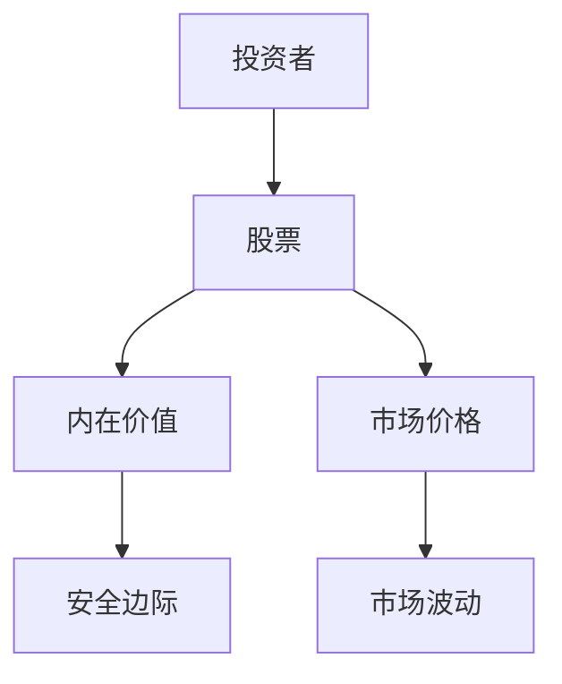
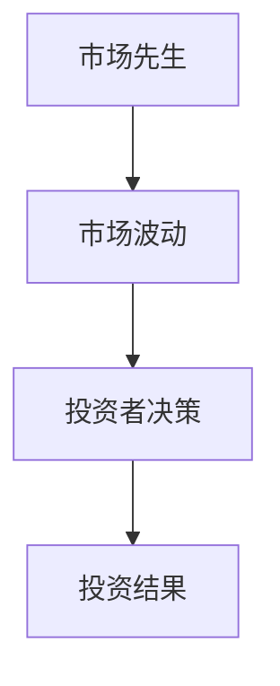
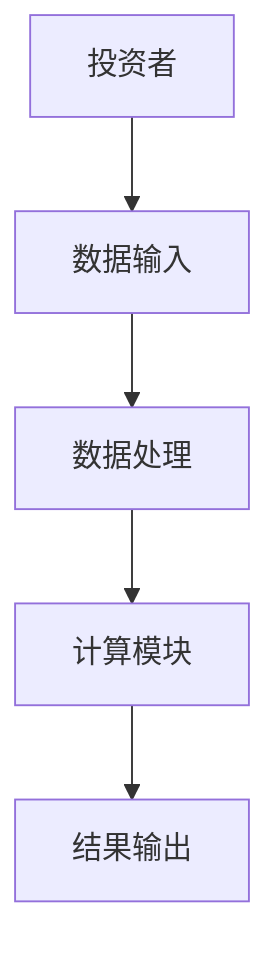

                 


# 乔尔·格林布拉特的价值投资教育理念

> 关键词：价值投资，安全边际，市场先生，投资策略，长期投资

> 摘要：本文深入探讨了乔尔·格林布拉特的价值投资理念，分析了其核心概念、算法原理及其在投资中的应用。通过对比分析、系统架构和案例实战，揭示了如何通过安全边际和市场先生理论实现稳健投资。

---

## 正文

### 第一部分: 价值投资的背景与核心理念

#### 第1章: 价值投资的定义与历史演变

##### 1.1 价值投资的定义与特征
- **投资的基本概念**：投资是将资金投入资产以获得未来收益的行为。资产可以是股票、债券、房地产等。
- **价值投资的定义**：寻找市场价格低于内在价值的资产进行投资，以期获得长期收益。
- **与其他投资策略的对比**：与趋势投资和技术分析不同，价值投资注重基本面分析，寻找市场低估的企业。

##### 1.2 价值投资的历史演变
- **起源与发展**：价值投资起源于20世纪初，格雷厄姆和多德是早期代表人物。
- **现代演变**：格林布拉特在传统价值投资基础上，引入安全边际和市场先生理论，使理念更加系统化。

##### 1.3 格林布拉特的贡献
- **生平简介**：格林布拉特是哥伦比亚大学教授，著有《安全边际》等书籍。
- **创新贡献**：提出安全边际和市场先生理论，强调情绪化对市场的影响。

#### 第2章: 格林布拉特的价值投资理念

##### 2.1 核心投资策略
- **安全边际**：内在价值与市场价格的差额，是投资的安全垫。
- **市场先生理论**：将市场情绪化为市场先生，帮助投资者理性决策。

##### 2.2 投资组合管理
- **构建原则**：分散投资，降低风险。
- **股票选择标准**：低市盈率、低市净率、高收益率的股票。

##### 2.3 长期投资策略
- **优势**：避免短期波动，捕捉长期增长。
- **挑战**：需要耐心和纪律。

### 第二部分: 核心概念与联系

#### 核心概念原理
- **安全边际的计算**：通过公式计算内在价值和安全边际，确保投资的安全性。
- **市场先生的理论**：分析市场情绪，避免盲目跟风。

#### 对比表格
| 概念       | 价值投资 | 趋势投资 |
|------------|----------|----------|
| 核心理念   | 内在价值 | 市场趋势 |
| 工具       | 财务报表 | 技术指标 |
| 时间框架   | 长期     | 短期     |

#### ER实体关系图


### 第三部分: 算法原理讲解

#### 安全边际的计算
- **内在价值公式**：$$ V = \frac{E}{k} $$
- **安全边际公式**：$$ \text{安全边际} = V - P $$

#### 市场先生模拟


#### 投资组合优化算法
```python
def calculate_intrinsic_value(earnings, discount_rate):
    return earnings / discount_rate

def calculate_margin_of_safety(intrinsic_value, price):
    return intrinsic_value - price

# 示例计算
earnings = 100
discount_rate = 0.1
price = 50

iv = calculate_intrinsic_value(earnings, discount_rate)
mos = calculate_margin_of_safety(iv, price)

print(f"内在价值: {iv}, 安全边际: {mos}")
```

### 第四部分: 系统分析与架构设计方案

#### 系统功能设计
- **用户界面**：输入股票信息，计算内在价值和安全边际。
- **数据处理**：分析市场数据，评估投资机会。

#### 架构设计


### 第五部分: 项目实战

#### 环境安装
- 安装Python和必要的库（pandas, numpy）。

#### 核心代码实现
```python
import pandas as pd

def analyze_stock(finance_data):
    iv = finance_data['earnings'] / finance_data['discount_rate']
    mos = iv - finance_data['price']
    return iv, mos

# 数据输入
data = {
    'earnings': 100,
    'discount_rate': 0.1,
    'price': 50
}

# 分析
iv, mos = analyze_stock(data)

print(f"内在价值: {iv}, 安全边际: {mos}")
```

#### 案例分析
选择某制造公司，分析其财务数据，计算内在价值和安全边际，评估投资价值。

### 总结与注意事项

- **最佳实践**：定期复评投资组合，关注安全边际变化。
- **注意事项**：市场波动大时，安全边际减少，需及时调整。
- **拓展阅读**：推荐格林布拉特的书籍，深入学习价值投资。

---

通过以上结构，文章系统地介绍了格林布拉特的价值投资理念，从理论到实践，帮助读者全面理解和应用这一投资策略。

