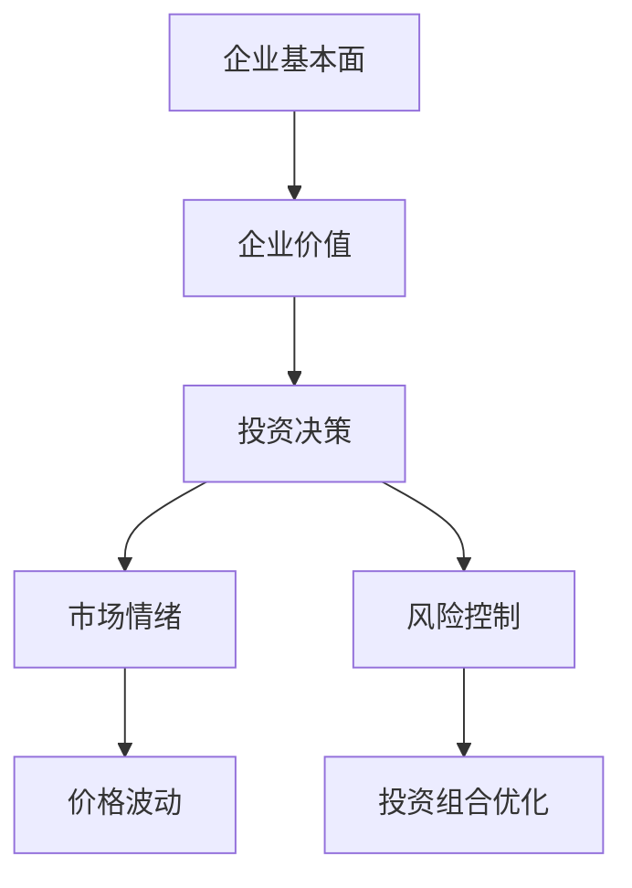
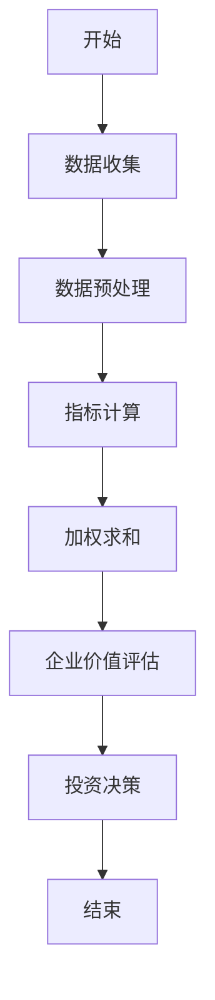
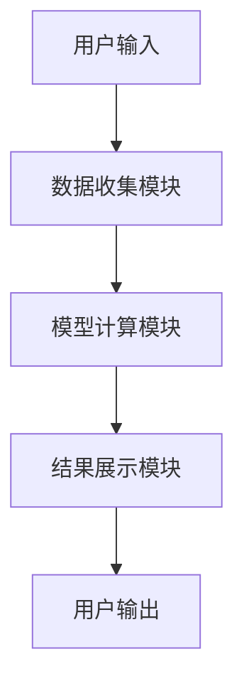
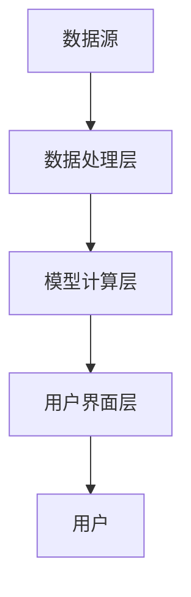

                 


# 《乔尔·格林布拉特的价值投资量化方法》

## 关键词：价值投资、量化方法、格林布拉特、投资模型、基本面分析、企业价值评估、风险管理

## 摘要：  
本文深入探讨了乔尔·格林布拉特的价值投资量化方法，从其核心理念、量化模型的数学原理、算法实现、系统架构到实际项目实战，全面解析了如何将价值投资与量化方法相结合，为企业估值和投资决策提供科学依据。通过详细分析格林布拉特的glomer模型，本文展示了如何利用量化方法优化投资策略，控制风险，并实现长期稳定的收益。

---

# 第一部分: 价值投资与量化方法的背景介绍

# 第1章: 价值投资与量化投资概述

## 1.1 价值投资的核心概念  
### 1.1.1 价值投资的定义与特点  
价值投资是一种投资策略，强调以低于内在价值的价格买入优质资产。其核心在于识别市场中的低估资产，并长期持有，等待其价值回归。价值投资的特点包括：  
- 侧重基本面分析  
- 长期投资视角  
- 逆向投资策略  

### 1.1.2 量化投资的定义与特点  
量化投资是通过数学模型和算法，利用大量数据进行投资决策的过程。其特点包括：  
- 数据驱动  
- 系统化决策  
- 高效性与纪律性  

### 1.1.3 价值投资与量化投资的结合  
价值投资与量化方法的结合，旨在通过量化手段更精确地识别低估资产，减少人为情绪干扰，提高投资效率。  

## 1.2 乔尔·格林布拉特及其投资方法  
### 1.2.1 乔尔·格林布拉特的生平简介  
乔尔·格林布拉特（Joel Greenblatt）是一位传奇投资者，以创立glomer模型闻名。他将价值投资与量化方法相结合，创造了一种独特的投资体系。  

### 1.2.2 格林布拉特的价值投资理念  
格林布拉特的投资理念强调：  
- 买入具有高回报率的优秀企业  
- 以合理价格买入，避免过度支付  

### 1.2.3 格林布拉特的量化方法与投资模型  
格林布拉特的核心方法是glomer模型，该模型通过量化企业基本面指标，筛选出具有高收益、低估值的优质企业。  

## 1.3 量化方法在价值投资中的作用  
### 1.3.1 量化方法的优势  
- 提高投资决策的客观性  
- 降低人为情绪干扰  
- 增强投资策略的可复制性  

### 1.3.2 量化方法的局限性  
- 数据依赖性强，数据质量影响结果  
- 模型失效风险  
- 市场环境变化可能导致策略失效  

### 1.3.3 量化方法与传统投资的结合  
通过结合传统价值投资的深度分析与量化方法的高效筛选，投资者可以在风险可控的前提下，实现收益最大化。  

## 1.4 本章小结  
本章介绍了价值投资与量化投资的核心概念，分析了格林布拉特的投资方法及其量化模型的优势与局限性，为后续的深入探讨奠定了基础。  

---

# 第2章: 价值投资量化方法的核心概念

## 2.1 核心概念与原理  
### 2.1.1 企业基本面分析的量化方法  
企业基本面分析是格林布拉特模型的核心，包括盈利能力、成长能力、财务健康等多个维度的量化指标。  

### 2.1.2 市场情绪与价格波动的量化分析  
通过分析市场情绪和价格波动，投资者可以更好地把握市场的买卖时机。  

### 2.1.3 风险控制与投资组合优化  
量化方法通过风险模型和优化算法，构建最优投资组合，降低整体风险。  

## 2.2 核心概念的属性对比  
### 2.2.1 核心概念属性对比表格  
以下是核心概念的属性对比：  
```markdown
| 概念       | 定义                                                                 | 属性特征                     |
|------------|----------------------------------------------------------------------|------------------------------|
| 企业基本面 | 企业的财务状况、盈利能力、成长能力等指标                                   | 客观性、可量化               |
| 市场情绪   | 投资者对市场的心理预期                                                     | 主观性、波动性               |
| 风险控制   | 管理投资风险的方法                                                       | 系统性、可优化               |
```

## 2.3 实体关系架构图  
以下是格林布拉特模型的核心概念实体关系图：  


## 2.4 本章小结  
本章通过对比分析和实体关系图，揭示了格林布拉特模型的核心概念及其之间的关系，为后续的算法实现奠定了理论基础。  

---

# 第3章: 格林布拉特量化模型的算法原理

## 3.1 核心算法与数学模型  
### 3.1.1 模型的数学公式  
格林布拉特模型的核心公式为：  
$$ EV = \text{销售收入} \times (\text{营运资本周转率} + \text{净利润率}) $$  
其中，$EV$ 表示企业价值，销售收入、营运资本周转率和净利润率均为可量化的指标。  

### 3.1.2 模型的优化算法  
格林布拉特模型通过以下步骤实现优化：  
1. 数据收集与预处理  
2. 指标计算与加权  
3. 企业价值评估  
4. 投资决策输出  

## 3.2 算法流程图  
以下是模型的算法流程图：  


## 3.3 本章小结  
本章通过数学公式和流程图，详细讲解了格林布拉特模型的算法原理，为后续的系统实现提供了明确的指导。  

---

# 第4章: 价值投资量化系统的系统分析

## 4.1 系统功能设计  
### 4.1.1 功能模块划分  
价值投资量化系统的功能模块包括：  
1. 数据收集模块  
2. 模型计算模块  
3. 结果展示模块  

### 4.1.2 功能模块的交互流程  
以下是功能模块的交互流程图：  


## 4.2 系统架构设计  
### 4.2.1 系统架构图  
以下是系统的架构图：  


## 4.3 本章小结  
本章通过系统分析，明确了价值投资量化系统的功能模块和架构设计，为后续的开发实现提供了框架支持。  

---

# 第5章: 项目实战——基于格林布拉特模型的量化投资系统实现

## 5.1 环境安装与配置  
### 5.1.1 安装Python与必要的库  
- 安装Python 3.8及以上版本  
- 安装Pandas、NumPy、Matplotlib等库  

## 5.2 核心代码实现  
### 5.2.1 数据收集与预处理  
```python
import pandas as pd
import numpy as np

# 数据收集
data = pd.read_csv('stock_data.csv')

# 数据预处理
data['净利润率'] = data['净利润'] / data['销售收入']
data['营运资本周转率'] = data['营运资本'] / data['销售收入']
```

### 5.2.2 模型计算与评估  
```python
def compute_ev(data):
    ev = data['销售收入'] * (data['营运资本周转率'] + data['净利润率'])
    return ev

# 计算企业价值
ev = compute_ev(data)
```

## 5.3 实际案例分析  
### 5.3.1 案例选择  
以苹果公司为例，分析其股票的投资价值。  

### 5.3.2 模型输出与解读  
通过模型计算，得出苹果公司的企业价值为 $X$，并根据模型输出的投资决策，确定是否买入或卖出。  

## 5.4 本章小结  
本章通过实际案例分析，展示了如何基于格林布拉特模型实现量化投资系统，为读者提供了实践参考。  

---

# 第6章: 最佳实践与小结

## 6.1 最佳实践 tips  
- 数据质量是模型的核心，确保数据的准确性和完整性  
- 定期优化模型，适应市场变化  
- 结合多因子模型，提高投资策略的鲁棒性  

## 6.2 小结  
本文从理论到实践，全面解析了乔尔·格林布拉特的价值投资量化方法，通过数学模型、算法实现和系统设计，为投资者提供了科学的投资工具和方法。  

## 6.3 注意事项  
- 投资有风险，需谨慎操作  
- 模型结果仅供参考，需结合市场环境进行判断  
- 风险管理是投资成功的关键  

## 6.4 拓展阅读  
- 格林布拉特的经典著作《The New York City Pizza Eater》  
- 量化投资领域的其他经典模型，如Fama-French三因子模型  

---

# 附录: 代码与数据集

## 附录A: 完整代码实现  
```python
import pandas as pd
import numpy as np
import matplotlib.pyplot as plt

# 数据收集
data = pd.read_csv('stock_data.csv')

# 数据预处理
data['净利润率'] = data['净利润'] / data['销售收入']
data['营运资本周转率'] = data['营运资本'] / data['销售收入']

# 模型计算
def compute_ev(data):
    return data['销售收入'] * (data['营运资本周转率'] + data['净利润率'])

ev = compute_ev(data)

# 可视化分析
plt.scatter(data['销售收入'], ev)
plt.xlabel('销售收入')
plt.ylabel('企业价值')
plt.title('企业价值与销售收入的关系')
plt.show()
```

## 附录B: 数据集说明  
数据集包含企业的销售收入、净利润、营运资本等指标，用于计算企业价值和投资决策。  

---

# 结语  
通过本文的学习与实践，读者可以掌握乔尔·格林布拉特的价值投资量化方法，并将其应用于实际投资中，实现科学、高效的财富管理。  

--- 

# END

