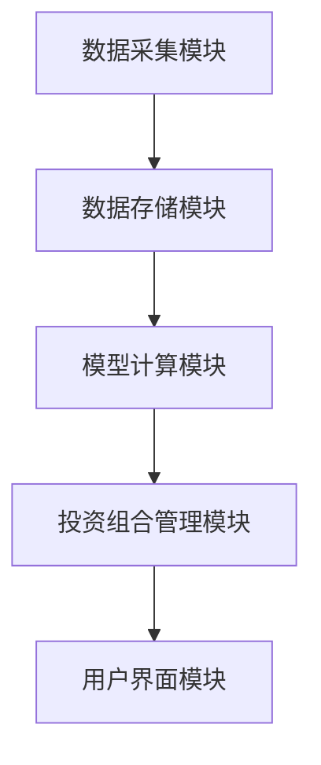
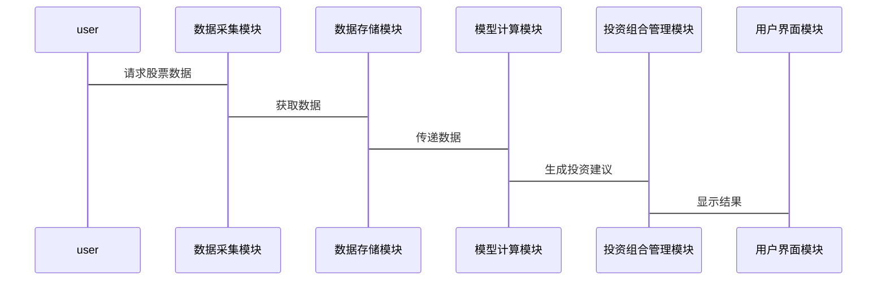

                 


# 乔尔·格林布拉特的价值投资量化方法

> 关键词：价值投资，量化方法，基本面分析，投资策略，风险管理

> 摘要：本文详细介绍了乔尔·格林布拉特的价值投资量化方法，从其核心理念、数学模型到系统架构，再到项目实战，全面解析了该方法的理论基础与实践应用。通过本文，读者将了解如何将基本面分析与量化方法相结合，构建高效的投资策略。

---

# 正文

## 第一部分: 价值投资量化方法的背景与基础

### 第1章: 价值投资与量化方法概述

#### 1.1 价值投资的核心理念

##### 1.1.1 价值投资的定义与起源

价值投资是一种以基本面分析为基础的投资策略，起源于20世纪初。其核心理念是寻找市场价格低于其内在价值的股票进行投资，长期持有，等待市场重新评估其价值。

##### 1.1.2 格林布拉特的价值投资方法

乔尔·格林布拉特（Joel Greenblatt）是价值投资领域的代表人物之一。他在《证券分析》等经典著作的基础上，提出了一套独特的量化方法，将基本面分析与数学模型相结合，构建了多因子投资策略。

##### 1.1.3 量化方法在投资中的应用

量化方法通过数学模型和算法，将复杂的投资决策过程系统化、自动化。格林布拉特的量化方法在传统价值投资的基础上，引入了多因子模型和风险管理，使投资策略更加科学、可量化。

---

#### 1.2 价值投资与量化方法的结合

##### 1.2.1 传统价值投资的局限性

传统价值投资依赖于分析师的主观判断，存在效率低、难以大规模应用的问题。此外，主观判断的不确定性可能导致投资决策的偏差。

##### 1.2.2 量化方法的优势

量化方法通过数据驱动的方式，能够快速、准确地筛选出符合条件的股票，同时降低人为情绪的影响，提高投资决策的客观性和一致性。

##### 1.2.3 格林布拉特方法的创新点

格林布拉特将基本面分析与量化方法相结合，提出了一套多因子模型，能够同时考虑多个基本面指标，量化股票的投资价值，并根据模型结果动态调整投资组合。

---

#### 1.3 本书的核心内容与结构

##### 1.3.1 本书的目标读者

本书适合对价值投资和量化方法感兴趣的专业投资者、金融从业者以及相关领域的研究人员。

##### 1.3.2 本书的主要内容

本书将详细介绍格林布拉特的价值投资量化方法，包括其核心理念、数学模型、系统架构以及实际应用案例。

##### 1.3.3 本书的结构安排

本书分为五个部分：背景与基础、核心概念与量化模型、算法原理、系统架构与项目实战、最佳实践。

---

## 第二部分: 价值投资的核心概念与量化模型

### 第2章: 价值投资的核心概念

#### 2.1 基本面分析的核心要素

##### 2.1.1 财务报表分析

财务报表是基本面分析的核心内容，包括利润表、资产负债表和现金流量表。通过分析这些报表，可以评估企业的盈利能力、财务状况和现金流情况。

##### 2.1.2 行业分析与竞争优势

行业分析帮助企业了解所处的竞争环境，识别企业的竞争优势。竞争优势包括成本优势、品牌优势、技术优势等。

##### 2.1.3 股价与内在价值的关系

股价围绕内在价值波动，内在价值是股票的合理价格，基于企业的基本面情况和市场环境。

#### 2.2 格林布拉特的多因子模型

##### 2.2.1 多因子模型的定义

多因子模型是一种基于多个基本面指标的投资模型，通过综合考虑多个因子（如市盈率、市净率、股息率等）来评估股票的投资价值。

##### 2.2.2 核心因子的筛选与权重

格林布拉特选择了一系列基本面指标作为因子，并根据其对股票收益的影响力，赋予不同的权重。

##### 2.2.3 因子之间的关系与影响

因子之间的关系需要通过数据分析和建模来确定，以确保模型的准确性和稳定性。

#### 2.3 量化模型的构建与验证

##### 2.3.1 数据收集与处理

数据收集是量化模型构建的基础，包括历史股价、财务数据、行业数据等。

##### 2.3.2 模型的构建过程

通过数据预处理、因子筛选、模型训练等步骤，构建一个多因子量化模型。

##### 2.3.3 模型的回测与优化

通过历史数据回测模型的性能，并根据回测结果优化模型参数，提高模型的预测能力。

---

## 第三部分: 格林布拉特量化方法的数学模型与算法原理

### 第3章: 核心算法与数学模型

#### 3.1 多因子模型的数学表达

##### 3.1.1 因子权重的确定

因子权重是根据因子对股票收益的影响力确定的，可以通过回归分析等方法计算。

##### 3.1.2 股票评分的计算公式

股票评分是基于多个因子的加权平均值，公式如下：

$$
\text{股票评分} = \sum_{i=1}^{n} w_i \times f_i
$$

其中，\( w_i \) 是因子 \( i \) 的权重，\( f_i \) 是因子 \( i \) 的值。

##### 3.1.3 模型的优化与调整

根据回测结果，调整模型参数，优化模型的预测能力。

#### 3.2 风险管理与投资组合优化

##### 3.2.1 风险调整后的收益计算

通过计算夏普比率等风险调整后收益指标，评估投资组合的风险调整后收益。

##### 3.2.2 投资组合的构建与优化

根据量化模型的结果，构建最优投资组合，以最大化收益并最小化风险。

##### 3.2.3 风险控制的量化方法

通过设置止损、分散投资等方式，控制投资组合的风险。

#### 3.3 算法实现与代码示例

##### 3.3.1 数据预处理与因子计算

```python
import pandas as pd

# 数据预处理
df = pd.read_csv('stock_data.csv')
df = df.dropna()

# 计算因子
df['市盈率'] = df['股价'] / df['每股收益']
df['市净率'] = df['股价'] / df['每股净资产']
# 其他因子计算...
```

##### 3.3.2 模型训练与参数调优

```python
from sklearn.linear_model import LinearRegression

model = LinearRegression()
model.fit(X_train, y_train)
```

##### 3.3.3 投资组合优化的代码实现

```python
import numpy as np

# 计算投资组合的收益和风险
def portfolio_return(weights, returns):
    return np.dot(weights, returns)

def portfolio_risk(weights, cov_matrix):
    return np.sqrt(np.dot(weights.T, np.dot(cov_matrix, weights)))

# 最优化问题
from scipy.optimize import minimize

def minimize_risk(weights, returns, cov_matrix):
    return portfolio_risk(weights, cov_matrix)

# 约束条件
def constraint(weights):
    return np.sum(weights) - 1

# 解决最优化问题
result = minimize(minimize_risk, np.array([1.0/len(returns), ]), 
                 args=(returns, cov_matrix),
                 method='SLSQP',
                 constraints=({'type': 'eq', 'fun': constraint}))
```

---

## 第四部分: 系统架构与项目实战

### 第4章: 投资管理系统的设计与实现

#### 4.1 系统功能模块划分

##### 4.1.1 数据采集模块

负责收集股票的实时数据，包括股价、财务数据等。

##### 4.1.2 模型计算模块

根据收集的数据，计算股票评分，生成投资建议。

##### 4.1.3 投资组合管理模块

根据模型结果，构建和优化投资组合。

#### 4.2 系统架构设计

##### 4.2.1 模块间的交互关系



##### 4.2.2 系统的扩展性设计

通过模块化设计，系统具有良好的扩展性，可以方便地添加新的因子或优化算法。

##### 4.2.3 系统的性能优化

通过数据压缩、缓存优化等技术，提高系统的运行效率。

#### 4.3 系统接口与交互设计

##### 4.3.1 数据接口的设计

```json
{
    "接口名称": "获取股票数据",
    "请求方法": "GET",
    "请求路径": "/get_stock_data",
    "参数": {
        "symbol": "股票代码"
    }
}
```

##### 4.3.2 用户界面的交互流程



---

## 第五部分: 项目实战与案例分析

### 第5章: 项目实战与代码实现

#### 5.1 环境搭建与数据准备

##### 5.1.1 Python环境的安装与配置

安装Python和相关库（如Pandas、NumPy、Scikit-learn等）。

##### 5.1.2 数据源的选择与获取

从Yahoo Finance等数据源获取股票数据。

##### 5.1.3 数据的清洗与预处理

删除缺失值，处理异常数据等。

#### 5.2 核心代码实现

##### 5.2.1 数据预处理与因子计算

```python
import pandas as pd
import numpy as np

# 读取数据
df = pd.read_csv('stock_data.csv')

# 删除缺失值
df.dropna(inplace=True)

# 计算市盈率
df['市盈率'] = df['股价'] / df['每股收益']
# 计算市净率
df['市净率'] = df['股价'] / df['每股净资产']
# 其他因子计算...
```

##### 5.2.2 模型训练与参数调优

```python
from sklearn.linear_model import LinearRegression
from sklearn.model_selection import train_test_split

# 划分训练集和测试集
X_train, X_test, y_train, y_test = train_test_split(X, y, test_size=0.2)

# 训练模型
model = LinearRegression()
model.fit(X_train, y_train)

# 调优参数（可选）
```

##### 5.2.3 投资组合优化的代码实现

```python
import numpy as np
from scipy.optimize import minimize

# 定义优化目标函数和约束条件
def minimize_risk(weights, returns, cov_matrix):
    return np.sqrt(np.dot(weights.T, np.dot(cov_matrix, weights)))

# 约束条件
def constraint(weights):
    return np.sum(weights) - 1

# 解决最优化问题
result = minimize(minimize_risk, np.array([1.0/len(returns), ]), 
                 args=(returns, cov_matrix),
                 method='SLSQP',
                 constraints=({'type': 'eq', 'fun': constraint}))
```

#### 5.3 实际案例分析与详细解读

##### 5.3.1 案例背景

假设我们有10只股票，目标是构建一个最优投资组合。

##### 5.3.2 数据分析与处理

收集这10只股票的历史数据，计算市盈率、市净率等因子。

##### 5.3.3 模型训练与结果解读

训练多因子模型，评估每只股票的投资价值。

##### 5.3.4 投资组合优化

根据模型结果，构建最优投资组合，最大化收益并最小化风险。

##### 5.3.5 项目小结

通过实际案例分析，验证了格林布拉特量化方法的有效性。

---

## 第六部分: 最佳实践与总结

### 第6章: 最佳实践与总结

#### 6.1 小结

格林布拉特的价值投资量化方法通过将基本面分析与量化方法相结合，提供了一种科学的投资策略。

#### 6.2 注意事项

- 数据质量是模型准确性的基础。
- 模型需要不断优化和调整。
- 风险管理是投资成功的关键。

#### 6.3 拓展阅读

- 《证券分析》
- 《投资学》
- 其他相关投资书籍和论文。

---

通过本文的详细讲解，读者可以系统地了解格林布拉特的价值投资量化方法，并将其应用于实际投资中。

