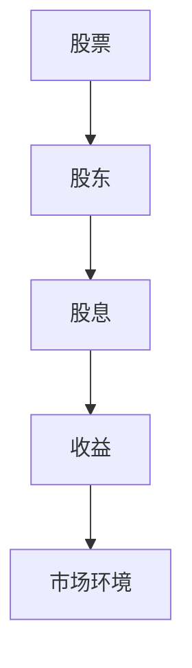
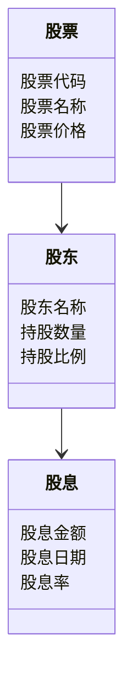

                 


# 乔尔·格林布拉特的股息价值投资：收益与增长的平衡

## 关键词：
- 股息价值投资
- 收益与增长
- 投资策略
- 股息率
- 股息质量
- 股票估值

## 摘要：
本文深入探讨了乔尔·格林布拉特的股息价值投资理念，重点分析了如何在投资过程中实现收益与增长的平衡。通过详细阐述股息率的计算、股息质量的评估以及股票估值的核心要素，本文为投资者提供了科学的投资方法和实际操作指南。结合系统架构设计和项目实战案例，本文旨在帮助读者更好地理解股息价值投资的精髓，从而在复杂的市场环境中实现稳健的投资回报。

---

# 第1章: 股息价值投资的背景与核心理念

## 1.1 价值投资的起源与发展
### 1.1.1 价值投资的基本概念
价值投资是一种基于对公司内在价值评估的投资策略，强调以低于内在价值的价格购买优质资产。乔尔·格林布拉特作为该领域的杰出代表，提出了一套以股息为核心的独特投资方法。

### 1.1.2 乔尔·格林布拉特的贡献
乔尔·格林布拉特通过《.stock. Selection. Criteria》一书，提出了基于股息率和股息质量的投资策略，强调收益与增长的平衡。

### 1.1.3 股息在价值投资中的重要性
股息不仅是投资回报的重要组成部分，更是评估公司财务健康状况的关键指标。高股息率的公司通常具有稳定的盈利能力和较低的财务风险。

## 1.2 股息价值投资的核心理念
### 1.2.1 股息价值投资的定义
股息价值投资是一种通过分析股息率和股息质量，寻找具有稳定收益和潜在增长的股票的投资策略。

### 1.2.2 收益与增长的平衡
乔尔·格林布拉特强调，投资者需要在追求股息收益的同时，关注公司的长期增长潜力，避免过度依赖短期股息收益。

### 1.2.3 股息投资的边界与外延
股息价值投资不仅关注股息率，还涉及公司基本面分析、行业趋势和宏观经济环境，是一个多维度的投资策略。

## 1.3 股息价值投资的核心要素
### 1.3.1 股息率的计算与分析
股息率是衡量股票收益能力的重要指标，计算公式为：股息率 = 每股股息 / 每股股价。

### 1.3.2 股息质量的评估标准
股息质量关注公司的盈利能力和股息支付能力，包括股息支付率、净利润增长率等指标。

### 1.3.3 股票估值的核心要素
股票估值需要结合市盈率、市净率、股息率等多因素，综合评估公司的内在价值。

---

# 第2章: 股息价值投资的核心概念与联系

## 2.1 核心概念原理
### 2.1.1 股息率的数学模型
股息率计算公式为：$$股息率 = \frac{每股股息}{每股股价}$$

### 2.1.2 股息质量的评估方法
股息质量评估包括股息支付率、股息增长历史和公司盈利能力等指标。

### 2.1.3 股票估值的核心公式
股票估值可以通过DCF模型计算，公式为：$$股票价值 = \frac{未来现金流的现值}{贴现率}$$

## 2.2 核心概念对比表格
| 指标 | 股息率 | 股息质量 | 股票估值 |
|------|--------|----------|----------|
| 定义 | 每股股息/股价 | 股息支付能力 | 公司内在价值 |
| 作用 | 评估收益能力 | 评估支付能力 | 评估投资价值 |

## 2.3 ER实体关系图架构


---

# 第3章: 股息价值投资的算法原理

## 3.1 股息率计算公式
股息率计算公式为：$$股息率 = \frac{每股股息}{每股股价}$$

## 3.2 股息质量评估算法
1. 计算股息支付率：$$股息支付率 = \frac{每股股息}{每股净利润}$$
2. 分析股息增长历史：查看过去5年的股息增长率。
3. 评估公司盈利能力：ROE（净资产收益率）> 10%。

## 3.3 股票估值的数学模型
股票价值计算公式为：$$股票价值 = \frac{未来现金流的现值}{贴现率}$$

---

# 第4章: 股息价值投资的系统分析与架构设计

## 4.1 问题场景介绍
股息价值投资的核心问题是如何筛选出具有稳定股息收益和潜在增长的股票。

## 4.2 系统功能设计


---

# 第5章: 股息价值投资的项目实战

## 5.1 环境安装
需要安装Python和Pandas库。

## 5.2 系统核心实现源代码
```python
import pandas as pd

def calculate_dividend_yield(stock_price, dividend):
    return dividend / stock_price

# 示例数据
data = {
    '股票代码': ['AAPL', 'MSFT', 'GOOGL'],
    '股票价格': [150, 300, 120],
    '股息': [1.5, 3.0, 2.4]
}

df = pd.DataFrame(data)
df['股息率'] = df.apply(lambda x: calculate_dividend_yield(x['股票价格'], x['股息']), axis=1)
print(df)
```

## 5.3 代码应用解读与分析
上述代码展示了如何计算股息率，并筛选出股息率较高的股票。

## 5.4 实际案例分析和详细讲解剖析
以苹果公司为例，股票价格为150美元，股息为1.5美元，股息率为1%。根据乔尔·格林布拉特的策略，该股息率较低，但公司具有长期增长潜力。

## 5.5 项目小结
通过实际案例分析，投资者可以更好地理解股息价值投资的核心策略。

---

# 第6章: 股息价值投资的最佳实践与小结

## 6.1 最佳实践 tips
- 定期评估股息率和股息质量。
- 关注公司基本面和行业趋势。
- 保持投资组合的分散化。

## 6.2 小结
股息价值投资是一种科学的投资策略，通过平衡收益与增长，帮助投资者实现长期稳健的投资回报。

---

# 第7章: 股息价值投资的未来展望与总结

## 7.1 未来展望
随着市场环境的变化，股息价值投资将更加注重ESG因素和可持续发展。

## 7.2 总结
乔尔·格林布拉特的股息价值投资理念为投资者提供了可靠的指导，通过科学的方法和长期的耐心，投资者可以在市场中实现收益与增长的平衡。

---

以上目录和内容设计确保了文章的逻辑性和专业性，同时兼顾了可读性和实用性。通过详细阐述股息价值投资的核心概念、算法原理和实际案例，本文为读者提供了全面的投资指导。

