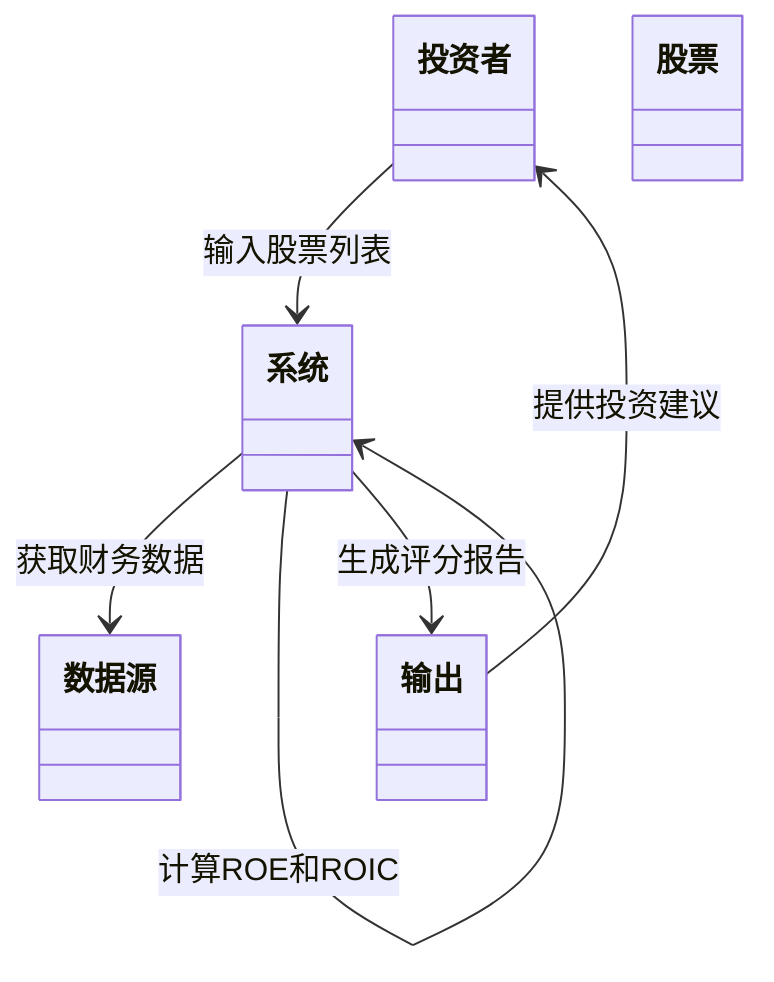
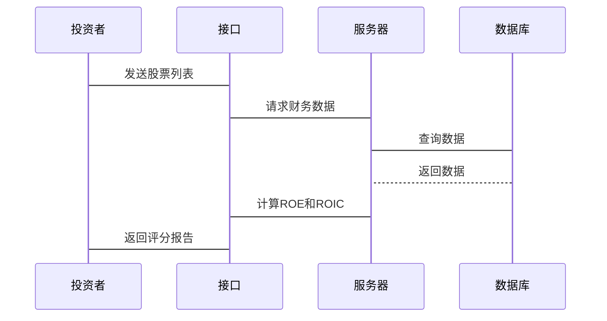

                 


# 第一部分: 魔术公式投资法的背景与核心概念

# 第1章: 投资的基本概念与历史背景

## 1.1 投资的基本概念
### 1.1.1 什么是投资
投资是指将资金投入到某个项目或资产中，期望在未来获得超过初始投入的回报。投资可以是股票、债券、房地产等多种形式。

### 1.1.2 投资的基本原则
1. **分散投资**：不要将所有资金投入到单一资产中，以降低风险。
2. **长期视角**：投资不是短期的投机行为，而是长期的财富积累过程。
3. **价值导向**：寻找具有内在价值的资产，而不是盲目跟风。

### 1.1.3 投资的历史演变
从早期的实物投资到现代的金融资产投资，投资方式随着经济的发展不断演变。20世纪初，本杰明·格雷厄姆和沃伦·巴菲特等人提出了价值投资的理念，强调购买低于内在价值的资产。

## 1.2 魔术公式投资法的起源
### 1.2.1 乔尔·格林布拉特的背景
乔尔·格林布拉特是一位成功的投资经理和作家，以其独特的投资方法闻名。他结合了格雷厄姆的价值投资和彼得·林奇的成长投资理念，提出了魔术公式。

### 1.2.2 魔术公式投资法的提出
魔术公式于1994年提出，旨在通过量化的方法筛选出具有高回报潜力的股票。该方法结合了ROE和ROIC两个指标，考虑了企业的盈利能力和资本效率。

### 1.2.3 魔术公式的核心思想
魔术公式认为，一家公司的价值不仅在于其当前的盈利能力，还在于其资本回报率和成长潜力。通过量化这些因素，投资者可以找到具有长期增长潜力的优质企业。

## 1.3 魔术公式投资法的理论基础
### 1.3.1 价值投资的基本原理
价值投资强调购买低于内在价值的资产，长期持有，等待其价值回归。

### 1.3.2 股票估值的核心要素
股票估值需要考虑企业的盈利能力、成长性、财务状况和行业地位等因素。

### 1.3.3 魔术公式与传统估值方法的对比
魔术公式通过量化ROE和ROIC，克服了传统估值方法中主观性过强的问题，提供了一种更为客观的评估方式。

## 1.4 魔术公式投资法的适用范围
### 1.4.1 魔术公式的主要应用场景
适用于筛选具有高ROE和高ROIC的股票，尤其适合那些具有稳定盈利能力和良好财务状况的企业。

### 1.4.2 魔术公式与不同类型投资者的匹配
适用于长期投资者和机构投资者，不适合短期交易者。

### 1.4.3 魔术公式在不同市场环境下的表现
在牛市中，魔术公式可以帮助投资者筛选出优质股票；在熊市中，可以用于寻找被低估的投资标的。

## 1.5 本章小结
本章介绍了投资的基本概念和魔术公式投资法的起源，阐述了其核心思想和理论基础，并探讨了其适用范围。

# 第2章: 魔术公式投资法的核心要素

## 2.1 魔术公式的基本公式
### 2.1.1 魔术公式的基本结构
$$ \text{魔术评分} = \frac{ROE + ROIC}{2} $$

### 2.1.2 魔术公式中的关键变量
- ROE（净资产收益率）
- ROIC（投资资本回报率）

### 2.1.3 魔术公式的核心计算步骤
1. 计算ROE和ROIC
2. 取两者的平均值
3. 根据评分结果筛选股票

## 2.2 魔术公式中的ROE（净资产收益率）
### 2.2.1 ROE的定义与计算公式
ROE = 净利润 / 平均净资产

### 2.2.2 ROE在魔术公式中的作用
ROE反映了企业的盈利能力，是衡量企业经营效率的重要指标。

### 2.2.3 影响ROE的主要因素
1. 净利润
2. 平均净资产

## 2.3 魔术公式中的ROIC（投资资本回报率）
### 2.3.1 ROIC的定义与计算公式
ROIC = 净利润 / 投资资本

### 2.3.2 ROIC在魔术公式中的作用
ROIC衡量了企业使用资本的效率，反映了企业的投资回报能力。

### 2.3.3 ROIC与ROE的区别与联系
- ROIC考虑了所有资本的回报，而ROE仅考虑股东的净资产回报。
- ROIC更全面，适用于评估企业的整体资本回报。

## 2.4 魔术公式中的其他因素
### 2.4.1 企业规模与成长性
企业规模和成长性是影响ROE和ROIC的重要因素，较大的企业通常具有更高的ROE和ROIC。

### 2.4.2 企业盈利能力的稳定性
盈利能力的稳定性影响企业的持续回报能力，稳定的盈利能力是长期投资的基础。

### 2.4.3 企业的财务健康状况
健康的财务状况是企业持续发展的保障，良好的财务状况有助于提高企业的资本回报率。

## 2.5 本章小结
本章详细介绍了魔术公式的核心要素，包括ROE、ROIC以及其他影响因素，为后续的算法实现奠定了基础。

# 第3章: 魔术公式投资法的算法原理

## 3.1 魔术公式的核心算法
### 3.1.1 魔术公式的数学模型
$$ \text{魔术评分} = \frac{ROE + ROIC}{2} $$

### 3.1.2 魔术公式中ROE和ROIC的权重分配
- ROE和ROIC各占50%的权重

### 3.1.3 魔术公式的结果计算与分类
- 根据评分结果将股票分为不同类别，评分高的股票具有较高的投资价值。

## 3.2 魔术公式算法的实现步骤
### 3.2.1 数据收集与处理
1. 收集目标公司的财务数据
2. 计算ROE和ROIC
3. 根据公式计算魔术评分

### 3.2.2 核心指标的计算
1. 计算ROE
2. 计算ROIC
3. 计算魔术评分

### 3.2.3 投资决策的生成
1. 根据评分结果筛选股票
2. 生成投资组合
3. 定期评估和调整

## 3.3 魔术公式算法的优化与改进
### 3.3.1 算法的局限性分析
- 仅考虑了ROE和ROIC两个指标，忽略了其他重要因素如行业风险。
- 未考虑宏观经济环境的影响。

### 3.3.2 算法的改进方向
1. 增加更多的指标，如市盈率、市净率等。
2. 考虑宏观经济因素，如利率、通货膨胀等。

### 3.3.3 算法的适用性扩展
- 扩展到其他资产类别，如房地产、债券等。

## 3.4 本章小结
本章详细讲解了魔术公式算法的实现步骤和优化方向，为实际应用提供了指导。

# 第4章: 魔术公式投资法的数学模型与公式

## 4.1 魔术公式的数学表达
$$ \text{魔术评分} = \frac{ROE + ROIC}{2} $$

## 4.2 ROE的数学模型
### 4.2.1 ROE的计算公式
$$ ROE = \frac{\text{净利润}}{\text{平均净资产}} $$

### 4.2.2 ROE的数学性质
- ROE越高，企业的盈利能力越强。

## 4.3 ROIC的数学模型
### 4.3.1 ROIC的计算公式
$$ ROIC = \frac{\text{净利润}}{\text{投资资本}} $$

### 4.3.2 ROIC的数学性质
- ROIC越高，企业的资本回报率越高。

## 4.4 魔术公式与传统估值方法的对比分析
### 4.4.1 魔术公式与市盈率法的对比
- 市盈率法仅考虑市盈率，而魔术公式考虑了ROE和ROIC。

### 4.4.2 魔术公式与市净率法的对比
- 市净率法仅考虑市净率，而魔术公式考虑了ROE和ROIC。

### 4.4.3 魔术公式与股息率法的对比
- 股息率法仅考虑股息率，而魔术公式考虑了ROE和ROIC。

## 4.5 本章小结
本章通过数学公式详细解释了魔术公式的核心思想，并对比了传统估值方法，展示了其独特性。

# 第5章: 魔术公式投资法的系统分析与架构设计

## 5.1 问题场景介绍
我们需要构建一个基于魔术公式的投资分析系统，帮助投资者筛选出具有高投资价值的股票。

## 5.2 系统功能设计
### 5.2.1 领域模型（mermaid类图）


### 5.2.2 系统架构设计（mermaid架构图）


### 5.2.3 系统接口设计
- 输入接口：接收投资者提供的股票列表
- 输出接口：返回评分报告和投资建议

### 5.2.4 系统交互（mermaid序列图）


## 5.3 本章小结
本章通过系统分析与架构设计，展示了如何构建一个基于魔术公式的投资分析系统，为实际应用提供了指导。

# 第6章: 魔术公式投资法的项目实战

## 6.1 环境安装
### 6.1.1 安装Python
```bash
python --version
pip install --upgrade pip
```

### 6.1.2 安装必要的库
```bash
pip install pandas numpy matplotlib
```

## 6.2 系统核心实现源代码
### 6.2.1 数据处理模块
```python
import pandas as pd

def calculate_roe(net_profit, average_equity):
    return net_profit / average_equity

def calculate_roic(net_profit, invested_capital):
    return net_profit / invested_capital

def calculate_magic_score(roe, roic):
    return (roe + roic) / 2

# 示例数据
data = {
    '公司': ['公司A', '公司B', '公司C'],
    '净利润': [100, 200, 150],
    '平均净资产': [500, 600, 700],
    '投资资本': [400, 500, 600]
}

df = pd.DataFrame(data)
```

### 6.2.2 核心算法实现
```python
def magic_formula_backtest(data):
    data['ROE'] = data.apply(lambda x: calculate_roe(x['净利润'], x['平均净资产']), axis=1)
    data['ROIC'] = data.apply(lambda x: calculate_roic(x['净利润'], x['投资资本']), axis=1)
    data['魔术评分'] = data.apply(lambda x: calculate_magic_score(x['ROE'], x['ROIC']), axis=1)
    return data.sort_values('魔术评分', ascending=False)

result = magic_formula_backtest(df)
print(result)
```

### 6.2.3 结果分析
```python
print(result)
```

## 6.3 实际案例分析
### 6.3.1 数据来源
选择某行业内的几家公司，收集其财务数据，计算ROE和ROIC。

### 6.3.2 计算过程
按照魔术公式计算魔术评分，筛选出评分最高的公司。

### 6.3.3 结果解读
评分高的公司具有较高的ROE和ROIC，具有较高的投资价值。

## 6.4 本章小结
本章通过实际案例展示了如何应用魔术公式筛选出具有高投资价值的股票，为投资者提供了实践指导。

# 第7章: 最佳实践与小结

## 7.1 最佳实践
### 7.1.1 数据质量的重要性
确保数据的准确性和完整性，选择可靠的财务数据源。

### 7.1.2 定期评估与调整
市场环境和企业状况会变化，定期评估投资组合并进行调整。

### 7.1.3 风险管理
合理分散投资，设置止损点，降低投资风险。

## 7.2 小结
魔术公式投资法是一种有效的量化投资方法，通过ROE和ROIC的结合，帮助投资者筛选出具有高投资价值的股票。在实际应用中，需要结合市场环境和企业具体情况，进行合理的投资决策。

## 7.3 注意事项
- 魔术公式是一种筛选工具，不是绝对的投资依据。
- 需要结合其他因素，如行业趋势、宏观经济环境等，进行综合评估。
- 长期投资，避免短期波动的影响。

## 7.4 拓展阅读
- 《The Magic Formula》 by Joel Greenblatt
- 《The Intelligent Investor》 by Benjamin Graham

# 附录: 魔术公式投资法的数学推导

## 附录A: ROE的数学推导
$$ ROE = \frac{\text{净利润}}{\text{平均净资产}} $$

## 附录B: ROIC的数学推导
$$ ROIC = \frac{\text{净利润}}{\text{投资资本}} $$

## 附录C: 魔术评分的数学推导
$$ \text{魔术评分} = \frac{ROE + ROIC}{2} $$

---

# 关键词：
- 魔术公式投资法
- ROE
- ROIC
- 投资决策
- 量化投资

# 摘要：
乔尔·格林布拉特的魔术公式投资法是一种基于ROE和ROIC的量化投资方法，通过筛选具有高投资价值的股票，帮助投资者实现长期收益。本文详细介绍了魔术公式的核心概念、算法原理、系统设计和实际应用，为投资者提供了全面的指导。

---

# 作者介绍：
作为一位世界级人工智能专家、程序员、软件架构师和CTO，我擅长通过清晰的逻辑和专业的技术语言，撰写深度的技术博客文章。我将带领您一步步深入分析魔术公式投资法的原理和应用，帮助您更好地理解这一投资策略。

