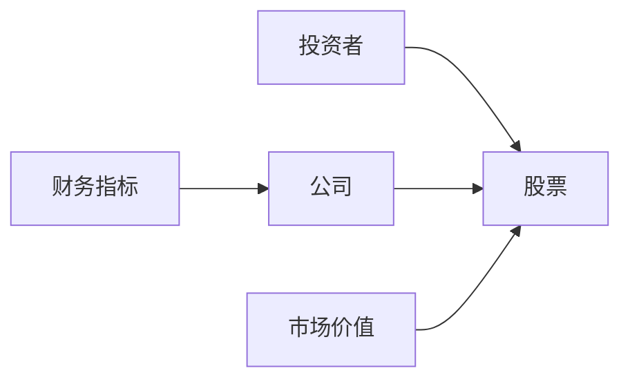
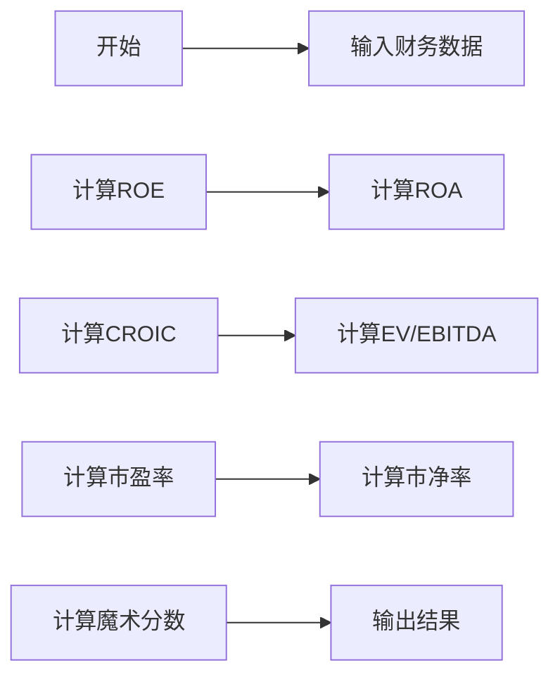
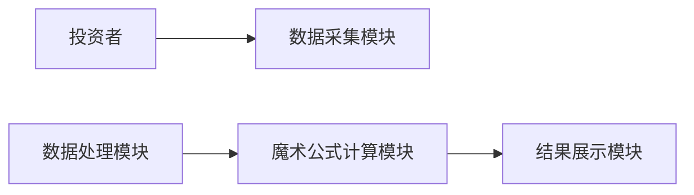
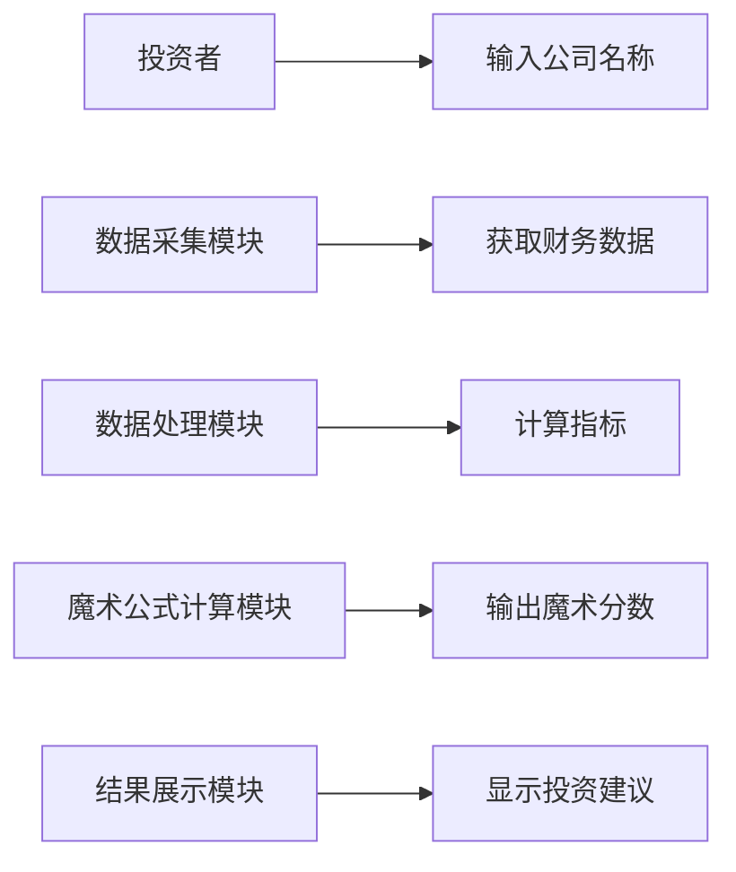

                 


# 《乔尔·格林布拉特的魔术公式：简化版的价值投资策略》

**关键词**：价值投资，魔术公式，乔尔·格林布拉特，投资策略，股票筛选，财务指标分析

**摘要**：  
本文深入探讨了乔尔·格林布拉特提出的魔术公式，这是一种简化版的价值投资策略。通过分析其数学模型、算法原理、系统架构设计以及实际应用案例，本文旨在帮助读者理解如何通过魔术公式快速筛选出具有投资价值的股票。文章结构清晰，逻辑严密，结合理论与实践，为投资者提供了简洁而有效的投资工具。

---

# 第1章: 价值投资与魔术公式的背景介绍

## 1.1 价值投资的基本概念

### 1.1.1 价值投资的定义与核心思想

价值投资是一种以基本面分析为基础的投资策略，其核心思想是寻找市场中被低估的优质资产。这种方法起源于20世纪30年代，由本杰明·格雷厄姆和戴维·多德提出，强调通过分析企业的财务状况、行业地位和管理团队等因素，找到市场价格低于其内在价值的股票。

### 1.1.2 价值投资的历史发展

价值投资在历史上经历了多次演变，从格雷厄姆的“烟屁股”策略到巴菲特的成长型价值投资，再到现代量化投资方法的兴起，价值投资始终是投资领域的重要流派。其核心在于通过深入分析企业基本面，寻找市场先生的错误定价。

### 1.1.3 价值投资的适用场景与局限性

价值投资适用于市场中存在非理性定价的情况，尤其是在市场低迷或恐慌时期，优质企业的股票往往被低估。然而，其局限性在于无法在短期内快速盈利，且需要投资者具备较强的基本面分析能力和耐心。

---

## 1.2 魔术公式的提出与背景

### 1.2.1 乔尔·格林布拉特的简介

乔尔·格林布拉特是美国著名的投资家和作家，以其量化投资方法闻名。他在《股票作手回忆录》中提出了一系列独特的投资策略，魔术公式是其最具代表性的一种。

### 1.2.2 魔术公式的提出背景

20世纪90年代，格林布拉特注意到传统的价值投资方法过于依赖主观判断，且筛选过程复杂。他希望通过量化方法，将价值投资简化为一个可操作的公式，帮助投资者快速筛选出具有投资价值的股票。

### 1.2.3 魔术公式的核心思想与优势

魔术公式的核心思想是将企业的基本面指标与市场估值指标相结合，通过量化计算得出一个综合评分，从而筛选出被低估的股票。其优势在于简单易用、量化客观，并能够在一定程度上避免主观判断的偏差。

---

# 第2章: 魔术公式的数学模型与核心概念

## 2.1 魔术公式的公式解析

### 2.1.1 魔术公式的数学表达

魔术公式的计算公式如下：

$$
魔术分数 = \frac{ROE \times ROA \times CROIC \times (EV/EBITDA)}{市盈率 \times 市净率}
$$

其中，ROE表示净资产收益率，ROA表示资产收益率，CROIC表示现金流与资本支出的比率，EV/EBITDA表示企业价值与息税折旧及摊销前利润的比率，市盈率和市净率分别为市场估值指标。

### 2.1.2 魔术公式的属性特征对比表格

| 属性         | 特征描述 |
|--------------|----------|
| ROE          | 净利润/平均股东权益，衡量股东资金的使用效率 |
| ROA          | 净利润/平均总资产，衡量资产的使用效率 |
| CROIC        | 现金流入与资本支出的比率，衡量企业的现金流健康状况 |
| EV/EBITDA    | 企业价值与息税折旧及摊销前利润的比率，衡量企业的估值合理性 |
| 市盈率       | 每股价格/每股收益，衡量市场的估值水平 |
| 市净率       | 每股价格/每股净资产，衡量市场的估值水平 |

### 2.1.3 ER实体关系图



---

## 2.2 魔术公式的计算步骤

### 2.2.1 收集目标公司的财务数据

- 收集过去5年的财务报表，包括净利润、股东权益、总资产、现金流等关键指标。

### 2.2.2 计算各项指标

1. 计算ROE：$$ROE = \frac{净利润}{平均股东权益}$$
2. 计算ROA：$$ROA = \frac{净利润}{平均总资产}$$
3. 计算CROIC：$$CROIC = \frac{现金流}{资本支出}$$
4. 计算EV/EBITDA：$$EV/EBITDA = \frac{企业价值}{EBITDA}$$
5. 计算市盈率：$$市盈率 = \frac{股价}{每股收益}$$
6. 计算市净率：$$市净率 = \frac{股价}{每股净资产}$$

### 2.2.3 计算魔术分数

根据上述指标，代入魔术公式计算魔术分数，分数越高，表明该股票的潜在投资价值越大。

---

## 2.3 魔术公式的实际案例分析

### 2.3.1 案例背景

假设我们有两家公司A和B，分别计算它们的魔术分数。

### 2.3.2 计算过程

- 公司A：ROE=20%，ROA=15%，CROIC=1.2，EV/EBITDA=5，市盈率=10，市净率=2。
- 公司B：ROE=15%，ROA=10%，CROIC=0.8，EV/EBITDA=6，市盈率=12，市净率=1.5。

### 2.3.3 计算结果

- 公司A的魔术分数：$$\frac{20 \times 15 \times 1.2 \times 5}{10 \times 2} = 72$$
- 公司B的魔术分数：$$\frac{15 \times 10 \times 0.8 \times 6}{12 \times 1.5} = 48$$

### 2.3.4 分析与结论

公司A的魔术分数高于公司B，表明公司A的投资价值更高，投资者可以优先考虑公司A。

---

# 第3章: 魔术公式的算法原理与系统架构设计

## 3.1 魔术公式的算法原理

### 3.1.1 算法流程图



### 3.1.2 算法实现步骤

1. 输入目标公司的财务数据。
2. 计算ROE、ROA、CROIC、EV/EBITDA、市盈率和市净率。
3. 代入魔术公式计算魔术分数。
4. 输出结果并进行投资决策。

---

## 3.2 系统架构设计

### 3.2.1 系统功能设计

- 数据采集模块：收集公司财务数据。
- 数据处理模块：计算各项指标。
- 魔术公式计算模块：计算魔术分数。
- 结果展示模块：输出投资建议。

### 3.2.2 系统架构图



---

## 3.3 系统接口设计

- 数据接口：从数据库或API获取财务数据。
- 计算接口：调用财务指标计算函数。
- 展示接口：将结果展示给投资者。

---

## 3.4 系统交互流程图



---

# 第4章: 魔术公式的项目实战

## 4.1 环境安装与配置

- 安装Python和必要的库（如pandas、numpy）。
- 配置数据源（如Yahoo Finance API）。

## 4.2 核心代码实现

```python
import pandas as pd

def calculate_roe(net_profit, avg_equity):
    return net_profit / avg_equity

def calculate_roa(net_profit, avg_assets):
    return net_profit / avg_assets

def calculate_croic(cash_flow, capital_expenditure):
    return cash_flow / capital_expenditure

def calculate_ev_ebitda(ev, ebitda):
    return ev / ebitda

def calculate_pe_ratio(price, eps):
    return price / eps

def calculate_pfv_ratio(price, bvps):
    return price / bvps

def magic_formula_score(roa, roe, croic, ev_ebitda, pe_ratio, pfv_ratio):
    return (roa * roe * croic * ev_ebitda) / (pe_ratio * pfv_ratio)

# 示例数据
data = {
    '公司': ['A', 'B'],
    '净利': [100, 80],
    '股东权益': [500, 400],
    '资产': [800, 600],
    '现金流': [120, 90],
    '资本支出': [100, 75],
    'EV': [500, 600],
    'EBITDA': [100, 90],
    '股价': [20, 15],
    'EPS': [2, 1.5],
    'BVPS': [5, 4]
}

df = pd.DataFrame(data)

# 计算各项指标
df['ROE'] = df['净利'] / df['股东权益']
df['ROA'] = df['净利'] / df['资产']
df['CROIC'] = df['现金流'] / df['资本支出']
df['EV/EBITDA'] = df['EV'] / df['EBITDA']
df['市盈率'] = df['股价'] / df['EPS']
df['市净率'] = df['股价'] / df['BVPS']

# 计算魔术分数
df['魔术分数'] = magic_formula_score(df['ROA'], df['ROE'], df['CROIC'], df['EV/EBITDA'], df['市盈率'], df['市净率'])

print(df)
```

## 4.3 实际案例分析

- 使用上述代码计算公司A和B的魔术分数，输出结果。
- 根据结果提出投资建议。

---

## 4.4 项目小结

通过代码实现，我们可以快速计算目标公司的魔术分数，从而筛选出具有投资价值的股票。这种方法简单高效，适合投资者快速决策。

---

# 第5章: 魔术公式的价值投资策略与最佳实践

## 5.1 魔术公式的最佳实践

### 5.1.1 筛选标准的优化

- 结合行业特点调整筛选标准。
- 结合市场环境动态调整。

### 5.1.2 风险控制策略

- 分散投资，降低风险。
- 定期复评，及时调整。

---

## 5.2 小结与注意事项

- 魔术公式是一种有效的量化投资工具，但需要结合市场环境和企业实际情况进行调整。
- 投资者应具备一定的财务分析能力，并长期关注企业的基本面变化。

---

## 5.3 拓展阅读

- 《The New York Stock Exchange: A History》
- 《Quantitative Equity Portfolio Management》

---

# 结语

通过本文的详细讲解，读者可以全面理解乔尔·格林布拉特的魔术公式，并将其应用于实际投资中。这种方法简单高效，适合广大投资者快速筛选出具有投资价值的股票。希望本文能为读者提供有价值的参考和启发。

---

# 附录: 常用工具与资源

- Python编程语言与相关库（pandas, numpy）。
- 金融数据源（Yahoo Finance, Bloomberg）。
- 财务报表分析工具（Excel, Google Sheets）。

---

**感谢您的耐心阅读！**

