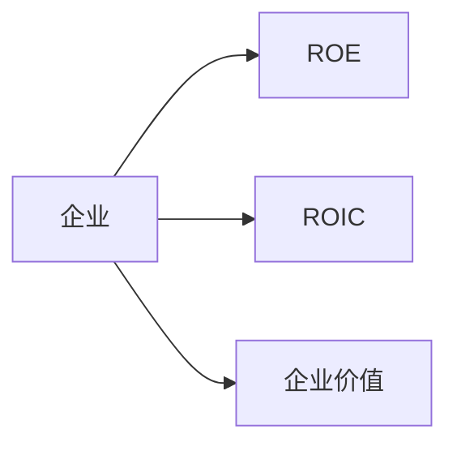
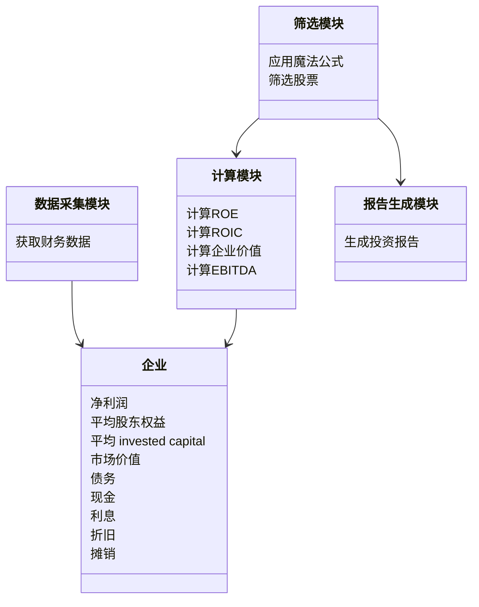
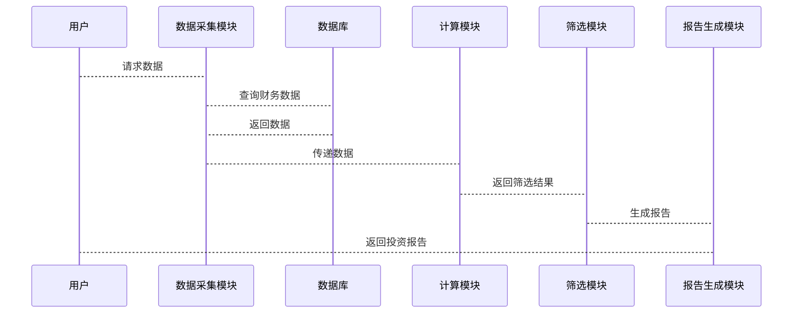

                 


# 乔尔·格林布拉特的魔法公式投资策略

## 关键词：投资策略，魔法公式，股票筛选，ROE，ROIC，价值投资

## 摘要：  
乔尔·格林布拉特的魔法公式投资策略是一种基于基本面分析的股票筛选方法，旨在识别那些被市场低估的优秀企业。本文将从背景介绍、核心概念、算法原理、系统分析、项目实战等多个维度，详细阐述魔法公式投资策略的理论基础、实现方法和实际应用。通过本文的分析，读者将能够理解魔法公式的核心思想，并能够将其应用于实际投资中。

---

# 第一部分: 魔法公式投资策略概述

## 第1章: 魔法公式投资策略的背景与核心概念

### 1.1 魔法公式投资策略的背景

#### 1.1.1 投资领域的传统方法与挑战

传统投资方法通常依赖于市场趋势分析、技术指标或简单的市盈率（P/E）评估。然而，这些方法往往存在以下问题：

1. **市场波动的干扰**：技术分析受市场情绪影响较大，难以捕捉长期价值。
2. **市盈率的局限性**：市盈率仅关注当前利润与股价的比值，忽视了企业的真实价值创造能力。
3. **信息不对称**：普通投资者难以获取企业内部的详细财务数据。

#### 1.1.2 乔尔·格林布拉特的魔法公式提出背景

乔尔·格林布拉特（Joel Greenblatt）是一位成功的投资专家，他在《股市稳赚》（*The Magic of Thinking)一书中提出了“魔法公式”。该公式旨在通过量化的方法，筛选出那些具有高回报潜力的企业，同时避免了传统投资方法的不足。

#### 1.1.3 魔法公式的核心理念与目标

魔法公式的核心理念是：  
**找到那些具有高投资回报率（ROI）且市场价格被低估的企业**。其目标是通过量化指标，筛选出具有以下特征的企业：

1. **高ROE（净资产收益率）**：表明企业能够高效利用股东资产创造利润。
2. **高ROIC（投资资本回报率）**：表明企业能够有效利用所有资本创造利润。
3. **低企业价值倍数**：表明企业市场价格相对其内在价值被低估。

---

### 1.2 魔法公式投资策略的核心概念

#### 1.2.1 核心概念的定义与解释

魔法公式的核心概念包括以下三个指标：

1. **ROE（净资产收益率）**：  
   $$ \text{ROE} = \frac{\text{净利润}}{\text{平均股东权益}} $$  
   ROE反映了企业利用股东资产创造利润的能力。

2. **ROIC（投资资本回报率）**：  
   $$ \text{ROIC} = \frac{\text{净利润}}{\text{平均 invested capital}} $$  
   ROIC反映了企业利用所有资本（包括债务和股权）创造利润的能力。

3. **企业价值**：  
   $$ \text{企业价值} = \text{市场价值} + \text{债务} - \text{现金} $$  
   企业价值是衡量企业整体价值的重要指标。

#### 1.2.2 核心概念的属性特征对比表格

| 指标 | 公式 | 描述 | 关注点 |
|------|------|------|--------|
| ROE  | 净利润 / 平均股东权益 | 衡量股东资产的利用效率 | 股东价值最大化 |
| ROIC | 净利润 / 平均 invested capital | 衡量所有资本的利用效率 | 全面回报能力 |
| 企业价值 | 市场价值 + 债务 - 现金 | 衡量企业整体价值 | 相对于市场价格的低估程度 |

#### 1.2.3 核心概念的ER实体关系图



---

### 1.3 魔法公式的核心公式与逻辑

#### 1.3.1 核心公式

魔法公式的核心公式如下：  
$$ \text{Magic Formula Value} = \frac{\text{企业价值}}{\text{息税折旧前利润}} $$  

其中，息税折旧前利润（EBITDA）的计算公式为：  
$$ \text{EBITDA} = \text{净利润} + \text{利息} + \text{折旧} + \text{摊销} $$  

#### 1.3.2 公式逻辑与应用场景

魔法公式的逻辑是：  
**通过企业价值与息税折旧前利润的比值，评估企业的整体价值是否被低估**。当该比值低于某个阈值时，企业可能具有较高的投资价值。

#### 1.3.3 魔法公式与传统估值方法的对比

| 方法 | 优点 | 缺点 |
|------|------|------|
| 市盈率（P/E） | 简单易用 | 无法反映企业的真实价值 |
| 魔法公式 | 全面考虑企业价值 | 计算复杂，需要详细财务数据 |

---

### 1.4 本章小结

本章介绍了魔法公式投资策略的背景、核心概念和公式逻辑。通过对比传统估值方法，我们发现魔法公式能够更全面地评估企业的投资价值。

---

## 第2章: 魔法公式筛选股票的算法流程

### 2.1 算法的步骤与逻辑

#### 2.1.1 数据采集与预处理

1. **数据来源**：获取企业的财务报表数据（如ROE、ROIC、企业价值等）。
2. **数据清洗**：处理缺失值、异常值等。

#### 2.1.2 计算关键指标

1. **ROE计算**：根据公式计算企业的ROE。
2. **ROIC计算**：根据公式计算企业的ROIC。
3. **企业价值计算**：根据公式计算企业的整体价值。

#### 2.1.3 应用魔法公式进行筛选

1. **计算魔法公式值**：  
   $$ \text{Magic Formula Value} = \frac{\text{企业价值}}{\text{EBITDA}} $$  
2. **筛选标准**：当Magic Formula Value低于某个阈值时，企业可能具有较高的投资价值。

### 2.2 算法流程图


### 2.3 算法实现代码

以下是一个Python实现的示例代码：

```python
import pandas as pd

# 数据采集
df = pd.read_csv('financial_data.csv')

# 计算ROE
df['ROE'] = df['净利润'] / df['平均股东权益']

# 计算ROIC
df['ROIC'] = df['净利润'] / df['平均 invested capital']

# 计算企业价值
df['企业价值'] = df['市场价值'] + df['债务'] - df['现金']

# 计算EBITDA
df['EBITDA'] = df['净利润'] + df['利息'] + df['折旧'] + df['摊销']

# 应用魔法公式
df['Magic Formula Value'] = df['企业价值'] / df['EBITDA']

# 筛选结果
threshold = 10
selected_stocks = df[df['Magic Formula Value'] < threshold]
```

### 2.4 算法的数学模型

魔法公式的数学模型可以表示为：  
$$ \text{Magic Formula Value} = \frac{\text{企业价值}}{\text{EBITDA}} $$  

当上述比值小于某个阈值时，企业可能具有较高的投资价值。

---

## 第3章: 系统分析与架构设计方案

### 3.1 问题场景介绍

为了实现魔法公式投资策略，我们需要构建一个能够自动采集数据、计算指标并筛选股票的系统。

### 3.2 系统功能设计

#### 3.2.1 系统功能模块

1. **数据采集模块**：负责获取企业的财务数据。
2. **计算模块**：计算ROE、ROIC、企业价值等指标。
3. **筛选模块**：应用魔法公式筛选出符合条件的股票。
4. **报告生成模块**：生成投资报告。

#### 3.2.2 系统功能设计的领域模型



### 3.3 系统架构设计

#### 3.3.1 系统架构设计的分层架构


#### 3.3.2 系统接口设计

1. **数据接口**：提供REST API用于数据采集。
2. **计算接口**：提供API用于计算ROE、ROIC等指标。
3. **筛选接口**：提供API用于筛选股票。

#### 3.3.3 系统交互流程图



---

## 第4章: 项目实战与应用分析

### 4.1 项目实战

#### 4.1.1 环境安装与配置

1. **安装Python**：确保安装了最新版本的Python。
2. **安装库**：安装Pandas、NumPy等库。

```bash
pip install pandas numpy
```

#### 4.1.2 核心代码实现

```python
import pandas as pd

# 数据采集
df = pd.read_csv('financial_data.csv')

# 计算ROE
df['ROE'] = df['净利润'] / df['平均股东权益']

# 计算ROIC
df['ROIC'] = df['净利润'] / df['平均 invested capital']

# 计算企业价值
df['企业价值'] = df['市场价值'] + df['债务'] - df['现金']

# 计算EBITDA
df['EBITDA'] = df['净利润'] + df['利息'] + df['折旧'] + df['摊销']

# 应用魔法公式
df['Magic Formula Value'] = df['企业价值'] / df['EBITDA']

# 筛选结果
threshold = 10
selected_stocks = df[df['Magic Formula Value'] < threshold]

print(selected_stocks)
```

#### 4.1.3 代码解读与分析

1. **数据采集**：从CSV文件中读取财务数据。
2. **计算指标**：分别计算ROE、ROIC、企业价值和EBITDA。
3. **应用公式**：计算Magic Formula Value。
4. **筛选股票**：筛选出Magic Formula Value小于阈值的股票。

#### 4.1.4 实际案例分析

假设我们有一个包含以下数据的CSV文件：

| 公司名称 | 净利润 | 平均股东权益 | 平均 invested capital | 市场价值 | 债务 | 现金 | 利息 | 折旧 | 摊销 |
|----------|--------|--------------|---------------------|----------|------|------|------|------|------|
| 公司A    | 100    | 200          | 150                 | 500      | 50   | 20   | 10   | 5    | 3    |
| 公司B    | 150    | 300          | 200                 | 600      | 70   | 30   | 15   | 6    | 4    |

计算过程如下：

1. **公司A的ROE**：100 / 200 = 0.5
2. **公司A的ROIC**：100 / 150 ≈ 0.6667
3. **公司A的企业价值**：500 + 50 - 20 = 530
4. **公司A的EBITDA**：100 + 10 + 5 + 3 = 118
5. **公司A的Magic Formula Value**：530 / 118 ≈ 4.49

假设阈值为5，公司A的Magic Formula Value（4.49）低于阈值，因此公司A被筛选为潜在投资标的。

---

## 第5章: 最佳实践与投资策略优化

### 5.1 投资策略优化

#### 5.1.1 动态调整阈值

根据市场环境的变化，动态调整阈值。例如，在市场低迷时，可以适当降低阈值，以筛选更多潜在标的。

#### 5.1.2 结合其他指标

将魔法公式与其他投资策略（如技术分析）结合，以提高筛选的准确性。

### 5.2 小结

魔法公式是一种有效的投资策略，但其结果需要结合市场环境和企业具体情况综合分析。

### 5.3 注意事项

1. **数据的准确性**：确保财务数据的准确性和完整性。
2. **市场环境的影响**：魔法公式在不同市场环境下表现可能不同。
3. **长期投资**：魔法公式更适合长期投资策略。

### 5.4 拓展阅读

1. 《股市稳赚》（*The Magic of Thinking) - 乔尔·格林布拉特
2. 其他价值投资经典书籍（如《巴菲特的选股智慧》）

---

## 第六章: 总结与展望

### 6.1 总结

魔法公式投资策略通过量化方法，帮助投资者识别具有高投资价值的企业。其核心在于对企业基本面的深入分析和量化筛选。

### 6.2 展望

随着大数据和人工智能技术的发展，魔法公式可以进一步优化，例如结合机器学习模型，提高筛选的准确性和效率。

---

## 附录: 参考文献与工具

### 附录A: 参考文献

1. 乔尔·格林布拉特. 《股市稳赚》.
2. 罗伯特·清崎. 《富爸爸穷爸爸》.

### 附录B: 工具推荐

1. Python编程语言
2. Pandas库
3. Matplotlib/Seaborn可视化库

---

# 结语

通过本文的详细分析，读者可以全面理解乔尔·格林布拉特的魔法公式投资策略，并能够将其应用于实际投资中。无论是从理论分析还是实际操作，魔法公式都为我们提供了一种有效的投资思路。

