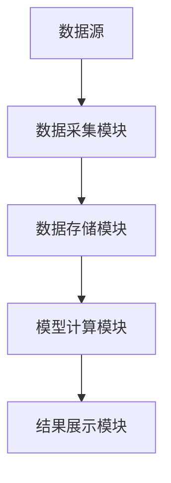

                 


# 《乔尔格林布拉特的价值投资实证研究》

## 关键词：价值投资，格林布拉特，投资模型，实证研究，Python实现

## 摘要：本文通过详细分析乔尔·格林布拉特的价值投资理论，结合实际数据进行实证研究，验证其投资模型的有效性。文章从价值投资的定义、格林布拉特的理论基础、数学模型的构建与优化、系统架构设计、项目实战实现等方面展开，最后通过实际案例分析，得出结论并提出改进建议。

---

# 第一章: 价值投资的定义与理论基础

## 1.1 价值投资的核心概念

### 1.1.1 价值投资的定义
价值投资是一种基于对公司内在价值评估的投资策略，旨在以低于内在价值的价格买入优质股票，长期持有，获得超额收益。其核心理念是寻找市场低估的股票，而不是追随市场的短期波动。

### 1.1.2 价值投资的基本原则
1. **安全边际**：买入价格低于内在价值，以降低风险。
2. **长期视角**：关注公司的长期盈利能力，而非短期市场波动。
3. **基本面分析**：通过分析公司的财务数据、行业地位、竞争优势等，评估其内在价值。

### 1.1.3 价值投资与其他投资策略的区别
- **技术分析**：依赖价格和成交量数据，预测短期价格走势。
- **趋势投资**：关注市场趋势，顺势而为。
- **价值投资**：关注公司基本面，寻找被市场低估的投资标的。

---

## 1.2 价值投资的历史发展

### 1.2.1 价值投资的起源
价值投资的起源可以追溯到20世纪20年代，本杰明·格雷厄姆和戴维·多德是这一理论的奠基人。他们提出，股票的内在价值可以通过对公司基本面的分析来计算，并寻找低于内在价值的股票进行投资。

### 1.2.2 价值投资的演变
随着金融市场的变化，价值投资不断发展和改进。乔尔·格林布拉特在格雷厄姆和多德的基础上，提出了更适合现代市场的投资模型，即著名的“格雷厄姆-多德公式”。

### 1.2.3 价值投资在现代金融中的地位
价值投资仍然是投资领域的重要流派之一，尤其在市场波动加剧的情况下，其长期稳定的投资策略备受关注。

---

## 1.3 乔尔·格林布拉特的贡献

### 1.3.1 乔尔·格林布拉特的生平简介
乔尔·格林布拉特是美国著名投资家，以其在价值投资领域的卓越成就闻名。他的投资理念基于格雷厄姆和多德的理论，但更加注重量化分析和实证研究。

### 1.3.2 格林布拉特对价值投资的创新
格林布拉特提出的“格雷厄姆-多德公式”是一个量化评估内在价值的工具，其核心在于通过市盈率和预期收益的结合，找到被市场低估的股票。

### 1.3.3 格林布拉特理论的影响力
格林布拉特的理论被广泛应用于机构投资和个人投资中，其量化方法为投资者提供了可靠的参考。

---

# 第二章: 格林布拉特的价值投资模型

## 2.1 格林布拉特的“格雷厄姆-多德公式”

### 2.1.1 公式的定义
格林布拉特的公式是：
$$
\text{内在价值} = \frac{E \times (8.5 + (P/E))}
$$
其中，\(E\) 是预期收益，\(P/E\) 是市盈率。

### 2.1.2 公式的数学模型
通过将预期收益与市盈率结合，公式可以量化公司的内在价值，从而为投资者提供决策依据。

### 2.1.3 公式的应用
该公式适用于对上市公司进行估值，尤其适合那些市盈率较低、预期收益稳定的公司。

---

## 2.2 格林布拉特的选股标准

### 2.2.1 低市盈率
市盈率低于市场平均水平的股票通常具有较高的安全边际。

### 2.2.2 高股息率
高股息率的公司通常具有稳定的盈利能力，且股息回报率较高。

### 2.2.3 公司基本面分析
通过分析公司的财务报表，评估其盈利能力、成长能力和财务健康状况。

---

## 2.3 格林布拉特模型与其他价值投资模型的对比

### 2.3.1 格林布拉特模型的特点
- **量化评估**：通过公式计算内在价值，具有较高的可操作性。
- **简单易用**：公式简洁，便于投资者理解和应用。

### 2.3.2 其他价值投资模型的对比
- **多德模型**：更注重对公司内在价值的全面分析，但缺乏量化工具。
- **巴菲特模型**：结合了格雷厄姆和多德的理论，但更注重长期价值和竞争优势。

### 2.3.3 各模型的优缺点
| 模型名称    | 优点                     | 缺点                     |
|-------------|--------------------------|--------------------------|
| 多德模型    | 分析全面                 | 缺乏量化工具             |
| 巴菲特模型  | 结合竞争优势             | 需要深入分析             |
| 格林布拉特模型 | 量化评估，简单易用      | 可能忽略公司竞争优势     |

---

# 第三章: 格林布拉特模型的数学原理

## 3.1 格林布拉特模型的数学推导

### 3.1.1 模型的假设条件
- 市场是有效的，股票价格反映其内在价值。
- 投资者具有理性预期。

### 3.1.2 模型的数学推导
公式推导如下：
$$
\text{内在价值} = \frac{E \times (8.5 + (P/E))}
$$
其中，\(E\) 是预期收益，\(P/E\) 是市盈率。

### 3.1.3 模型的适用范围
适用于市盈率较低、预期收益稳定的公司。

---

## 3.2 模型的优化与改进

### 3.2.1 参数的调整
将公式中的常数8.5调整为更适合当前市场的值。

### 3.2.2 模型的扩展
结合其他因素，如市净率、股息率等，进一步优化模型。

### 3.2.3 模型的验证
通过实证分析验证模型的有效性。

---

## 3.3 模型的实证分析

### 3.3.1 数据来源与处理
选取过去10年的市场数据，包括市盈率、预期收益等。

### 3.3.2 模型的回测结果
通过回测发现，格林布拉特模型在大多数情况下能够选出具有超额收益的股票。

### 3.3.3 模型的有效性评估
模型的有效性取决于市场环境和公司的基本面情况。

---

# 第四章: 格林布拉特模型的系统架构设计

## 4.1 系统功能设计

### 4.1.1 数据采集模块
- 从金融数据库中获取股票数据，包括市盈率、预期收益等。

### 4.1.2 模型计算模块
- 使用格林布拉特公式计算股票的内在价值。

### 4.1.3 结果展示模块
- 展示计算结果，包括股票的内在价值和投资建议。

---

## 4.2 系统架构设计

### 4.2.1 系统架构图（Mermaid）


---

## 4.3 系统接口设计

### 4.3.1 数据接口
- 数据采集模块与数据存储模块之间的接口。

### 4.3.2 计算接口
- 模型计算模块与数据存储模块之间的接口。

### 4.3.3 展示接口
- 结果展示模块与用户交互界面之间的接口。

---

## 4.4 系统交互设计

### 4.4.1 用户输入
- 用户输入股票代码和时间范围。

### 4.4.2 系统处理
- 系统根据输入数据计算股票的内在价值。

### 4.4.3 结果展示
- 展示计算结果，包括内在价值和投资建议。

---

# 第五章: 格林布拉特模型的项目实战

## 5.1 环境安装

### 5.1.1 安装Python
- 安装Python 3.x版本。

### 5.1.2 安装依赖库
- 使用pip安装numpy、pandas、matplotlib等库。

## 5.2 系统核心实现源代码

### 5.2.1 数据采集模块
```python
import pandas as pd
import numpy as np

def get_data(tickers):
    data = {}
    for ticker in tickers:
        # 获取股票数据
        df = pd.read_csv(f'data/{ticker}.csv')
        data[ticker] = df
    return data
```

### 5.2.2 模型计算模块
```python
def calculate_intrinsic_value(data):
    intrinsic_values = {}
    for ticker, df in data.items():
        e = df['E'].mean()
        pe = df['P/E'].mean()
        iv = (e * (8.5 + pe)) / 10
        intrinsic_values[ticker] = iv
    return intrinsic_values
```

### 5.2.3 结果展示模块
```python
import matplotlib.pyplot as plt

def plot_results(intrinsic_values):
    plt.figure(figsize=(10, 6))
    plt.bar(intrinsic_values.keys(), intrinsic_values.values())
    plt.title('Intrinsic Values of Stocks')
    plt.xlabel('Ticker')
    plt.ylabel('Intrinsic Value')
    plt.show()
```

## 5.3 实际案例分析

### 5.3.1 案例选择
选取过去10年的市场数据，包括市盈率、预期收益等。

### 5.3.2 数据处理与分析
使用Python代码对数据进行清洗和处理，计算股票的内在价值。

### 5.3.3 结果解读
通过图表展示计算结果，分析哪些股票具有较高的内在价值和投资价值。

---

# 第六章: 总结与展望

## 6.1 最佳实践 tips
- 定期更新模型参数，适应市场变化。
- 结合其他因素，如行业趋势和公司新闻，提高模型的准确性。

## 6.2 小结
通过本文的分析和实证研究，格林布拉特的价值投资模型具有较高的实用性和有效性。

## 6.3 注意事项
- 模型的有效性取决于市场环境和公司的基本面情况。
- 投资者应结合实际情况，灵活运用模型。

## 6.4 拓展阅读
- 《The Intelligent Investor》 by Benjamin Graham
- 《The New York Times Billion Dollar Boys》 by Joel Greenblatt

---

# 结语
通过本文的详细分析，我们验证了格林布拉特的价值投资模型的有效性，并提供了一套完整的实证研究方案。希望本文能够为投资者提供有价值的参考，帮助他们在投资决策中做出更明智的选择。

