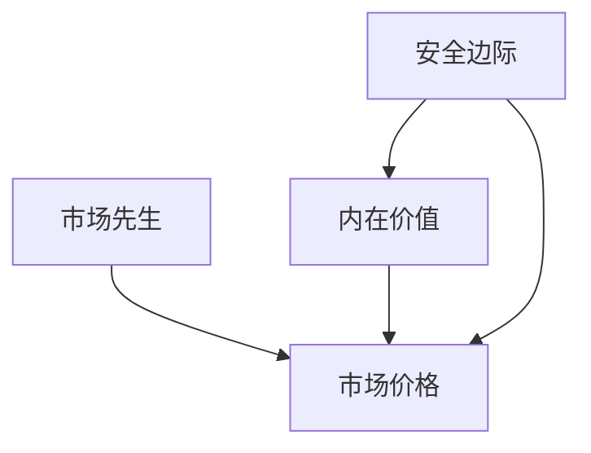

                 


# 《乔尔·格林布拉特的价值投资教育》

---

## 关键词

- 价值投资
- 乔尔·格林布拉特
- 投资策略
- 数学模型
- 量化分析
- 系统架构

---

## 摘要

本文系统地介绍了乔尔·格林布拉特的价值投资理念、数学模型和投资策略。从价值投资的基本概念出发，详细讲解了格林布拉特投资模型的核心要素，包括市场先生、安全边际、内在价值等关键概念。接着，从数学模型和算法的角度，深入分析了价值投资的定量分析方法，结合实际案例，展示了如何将这些理论应用于投资实践。最后，本文还探讨了价值投资的系统架构与技术实现，为投资者提供了从理论到实践的全面指导。

---

## 第一部分: 价值投资基础

### 第1章: 价值投资的基本概念

#### 1.1 价值投资的定义与核心理念

- **1.1.1 价值投资的定义**
  - 价值投资是一种基于对公司内在价值评估的投资策略。
  - 核心理念是寻找市场低估的资产，长期持有，等待市场重新发现其价值。
  - 价值投资强调安全边际，即买入价格与内在价值的差距。

- **1.1.2 格林布拉特的价值投资理念**
  - 格林布拉特是价值投资领域的权威，提出了“市场先生”概念。
  - 他认为市场是不理性的，投资者应利用市场的非理性来获利。
  - 强调安全边际的重要性，即买入价格远低于内在价值。

- **1.1.3 价值投资的核心原则**
  - 长期投资，避免短期波动。
  - 买入低估资产，卖出高估资产。
  - 重视公司的基本面，尤其是盈利能力、财务健康和竞争优势。

#### 1.2 乔尔·格林布拉特的背景介绍

- **1.2.1 格林布拉特的生平简介**
  - 格林布拉特出生于美国，是一位著名投资专家。
  - 他通过量化分析和基本面研究，创造了自己的投资体系。
  - 他的投资哲学影响了无数投资者，成为价值投资领域的标杆。

- **1.2.2 格林布拉特的投资哲学**
  - 强调安全边际和长期价值。
  - 认为市场情绪波动是投资机会的来源。
  - 通过量化模型筛选出具有投资价值的公司。

- **1.2.3 格林布拉特的著作与影响力**
  - 著有《The New York Times Financial Series》等书籍。
  - 他的投资方法被广泛应用于机构和个人投资者。
  - 他的理念对现代投资理论的发展有重要影响。

### 第2章: 价值投资的背景与现状

#### 2.1 价值投资的起源与发展

- **2.1.1 价值投资的起源**
  - 价值投资起源于20世纪初，由本杰明·格雷厄姆和戴维·多德提出。
  - 早期价值投资者关注于寻找被市场低估的公司。

- **2.1.2 格林布拉特对价值投资的贡献**
  - 将量化分析引入价值投资，提出了数学模型。
  - 强调安全边际和市场情绪的影响。

- **2.1.3 价值投资的现状与趋势**
  - 现代价值投资结合了量化和基本面分析。
  - 在机构投资者和个人投资者中广泛应用。

#### 2.2 价值投资的核心概念

- **2.2.1 市场先生的概念**
  - 市场先生是格林布拉特提出的虚拟人物，代表市场情绪。
  - 市场先生每天为投资者提供买卖价格，但情绪波动不定。

- **2.2.2 安全边际的定义**
  - 安全边际是买入价格与内在价值之间的差距。
  - 通过安全边际，投资者可以降低投资风险。

- **2.2.3 格林布拉特投资模型的框架**
  - 买入低估资产：内在价值 > 市场价格。
  - 卖出高估资产：市场价格 > 内在价值。
  - 通过量化模型筛选出具有投资价值的公司。

---

## 第二部分: 格林布拉特投资模型与策略

### 第3章: 格林布拉特投资模型的核心要素

#### 3.1 核心概念与联系

- **3.1.1 核心概念的原理**
  - 格林布拉特模型基于市场先生和安全边际的概念。
  - 内在价值是资产的真正价值，市场价格波动为其提供投资机会。

- **3.1.2 核心概念的属性特征对比表格**

| 概念       | 属性特征                  |
|------------|---------------------------|
| 市场价格    | 受市场情绪影响，波动性大  |
| 内在价值    | 基于基本面分析，相对稳定  |
| 安全边际    | 买入价格与内在价值的差距 |

- **3.1.3 ER实体关系图架构的 Mermaid 流程图**



#### 3.2 格林布拉特投资模型的数学模型

- **3.2.1 数学模型的定义**
  - 格林布拉特模型通过量化分析，筛选出具有安全边际的资产。

- **3.2.2 数学模型的公式**
  - 内在价值公式：
    $$ V = \text{未来现金流的现值} $$
  - 安全边际公式：
    $$ \text{安全边际} = V - P $$

- **3.2.3 数学模型的详细讲解与举例说明**
  - 例如，某公司的未来现金流现值为 $50，市场价格为 $40，则安全边际为 $10。
  - 这意味着该资产被低估，具有投资价值。

### 第4章: 价值投资的策略与应用

#### 4.1 价值投资的基本策略

- **4.1.1 买入低估资产的原则**
  - 买入价格低于内在价值。
  - 确保有足够的安全边际。

- **4.1.2 卖出高估资产的原则**
  - 当市场价格超过内在价值时，卖出资产。
  - 避免过度投资。

- **4.1.3 价值投资的长期视角**
  - 长期持有低估资产，等待市场重新发现其价值。
  - 忽略短期波动，关注长期收益。

#### 4.2 格林布拉特的定量分析方法

- **4.2.1 市场先生情绪的量化**
  - 使用市场指数（如标普500）来衡量市场情绪。
  - 市场情绪高涨时，可能高估资产价值。

- **4.2.2 安全边际的量化计算**
  - 计算公式：
    $$ \text{安全边际} = V - P $$
  - 通过量化分析，筛选出安全边际较高的资产。

- **4.2.3 价值投资的量化指标**
  - 常用指标包括市盈率（P/E）、市净率（P/B）、股息率等。
  - 结合这些指标，量化分析资产的价值。

---

## 第三部分: 项目实战与系统架构

### 第5章: 项目实战

#### 5.1 环境安装与数据准备

- **5.1.1 数据来源**
  - 从股票市场获取历史数据。
  - 包括价格、成交量、财务指标等。

- **5.1.2 工具安装**
  - 使用Python进行数据分析。
  - 安装Pandas、NumPy、Matplotlib等库。

#### 5.2 核心实现

- **5.2.1 内在价值计算**
  - 使用现金流折现模型（DCF）计算内在价值。
  - 示例代码：

```python
def calculate_intrinsic_value(future_cash_flows, discount_rate):
    return sum(future_cash_flows) / (1 + discount_rate)
```

- **5.2.2 安全边际计算**
  - 示例代码：

```python
def calculate_margin_of_safety(intrinsic_value, market_price):
    return intrinsic_value - market_price
```

#### 5.3 实际案例分析

- **5.3.1 案例背景**
  - 选择某公司，分析其基本面。
  - 计算其内在价值和市场价格。

- **5.3.2 数据分析与结果解读**
  - 使用Python进行数据处理和可视化。
  - 输出结果，判断是否具有投资价值。

#### 5.4 项目小结

- **5.4.1 项目总结**
  - 通过量化分析，筛选出具有安全边际的资产。
  - 理解格林布拉特模型的应用。

- **5.4.2 经验与教训**
  - 数据的准确性和完整性至关重要。
  - 模型需要不断优化和调整。

### 第6章: 系统架构与技术实现

#### 6.1 系统功能设计

- **6.1.1 领域模型Mermaid类图**
  ```mermaid
  classDiagram
      class Market {
          price: float
          value: float
      }
      class Asset {
          name: str
          price: float
          value: float
      }
      class Model {
          calculate_margin_of_safety(Asset)
          calculate_intrinsic_value(Asset)
      }
  ```

- **6.1.2 系统架构设计Mermaid架构图**
  ```mermaid
  rectangle Database {
      Market Data
      Asset Data
  }
  rectangle Processing {
      Model
      Algorithms
  }
  rectangle Output {
      Results
  }
  ```

- **6.1.3 系统接口设计**
  - 数据输入接口：接收市场和资产数据。
  - 模型接口：调用计算内在价值和安全边际的函数。
  - 结果输出接口：显示投资建议。

- **6.1.4 系统交互Mermaid序列图**
  ```mermaid
  sequenceDiagram
      User -> Model: 请求计算安全边际
      Model -> Database: 获取市场数据
      Database --> Model: 返回市场数据
      Model -> Asset: 获取资产数据
      Asset --> Model: 返回资产数据
      Model -> calculate_margin_of_safety
      Model -> Output: 显示结果
  ```

---

## 第四部分: 最佳实践与小结

### 第7章: 最佳实践与小结

#### 7.1 最佳实践 tips

- **7.1.1 数据准确性**
  - 确保数据来源可靠，避免错误。
- **7.1.2 模型优化**
  - 定期更新模型，适应市场变化。
- **7.1.3 风险管理**
  - 设置止损点，控制风险。
- **7.1.4 持续学习**
  - 关注市场动态，学习新的投资理念。

#### 7.2 小结

- 价值投资是一种长期有效的投资策略。
- 格林布拉特的投资模型结合了量化分析和基本面研究。
- 通过数学模型和系统架构，投资者可以更科学地进行投资决策。

#### 7.3 注意事项

- 避免过度依赖模型，结合市场实际情况。
- 理解投资的本质，避免短期波动干扰。
- 保持耐心，长期持有低估资产。

#### 7.4 拓展阅读

- 推荐书籍：《The Intelligent Investor》
- 推荐博客：Portfolio.com
- 推荐课程：Quantitative Investment Analysis

---

## 结语

乔尔·格林布拉特的价值投资教育为投资者提供了科学的投资方法。通过数学模型和系统架构，投资者可以更好地理解和应用价值投资策略。希望本文能为读者在投资道路上提供有价值的指导和启发。

---

# END

