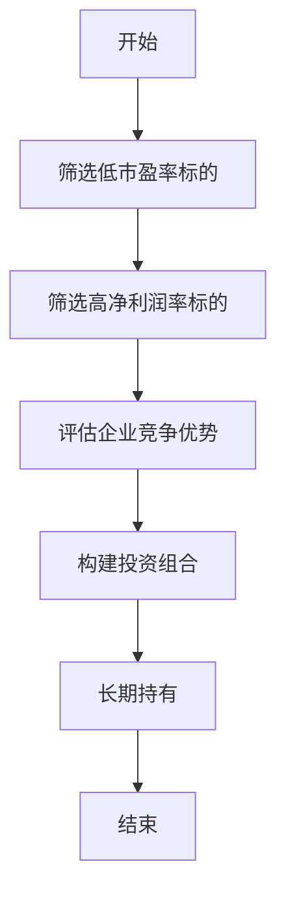
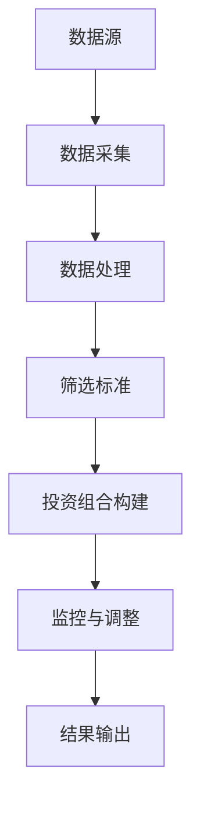
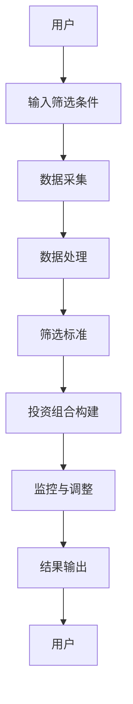

                 


# 乔尔·格林布拉特的价值投资筛选

> 关键词：价值投资，格林布拉特，投资筛选，量化分析，投资策略

> 摘要：本文深入探讨了乔尔·格林布拉特的价值投资筛选方法，从其核心思想到具体实施步骤，结合量化分析与实际案例，详细阐述了如何通过系统化的筛选标准和投资策略实现长期稳定的收益。

---

# 第一部分: 价值投资与价值筛选的背景与基础

## 第1章: 价值投资的基本概念与历史发展

### 1.1 价值投资的定义与核心理念

#### 1.1.1 价值投资的定义
价值投资是一种以基本面分析为基础的投资策略，旨在通过识别市场中被低估的资产，长期持有以实现资本增值。其核心在于寻找市场价格低于其内在价值的投资标的。

#### 1.1.2 价值投资的核心理念
- **安全边际**：买入价格低于内在价值，以降低投资风险。
- **长期视角**：关注企业的长期盈利能力，而非短期市场波动。
- **逆向思维**：在市场恐慌时寻找机会，在市场狂热时保持冷静。

#### 1.1.3 价值投资与其它投资策略的区别
- **区别于成长投资**：成长投资者更关注企业的高速增长潜力，而价值投资者更关注企业的内在价值和安全边际。
- **区别于趋势投资**：趋势投资者关注市场的短期趋势，而价值投资者关注企业的长期基本面。

### 1.2 价值投资的历史与发展

#### 1.2.1 价值投资的起源
价值投资的起源可以追溯到20世纪初，本杰明·格雷厄姆和戴维·多德是该领域的先驱。他们提出了“安全边际”和“内在价值”等核心概念。

#### 1.2.2 价值投资的发展历程
- **20世纪30年代**：格雷厄姆和多德提出价值投资的基本理论。
- **20世纪70年代**：彼得·林奇等投资者将价值投资理念进一步发展。
- **20世纪90年代至今**：价值投资在全球范围内广泛应用，并结合量化分析等技术手段不断进化。

#### 1.2.3 当代价值投资的主要流派
- **格雷厄姆派**：以低市盈率、低市净率等指标筛选低估股票。
- **成长派**：关注企业未来增长潜力，结合估值指标筛选标的。
- **综合派**：将基本面分析与量化筛选相结合，寻找具有竞争优势且估值合理的标的。

### 1.3 价值投资的基本分析方法

#### 1.3.1 财务报表分析基础
- **利润表**：分析企业的盈利能力，关注收入、成本、净利润等指标。
- **资产负债表**：评估企业的财务健康状况，关注资产、负债、所有者权益等指标。
- **现金流量表**：分析企业的现金流状况，关注经营活动、投资活动和筹资活动的现金流。

#### 1.3.2 行业分析与竞争优势识别
- **行业分析**：研究行业的发展前景、竞争格局、周期性等因素。
- **竞争优势识别**：分析企业的核心竞争力，如成本优势、技术优势、品牌优势等。

#### 1.3.3 市场情绪与估值分析
- **市场情绪分析**：通过市场情绪指标（如恐慌指数、投资者情绪指数等）判断市场的整体情绪。
- **估值分析**：通过市盈率（P/E）、市净率（P/B）、市销率（P/S）等指标判断资产的估值水平。

### 1.4 价值投资中的心理因素

#### 1.4.1 投资者心理与行为偏差
- **贪婪与恐惧**：投资者在市场狂热时贪婪，在市场恐慌时恐惧。
- **确认偏见**：投资者倾向于寻找支持自己决策的信息，忽视相反的证据。
- **从众心理**：投资者倾向于跟随市场潮流，避免与市场观点不一致。

#### 1.4.2 理性决策与非理性决策
- **理性决策**：基于逻辑和事实的决策，追求长期利益。
- **非理性决策**：受情绪和偏见影响的决策，追求短期利益。

#### 1.4.3 价值投资中的纪律性与耐心
- **纪律性**：严格遵守投资策略和筛选标准，避免随意调整投资组合。
- **耐心**：长期持有优质资产，等待价值回归，不因短期波动而改变投资决策。

## 第2章: 乔尔·格林布拉特的价值投资方法概述

### 2.1 乔尔·格林布拉特的简介

#### 2.1.1 乔尔·格林布拉特的生平
乔尔·格林布拉特（Joel Greenblatt）是美国著名的价值投资者和投资作家，以“小数投资”（Magic Formula）策略闻名。

#### 2.1.2 乔尔·格林布拉特的投资理念
格林布拉特的投资理念基于以下几个核心原则：
1. **寻找低估的资产**：通过量化筛选，寻找市场价格低于内在价值的资产。
2. **关注企业盈利能力**：重视企业的净利润率和ROIC（Return on Invested Capital）。
3. **长期持有**：长期持有优质资产，等待价值回归。

#### 2.1.3 乔尔·格林布拉特的著作与影响力
格林布拉特的代表作《The Magic of Thinking Clearly》和《The Misbehavior of Markets》深入阐释了其投资理念，并在全球范围内影响了大量投资者。

### 2.2 格林布拉特价值投资方法的核心思想

#### 2.2.1 格林布拉特的选股标准
格林布拉特的选股标准主要包括以下几个方面：
1. **低市盈率（P/E）**：市盈率低于行业平均水平或历史平均水平。
2. **高净利润率**：净利润率较高的企业具有更强的盈利能力。
3. **高ROIC（Return on Invested Capital）**：ROIC是衡量企业投资回报能力的重要指标。
4. **低债务水平**：企业债务过低，财务风险较小。

#### 2.2.2 格林布拉特的估值方法
格林布拉特的估值方法基于以下公式：
$$
\text{内在价值} = \frac{\text{净利润}}{\text{ROIC}} \times \text{WACC}
$$
其中，WACC（加权平均资本成本）是衡量企业资本成本的重要指标。

#### 2.2.3 格林布拉特的投资策略
格林布拉特的投资策略主要包括以下步骤：
1. **筛选符合选股标准的标的**：通过量化筛选，找到符合低市盈率、高净利润率和高ROIC的企业。
2. **评估企业竞争优势**：分析企业的竞争优势，判断其是否具有长期盈利能力。
3. **构建投资组合**：将筛选出的优质资产组合成投资组合，分散投资风险。
4. **长期持有**：长期持有优质资产，等待价值回归。

### 2.3 格林布拉特价值投资方法的优缺点

#### 2.3.1 方法的优点
1. **简单易行**：通过量化筛选，降低了投资的复杂性。
2. **纪律性**：严格的筛选标准确保了投资的纪律性。
3. **可复制性**：方法具有较高的可复制性，适合个人投资者和机构投资者。

#### 2.3.2 方法的缺点
1. **过度依赖量化指标**：过于依赖量化指标可能导致误判。
2. **忽视市场环境**：忽视市场环境的变化，可能导致投资决策失误。
3. **需要不断更新**：市场环境不断变化，需要不断更新筛选标准。

#### 2.3.3 方法的适用场景
格林布拉特的价值投资方法适用于以下场景：
- **市场低估时期**：市场整体估值较低，容易找到低估资产。
- **成熟市场**：成熟市场的企业财务数据较为透明，适合量化筛选。
- **长期投资**：适合长期投资者，追求长期稳定的收益。

---

# 第二部分: 格林布拉特价值投资筛选的核心标准

## 第3章: 格林布拉特的选股公式与筛选标准

### 3.1 格林布拉特选股公式的概述

#### 3.1.1 公式的数学表达
格林布拉特的选股公式可以简化为以下两个指标：
1. **低市盈率（P/E）**：市盈率低于行业平均水平或历史平均水平。
2. **高净利润率**：净利润率较高的企业具有更强的盈利能力。

#### 3.1.2 公式的逻辑解读
格林布拉特的选股公式基于以下逻辑：
1. **低市盈率**：市场价格低于内在价值，具有较高的安全边际。
2. **高净利润率**：企业具有较强的盈利能力，能够持续创造利润。

#### 3.1.3 公式的实际应用
通过格林布拉特的选股公式，投资者可以筛选出以下类型的股票：
- **低市盈率高净利润率的股票**：这类股票通常具有较高的安全边际和盈利能力。
- **低市盈率但高ROIC的股票**：这类股票具有较高的投资回报能力。

### 3.2 格林布拉特选股公式的关键指标

#### 3.2.1 市盈率（P/E）
市盈率（P/E）是衡量股票估值的重要指标，计算公式为：
$$
\text{P/E} = \frac{\text{股价}}{\text{每股净利润}}
$$
市盈率越低，股票的估值越低，投资的安全边际越高。

#### 3.2.2 企业盈利增长率（ROE）
ROE（Return on Equity）是衡量企业盈利能力的重要指标，计算公式为：
$$
\text{ROE} = \frac{\text{净利润}}{\text{股东权益}}
$$
ROE越高，企业的盈利能力越强。

#### 3.2.3 企业竞争优势分析
企业竞争优势分析包括以下几个方面：
1. **成本优势**：企业是否具有成本优势，能够以更低的价格提供产品或服务。
2. **技术优势**：企业是否拥有核心技术或专利，能够保持竞争优势。
3. **品牌优势**：企业品牌是否具有较高的知名度和美誉度，能够吸引更多的消费者。

#### 3.2.4 企业财务健康状况
企业财务健康状况分析包括以下几个方面：
1. **资产负债表分析**：分析企业的资产、负债和所有者权益状况。
2. **现金流分析**：分析企业的经营活动、投资活动和筹资活动的现金流状况。
3. **财务比率分析**：分析企业的偿债能力、营运能力、盈利能力等财务比率。

### 3.3 格林布拉特选股公式的实际案例分析

#### 3.3.1 案例一：A公司
假设A公司是一家制造业企业，以下是其财务数据：
- 市盈率（P/E）：10
- 净利润率：15%
- ROIC：20%
- 债务水平：低

根据格林布拉特的选股公式，A公司符合以下筛选标准：
- 低市盈率（P/E）：10低于行业平均水平。
- 高净利润率：15%高于行业平均水平。
- 高ROIC：20%高于行业平均水平。
- 低债务水平：财务风险较小。

因此，A公司符合格林布拉特的选股标准，具有较高的投资价值。

#### 3.3.2 案例二：B公司
假设B公司是一家科技企业，以下是其财务数据：
- 市盈率（P/E）：30
- 净利润率：5%
- ROIC：10%
- 债务水平：高

根据格林布拉特的选股公式，B公司不符合以下筛选标准：
- 低市盈率（P/E）：30高于行业平均水平。
- 高净利润率：5%低于行业平均水平。
- 高ROIC：10%低于行业平均水平。
- 低债务水平：财务风险较大。

因此，B公司不符合格林布拉特的选股标准，不具有较高的投资价值。

---

# 第三部分: 格林布拉特价值投资筛选的量化分析

## 第4章: 量化分析与数学模型

### 4.1 量化分析的定义与作用
量化分析是通过数学模型和算法对市场数据进行分析，以寻找投资机会和优化投资组合。量化分析的作用包括：
1. **提高投资效率**：通过量化分析，投资者可以快速筛选出符合筛选标准的标的。
2. **降低投资风险**：通过量化分析，投资者可以更好地控制风险，避免人为情绪的干扰。

### 4.2 格林布拉特价值投资筛选的数学模型

#### 4.2.1 格林布拉特选股公式的数学表达
格林布拉特的选股公式可以表示为以下两个指标：
1. **低市盈率（P/E）**：$$\text{P/E} < \text{行业平均P/E}$$
2. **高净利润率**：$$\text{净利润率} > \text{行业平均净利润率}$$

#### 4.2.2 格林布拉特选股公式的流程图



### 4.3 格林布拉特价值投资筛选的Python实现

#### 4.3.1 环境安装
- **Python**：安装Python 3.8或更高版本。
- **Pandas**：用于数据处理和分析。
- **NumPy**：用于数值计算。
- **Matplotlib**：用于数据可视化。

#### 4.3.2 核心代码实现

```python
import pandas as pd
import numpy as np

# 加载数据
df = pd.read_csv('stock_data.csv')

# 计算市盈率
df['PE'] = df['股价'] / df['每股净利润']

# 计算净利润率
df['净利润率'] = (df['净利润'] / df['收入']) * 100

# 筛选低市盈率标的
low_pe = df[df['PE'] < df['PE'].mean()]

# 筛选高净利润率标的
high_net_profit = low_pe[low_pe['净利润率'] > low_pe['净利润率'].mean()]

# 输出结果
print(high_net_profit)
```

#### 4.3.3 代码解读
1. **数据加载**：从CSV文件中加载股票数据，包括股价、每股净利润、收入、净利润等指标。
2. **计算市盈率**：通过股价除以每股净利润计算市盈率。
3. **计算净利润率**：通过净利润除以收入计算净利润率。
4. **筛选低市盈率标的**：筛选出市盈率低于行业平均水平的股票。
5. **筛选高净利润率标的**：从低市盈率股票中筛选出净利润率高于行业平均水平的股票。
6. **输出结果**：输出符合条件的股票列表。

### 4.4 格林布拉特价值投资筛选的系统架构

#### 4.4.1 系统功能设计
- **数据采集**：从股票数据库中采集股票数据。
- **数据处理**：计算市盈率、净利润率等指标。
- **筛选标准**：根据格林布拉特的选股公式筛选出符合条件的股票。
- **投资组合构建**：根据筛选结果构建投资组合。
- **监控与调整**：定期监控投资组合的表现，根据市场变化进行调整。

#### 4.4.2 系统架构图



### 4.5 系统接口设计

#### 4.5.1 数据接口
- **输入接口**：接收股票数据，包括股价、每股净利润、收入、净利润等指标。
- **输出接口**：输出筛选结果，包括符合条件的股票列表和投资组合建议。

#### 4.5.2 用户接口
- **用户输入**：用户输入筛选条件，包括市盈率和净利润率等指标。
- **用户输出**：输出筛选结果，包括符合条件的股票列表和投资组合建议。

### 4.6 系统交互流程图



---

# 第四部分: 项目实战与案例分析

## 第5章: 项目实战

### 5.1 项目背景
本项目旨在通过格林布拉特的价值投资筛选方法，筛选出符合条件的股票，构建投资组合，并进行长期投资。

### 5.2 项目核心实现

#### 5.2.1 环境安装
- **Python**：安装Python 3.8或更高版本。
- **Pandas**：用于数据处理和分析。
- **NumPy**：用于数值计算。
- **Matplotlib**：用于数据可视化。

#### 5.2.2 核心代码实现

```python
import pandas as pd
import numpy as np

# 加载数据
df = pd.read_csv('stock_data.csv')

# 计算市盈率
df['PE'] = df['股价'] / df['每股净利润']

# 计算净利润率
df['净利润率'] = (df['净利润'] / df['收入']) * 100

# 筛选低市盈率标的
low_pe = df[df['PE'] < df['PE'].mean()]

# 筛选高净利润率标的
high_net_profit = low_pe[low_pe['净利润率'] > low_pe['净利润率'].mean()]

# 构建投资组合
investment_portfolio = high_net_profit[['股票代码', '公司名称', '股价', 'PE', '净利润率']]

# 输出结果
print(investment_portfolio)
```

#### 5.2.3 代码解读
1. **数据加载**：从CSV文件中加载股票数据，包括股价、每股净利润、收入、净利润等指标。
2. **计算市盈率**：通过股价除以每股净利润计算市盈率。
3. **计算净利润率**：通过净利润除以收入计算净利润率。
4. **筛选低市盈率标的**：筛选出市盈率低于行业平均水平的股票。
5. **筛选高净利润率标的**：从低市盈率股票中筛选出净利润率高于行业平均水平的股票。
6. **构建投资组合**：根据筛选结果构建投资组合，输出符合条件的股票列表。

### 5.3 实际案例分析

#### 5.3.1 案例一：A公司

假设A公司是一家制造业企业，以下是其财务数据：
- 股价：$50
- 每股净利润：$5
- 收入：$100百万
- 净利润：$15百万

根据格林布拉特的选股公式，A公司的市盈率为：
$$
\text{PE} = \frac{\text{股价}}{\text{每股净利润}} = \frac{50}{5} = 10
$$
A公司的净利润率为：
$$
\text{净利润率} = \frac{\text{净利润}}{\text{收入}} \times 100 = \frac{15}{100} \times 100 = 15\%
$$
A公司的ROIC为：
$$
\text{ROIC} = \frac{\text{净利润}}{\text{股东权益}} \times 100 = \frac{15}{50} \times 100 = 30\%
$$
根据格林布拉特的选股标准，A公司符合以下条件：
- 低市盈率（PE=10）：低于行业平均水平。
- 高净利润率（15%）：高于行业平均水平。
- 高ROIC（30%）：高于行业平均水平。
- 低债务水平：假设A公司的债务水平较低。

因此，A公司符合格林布拉特的选股标准，具有较高的投资价值。

#### 5.3.2 案例二：B公司

假设B公司是一家科技企业，以下是其财务数据：
- 股价：$100
- 每股净利润：$5
- 收入：$200百万
- 净利润：$10百万

根据格林布拉特的选股公式，B公司的市盈率为：
$$
\text{PE} = \frac{\text{股价}}{\text{每股净利润}} = \frac{100}{5} = 20
$$
B公司的净利润率为：
$$
\text{净利润率} = \frac{\text{净利润}}{\text{收入}} \times 100 = \frac{10}{200} \times 100 = 5\%
$$
B公司的ROIC为：
$$
\text{ROIC} = \frac{\text{净利润}}{\text{股东权益}} \times 100 = \frac{10}{100} \times 100 = 10\%
$$
根据格林布拉特的选股标准，B公司不符合以下条件：
- 低市盈率（PE=20）：高于行业平均水平。
- 高净利润率（5%）：低于行业平均水平。
- 高ROIC（10%）：低于行业平均水平。
- 低债务水平：假设B公司的债务水平较高。

因此，B公司不符合格林布拉特的选股标准，不具有较高的投资价值。

### 5.4 项目小结

通过格林布拉特的价值投资筛选方法，投资者可以系统化地筛选出符合条件的股票，构建投资组合，并进行长期投资。这种方法具有以下优点：
1. **简单易行**：通过量化筛选，降低了投资的复杂性。
2. **纪律性**：严格的筛选标准确保了投资的纪律性。
3. **可复制性**：方法具有较高的可复制性，适合个人投资者和机构投资者。

---

# 第五部分: 总结与展望

## 第6章: 总结与展望

### 6.1 总结
本文深入探讨了乔尔·格林布拉特的价值投资筛选方法，从其核心思想到具体实施步骤，结合量化分析与实际案例，详细阐述了如何通过系统化的筛选标准和投资策略实现长期稳定的收益。通过格林布拉特的选股公式和筛选标准，投资者可以系统化地筛选出符合条件的股票，构建投资组合，并进行长期投资。

### 6.2 投资建议
- **长期视角**：关注企业的长期基本面，而非短期市场波动。
- **安全边际**：买入价格低于内在价值，以降低投资风险。
- **纪律性**：严格遵守投资策略和筛选标准，避免随意调整投资组合。

### 6.3 注意事项
- **市场环境**：注意市场环境的变化，及时调整投资策略。
- **风险管理**：合理控制投资风险，避免过度集中投资。
- **持续学习**：保持对市场和投资策略的持续学习和研究。

### 6.4 拓展阅读
- **《The Magic of Thinking Clearly》**：乔尔·格林布拉特的代表作，深入阐释了其投资理念。
- **《The Misbehavior of Markets》**：进一步探讨了市场行为和投资策略。
- **《价值投资实战》**：结合实际案例，深入分析价值投资的实践应用。

---

通过本文的学习，读者可以全面了解乔尔·格林布拉特的价值投资筛选方法，并能够在实际投资中加以应用，实现长期稳定的收益。

