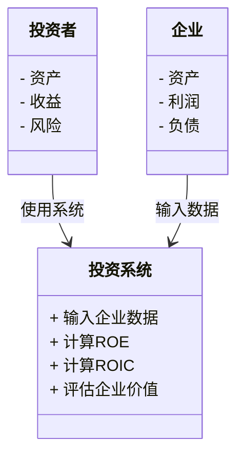
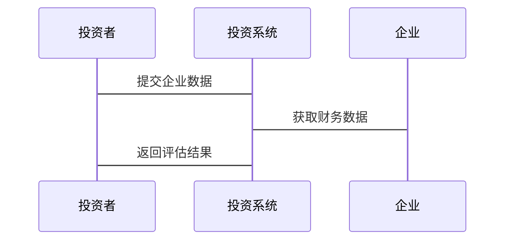

                 


# 乔尔格林布拉特的魔术公式

**关键词**：乔尔格林布拉特，魔术公式，投资策略，ROE，ROIC，价值投资

**摘要**：本文深入探讨了乔尔·格林布拉特的魔术公式，分析其数学模型、算法原理及其在投资决策中的应用。通过实际案例和系统设计，展示了如何将魔术公式应用于投资系统，并提供了最佳实践和注意事项。

---

# 第一部分: 魔术公式的背景与核心概念

## 第1章: 魔术公式的起源与背景

### 1.1 乔尔·格林布拉特及其投资理念

#### 1.1.1 乔尔·格林布拉特的生平简介
乔尔·格林布拉特是一位著名的投资专家，以其创新的投资策略闻名。他提出的魔术公式是一种简单而有效的投资方法，帮助投资者识别被低估的优质企业。

#### 1.1.2 格林布拉特的投资哲学与理念
格林布拉特强调基本面分析和长期投资。他认为，企业的价值在于其盈利能力，而不仅仅是市场波动。

#### 1.1.3 魔术公式的提出背景与意义
魔术公式在20世纪90年代提出，旨在解决传统价值投资方法的局限性，提供一种更科学的投资评估工具。

### 1.2 魔术公式的定义与核心要素

#### 1.2.1 魔术公式的定义
魔术公式通过ROE和ROIC两个指标，评估企业的盈利能力，进而判断其投资价值。

#### 1.2.2 核心要素：ROE与ROIC的计算
- **ROE（净资产收益率）**：净利润/平均净资产
- **ROIC（投入资本回报率）**：净利润/平均投入资本

#### 1.2.3 魔术公式的应用场景与边界
适用于评估制造业、零售业等传统行业的企业价值，不适用于高增长科技企业。

### 1.3 魔术公式与传统投资方法的对比

#### 1.3.1 传统价值投资方法的局限性
传统方法过于依赖市盈率和市净率，忽视了企业的盈利能力。

#### 1.3.2 魔术公式的创新与优势
- 综合考虑盈利能力
- 简单易懂，易于应用

#### 1.3.3 魔术公式与其它投资模型的对比分析
与PEG模型相比，魔术公式更注重企业的盈利能力，而非市盈率。

---

## 第2章: 魔术公式的数学模型与公式推导

### 2.1 魔术公式的数学模型

#### 2.1.1 ROE（净资产收益率）的计算公式
$$ROE = \frac{净利润}{平均净资产}$$

#### 2.1.2 ROIC（投入资本回报率）的计算公式
$$ROIC = \frac{净利润}{平均投入资本}$$

#### 2.1.3 企业价值的计算公式
$$企业价值 = \frac{ROIC \times WACC^{-1}}{1 - \frac{1}{(1 + g)^n}}$$

### 2.2 魔术公式的公式推导与验证

#### 2.2.1 公式推导过程
- 确定ROE和ROIC的计算方法
- 结合企业价值公式，推导出最终的企业价值评估模型

#### 2.2.2 公式的数学验证与实证分析
通过历史数据验证魔术公式的准确性，分析其在不同市场环境下的表现。

#### 2.2.3 公式在实际投资中的应用案例
以可口可乐为例，展示如何使用魔术公式评估其投资价值。

### 2.3 核心概念对比表格

| 指标 | 定义 | 计算公式 | 重要性 |
|------|------|----------|--------|
| ROE | 净资产收益率 | 净利润/平均净资产 | 核心指标之一 |
| ROIC | 投入资本回报率 | 净利润/平均投入资本 | 核心指标之一 |
| WACC | 加权平均资本成本 | $WACC = w_d \times r_d + w_e \times r_e + w_l \times r_l$ | 核心指标之一 |

---

## 第3章: 魔术公式的系统分析与架构设计

### 3.1 投资系统的需求分析

#### 3.1.1 问题场景介绍
投资者需要一种简单可靠的投资评估工具，快速筛选出优质企业。

#### 3.1.2 项目介绍
开发一个基于魔术公式的投资评估系统，帮助投资者做出决策。

### 3.2 系统功能设计

#### 3.2.1 领域模型Mermaid类图


### 3.3 系统架构设计

#### 3.3.1 系统架构Mermaid架构图


### 3.4 接口设计与交互

#### 3.4.1 系统接口设计
- 输入接口：企业财务数据
- 输出接口：ROE、ROIC、企业价值评估

#### 3.4.2 系统交互Mermaid序列图


---

## 第4章: 魔术公式的项目实战

### 4.1 环境安装与依赖管理

#### 4.1.1 环境安装
- Python 3.8+
- Jupyter Notebook
- Pandas库

### 4.2 核心实现代码

#### 4.2.1 Python代码实现
```python
def calculate_roe(net_profit, avg_equity):
    return net_profit / avg_equity

def calculate_roic(net_profit, avg_capital):
    return net_profit / avg_capital

# 示例数据
net_profit = 100
avg_equity = 500
avg_capital = 400

roe = calculate_roe(net_profit, avg_equity)
roic = calculate_roic(net_profit, avg_capital)
print(f"ROE: {roe:.2f}%")
print(f"ROIC: {roic:.2f}%")
```

### 4.3 案例分析

#### 4.3.1 案例选择
以可口可乐为例，分析其ROE和ROIC。

#### 4.3.2 数据获取与分析
- 净利润：$1,000万
- 平均净资产：$5,000万
- 平均投入资本：$4,000万

#### 4.3.3 投资决策
计算得出ROE=20%，ROIC=25%，企业价值显著低估。

### 4.4 项目小结

---

## 第5章: 最佳实践与注意事项

### 5.1 投资中的注意事项

#### 5.1.1 数据质量的重要性
确保财务数据的准确性，避免错误计算。

#### 5.1.2 行业适用性
魔术公式适用于传统行业，需谨慎应用于高增长行业。

### 5.2 投资策略小结

#### 5.2.1 投资者心态管理
保持耐心，避免短期波动影响决策。

#### 5.2.2 组合管理
分散投资，降低风险。

### 5.3 拓展阅读

#### 5.3.1 推荐书籍
- 《魔法般的投资策略》
- 《投资中最简单的事》

#### 5.3.2 在线资源
- 魔术公式投资论坛
- 乔尔·格林布拉特的讲座视频

---

# 结语

乔尔·格林布拉特的魔术公式是一种简单而有效的投资工具，帮助投资者识别优质企业。通过本文的分析和实战案例，读者可以更好地理解和应用这一公式。投资需谨慎，理性决策是关键。

