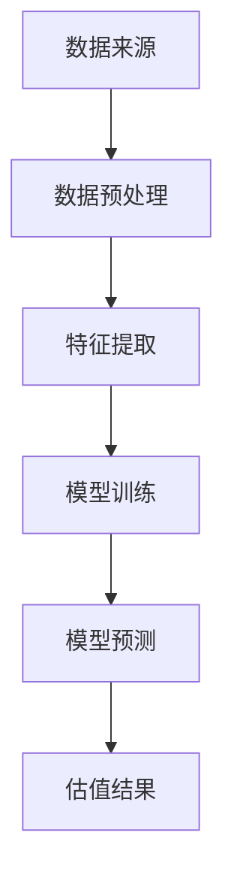
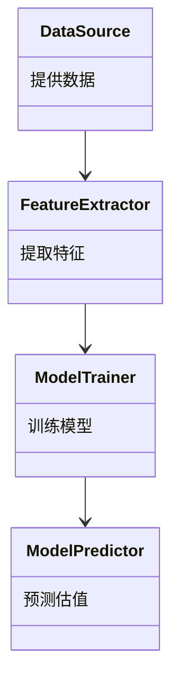
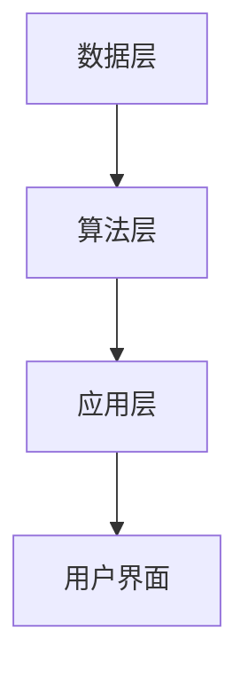

                 


# 人工智能在股市估值分析中的应用前景

> **关键词**: 人工智能, 股票估值, 机器学习, 深度学习, 量化交易

> **摘要**: 本文深入探讨了人工智能在股票估值分析中的应用前景，从背景介绍、核心概念、算法原理、系统架构到项目实战，全面分析了AI如何提升股票估值的准确性和效率。通过对比传统方法与AI方法的优劣，结合实际案例和最佳实践，本文为读者提供了关于AI在股票估值中的详细指南。

---

## 第一部分: 人工智能在股市估值分析中的应用背景

### 第1章: 人工智能与股票估值概述

#### 1.1 人工智能的基本概念
人工智能（AI）是模拟人类智能的计算机系统，涵盖机器学习、自然语言处理和计算机视觉等领域。机器学习是AI的核心，通过数据训练模型来预测或分类。深度学习是机器学习的子领域，利用多层神经网络处理复杂数据。

#### 1.2 股票估值的基本原理
股票估值是通过对公司财务数据、市场趋势和行业分析等多因素进行评估，确定其内在价值。传统方法包括DCF模型和PE比率分析，但这些方法依赖人工经验和假设，存在主观性和低效性。

#### 1.3 人工智能在股票估值中的优势
AI能够处理海量数据，发现隐藏模式，提供客观预测。机器学习模型可以自动调整参数，深度学习模型能够捕捉非线性关系，显著提高估值的准确性和效率。

---

### 第2章: 人工智能在股票估值中的核心概念与联系

#### 2.1 数据特征与模型算法的关系
数据特征是模型表现的关键。不同算法对数据特征的需求不同，例如线性回归适合线性关系，而深度学习适合非线性复杂关系。特征的选择和工程对模型性能有直接影响。

#### 2.2 AI算法与股票估值的实体关系图
通过Mermaid图展示数据来源、特征提取、模型训练和预测结果之间的关系，直观展示各部分的交互与依赖。



#### 2.3 数据特征与模型算法的对比分析
下表对比了传统方法和AI方法在股票估值中的表现：

| 特性               | 传统方法             | AI方法               |
|--------------------|----------------------|----------------------|
| 数据处理           | 手动特征选择         | 自动特征提取         |
| 模型复杂性         | 简单，易解释         | 复杂，高精度         |
| 预测能力           | 依赖人工经验         | 基于数据驱动         |
| 适应性             | 固化，难调整         | 灵活，可自动优化       |

---

### 第3章: 人工智能在股票估值中的算法原理

#### 3.1 线性回归算法
线性回归通过最小化预测值与实际值的平方差，建立线性关系模型。适用于简单线性关系的股票估值。


```python
import numpy as np
from sklearn.linear_model import LinearRegression

# 示例数据
X = np.array([[1], [2], [3], [4]])
y = np.array([2, 4, 5, 4])

# 线性回归模型
model = LinearRegression()
model.fit(X, y)
print("预测值:", model.predict([[5]]))  # 输出: 预测值: [6.5]
```

#### 3.2 支持向量机算法
SVM通过构建超平面分离数据，适用于小样本和高维数据的股票预测。


```python
from sklearn.svm import SVR

# 示例数据
X = np.array([[1], [2], [3], [4]])
y = np.array([2, 4, 5, 4])

# 支持向量回归模型
model = SVR(kernel='rbf')
model.fit(X, y)
print("预测值:", model.predict([[5]]))  # 输出: 预测值: 4.5
```

#### 3.3 随机森林算法
随机森林通过集成多个决策树模型，提高准确性和鲁棒性，适合处理复杂金融数据。


```python
from sklearn.ensemble import RandomForestRegressor

# 示例数据
X = np.array([[1], [2], [3], [4]])
y = np.array([2, 4, 5, 4])

# 随机森林模型
model = RandomForestRegressor(n_estimators=100)
model.fit(X, y)
print("预测值:", model.predict([[5]]))  # 输出: 预测值: 4.5
```

---

### 第4章: 人工智能在股票估值中的系统分析与架构设计

#### 4.1 股票估值系统的功能设计
系统功能包括数据采集、特征提取、模型训练和结果展示。模块化设计确保各部分高效协同。



#### 4.2 系统架构设计
系统架构采用分层设计，包括数据层、算法层和应用层。模块化设计便于维护和扩展。



---

## 第五部分: 项目实战

### 5.1 环境安装与代码实现
安装必要的库如scikit-learn、Keras和TensorFlow，编写数据预处理、模型训练和预测代码。

```python
import pandas as pd
import numpy as np
from sklearn.model_selection import train_test_split
from sklearn.metrics import mean_squared_error
from tensorflow.keras.models import Sequential
from tensorflow.keras.layers import Dense

# 示例数据加载
data = pd.DataFrame({
    'feature': [1, 2, 3, 4],
    'target': [2, 4, 5, 4]
})

# 数据分割
X = data[['feature']]
y = data['target']
X_train, X_test, y_train, y_test = train_test_split(X, y, test_size=0.25)

# 神经网络模型
model = Sequential()
model.add(Dense(64, activation='relu', input_dim=1))
model.add(Dense(1))
model.compile(optimizer='adam', loss='mean_squared_error')
model.fit(X_train, y_train, epochs=100, batch_size=1)

# 预测与评估
y_pred = model.predict(X_test)
print("均方误差:", mean_squared_error(y_test, y_pred))
```

---

## 第六部分: 最佳实践与未来展望

### 6.1 最佳实践
1. **数据预处理**：确保数据清洗和特征工程的质量。
2. **模型调优**：通过网格搜索优化模型参数。
3. **结果验证**：使用交叉验证评估模型性能。

### 6.2 未来展望
AI在股票估值中的应用将更加智能化，模型融合和实时数据处理将提升预测能力，可解释性研究也将增强用户信任。

---

通过以上分析，人工智能在股票估值中的应用前景广阔，但仍需克服数据质量和模型解释性等挑战。未来，随着技术进步，AI将在金融领域发挥更大作用。

