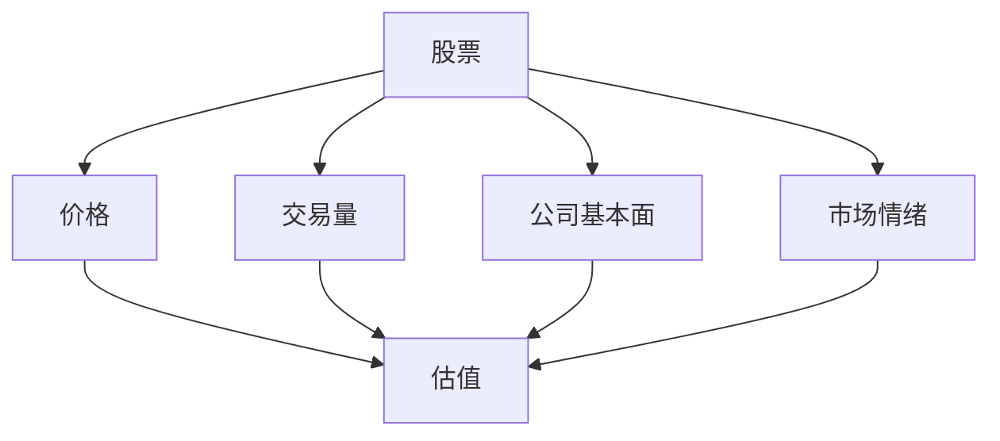
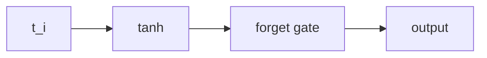
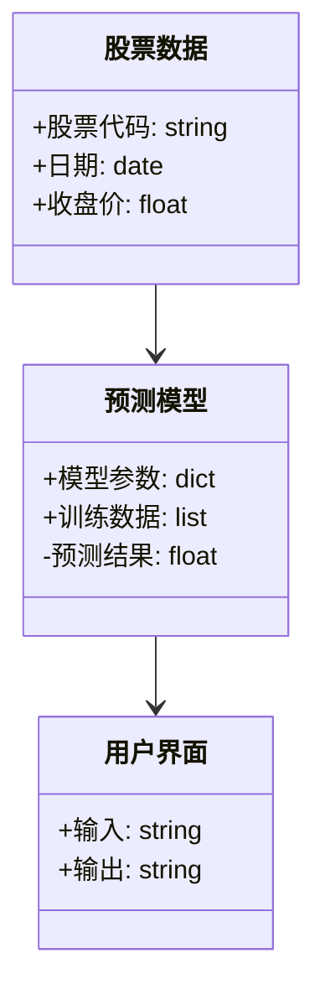
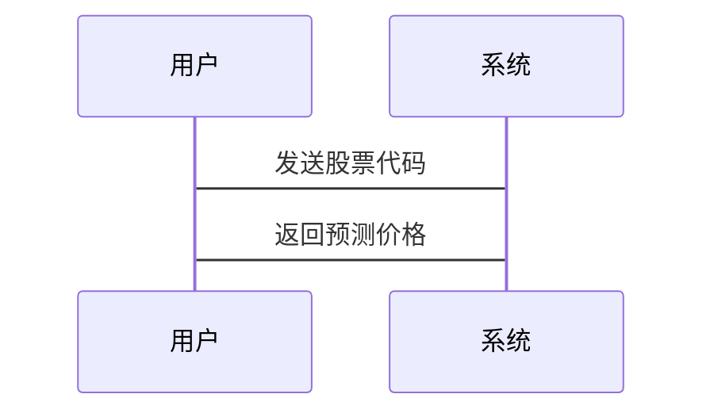

                 


# 《人工智能在股市估值预测中的应用》

---

## 关键词：  
人工智能，股市估值，机器学习，深度学习，时间序列分析，NLP，金融预测

---

## 摘要：  
本文详细探讨了人工智能在股市估值预测中的应用，从背景、核心概念到具体算法原理、系统设计和项目实战，层层剖析。通过机器学习、深度学习等技术，结合时间序列分析和NLP，构建了一个完整的股市预测系统，并通过案例展示了如何利用这些技术进行实际的股票价格预测。文章最后总结了当前的研究成果与未来的发展方向。

---

# 第一部分: 人工智能在股市估值预测中的应用概述

---

# 第1章: 背景介绍

## 1.1 人工智能的基本概念

### 1.1.1 人工智能的定义与核心概念

人工智能（Artificial Intelligence, AI）是模拟人类智能的计算机系统，涵盖学习、推理、自适应等能力。在金融领域，AI用于数据分析、模式识别和决策支持。

### 1.1.2 人工智能在金融领域的应用背景

金融数据复杂且动态变化，传统方法难以捕捉非线性关系。AI的引入提供了强大的数据处理能力和自动化决策支持。

### 1.1.3 股市估值预测的定义与重要性

股市估值预测是对股票价格进行预测，帮助投资者做出决策。其重要性在于帮助投资者识别市场趋势和潜在风险。

---

## 1.2 问题背景与问题描述

### 1.2.1 股市预测的复杂性与挑战

股票价格受多种因素影响，如市场情绪、经济指标和公司新闻。这些因素相互作用，增加了预测的难度。

### 1.2.2 传统估值方法的局限性

传统方法如基本面分析和统计模型在处理复杂数据时表现有限，难以应对市场的快速变化。

### 1.2.3 人工智能的优势与解决方案

AI技术能够处理大量数据，识别复杂模式，提供实时反馈，弥补传统方法的不足。

---

## 1.3 问题解决与边界

### 1.3.1 人工智能在估值预测中的核心作用

AI通过机器学习和深度学习，从历史数据中提取特征，预测未来价格走势。

### 1.3.2 问题的边界与外延

本文聚焦于股票价格预测，不涉及交易策略和风险管理。未来研究可扩展到多因素模型和实时预测。

### 1.3.3 核心概念的结构与要素组成

构建一个完整的预测系统，需整合数据收集、特征工程、模型训练和结果评估。

---

# 第二部分: 核心概念与原理

---

# 第2章: 核心概念与原理

## 2.1 人工智能技术的核心原理

### 2.1.1 机器学习的基本原理

机器学习通过训练数据建立模型，实现预测或分类。监督学习、无监督学习和强化学习是主要的学习方式。

### 2.1.2 深度学习的基本原理

深度学习利用多层神经网络，自动提取数据特征，适用于复杂模式识别。

### 2.1.3 时间序列分析与NLP在金融中的应用

时间序列分析处理历史数据，预测未来趋势。NLP用于分析新闻和社交媒体，提取市场情绪。

---

## 2.2 核心概念的属性特征对比

### 2.2.1 机器学习与深度学习的对比分析

| 特性 | 机器学习 | 深度学习 |
|------|----------|----------|
| 数据需求 | 小 | 大 |
| 特征工程 | 复杂 | 较简单 |
| 模型复杂度 | 低 | 高 |

### 2.2.2 时间序列分析与传统统计分析的对比

时间序列分析能够捕捉动态变化，而传统统计方法在非线性关系上表现不佳。

### 2.2.3 NLP在金融新闻分析中的应用特点

NLP能够从文本中提取情感和主题，帮助预测市场走势。

---

## 2.3 ER实体关系图架构



---

# 第三部分: 算法原理与数学模型

---

# 第3章: 常用算法原理

## 3.1 机器学习算法

### 3.1.1 线性回归

线性回归用于预测连续值，模型公式为：$y = \beta x + \epsilon$。


### 3.1.2 支持向量机（SVM）

SVM用于分类，通过寻找最优超平面分割数据。


### 3.1.3 随机森林

随机森林通过集成学习提高准确性，适用于特征重要性分析。

---

## 3.2 深度学习算法

### 3.2.1 神经网络

神经网络模拟人脑结构，用于处理复杂数据。


### 3.2.2 长短期记忆网络（LSTM）

LSTM适用于时间序列数据，能够记住长期信息。



---

## 3.3 时间序列分析

### 3.3.1 ARIMA模型

ARIMA用于预测未来值，模型公式为：$y_t = c + \phi_1 y_{t-1} + \theta_1 e_{t-1} + e_t$。

### 3.3.2 LSTM与时间序列结合

LSTM在时间序列预测中表现出色，适用于股票价格预测。

---

## 3.4 NLP与情感分析

### 3.4.1 文本预处理

包括分词、去除停用词和向量化。

### 3.4.2 情感分析模型

使用LSTM或Transformer进行情感分类，帮助预测市场情绪。

---

# 第四部分: 系统分析与架构设计

---

# 第4章: 系统分析与架构设计

## 4.1 问题场景介绍

构建一个实时股票价格预测系统，帮助投资者做出决策。

## 4.2 项目介绍

### 4.2.1 项目目标

准确预测股票价格，提供投资建议。

### 4.2.2 项目范围

选择特定股票，收集历史数据，构建预测模型。

## 4.3 系统功能设计

### 4.3.1 领域模型设计



### 4.3.2 系统架构设计


### 4.3.3 系统接口设计

API接口用于数据输入和结果输出，支持RESTful调用。

### 4.3.4 系统交互设计



---

# 第五部分: 项目实战

---

# 第5章: 项目实战

## 5.1 环境安装

安装必要的库，如TensorFlow、Pandas和Matplotlib。

## 5.2 核心实现

### 5.2.1 数据预处理

加载数据，清洗和归一化处理。

### 5.2.2 模型训练

选择LSTM进行训练，优化超参数。

### 5.2.3 结果分析

评估模型性能，调整参数。

## 5.3 代码实现

### 5.3.1 数据加载

```python
import pandas as pd

data = pd.read_csv('stock.csv')
```

### 5.3.2 模型构建

```python
import tensorflow as tf
from tensorflow.keras.layers import LSTM, Dense

model = tf.keras.Sequential([
    LSTM(64, input_shape=(timesteps, features)),
    Dense(1)
])
```

### 5.3.3 训练与评估

```python
model.compile(optimizer='adam', loss='mse')
model.fit(X_train, y_train, epochs=10, batch_size=32)
```

## 5.4 案例分析

使用实际数据训练模型，展示预测结果与实际值的对比。

## 5.5 总结

项目实现了股票价格预测，验证了AI技术的有效性，但仍需进一步优化。

---

# 第六部分: 总结与展望

---

# 第6章: 总结与展望

## 6.1 最佳实践 tips

- 数据质量至关重要，需进行充分清洗。
- 模型需定期更新，适应市场变化。
- 结合多种技术，提升预测精度。

## 6.2 小结

本文详细介绍了人工智能在股市估值预测中的应用，从理论到实践，构建了一个完整的预测系统。

## 6.3 注意事项

- 模型预测仅供参考，投资需谨慎。
- 数据隐私和安全需重视。

## 6.4 拓展阅读

推荐学习强化学习和多模态数据处理，进一步提升预测能力。

---

## 结语

人工智能为股市估值预测提供了强大工具，未来随着技术进步，预测精度和实时性将不断提升。

