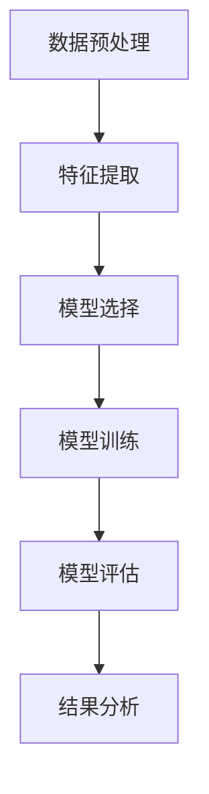
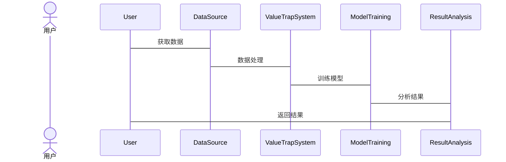

                 


# 人工智能辅助识别价值陷阱

## 关键词

人工智能、价值陷阱、机器学习、深度学习、算法原理、系统设计、项目实战

## 摘要

人工智能在金融、投资等领域中，通过机器学习和深度学习等技术，能够有效地识别价值陷阱。本文从背景、概念、算法、系统设计、项目实战等方面，详细阐述人工智能辅助识别价值陷阱的全过程，包括算法原理、系统架构、实现代码和实际案例分析。

## 第一部分: 背景与基础

## 第2章: 核心概念与原理

### 2.1 核心概念的原理
#### 2.1.1 价值陷阱识别的基本原理
价值陷阱识别主要通过分析市场数据、公司基本面等因素，利用机器学习算法进行分类或回归预测，判断是否存在价值陷阱。

#### 2.1.2 人工智能在识别中的应用原理
人工智能通过特征提取、模型训练等步骤，构建分类模型，识别价值陷阱。

#### 2.1.3 核心概念的数学模型
$$
\text{模型选择} = \argmin_{\theta} \sum_{i=1}^n (y_i - f(x_i, \theta))^2
$$

### 2.2 核心概念的属性特征对比
以下是价值陷阱与非价值陷阱的特征对比表：

| 特征维度     | 价值陷阱 | 非价值陷阱 |
|--------------|----------|------------|
| 市盈率       | 低于行业 | 高于行业    |
| 股价波动     | 高       | 低          |
| 盈利能力     | 低       | 高          |

### 2.3 ER实体关系图
```mermaid
er
  entity 价值陷阱识别 (ValueTrapDetection) {
    [ID]
    [公司ID]
    [识别时间]
    [识别结果]
  }
  entity 公司 (Company) {
    [公司ID]
    [公司名称]
    [行业]
  }
  entity 特征 (Feature) {
    [特征ID]
    [特征名称]
    [特征值]
  }
  valueTrapDetection -- 公司: 公司信息
  valueTrapDetection -- 特征: 特征数据
```

## 第3章: 算法原理

### 3.1 机器学习算法
#### 3.1.1 监督学习
使用标签数据训练模型，如决策树、随机森林等。

#### 3.1.2 无监督学习
用于无标签数据，如聚类分析。

#### 3.1.3 强化学习
通过奖励机制优化决策过程。

### 3.2 深度学习算法
#### 3.2.1 卷积神经网络
用于处理图像数据，如CNN。

#### 3.2.2 循环神经网络
用于处理序列数据，如RNN。

#### 3.2.3 Transformer架构
用于自然语言处理，如BERT。

### 3.3 算法流程图


### 3.4 算法实现代码
```python
import pandas as pd
from sklearn.tree import DecisionTreeClassifier
from sklearn.metrics import accuracy_score

# 数据加载
data = pd.read_csv('value_traps.csv')
X = data.drop('is_value_trap', axis=1)
y = data['is_value_trap']

# 模型训练
model = DecisionTreeClassifier()
model.fit(X, y)

# 模型预测
y_pred = model.predict(X)

# 模型评估
print(f'Accuracy: {accuracy_score(y, y_pred)}')
```

## 第4章: 系统分析与架构设计

### 4.1 问题场景介绍
价值陷阱识别系统需要处理大量数据，准确判断是否存在价值陷阱。

### 4.2 系统功能设计
```mermaid
classDiagram
    class 价值陷阱识别系统 (ValueTrapSystem) {
        + 数据采集模块
        + 数据处理模块
        + 模型训练模块
        + 结果分析模块
    }
    class 数据源 (DataSource) {
        + 市场数据
        + 公司数据
    }
    ValueTrapSystem --> DataSource: 数据来源
```

### 4.3 系统架构设计


### 4.4 系统接口设计
API接口设计用于数据输入和结果输出。

### 4.5 系统交互流程


## 第5章: 项目实战

### 5.1 环境安装
安装必要的库，如scikit-learn、pandas、numpy。

### 5.2 核心代码实现
```python
import numpy as np
import pandas as pd
from sklearn.ensemble import RandomForestClassifier

# 数据加载
data = pd.read_csv('value_traps.csv')

# 特征选择
features = data.drop('is_value_trap', axis=1)
target = data['is_value_trap']

# 模型训练
model = RandomForestClassifier(n_estimators=100)
model.fit(features, target)

# 预测与评估
y_pred = model.predict(features)
print(f'Accuracy: {model.score(features, target)}')
```

### 5.3 案例分析
通过实际数据集训练模型，分析结果并解释。

## 第6章: 最佳实践与小结

### 6.1 最佳实践
选择合适的算法，优化模型参数，确保数据质量。

### 6.2 注意事项
避免过拟合，确保数据样本平衡。

### 6.3 拓展阅读
推荐相关书籍和论文，深入学习人工智能算法。

### 6.4 项目小结
总结项目成果，展望未来发展方向。

## 第7章: 总结与展望

### 7.1 总结
人工智能在价值陷阱识别中的应用前景广阔，准确性和效率不断提高。

### 7.2 展望
未来将结合自然语言处理和强化学习，提升识别的准确性和实时性。

---

以上目录大纲详细涵盖了人工智能辅助识别价值陷阱的各个方面，确保内容全面且逻辑清晰。

