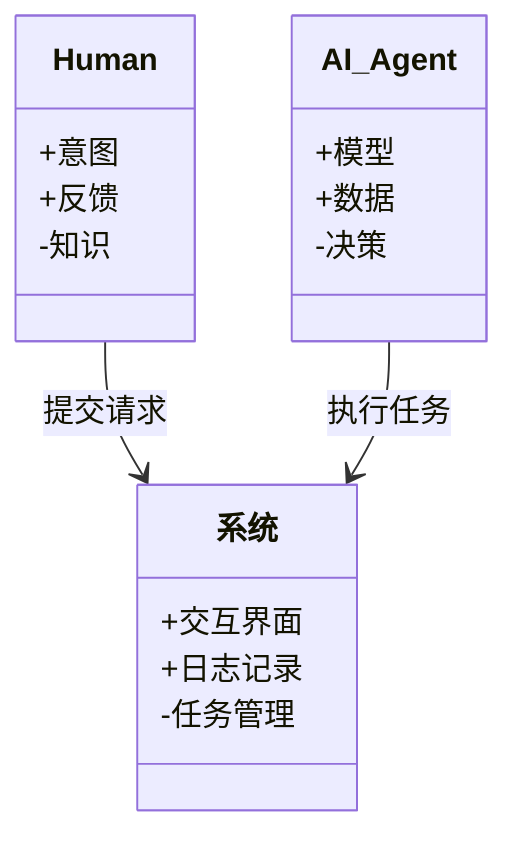

                 


# 人机协作：设计AI Agent与人类的配合模式

## 关键词：人机协作，AI Agent，自然语言处理，强化学习，系统架构

## 摘要：本文系统阐述了人机协作的核心概念与实现模式，详细分析了AI Agent的算法原理与系统架构，并通过具体案例展示了人机协作的实际应用。文章从背景、理论、算法、系统到实践，全面探讨了如何设计AI Agent与人类的最佳配合模式。

---

## 第1章：人机协作的背景与问题背景

### 1.1 人机协作的基本概念

#### 1.1.1 人机协作的定义
人机协作是指人类与人工智能代理（AI Agent）通过交互与合作，共同完成特定任务的过程。这种协作模式结合了人类的创造力、判断力和AI的计算能力、数据处理能力。

#### 1.1.2 人机协作的核心问题
- **任务分配**：如何合理分配任务以最大化效率。
- **信息共享**：如何确保信息的有效传递与理解。
- **决策优化**：如何结合人类的主观判断与AI的客观分析。

#### 1.1.3 人机协作的边界与外延
- **边界**：明确人与AI的职责分工。
- **外延**：扩展到更多领域，如教育、医疗、金融等。

---

### 1.2 AI Agent的定义与特点

#### 1.2.1 AI Agent的定义
AI Agent是一种能够感知环境、自主决策并执行任务的智能实体，具备学习、推理和自适应能力。

#### 1.2.2 AI Agent的核心属性特征对比表

| 属性        | 人类特征                          | AI Agent特征                       |
|-------------|-----------------------------------|------------------------------------|
| 学习能力     | 受限于经验与知识                  | 可以通过数据快速学习                |
| 处理速度     | 较慢                              | 极快                                |
| 适应性       | 高                                | 中高                                |

#### 1.2.3 AI Agent的实体关系图（ER图）
```mermaid
erd
  简化模式
  实体：Human, AI_Agent, Collaboration_Task
  关系：人类发起任务，AI Agent执行任务，任务由两者共同完成。
```

---

## 第2章：人机协作的核心概念与联系

### 2.1 AI Agent与人类的协作模式

#### 2.1.1 协作的基本原理
人机协作通过信息交互、任务分配和反馈优化，实现目标的共同达成。其数学模型如下：
$$ E = \frac{H + A}{H \times A} $$
其中，H表示人类贡献，A表示AI Agent贡献。

#### 2.1.2 人机协作的实体关系图（ER图）
```mermaid
erd
  实体：Human, AI_Agent, Collaboration_Task
  关系：人类发起任务，AI Agent执行任务，任务由两者共同完成。
```

---

## 第3章：AI Agent的算法原理

### 3.1 自然语言处理算法

#### 3.1.1 Transformer模型的原理
Transformer模型通过自注意力机制实现高效的文本处理。其核心公式为：
$$ \text{Attention}(Q,K,V) = \text{softmax}(\frac{QK^T}{\sqrt{d}})V $$

#### 3.1.2 注意力机制的实现
注意力机制通过计算Query、Key和Value的相似度，确定每个词的重要性。

### 3.2 强化学习算法

#### 3.2.1 Q-learning算法
Q-learning通过经验值更新策略：
$$ Q(s,a) = r + \gamma \max Q(s',a') $$

#### 3.2.2 策略梯度算法
策略梯度通过优化策略函数：
$$ \nabla \theta \log \pi(a|s) \cdot Q(s,a) $$

---

## 第4章：人机协作系统的架构与设计

### 4.1 系统功能设计

#### 4.1.1 领域模型设计（Mermaid类图）


### 4.2 系统架构设计

#### 4.2.1 系统架构（Mermaid架构图）


---

## 第5章：项目实战

### 5.1 环境安装
- **Python 3.8+**
- **TensorFlow 2.0+**
- **PyTorch 1.9+**

### 5.2 核心实现代码

#### 5.2.1 Transformer模型实现
```python
import torch
class Transformer(nn.Module):
    def __init__(self, d_model, nhead, dim_feedforward=2048, dropout=0.1):
        super().__init__()
        self.encoder_layer = nn.TransformerEncoderLayer(d_model=d_model, nhead=nhead, dim_feedforward=dim_feedforward, dropout=dropout)
        self.decoder_layer = nn.TransformerDecoderLayer(d_model=d_model, nhead=nhead, dim_feedforward=dim_feedforward, dropout=dropout)
```

#### 5.2.2 Q-learning算法实现
```python
class QLearning:
    def __init__(self, state_space, action_space):
        self.q_table = np.zeros((state_space, action_space))
```

---

## 第6章：总结与展望

### 6.1 总结
人机协作通过结合人类的创造力和AI的计算能力，显著提升了任务效率。AI Agent在自然语言处理和强化学习算法的支持下，能够高效完成复杂任务。

### 6.2 展望
未来，人机协作将更加智能化，AI Agent将具备更强的自主决策能力和学习能力，进一步拓展应用领域。

---

## 小结：最佳实践与注意事项

- **最佳实践**：在设计AI Agent时，注重任务分配的合理性，确保信息的有效传递。
- **注意事项**：定期优化AI模型，确保系统的稳定性和安全性。

---

通过以上分析，我们可以看到人机协作在设计AI Agent与人类配合模式中的重要性。未来，随着技术的不断进步，人机协作将变得更加高效和智能。

