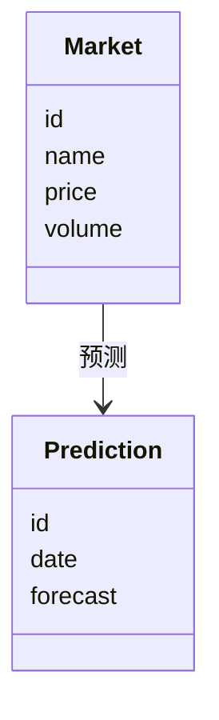

                 


# 从历史角度理解当前市场状况的重要性

## 关键词：市场分析、历史演变、经济趋势、数据建模、系统设计

## 摘要：  
本文从历史的角度出发，分析市场演变的规律，探讨如何利用历史数据和经验预测当前市场状况。通过结合历史案例、数学模型和系统设计，本文深入剖析市场分析的核心概念，帮助读者更好地理解当前市场动态。

---

# 第1章: 市场演变的历史背景

## 1.1 市场的定义与核心概念

### 1.1.1 市场的基本定义  
市场是商品和服务交换的场所，其核心功能是连接供给与需求。市场的基本要素包括价格、供需、竞争和交易机制。

### 1.1.2 市场的核心要素  
- **供给**：生产者提供商品或服务的能力。  
- **需求**：消费者对商品或服务的欲望和购买能力。  
- **价格**：供需关系的直接反映。  
- **竞争**：市场中参与者之间的竞争关系。  

### 1.1.3 市场与经济的关系  
市场是经济系统的核心组成部分，通过资源配置和利益分配推动经济的发展。

---

## 1.2 市场的历史演变

### 1.2.1 古代市场的形成  
古代市场以地方集市为主，交易范围有限，商品种类单一。货币的出现促进了市场的扩展。

### 1.2.2 中世纪市场的特点  
中世纪市场分为城市市场和农村市场，商品种类逐渐多样化，货币经济进一步发展。

### 1.2.3 工业革命对市场的深远影响  
工业革命推动了规模化生产，市场从地方性扩展为全国性甚至全球性。

### 1.2.4 现代市场体系的形成  
现代市场体系以全球化为特征，信息技术的普及进一步推动了市场的数字化和全球化。

---

# 第2章: 历史事件对市场的影响

## 2.1 经济危机与市场波动

### 2.1.1 大萧条时期市场的崩盘  
1929年经济大萧条导致全球市场崩溃，股票市场崩盘，企业倒闭潮涌现。

### 2.1.2 2008年金融危机的市场影响  
次贷危机引发的金融危机导致全球市场大幅震荡，许多金融机构破产，经济陷入衰退。

---

## 2.2 技术革命对市场的推动

### 2.2.1 工业革命对制造业市场的重塑  
工业革命推动了规模化生产，降低了成本，提高了生产效率。

### 2.2.2 互联网时代对全球市场的重构  
互联网技术的普及使得市场从本地化向全球化扩展，电子商务迅速崛起。

---

## 2.3 政治事件对市场的冲击

### 2.3.1 战争对市场的破坏性影响  
战争导致资源短缺、供应链中断，市场陷入混乱。

### 2.3.2 政治体制变化对市场的适应  
政治体制的变迁会影响市场的规则和参与者，例如从计划经济向市场经济的转型。

---

# 第3章: 市场分析的核心概念

## 3.1 市场分析的基本方法

### 3.1.1 宏观经济分析  
从宏观角度分析经济指标，如GDP、通胀率、利率等，了解整体市场趋势。

### 3.1.2 行业分析  
研究特定行业的市场结构、竞争格局和增长潜力。

### 3.1.3 公司分析  
分析企业的财务状况、竞争优势和市场策略。

---

## 3.2 市场数据的收集与处理

### 3.2.1 数据来源的多样性  
市场数据来源包括政府统计、行业报告、企业财报等。

### 3.2.2 数据清洗与预处理  
对数据进行清洗、去重和标准化处理，确保数据质量。

### 3.2.3 数据可视化  
通过图表展示数据，帮助理解市场趋势和规律。

---

## 3.3 市场趋势的预测模型

### 3.3.1 时间序列分析  
使用ARIMA模型预测未来市场走势。

### 3.3.2 机器学习在市场预测中的应用  
利用神经网络和随机森林等算法进行市场预测。

### 3.3.3 统计模型的优缺点  
统计模型假设简单，但可能无法捕捉复杂市场动态。

---

# 第4章: 数学模型与算法原理

## 4.1 时间序列分析模型

### 4.1.1 ARIMA模型的原理  
ARIMA模型通过自回归和移动平均部分捕捉时间序列的特征。

### 4.1.2 模型公式  
$$ARIMA(p, d, q)$$  
其中，p为自回归阶数，d为差分阶数，q为移动平均阶数。

### 4.1.3 模型实现  
```python
from statsmodels.tsa.arima.model import ARIMA
model = ARIMA(data, order=(5,1,0))
model_fit = model.fit()
```

---

## 4.2 机器学习算法

### 4.2.1 随机森林算法  
随机森林通过集成学习提高预测准确性。

### 4.2.2 算法流程  
1. 生成随机子集。  
2. 对每个子集构建决策树。  
3. 集成预测结果。  

### 4.2.3 代码示例  
```python
from sklearn.ensemble import RandomForestRegressor
model = RandomForestRegressor(n_estimators=100)
model.fit(X_train, y_train)
```

---

# 第5章: 系统架构设计

## 5.1 问题场景介绍  
我们需要设计一个实时市场监测系统，能够分析历史数据并预测未来走势。

## 5.2 系统功能设计

### 5.2.1 领域模型  


### 5.2.2 系统架构  


---

## 5.3 接口设计与交互

### 5.3.1 数据接口  
- API用于数据采集和存储。  
- 使用RESTful接口进行数据传输。

### 5.3.2 用户交互  
- 用户通过UI查看市场数据和预测结果。  
- 提供实时更新和数据可视化功能。

---

# 第6章: 项目实战

## 6.1 环境安装

### 6.1.1 安装Python和相关库  
安装Python 3.8以上版本，安装`pandas`, `numpy`, `statsmodels`, `scikit-learn`等库。

## 6.2 核心实现

### 6.2.1 数据处理  
```python
import pandas as pd
data = pd.read_csv('market_data.csv')
data = data.dropna().diff().dropna()
```

### 6.2.2 模型训练  
```python
from statsmodels.tsa.arima.model import ARIMA
model = ARIMA(data, order=(5,1,0))
model_fit = model.fit()
```

### 6.2.3 预测与可视化  
```python
import matplotlib.pyplot as plt
forecast = model_fit.forecast(steps=10)
plt.plot(data, label='实际值')
plt.plot(forecast, label='预测值')
plt.legend()
plt.show()
```

## 6.3 案例分析  
分析2008年金融危机前后的市场数据，验证模型的预测能力。

## 6.4 项目小结  
总结项目实现的关键步骤和经验教训。

---

# 第7章: 总结与最佳实践

## 7.1 小结  
从历史角度理解市场，结合数学模型和系统设计，能够更好地预测和应对市场变化。

## 7.2 注意事项  
- 数据质量直接影响预测结果。  
- 模型需要不断更新和优化。  
- 风险管理是市场分析的重要环节。

## 7.3 拓展阅读  
推荐阅读《经济学原理》和《时间序列分析》等书籍，深入理解市场分析的理论基础。

---

# 结语  
通过历史分析和数学建模，我们可以更好地理解当前市场状况。未来，随着技术的进步，市场分析将更加精准和智能化。

